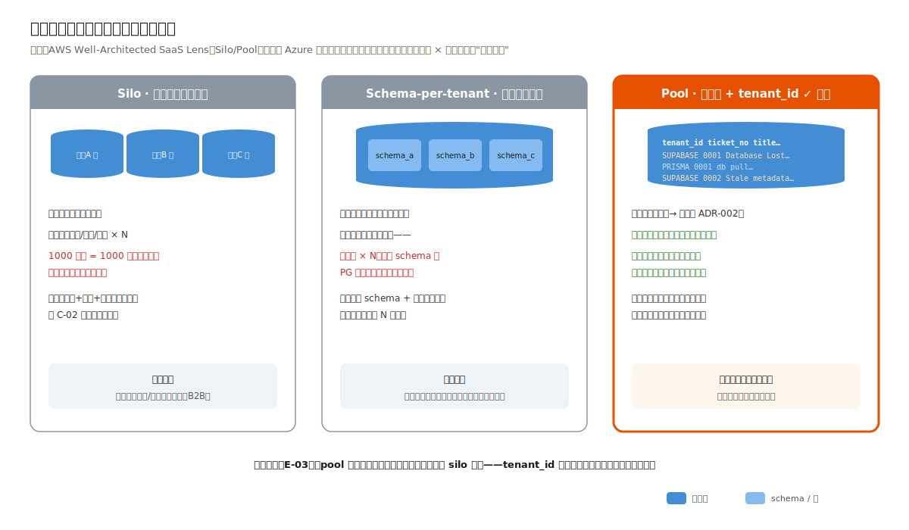
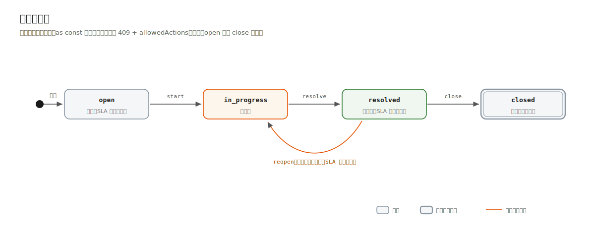
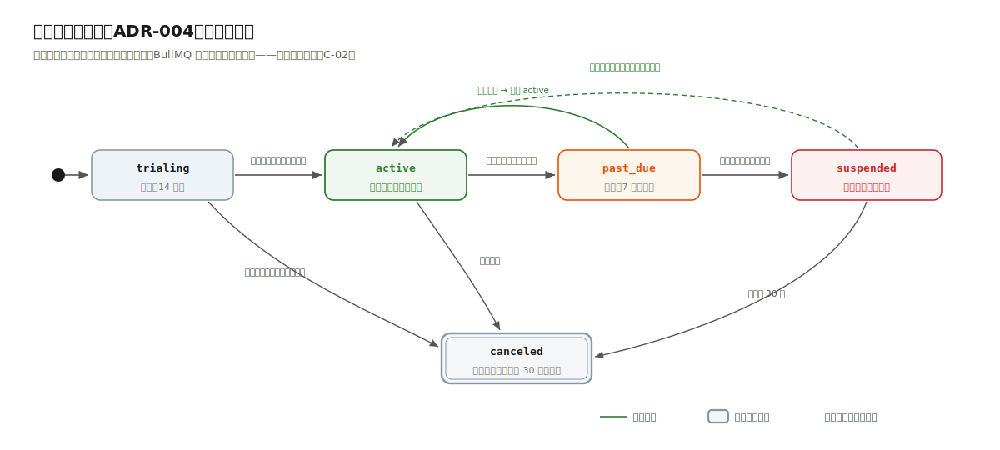
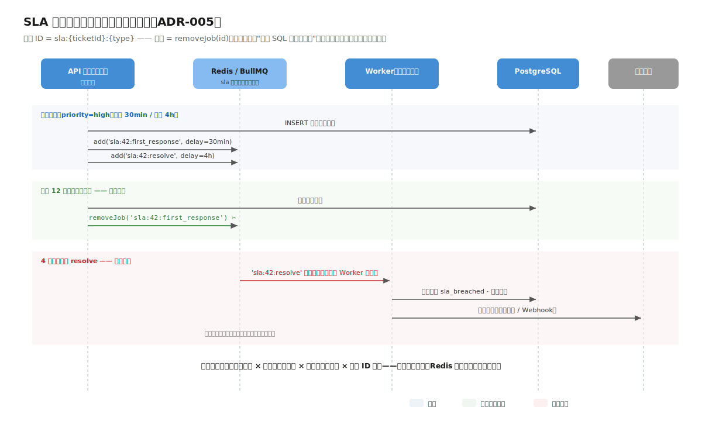

# 5.3 数据、接口与隔离纵深

> 流程进度：①②③ ▸ ④⑤ ▸ **⑥⑦** ▸ ⑧

## 三种租户模型，一图对照



图中三列即 ADR-001 的三个备选。记住选型的第一性依据不是"哪个隔离最强"，而是租户画像 × 成本结构：自助长尾（本案例）→ pool；数十个高价值大客户 → silo；混合画像 → pool 起步 + 大客户 silo（AWS SaaS Lens 的标准演进路径，已登记演进表）。

## 隔离纵深：一次请求的完整旅程



动画里两颗粒子的命运就是本案例的全部主题：SUPABASE 的凭证访问自家工单一路绿灯；PRISMA 的凭证访问 SUPABASE 的工单，在 repo 层的 `tenant_id = ?` 处被拦下，返回 404。真实实录（工程冒烟的高光场景，同一 URL、两把 Key）：

```bash
$ curl -s "http://localhost:3994/api/tickets/SUPABASE-0001" \
    -H 'X-API-Key: wd_supabase_b6d586079c13fa6651fc18a4'
# HTTP 200
{
  "ticketNo": "SUPABASE-0001",
  "title": "Supabase Database Lost",
  "priority": "high",
  "status": "in_progress",
  "assignee": "admin@supabase.example.com",
  "createdBy": "admin@supabase.example.com",
  "createdAt": "2026-07-02T22:26:39.000Z",
  "updatedAt": "2026-07-03T00:26:39.000Z",
  "events": [
    {
      "action": "created",
      "fromStatus": "-",
      "toStatus": "open",
      "actor": "admin@supabase.example.com",
      "note": null,
      "createdAt": "2026-07-02T22:26:39.000Z"
    },
    {
      "action": "start",
      "fromStatus": "open",
      "toStatus": "in_progress",
      "actor": "admin@supabase.example.com",
      "note": null,
      "createdAt": "2026-07-03T00:26:39.000Z"
    }
  ]
}

$ curl -s "http://localhost:3994/api/tickets/SUPABASE-0001" \
    -H 'X-API-Key: wd_prisma_c759423f7b16237cf2070804'
# HTTP 404
{
  "error": {
    "code": "TICKET_NOT_FOUND",
    "message": "工单不存在：SUPABASE-0001"
  }
}
```

**404 而不是 403。** 403 等于告诉攻击者"这个工单号存在，只是不归你"；404 不泄露任何存在性信息。这半行代码的差别是安全设计的基本功。

本案例的工单是真实数据：取自三个公开 GitHub 仓库的 issue（`supabase/supabase`、`prisma/prisma`、`vercel/next.js`，每仓对应一个租户），经 GitHub issues API 取回，工单标题、状态、标签、创建与解决时刻均为原始值（见 [dataset/MANIFEST.md](../../dataset/MANIFEST.md)）。租户企业名取自仓库所属公司，订阅档位、管理员账号与 API Key 均为应用内部演示配置。留存字段只到标题、状态、时间戳、标签，工单正文与解决经过不在其中，教程不据此虚构。

防线清单（每道均独立可测）：

| 防线 | 位置 | 机制 | 被什么证明 |
|---|---|---|---|
| 租户识别 | 鉴权钩子（fastify 子作用域） | Key 哈希查表 / 生产：子域名+JWT 双因子（ADR-003） | 无 Key/错 Key 401 测试 |
| 应用层强制 | repo 层 | 函数签名强制 tenantId 首参，SQL 一律 `tenant_id = ?` | **架构守护测试第 4 条**：正则扫描 repo 全部 SQL 字符串 |
| 数据库兜底 | PostgreSQL RLS（生产） | `set_config('app.tenant_id', $1, true)` 事务级 + POLICY | RLS 直连库验证；连接池坑详见 ADR-002 |

**鉴权作用域**的实现值得一看（工程 `app.ts`）：注册路由挂在无鉴权的公共作用域，全部工单路由注册在挂了 `onRequest` 钩子的 fastify 封装作用域内：安全边界用框架的封装模型表达，而不是每个路由手工记得加中间件。忘记加 = 路由根本不在受保护作用域里注册不上，错误在结构上不可能发生。

## 租户开通：一个事务的事

`POST /api/tenants/register` 在单个事务内完成：创建租户、管理员、每租户工单发号器（`ticket_seq`）。实录中注册完成即返回一次性明文 API Key（库中只存 sha256 哈希），立即可建单，这是 C-02"自助开通"的最小闭环。每租户工单号独立序列（`SUPABASE-0001`、`PRISMA-0001` 互不干扰，`UNIQUE(tenant_id, ticket_no)`），租户看到的是"自己的第 N 单"，这是产品体验，也是隔离语义的一部分。

## 两台状态机



工单：`open → in_progress → resolved → closed`，外加 `resolved → reopen → in_progress`（客户不满意重开）。迁移表实现与案例一同款，非法迁移 409 带 `allowedActions`（实录：对 open 工单直接 close 被拒）。



订阅（生产设计，ADR-004）：`trialing → active → past_due（宽限）→ suspended（欠费只读）→ canceled`。两台状态机加上案例一的审批状态机，"流程类实体 = 状态机"在全书的第三次出场，手法零新增。

## SLA 计时：延迟队列的取消语义



时序图的关键帧：工单创建 → 投递两个延迟任务（首响 30 分钟、解决 4 小时，按租户 SLA 策略）；客服首次回复 → 按 ID 取消首响任务；超时未动 → Worker 消费到期任务 → 升级（通知主管 + 工单标记）。"可取消的分钟级延迟任务 × 数万并存 × 多 Worker 竞争"就是 Redis 的入场证据链（ADR-005）。对照案例二的到期提醒（日级、一条 SQL），同一个"到期"语义，两个量级，两种正确答案。
