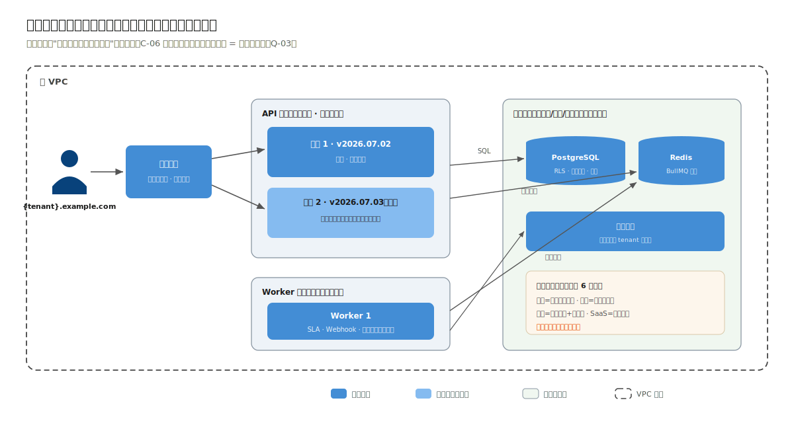
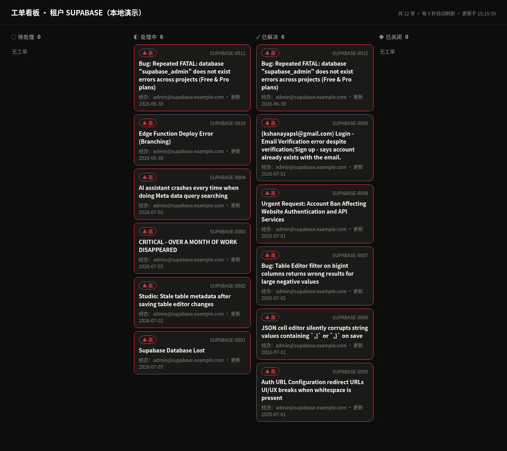

# 5.4 部署、工程验证与演进

> 流程进度：①②③ ▸ ④⑤ ▸ ⑥⑦ ▸ **⑦⑧**

## 部署视图：全书唯一的云上部署



- **API × N**（起步 N=2）挂在负载均衡后，无状态（十二要素：配置进环境变量、会话进 JWT、文件进对象存储），滚动发布即逐实例替换，LB 健康检查摘流（Q-03）；
- **Worker × M**（起步 M=1）独立伸缩：队列深度是它的扩容信号，与 API 的 CPU 信号解耦；
- **托管 PostgreSQL / Redis**：4 人团队（C-06）把数据库高可用、备份、补丁托管给云厂商，这是"复杂度预算花在业务上"的采购版；
- 对照前三章：政务双机热备在机房、企业单节点在机房、工厂物理机在车间侧，部署形态是约束表的镜像，四张部署图并排就是四份约束表的 X 光片。

## 示例工程走读

运行工程后 `http://localhost:3004/` 是内嵌只读看板（演示内置租户 SUPABASE 的开发 Key）：



看板里的工单是 supabase/supabase 仓库的真实 issue（数据来源见 [3.3 节](03-data-api-security.md)）。

配套工程 `code/04-saas-ticket/`（18 个测试全绿，冒烟 9 场景）。工程聚焦本案例的生死线，隔离双保险的第一道防线全链条：

```
src/modules/
├── tenant/     # 注册开通（单事务 provisioning）+ API Key 鉴权钩子
└── ticket/     # 工单状态机 + repo 层 tenant_id 强制
tests/
├── architecture.test.ts   # 四条规则：常规三条 + 第4条 repo SQL 必含 tenant_id
└── ...                    # 跨租户 404、两租户编号互不干扰、哈希存储等
```

三个最有含金量的测试（打开 `tests/` 直接看断言）：

1. **跨租户 404**：租户 A 的 Key 查租户 B 的工单，防线的行为证明；
2. **守护测试第 4 条**：扫描全部 repo 的 SQL，凡涉及作用域表的引用都必须配一个 `tenant_id = ?` 谓词，并断言扫描数量下限（防止扫描器自身失效），这是防线的结构证明；
3. **Key 只存哈希**：注册响应含明文，库中查无明文，凭证泄露面的证明。

## 示例工程 ⇄ 生产架构映射表

| 生产设计 | 示例工程 | 缝合线 |
|---|---|---|
| 子域名 + JWT 双因子识别（ADR-003） | X-API-Key（同为生产可用的 API 集成路径） | 鉴权钩子单点 |
| PG RLS 第二道防线（ADR-002） | 第一道防线全链条 + 守护测试 | RLS SQL 已在 ADR-002 给出 |
| BullMQ + Redis + Worker（ADR-005） | 未实现（工程聚焦隔离核心） | 队列投递点在 service 层预留 |
| 订阅计费状态机（ADR-004） | 未实现 | 与工单状态机同款手法，tenant 模块位 |
| LB + 多实例 | 单实例 | 工程本身无状态（数据全在库），加实例即成立 |

## 演进触发表

| 编号 | 触发条件 | 启动改造 | 提前量 |
|---|---|---|---|
| E-01 | 单租户查询影响他租户（P95 劣化且定位到吵闹邻居） | 按租户限流 + 慢查询配额；极端者迁 silo | 1 个月 |
| E-02 | 在线聊天/AI 回复立项 | 独立实时通道（WebSocket 网关）评估 | 3 个月 |
| E-03 | 签约首个要求独立部署的大客户 | pool + silo 混合模式（ADR-001 预分析：tenant_id 机制在单租户库依然成立，代码零改） | 2 个月 |
| E-04 | 队列任务类型 > 10 种或出现跨服务编排 | 重估工作流引擎（Temporal 型）——注意与案例二 ADR-001 的否决理由对照，届时上下文已不同 | 6 个月 |

---

## 本章小结（供第 6 章对照）

| 决策点 | 本案例答案 | 决定性证据 |
|---|---|---|
| 租户模型 | pool（共享表 + tenant_id） | 连接数算账、自助长尾画像 |
| 隔离 | 双保险：repo 强制 + RLS 兜底 | Q-01 生死线、防线独立性 |
| 进程形态 | 无状态 ×N + Worker | 滚动发布、伸缩、异步可靠性 |
| Redis | **要（BullMQ）**——全书唯一 | 分钟级 × 可取消 × 多实例竞争三重叠加 |
| 计费 | 自研订阅状态机 + 支付适配器 | 权限判定本地化、通道可插拔 |
