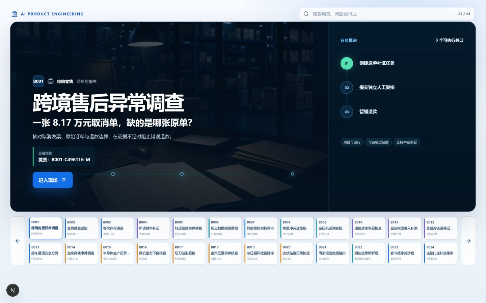

# AI 时代产品工程：从业务问题到可验证智能系统

AI 产品不是在旧软件里加一个聊天框。真正的变化是：人先把问题、材料和决定说清楚，再让模型调用合适的能力，最后用检查结果决定继续、修改还是停下。

全课沿一条主线展开：

```text
逻辑与证据：先分清事实、推断和决定
→ Prompt：让一次回答有用
→ Agent + Skills：让系统会选择工具、完成作品
→ Grill / Harness / Loop：让多步任务能追问、检查、修正和停止
→ 产品与系统架构：把角色、数据、状态和权限装进系统
→ 工程与交付：让系统经得起修改、失败和上线检查
→ 综合业务案例：在真实岗位、数据和流程里完成决定
```

数据分析贯穿三段主线：先提出可以计算的问题，再让 Agent 调用分析 Skill，最后把体检、计算、写作和复核连起来。

## 运行入口



在 `Course_AIProduct` 目录双击 `run.bat`，或在 CodeBuddy 终端执行：

```powershell
cd <课程目录>
.\run.bat
```

浏览器打开：

```text
http://127.0.0.1:3200
```

进入综合案例后，先用主岗位提交任务，再切换主管完成确认；刷新页面后，状态和操作记录仍然保留。部分案例提供“开始演示”引导，没有引导的页面直接按主按钮推进，业务动作不会被一段讲解文字替代。

全课按能力递进。综合业务案例在驾驶舱中演示；Prompt 与 Skill 章节直接在 CodeBuddy 中完成，不再为每个短实验制作网页。

| 编号 | 内容 | 学完能做什么 |
|---|---|---|
| P001—P008 | Prompt 实验 | 用 18 个短实验练会任务、参照、追问、数据、工具和检查 |
| S001—S008 | Agent + Skills | 让 Agent 选择并调用数据、视觉、文档、游戏和 3D 能力 |
| L001—L003 | Loop 工程 | 让多步任务根据检查结果修正、停止或交给人 |
| 架构与交付 | 规格、C4、DDD、事件、质量门禁 | 把业务规则变成能运行、能恢复、能验收的系统 |
| B001—B024 | 综合业务案例 | 把模型、数据、角色、状态和操作做成真实产品页面 |

需要在线模型时，只从环境变量读取密钥。没有接入模型、图像或 3D 服务时，仍可使用课程保存的输入与结果讲解，但不能把样例说成当场生成。
