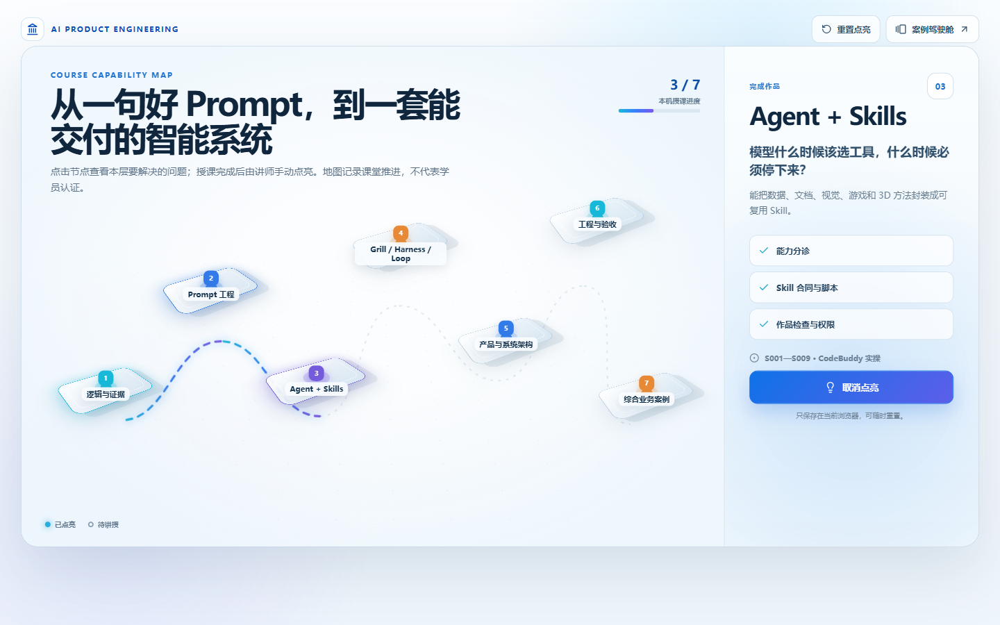

# AI 时代产品工程：从业务问题到可验证智能系统

锅炉主汽温度连续偏低二十四分钟，页面上只有出口温度，没有阀位、流量和分段温度。模型可以在几秒钟内写出三个“可能原因”，现场人员却不能据此动阀。此刻真正有用的产品，要把现有记录、缺少的材料、优先检查段和责任人放在一起，让下一步既能执行，也不会越过权限。

这门课就从这样的时刻出发。我们不从模型名词表开始，也不把 AI 当成聊天框；先学会分清观察、推断和动作，再一步步把 Prompt、Agent、Skill、Loop、业务规则和系统架构接起来。

```text
看清问题：事实能支持到哪里
→ 写清任务：让一次回答可以检查
→ 调用能力：让 Agent 读数据、做作品、交结果
→ 管住过程：让 Grill、Harness 与 Loop 负责追问、工具、修正和停止
→ 做成产品：把角色、状态、权限和异常写进系统
→ 放进现场：用二十四个案例完成一次真实决定
```

数据分析贯穿整条路径。最初只问一个算得出的问题；进入 Skills 后，程序读取文件并留下结果；进入 Loop 后，体检、计算、写作和复核开始接力；到了业务案例，数据只负责它确实能够回答的部分。



全课有六组 Prompt 单元、九个 Skill 实验、四种 Loop 模式和二十四个业务案例。编号用于定位，不代表授课天数。可以截取其中一段做短课，也可以沿主线讲完一套完整课程；知识顺序不随课时变化。

| 学习段落 | 课堂上完成什么 |
|---|---|
| 逻辑、材料与 Prompt | 把一句模糊要求改成带材料、做法、交付物和检查项的任务 |
| Agent + Skills | 让 Agent 选择数据、视觉、文档、游戏、3D 或动效能力，并交出可以打开的作品 |
| Grill、Harness、Loop | 处理含糊决定、工具失败、返工和停止条件 |
| 产品、架构与工程 | 把业务对象、状态、权限、事件和测试装进可维护的系统 |
| 综合案例 | 在电商、公共服务、工业、医疗和日常经营场景里走完一次岗位决定 |

## 案例驾驶舱

在 `Course_AIProduct` 目录双击 `run.bat`，或在 CodeBuddy 终端执行：

```powershell
cd <课程目录>
.\run.bat
```

浏览器打开 `http://127.0.0.1:3200`。进入案例后，用主岗位发起任务，再切换到有权限的角色确认；刷新页面，状态和操作记录仍应保留。Prompt 与 Skill 的短实验直接在 CodeBuddy 中完成，不为每个知识点再造一个网页。

需要在线模型、图像或 3D 服务时，密钥只从环境变量读取。没有在线服务也可以使用课程内的固定输入与结果完成授课，但要把“保存的样例”和“本次在线生成”说清楚。

下一章先处理一个更基础的问题：模型写得很像答案时，怎样知道哪些是事实，哪些只是顺着语言继续写。
