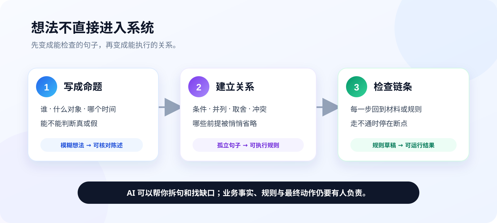
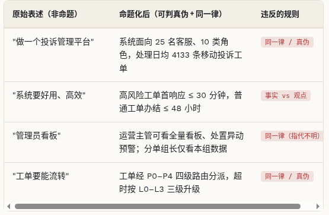
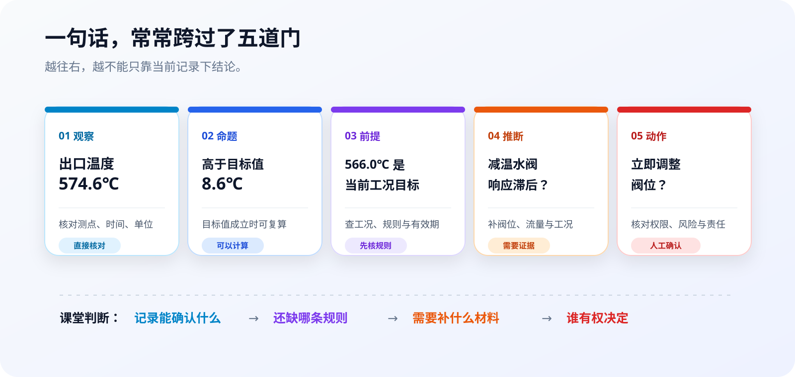

# 第1章 从想法到可以判断的命题

很多项目不是败在技术上，而是从第一句话开始就没说清楚。有人说“系统要智能一点”，有人说“这个方案太贵”，还有人把一条记录、一个猜测和一个操作建议写在同一句话里。人听着似乎明白，到了评审、写 Prompt 或验收时，大家理解的却不是同一件事。

这一章先不急着讲模型。我们只练一项基本功：把想法写成可以判断、可以核对、可以继续加工的句子。后面的 Prompt、Agent、Skill、Loop 和业务系统，都会从这里起步。



## 1.1 先把想法拆开

### 1.1.1 三步已经够用

逻辑在这门课里不是一套用来压人的术语，而是一条很朴素的工作路径。

第一步，把想法变成命题。命题是一句能够判断真假的陈述。它不一定已经被证明为真，但至少要让人知道怎样查。

第二步，建立命题之间的关系。哪些条件必须同时满足，哪些条件满足一个即可，哪两句话彼此冲突，哪条规则真的能推出后面的结论，都要写明白。

第三步，检查整条链。每一步都应回到一条材料、一个规则或一次计算。中间断了，就停在断点补材料，不靠语气把结论硬接上去。

这三步与 AI 产品的工作正好对应：模糊想法先变成可核对的需求，需求再变成规则、状态和数据，最后用运行结果检查链条是否真的走通。模型可以帮助拆句、找矛盾和列候选，但不能替项目替换事实，也不能替有责任的人签字。

### 1.1.2 “快递柜太扰民”为什么会吵不完

小区业主群里有人说：“小区快递柜太扰民，必须搬走。”另一位业主马上反驳：“快递柜方便大多数人，不能搬。”两边都在说真话吗？有可能。两边在说同一件事吗？未必。

“扰民”可能指夜间提示音，也可能指快递车占道；“方便大多数人”可能来自个人感觉，没有人数和时间范围；“必须搬走”又从现象直接跳到了动作，省略了静音、调整装卸时段和改变位置等备选办法。

先把争论拆成几句可以查的话：

1. 过去七天，22:00 以后共出现 11 次取件提示音。
2. 声音来自 3 号楼北侧快递柜，而不是旁边便利店。
3. 现行物业约定要求 22:00 后关闭外放提示音。
4. 关闭提示音仍能通过短信和屏幕完成取件。
5. 如果第 4 句成立，先静音就比立即搬迁更小、更容易恢复。

原来的争论混着感受、事实、规则和方案。拆开后，大家仍可能有不同偏好，却已经知道先查哪一项。逻辑不会保证所有人意见一致，它先让分歧落到同一个对象和同一组条件上。

### 1.1.3 一句话何时算拆完

拆句不是把一段话机械切成短句。判断是否拆完，可以连续问四个问题：

- 句子说的是谁或什么对象？
- 时间、地点、范围是否明确？
- 别人能否用记录、规则或观察判断它成立不成立？
- 如果它不成立，后面的结论是否会改变？

“提升用户体验”答不了这四问。“结算页在 4G 网络下的交互可用时间不超过 2 秒”就容易检查得多。这里的 2 秒还需要说明从哪个事件开始计时、在哪些设备和样本上测量；命题并不等于完整需求，但它让需求有了可继续加工的基本单元。

## 1.2 事实、观点与命题

### 1.2.1 命题不等于事实

“今天成都下雨”是命题，因为可以查天气记录；它可能真，也可能假。“今天的雨真烦人”是感受，没有统一真假。“请把伞带上”是请求，也不是命题。

命题只回答“这句话有没有明确的真假条件”，事实回答“核对以后它是否成立”。把两者混在一起，会出现一个常见错误：只要一句话写得像报告，就把它当成已经证实的事实。

| 表达 | 类型 | 还要补什么 |
|---|---|---|
| 这个套餐太贵 | 观点 | 与哪一个套餐、哪个价格口径比较 |
| 该套餐月费 129 元 | 命题 | 账单周期、地区和生效版本 |
| 用户一定被多收费了 | 未证实结论 | 订购记录、计费规则和账单明细 |
| 请立即退款 | 动作请求 | 权限、触发规则、金额和复核人 |

原讲稿里已经有一张很实用的命题化对照表。它把“做一个平台”“系统要高效”改成角色、数量和时限明确的陈述。图不华丽，但信息清楚，所以原样保留。



### 1.2.2 同一个词，前后必须指同一件事

“客户”“订单”“高风险”“办结”这些词在会议里很常见，也最容易悄悄换意思。

例如，产品经理说“客户可以看全部记录”，说的是发起投诉的个人；运营主管理解的“客户”却是签约企业；开发又把数据库里的 `customer` 当成所有联系人。如果不先统一对象，同一句权限需求会做出三套结果。

同一律的实际用法不是背一句“同一思维过程中概念要保持一致”，而是给关键名词固定口径：

- “任务”指 `task_id` 唯一标识的一次课程核查，不等于真实投诉案件；
- “已核实”指材料已经由指定角色确认，不等于模型判断概率较高；
- “办结”指状态进入关闭且必填材料齐全，不等于页面上出现绿色标签。

写 Prompt 时也一样。前面要求“只分析给定资料”，后面却让模型“结合行业经验补全”，材料范围就在一句话里被换掉了。模型可能很配合，结果却无法核对。

### 1.2.3 时间、范围和角色是句子的一部分

“响应时间不超过 30 分钟”看似清楚，仍缺三个口径：从什么时候开始，到什么动作结束，哪些任务适用。

把它写完整，可以是：

> 对 2025 年第二季度进入人工高风险队列的课程任务，从服务端记录 `received_at` 起，到有权限的运营主管首次写入处理记录为止，不超过 30 分钟。

这句话仍可能需要业务评审，但至少不会把“模型生成了一段建议”误算成“工作人员已经响应”。角色、时间和范围不是注释，它们决定命题的真值怎样计算。

## 1.3 条件、范围与判断边界

### 1.3.1 一句判断里藏着五层信息

看这句话：

> 主汽温度高于目标 8.6℃，说明减温水阀响应滞后，应立即调整阀位。

它把五层东西压在了一起：记录里有什么、能计算出什么、计算依赖什么条件、原因是什么、下一步做什么。



| 层次 | 本例 | 检查方法 |
|---|---|---|
| 观察 | 出口温度记录为 574.6℃ | 核对测点、时间和单位 |
| 命题 | 比 566.0℃ 高 8.6℃ | 复算差值 |
| 前提 | 566.0℃是当前工况目标 | 查工况规则及生效时间 |
| 推断 | 原因是阀门响应滞后 | 补阀位、流量和相邻工况记录 |
| 动作 | 立即调整阀位 | 核对权限、风险和人工确认 |

现有记录可能只够确认前两层。原因和动作不是“写得谨慎一点”就会自动成立，它们需要新的材料和责任人。AI 很容易把这五层写成一段流畅解释，产品必须把它们重新拆开。

### 1.3.2 “可能”“必然”“不可能”不能混用

生活里常说“他肯定忘了”“这事绝对不可能”。在系统规则里，这几个词的代价很高。

- **可能**：现有条件没有排除它，但也没有保证它发生。
- **必然**：只要前提成立，结论就不能不成立。
- **条件下不允许**：业务规则明确禁止，并不等同于物理或逻辑上的“不可能”。

“请求超时后外部系统可能已经执行”是一种状态未知；“同一业务键只能创建一条恢复任务”是一条系统约束；“网络中断绝不可能重复提交”则是没有根据的绝对化表达。

课程会保留原 50 讲中关于必然性、反例和逻辑边界的核心内容，但不照搬“某个定理直接证明 AI 做不到什么”这类跨层推断。数学定理、模型能力和产品责任是不同问题，必须分别说明适用条件。

### 1.3.3 不知道时，先把不知道写准确

判断并不只有“真”和“假”两个按钮。现实工作中还经常出现第三种状态：材料不足，暂时无法判断。

把“不知道”写准确，需要说清三件事：现在已经知道什么，缺什么，补到什么程度可以继续。比如：

> 本地日志确认请求已发出，但没有收到响应；现有材料不能确认外部系统是否执行。下一步按原业务键查询外部效果，在结果明确以前不创建第二条任务。

这段话没有给出根因，却已经足够指导安全动作。悬置判断不是回避问题，而是拒绝用猜测填满材料的空白。

## 1.4 模型回答也要逐句验明身份

### 1.4.1 流畅来自续写能力，不来自事实担保

Transformer 的注意力机制让模型能够联系上下文中相隔很远的词句；大语言模型再根据当前上下文预测后续更可能出现的内容。这解释了它为什么擅长改写、概括和模仿结构，也解释了为什么“像一篇评测”不等于“评测里的比较都有依据”。

NIST 在生成式 AI 风险框架中把“自信地生成错误或虚假内容”单列为一种风险。它不是偶发的语病，而与生成机制和输入材料有关。产品上的办法不是提醒一句“请勿幻觉”，而是把资料、判断范围、输出结构和检查条件都写进任务。

先给模型五个参数：256GB、5000mAh、80W、198g、3299 元；明确资料没有处理器、无线充电、防水等级、实测续航和充电耗时。然后只说：

```text
我要写一篇手机评测，重点说它续航强、很值得买。
```

这个 Prompt 已经把结论塞在问题里。模型最容易做的，是替这个结论寻找听起来合理的铺垫。

### 1.4.2 一次模型输出里，哪些句子越过了材料

课程已有一次 `qwen-plus` 的真实 A/B 运行，原始回执保存在 [`P001-smartphone-review-contract`](../evidence/runtime/prompt-curriculum/P001-smartphone-review-contract/receipt.json)。原始 Prompt 得到的回答包含下面几类句子：

| 回答片段 | 身份 | 判断 |
|---|---|---|
| “电池 5000mAh，机身 198g” | 给定参数 | 可以直接核对 |
| “续航表现确属同价位中突出” | 比较结论 | 材料没有竞品和实测数据 |
| “同档位竞品普遍起售价 3499 元以上” | 外部事实 | 给定资料没有提供 |
| “资料未提供实测续航数据” | 范围说明 | 与材料一致 |

问题不在文笔，而在第二、第三句穿过了材料。改写 Prompt 后，任务变成：

```text
为第一次购买中端手机、最担心电量不够的读者写一篇不超过500字的评测。

依次写：
1. 已知参数；
2. 资料尚不能证明什么；
3. 购买前还应实测什么。

第一段只能逐项陈述256GB、5000mAh、80W、198g和3299元。
不得加入“主流、常见、较快、舒适、性价比、值得买”等比较或评价；
不得推算使用天数、亮屏时长、补电比例、充电分钟数或同价位排名；
不得补写处理器、无线充电和防水能力；结尾不要下购买结论。
```

改写后的实际回答保留了五个已知参数，明确了资料没有提供哪些信息，并把续航、充电和温度列成购买前的实测项目。这里仍要注意身份：实测项目是**建议**，不是产品已经具备的性能。一个好的回答不一定句句都是事实，关键是不要把事实、推断和建议写成同一种口气。

### 1.4.3 给任何回答做一次“逐句验身”

下面这个 Prompt 可以直接用于 CodeBuddy 或其他模型。它不要求模型重写原文，先要求它把每句话放回正确的位置。

```text
阅读“给定资料”和“待检查回答”，逐句检查回答中的陈述。

只允许使用四种标签：
- [资料事实]：可以在给定资料中逐字或逐项核对；
- [可复算]：能只用给定字段稳定计算；
- [推断]：需要额外前提或材料；
- [建议]：下一步动作，不是已经发生的事实。

对每一句输出：原句、标签、对应材料、缺少的前提。
如果一句话混有两种身份，先拆句再标注。
最后只列三项：可以保留的句子、必须改写的句子、还需补充的材料。
不要根据常识补参数，不要替资料下购买、诊断或责任结论。
```

现场练习时，把手机评测的原始回答粘进去。最值得讨论的不是模型能不能贴对全部标签，而是同一条判断能否由另一位同事沿着材料重新核对。

## 1.5 综合案例：一条投诉需求怎样变成系统规则

### 1.5.1 先看真实公开统计，再看课程任务

电信投诉案例使用两层数据，不能混着讲。

第一层是工信部 `MIIT-2025-Q2` 公开汇总：2025 年第二季度，资费、服务、营销三类申诉占比分别为 40.4%、39.3% 和 11.4%。这能说明全国汇总中的类别比例，不能说明某一位用户的投诉已经成立。

第二层是本地 [`case.csv`](../dataset/B010-telecom-complaint-orchestration/case.csv)：1,000 条确定性合成课程任务，其中资费争议 404 条、服务争议 393 条、营销争议 114 条、其他 89 条；城市、渠道、任务号和网络故障场景均为合成。334 条是“没有提交线索”，333 条是“请求可能已提交但响应丢失”，333 条是“外部效果未知”。全部记录的 `allegation_verified` 都是 `False`。

这个分层很重要：真实公开数据提供比例和行业背景，合成运营层提供可重复练习的任务。二者合在一起可以做课程，不能合成“真实用户投诉库”。

### 1.5.2 把“智能处理、尽快办结”改成五条命题

原始需求只有一句：

> 系统要智能处理电信投诉，重要投诉尽快办结，网络失败时自动重试。

这句话无法直接开发。谁判断“重要”，多快算“尽快”，自动重试会不会重复建单，都没有答案。以 `CN-TEL-2025Q2-0008` 为例，先改成五条可以检查的命题：

1. 当前任务的唯一业务键是 `CN-TEL-2025Q2-0008`。
2. 本地已记录请求发出，但当前没有取得外部响应。
3. “没有收到响应”不能推出“外部系统没有执行”。
4. 外部效果未确认以前，不得创建第二条业务任务；查询或重试必须沿用原业务键。
5. 只有另一名业务主管核对结果摘要和材料编号后，任务才能关闭。

前两句描述当前材料，第三句阻止错误推理，第四句是系统约束，第五句补上责任角色。它们合在一起，才从“自动重试”变成一个可以实现和验收的恢复流程。

### 1.5.3 用 Prompt 把数据、规则和未知状态分开

把下面的任务交给 CodeBuddy。它既可以用来生成需求草案，也可以用来复核已有实现。

```text
你正在复核一条电信服务课程任务。

材料：
- dataset/B010-telecom-complaint-orchestration/case.csv
- 任务号 CN-TEL-2025Q2-0008
- 类别比例来自 MIIT-2025-Q2 全国公开汇总；城市、渠道和任务均为确定性合成；
- allegation_verified=False 表示投诉陈述尚未被核实。

请完成四件事：
1. 只读取该任务真实存在的字段，列出“本地已知”；
2. 列出当前仍不知道的外部效果，不得猜测投诉是否成立；
3. 把恢复流程写成状态转换：当前状态、允许动作、下一状态、执行角色；
4. 给出六条验收检查，至少覆盖重复提交、结果未知、缺少材料、同人关闭和刷新恢复。

规则：
- 没有响应不等于没有执行；
- 查询和安全重试沿用原业务键；
- 结果摘要与材料编号缺一不可；
- 查询发起人与最终关闭人必须不同；
- 不生成姓名、手机号、账号、真实运营商回执或投诉成立结论。

输出顺序固定为：已知事实、未知状态、状态转换、验收检查。
每个判断都要指出使用了哪个字段或哪条规则。
```

一个合格结果应停在“外部效果待核对”，而不是替外部系统宣布成功或失败。它还应把“查询”和“再次创建业务任务”分开：前者用于补材料，后者可能造成重复操作。

### 1.5.4 从命题走到可以操作的页面

现有 B010 工作台已经把这组命题落成了可操作流程：左侧按结果状态找任务，中间分开显示本地记录、网络中断点和外部效果，右侧由流程协调员记录查询目标、结果摘要与材料编号，再交给另一名业务主管关闭。


课堂演示只走一条路径：搜索 `CN-TEL-2025Q2-0008`，先记录“结果仍未知”，再补一个明确结果与材料编号，最后切换业务主管关闭并刷新页面。页面如果出现两条恢复任务、刷新后记录消失，或者同一个人可以发起并关闭，前面的逻辑链就没有真正落到产品里。

完整案例、实现与测试继续放在 [`B010 查询恢复案例`](../md/cases/B010-telecom-complaint-orchestration.md)。这一章先记住最小闭环：一句想法要先变成能判断的命题，命题之间要能连成规则，规则最终要由数据、页面状态和角色动作共同证明。
