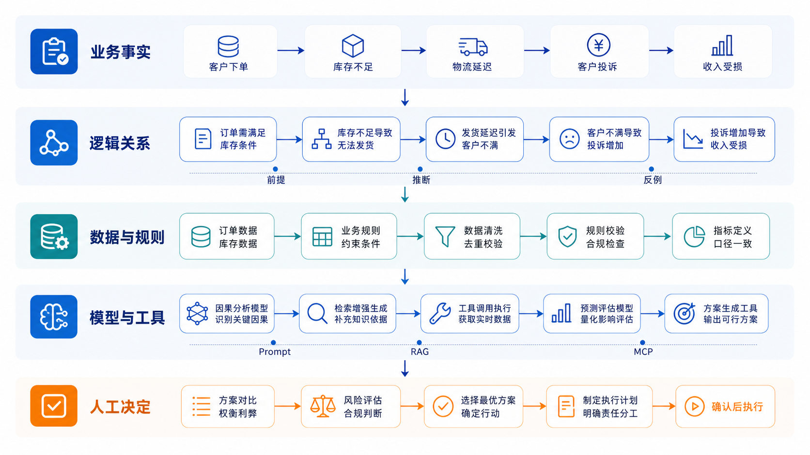

# 基础知识　模型会续写，产品必须负责

这一层只解决一个问题：面对模型给出的流畅回答，怎样判断它能说到哪一步。后面的 Prompt、Agent、Loop 和业务系统都会重复使用这里的判断方法。



## 模型为什么能写，却不等于知道

大语言模型根据上下文预测接下来更可能出现的词。Transformer 的注意力机制让它能在一段文字中关联相隔很远的信息，所以它擅长改写、归纳、模仿结构和生成候选方案。模型输出不能直接当数据库查询结果使用。

课堂上先做一个十秒实验：把“星河 X1 电池 5000mAh”改成“星河 X1 电池 5000mAh，资料没有实测续航”，再问“能用几天”。如果回答给出确定天数，就能看见第一个产品问题：语言顺畅不等于事实成立。

## 一句话里常常混着五种东西

看下面这句话：

> 主汽温度低于目标 8.6℃，说明减温水阀响应滞后，应立即调整阀位。

它看起来像一个结论，实际混在一起的是五层内容：

| 层次 | 本例 | 怎样检查 |
|---|---|---|
| 观察 | 记录值为 574.6℃ | 回到原始记录核对时间、单位和测点 |
| 命题 | 当前温度高于或低于某个参照 | 写成可以判断真假的完整句子 |
| 前提 | 566.0℃确实是此工况的目标值 | 核对目标从哪里来、适用于哪个窗口 |
| 推断 | 温差由阀门响应造成 | 寻找阀位、流量和相邻工况记录 |
| 动作 | 调整阀位 | 核对权限、风险和人工确认 |

数据里只有出口温度，就只能确认观察值和温差。阀门原因与调整动作都越过了现有材料。把一句话拆开，往往比继续要求模型“更谨慎”有效。

## 用反例检查结论有没有说得太满

假设有人提出：“每次高硅事件都由 3 号浮选槽造成。”只要找到一次高硅事件而 3 号槽没有异常，这个全称命题就不成立。这个反例没有证明其他槽是原因，只证明原结论过强。

课堂上可以把结论依次收窄：

```text
所有高硅都由 3 号槽造成
→ 本批次高硅与 3 号槽的偏差同时出现
→ 3 号槽应列入优先核对项
```

第一句需要排除所有其他解释；第二句只陈述同窗出现；第三句是基于现有材料可以执行的调查决定。证伪把话收回到材料能够支持的位置，不要求对所有事情保持绝对怀疑。

## 演绎与归纳走的是两条路

| 方法 | 从哪里出发 | 能得到什么 | 容易犯的错 |
|---|---|---|---|
| 演绎 | 已确认规则与当前事实 | 对当前对象的必然判断 | 规则本身没有核实，或适用条件被省略 |
| 归纳 | 一组样本中的重复现象 | 值得继续验证的模式 | 把有限样本写成普遍规律 |

例如，规则写明“资料不全不能提交检查申请”，当前对象确实缺少交接记录，那么“当前不能提交”是一次演绎。连续七天都出现功率下偏，则可以归纳出“值得检查共同原因”，但还不能推出设备已经故障。

产品里两种方法会接力：演绎负责执行明确规则，归纳负责提出候选模式。不要让模型用归纳猜出的模式直接越过权限门禁。

## 抽样、统计和因果要分三次讲

一个平均值出现以前，至少先回答四个问题：总体是谁、怎样抽样、分母是什么、缺失怎样处理。46 个农产品品种的月度价格可以回答“这批品种中哪些月份波动较大”，不能自动代表全国食品价格。

统计关系也不等于因果。发券组购买次数更高，可能来自优惠券，也可能因为高活跃会员更容易被选中。要回答“券是否带来增量”，至少需要可比较的实验组与对照组、统一观察窗、明确指标和随机或可解释的分配方法。

课堂判断可以保持三种状态：

- 已确认：原始记录或规则能够直接核对；
- 可计算：字段和口径齐全，可以稳定复算；
- 待验证：需要补材料、补实验或由有权限的人决定。

这三种状态已经足够支撑大多数 AI 产品，不需要把每个未知量都包装成一个置信度数字。

## 上下文决定这一次能看到什么

模型不会自动拥有项目里的全部文件。当前对话、明确附上的材料、检索返回的片段和工具结果，才构成这一次工作的上下文。上下文也不是越多越好：无关资料会挤占注意力，过期规则可能与新要求冲突，外部文档还可能夹带指令。

给材料时分成三层就够了：

| 层 | 放什么 | 不放什么 |
|---|---|---|
| 任务 | 这次要解决的问题、使用者、交付物 | 项目的全部历史聊天 |
| 资料 | 当前需要的字段、原文、截图、规则 | 与本次无关的整份资料库 |
| 检查 | 数字怎样复算、哪些话不能说、何时停 | “要专业”“请认真”等空要求 |

## Prompt、Agent、Skill、Loop 各管一件事

| 名称 | 它负责什么 | 什么时候不要用 |
|---|---|---|
| Prompt | 说清目标、材料、做法、交付和检查 | 需要真正读文件、写文件或调用系统时 |
| Agent | 根据当前结果选择下一步并调用能力 | 步骤固定、一次调用就能完成时 |
| Skill | 保存一套可重复的方法、脚本和资源 | 只用一次、没有复用价值时 |
| Loop | 把生成、检查、修改、停止连起来 | 没有清楚检查条件时 |

Agent 说“已经完成”不算完成。文档是否存在、数据是否写入、页面状态是否改变，才是结果；对话和工具调用记录只解释它怎样走到这里。

## RAG、MCP、A2A 不要混用

- RAG 解决“从哪份资料找依据”：先检索，再把相关片段交给模型。
- MCP 解决“应用怎样连接外部资料与工具”：服务器可以提供工具、资源和可复用 Prompt。
- A2A 解决“两个独立 Agent 怎样协作”：用于能力发现、任务交接和状态交换。

在同一个 Next.js 应用里调用一个函数，不需要 A2A；只查一份本地 CSV，也不需要先造知识库。先用最短路径把结果做对，再增加协议和自治。

有了这条底线，下一步才是写 Prompt。我们要把角色、材料、动作和检查项放进一次可执行的委托，句式只是表达工具。
