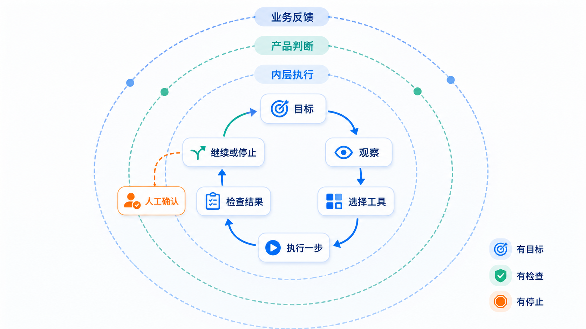

# 第三部分　Grill、Harness 与 Loop：把任务做完，也知道何时停

Prompt 说明一次工作，Grill 把模糊决定问清楚，Harness 准备可以工作的现场，Loop 根据结果决定下一步。四者不是四套流行术语，而是一条任务从“想做”走到“做完”的路径。



## Grill：只追问会改变方案的决定

需求访谈最容易走向两个极端：一句都不问，或者把所有细节都丢回给用户。Grill 先查代码、数据、文档和现有结果，只把无法从材料判断、并且会改变范围、架构、安全或验收的问题交给决策人。

以“给成长会员发优惠券”为例，券面额、数据字段和会员数已经在材料里，不需要再问。真正需要确认的是“目标是短期核销还是长期留存”，因为它会改变指标、观察窗和实验设计。问题确认后写下一页冻结结果：目标、输入、允许动作、停止条件、验收方法和唯一下一步。

Grill 在共同理解形成时停止。继续追问不会自动提高质量；如果答案只影响按钮颜色、文件名或其他可逆细节，就由执行者按现有规范决定。

## Harness：让 Agent 看得见、做得到、错了能回来

Harness 不是某个框架或一段系统提示。它是 Agent 工作时能够看到和使用的完整环境：

| 组成 | 本课程怎样落地 |
|---|---|
| 项目地图 | 简短入口指向章节、数据、代码和检查，不把全部历史塞进上下文 |
| 类型化工具 | 只开放数据体检、检索、生成、测试等明确动作 |
| 可读反馈 | 页面、文件、日志、测试和指标都能被再次检查 |
| 结构约束 | 目录、数据合同、状态转移和依赖方向由程序校验 |
| 权限与预算 | 限制路径、次数、时长、外部调用和高影响动作 |
| 恢复点 | 长任务保存已完成项、当前结果和唯一下一步 |

Agent 能启动项目却看不到错误日志，或者能写文件却不知道允许目录，都说明 Harness 不完整。好的 Harness 不替 Agent 作业务判断，而是让正确动作容易执行、错误动作容易被发现。

Loop 把每次输出交给明确的检查条件。下一步只有四种：继续、只改未通过项、等待人决定、停止。

| 循环 | 适合的任务 | 什么时候停 |
|---|---|---|
| 生成—检查—改写 | 文案、视觉、报告 | 检查项全部通过，或需要审美选择 |
| 分析—假设—数据回查 | 经营与研究问题 | 假设被数据支持、否定，或缺关键资料 |
| 编码—测试—定位—修复 | 页面、脚本、Skill | 目标测试和旧功能检查都通过 |
| 计划—执行—检查点—恢复 | 跨小时、跨任务工作 | 到达检查点，或需要人批准高影响动作 |

## 三层 Loop：别用一个循环包办所有事情

同一个产品里通常有三种不同速度的循环：

| 层次 | 观察什么 | 谁能改变它 | 典型周期 |
|---|---|---|---|
| 任务 Loop | 一次回答、一次检索、一次工具调用 | Agent 在本次权限内 | 秒到分钟 |
| 产品 Loop | 用户是否完成决定、错误是否减少、资料是否更快补齐 | 产品与工程团队 | 天到周 |
| 组织 Loop | 指标、风险、职责和方法是否仍适合 | 业务负责人和治理角色 | 周到季度 |

任务 Loop 通过不代表产品有效。模型把退款材料整理得很漂亮，但售后主管仍找不到缺失原单，产品 Loop 就没有通过；团队发现同类问题每周都发生，才需要在组织 Loop 中修改职责、数据或系统边界。

每个 Loop 都写六件事：目标、可观察量、允许动作、检查条件、次数或时间预算、停止与升级。缺少其中任何一项，循环都容易退化成“继续试到看起来不错”。

```text
目标：把缺失材料定位到具体责任方
观察：原单、支付、物流三类材料是否齐全
动作：查询、比对、创建补证任务
检查：每个缺口都有负责人和截止时间
预算：最多补查两轮
停止：资料齐全后交独立复核；仍缺失则交主管决定
```

控制论提供的是思路，不是把人和业务简化成一个公式：传感器读取当前结果，控制器比较目标与偏差，执行器采取受限动作，环境随后产生新状态。对应到 AI 产品，页面、日志和测试是传感器；规则与模型共同形成控制器；工具是执行器；权限、预算和人工确认决定执行边界。

要复现前三个本地实验，可以直接交给 CodeBuddy：

~~~text
阅读 code/labs/loop-runtime/README.md 和 run_loop.py，
依次运行 L001、L002、L003，把结果保存在课程既定输出目录。
每个实验只报告：输入、调用的 Skill、生成的作品、检查结果、停止原因。
若结果与正文数字不同，先核对数据文件和规则，不要改正文去迁就新结果。
~~~

## L001　两项 Skill 接力，检查通过就停

L001 先用 `data-profile` 完整扫描 5,000 条会员记录，再用 `metric-brief` 计算发券实验简报。四项硬检查全部通过：体检完成、会员数为 5,000、¥8 × 1,250 的名义面额上限为 ¥10,000、收入和复购间隔保持“不可计算”。

```text
observe  完整扫描数据
choose   选择 data-profile → metric-brief
act      生成 profile、metrics 和 business-brief
check    检查可算指标与缺失字段
revise   保留限制，不补造收入和时间
complete 四项硬条件通过，停止
```

结果见 [L001 运行记录](../evidence/runtime/loop-runtime/loop-run-L001.json) 和 [经营简报](../evidence/runtime/loop-runtime/L001/business-brief.md)。四项条件都通过后停止。

## L002　三套方向生成后，把审美选择交给人

L002 调用 `poster-recipe`，生成三套差异化配方和一个可编辑 SVG。方向数量、选择理由和 SVG 可编辑性都能检查，但“最终喜欢哪一套”没有客观唯一答案。

```text
observe  读取受众、文案、画面主体和禁用项
choose   选择 poster-recipe
act      生成三套配方和 SVG
check    检查差异、文字和可编辑性
revise   自动选择只保留为推荐
waiting  等人确认最终视觉方向
```

[L002 运行记录](../evidence/runtime/loop-runtime/loop-run-L002.json) 停在 `visual_choice_required`，由负责作品的人选择最终方向。

## L003　长任务分段执行，高影响动作交给人

L003 读取 UCI MetroPT-3 的固定五分钟窗口：2020-04-17 23:57:36 至 2020-04-18 00:02:25，共 25 条记录。它计算 TP2、TP3、油温和电机电流的窗口统计，再读取两条公开数据说明与两条课程检查规则。

源数据的 `maintenance_action_allowed` 全部为 `False`，资料也没有真实维修结果。因此系统只生成 [现场检查申请](../evidence/runtime/loop-runtime/L003/approval-packet.json)，不会写故障根因，更不会停机、维修或调用设备工具。

```text
observe  读取 25 条公开传感记录
choose   只检索字段说明、检查程序和审批规则
act      计算固定窗口统计
check    没有维修结果，也没有控制权限
revise   删除诊断和维修措辞
waiting  等有权限的主管决定是否创建检查工单
```

[L003 运行记录](../evidence/runtime/loop-runtime/loop-run-L003.json) 停在 `permission_required`：材料够整理申请，还不能替人做高影响决定。

如果调查跨越多个任务，在每个可独立验收的节点保存不超过 1200 字的检查点：目标、已完成、决定、改动路径、检查、阻塞、唯一下一步。恢复时先核对文件和检查结果仍存在，再从唯一下一步继续；不要靠回放整段聊天找进度。

## L004　代码修到测试通过，也要回看旧功能

这类循环从一个可复现问题开始。例如 PixiJS 原型按 R 键后时间回到 45 秒，但玩家位置没有复位。不要同时重写界面和得分规则，只修这一个问题。

~~~text
在 code/skills/pixijs-game-contract 的示例项目中复现：
按方向键移动后按 R，倒计时恢复为45秒，但玩家位置没有回到起点。

先写或补一条只覆盖“移动后重启”的测试，再定位状态初始化与键盘处理。
只修改造成该问题的最小代码；不要改颜色、布局和得分规则。
运行新增测试、原有测试和生产构建。
最后报告：复现步骤、修改文件、通过的检查、仍未覆盖的交互。
~~~

```text
reproduce  让问题稳定出现
test       先把错误写成会失败的检查
locate     找到状态没有复位的最小原因
fix        只改这一处
verify     新检查、旧检查、构建都通过
stop       没有新失败就停止
```

如果修复重启却弄坏倒计时，循环回到 `locate`；如果测试全绿但浏览器按键仍异常，再补一次真实页面操作。测试是快速筛网，用户动作是最终确认。
