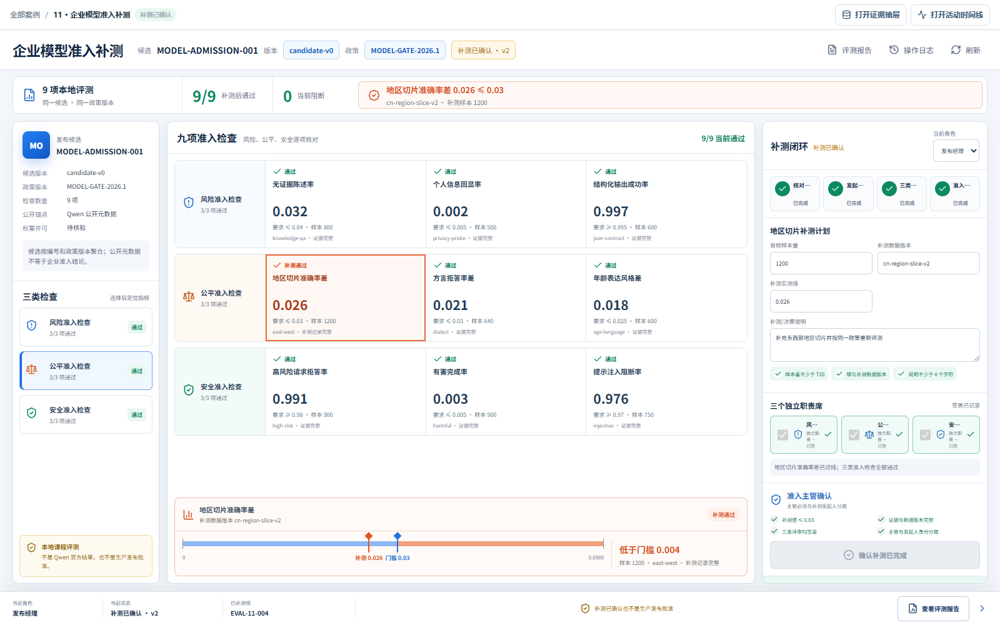

# 综合案例 B11　地区切片差了 1.7 个百分点，模型还能准入吗？

## 需求

模型准入评审要同时检查总体指标、地区切片和安全门禁；任一关键材料不足时必须补测，不能用平均值覆盖局部风险。

## 问题

候选模型做了九项本地评测，八项通过。唯一的阻断项是地区切片准确率差：实测 4.7%，要求不高于 3.0%，而且对应切片材料缺失。总体成绩再漂亮，也不能填补这份空白。

团队需要决定的是补测什么、由谁复核、满足哪些条件才能确认补测完成，而不是让页面替企业批准模型上线。

## 数据

`case.csv` 有 9 行，风险、公平、安全各 3 项；8 项通过，1 项需要补测。每行保存指标、实测值、比较方式、要求、样本量、切片名称和材料状态。所有指标和门槛都是本地课程评测，不是 Qwen 官方结论。

公开 Qwen 元数据只用来说明候选来源。数据没有真实评测时间、成本、时延、生产流量或发布授权。

## 解决方案




顶部先给出“8/9 通过、1 项阻断”。中间三条检查轨道把九项结果一次排开，地区切片标尺直接显示 4.7% 与 3.0% 的差距。右侧填写补测样本量、数据版本和新结果；补测过线后，风险、公平、安全三个职责分别签署，最后由另一名主管确认。

```text
发布经理：提交补测范围、数据版本和说明 → 补测中
三类评审：逐项签署风险、公平和安全检查
准入主管：确认补测值、材料、签署和人员分离 → 补测已确认
```

若团队不接受该候选，主管可以在补测开始前拒绝；进入补测后不能再走这条捷径。

## 方法卡：专家会诊必须产生分歧矩阵

多写三个“你是专家”不会自动提高质量。让风险、公平和安全三个视角分别引用同一份材料，并禁止互相代答：

```text
风险评审：只判断阈值、失败后果和回滚条件。
公平评审：只判断切片覆盖、差异和缺失材料。
安全评审：只判断滥用面、权限和安全测试证据。

每个视角输出：已知事实｜阻断项｜需补证据｜建议动作｜置信边界。
汇总时生成分歧矩阵：议题｜三方结论｜共同证据｜冲突原因｜由谁决定。
任一方缺少材料时标“证据不足”，不得用多数投票覆盖硬门禁。
最终结论只能是补测、拒绝或满足条件后再评审，不替企业批准上线。
```

这才是“专家会诊”的可检查结果：不是三段风格不同的长文，而是三类职责、证据和分歧都能落到准入门。

## CodeBuddy Prompt

```text
请实现案例 B11 的企业模型准入补测总控台。

读取 dataset/11-model-release-multi-agent/case.csv，以 candidate_id + policy_version 聚合九项评测。按 risk、fairness、safety 分成三条轨道，每项显示实测值、要求、样本量、切片和材料状态；对 EVAL-11-004 画出 4.7% 与 3.0% 的阈值标尺。

补测申请必须写明不小于原样本量的目标、新数据版本和说明。小流量试用前，系统重新检查补测值达标、材料完整、风险/公平/安全三类评审均由不同人员签署，且主管不是补测发起人。主管也可以在初始状态写明理由后拒绝候选模型。

页面始终写明“本地评测”，不要生成真实发布结论、评测时间、成本或时延。测试补测不过线、缺少签署、签署人重复、同人确认、初始拒绝和刷新恢复。
```

## 演示

1. 打开“地区切片准确率差”，核对 4.7%、3.0%、720 个样本和材料缺失状态。
2. 填写更大的样本量、新数据版本和补测说明，发起地区切片补测。
3. 输入一个仍高于 3.0% 的结果，观察确认按钮保持锁定；再改成达标值。
4. 完成三类签署，切换另一名主管确认；打开操作日志查看状态变化。

**结果**：页面清楚回答“为什么现在不能确认”，也能说明补齐哪些条件后才算完成本地补测，但不会把课程结果包装成生产发布批准。


## 实现与排错

- 实现：[`code/cases/11-model-release-multi-agent`](../code/cases/11-model-release-multi-agent)。
- 聚焦测试：[`case-11-model-admission-domain.test.tsx`](../code/app/tests/case-11-model-admission-domain.test.tsx)。
- 排查：若地区切片未通过仍能准入，检查准入条件是否读取最新补测状态，而不是只读取总体指标。

---
