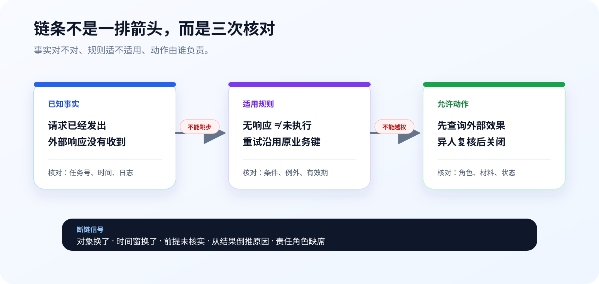

# 第2章 把命题连成可检查的推理链

第一章解决“每句话在说什么”，这一章解决“这些话能不能连起来”。一条业务规则常常从事实跳到结论，再从结论跳到动作。箭头画得越多，越容易让人忘记问：这一步凭什么？

先记住一条简单标准：推理链上的每个节点都要能单独判断，每条连线都要说明关系。节点模糊，链条没有起点；连线没有条件，链条只是故事。


这张课程旧图值得保留。它把业务事实、逻辑关系、数据规则、模型工具和人工决定分成五层：模型位于链条中间，既不替代源头事实，也不越过末端责任。



## 2.1 把一句规则写成逻辑关系

### 2.1.1 与、或、非先解决组合条件

假设有三条命题：

- P：查询结果已经明确；
- Q：材料编号已经填写；
- R：业务主管已经复核。

“P、Q、R 同时成立才允许关闭”是**与**关系。缺任何一个条件，关闭都不能发生。产品里最常见的实现就是多项门禁：`P ∧ Q ∧ R → 可关闭`。

“外部系统确认已执行，或者确认未执行，都可以进入结果复核”是**或**关系。这里的两个结果互斥，但都属于明确结果。要是再加一个“仍然未知”，它就不能偷偷算作前两个分支之一。

**非**关系最容易在自然语言里写错。“并非所有材料都齐全”只说明至少缺一项，不等于“所有材料都不齐全”。系统里若把 `not all` 写成 `all not`，一次布尔判断就会把部分缺失误报成全部缺失。

| 业务句子 | 逻辑关系 | 实现时检查 |
|---|---|---|
| 摘要和材料编号都齐全 | 与 | 两项都存在 |
| 已执行或未执行 | 或 | 至少一个明确结果，且不能同时成立 |
| 不是所有任务都已复核 | 非 + 量词 | 至少存在一条未复核任务 |

符号的作用是消除歧义，不是把课程变成数学考试。只要一句业务规则有两个以上条件，就值得先写成 P、Q、R，再翻回自然语言。

### 2.1.2 蕴含不等于双向等价

“如果任务属于高风险，就必须人工复核”，写成 `高风险 → 人工复核`。它没有说明所有人工复核任务都是高风险；材料异常、权限冲突也可能触发复核。

从 `P → Q` 和 `Q` 推出 `P`，叫肯定后件，是常见的无效推理：

> 如果下雨，地面会湿；地面湿了，所以一定下过雨。

洒水也能让地面变湿。产品里的版本是：“如果模型高风险就进人工队列；这条任务在人工队列，所以模型一定判了高风险。”它忽略了其他入口。

原命题 `P → Q` 与逆否命题 `非Q → 非P` 等价。既然“没有主管复核就不能关闭”，那么看见已经关闭的任务，至少应能找到主管复核记录。这种倒查很适合做验收。

只有 `P → Q` 和 `Q → P` 都成立，P 与 Q 才等价。业务上很少有天然的双向等价，除非我们通过唯一键、状态机或数据库约束把它做出来。

## 2.2 一致性比“听起来合理”更重要

### 2.2.1 对象、时间和口径要沿链条保持不变

“昨天的高风险任务 30 分钟内响应率为 92%，所以本月投诉都处理得很好。”这里至少换了三次对象：高风险变成全部投诉，昨天变成本月，首次响应变成处理质量。每个数字都可能没错，结论仍然无效。

检查一致性可以从四个地方入手：

1. **对象**：前后是不是同一批任务、同一个用户或同一个设备；
2. **时间**：统计窗、规则版本和动作发生时间有没有变化；
3. **口径**：分母、状态和指标定义是否一致；
4. **语境**：一句话在客服、运营和技术上下文中是否仍指同一件事。

AI 生成长文时，前后偷换口径很常见。不要只问“有没有矛盾”，还要把关键名词、时间窗和分母抽出来逐项对齐。

### 2.2.2 真值表和德摩根律用在门禁上

真值表适合检查条件少、风险高的规则。比如“材料齐全且主管复核才允许关闭”，只需列四种组合：

| 材料齐全 P | 主管复核 Q | P ∧ Q：允许关闭 |
|---|---|---|
| 否 | 否 | 否 |
| 否 | 是 | 否 |
| 是 | 否 | 否 |
| 是 | 是 | 是 |

条件多到无法逐项枚举时，先用逻辑定律化简。德摩根律告诉我们：`非(P 且 Q)` 等于 `非P 或 非Q`。因此“关闭条件不满足”的提示可以准确拆成“材料未齐”或“主管未复核”，不用只报一个模糊的“校验失败”。

逻辑定律的价值就在这里：它把复杂的布尔表达式变成用户能处理的具体原因。

## 2.3 从规则和事实推出动作

### 2.3.1 三段论是最短的可检查链

一个有效的业务三段论包括规则、当前事实和结论。这是演绎推理的最短版本：规则覆盖当前事实，结论就随之成立。

```text
规则：所有外部效果未知的任务都不得创建第二条业务任务。
事实：CN-TEL-2025Q2-0008 的外部效果未知。
结论：当前不得为它创建第二条业务任务。
```

这条链能成立，前提是“外部效果未知”来自当前任务和当前版本，而不是另一条日志；规则也必须处于有效期内。推理形式正确，不会替错误前提变真。

数学归纳法给业务设计一个有用提醒：先确认起点，再确认每一步怎样从前一步到下一步。状态机也是这个思路。初始状态错了，或者某条迁移没有条件，后面跑得再整齐也没有意义。

### 2.3.2 角色、对象、动作和量词要拆出来

“客服可以看投诉”太粗。把它拆成关系，可以得到：

```text
主体：客服人员
动作：查看
对象：分配给本人的课程任务
条件：任务未关闭且权限有效
量词：每名客服只能查看满足条件的任务
```

量词会直接改变需求。“所有主管都能关闭任意任务”与“每条任务至少需要一名不同于发起人的主管关闭”完全不是一回事。前者是宽权限，后者是责任分离。

谓词逻辑在课程中保留到够用为止：把谁、对什么、做什么、在什么条件下拆清楚。复杂的形式证明不进入产品主线。

## 2.4 识别几种最贵的逻辑跳跃

### 2.4.1 从结果倒推原因，最容易让 AI 写出“诊断”

“上了补习班的学生成绩更高”不能推出补习班造成了成绩提高；原本更努力、家庭投入更高的学生可能更愿意参加补习。类似地，“阀门变化与温度偏离同时出现”不能推出阀门就是根因。

两个形式错误尤其常见：

- **肯定后件**：`P → Q`，观察到 Q，就断定 P；
- **否定前件**：`P → Q`，没有 P，就断定没有 Q。

模型擅长从结果列出可能原因，这可以当调查清单；只要页面把“候选原因”显示成“诊断结果”，逻辑身份就变了。

### 2.4.2 虚假两难、以偏概全和权威替代材料

| 跳跃 | 生活里的说法 | 产品里的风险 | 修正 |
|---|---|---|---|
| 虚假两难 | 要么全自动，要么全人工 | 漏掉 AI 建议 + 人工确认 | 列出第三种流程 |
| 以偏概全 | 三个差评都说慢，所以用户都嫌慢 | 少量样本替代总体 | 先看抽样与分母 |
| 诉诸权威 | 专家说的肯定对 | 专业范围、时间和材料未核对 | 查原始来源与适用范围 |
| 诉诸大众 | 大家都这么用 | 流行做法替代验收 | 用运行结果和风险检查 |
| 循环论证 | 系统可靠，因为它通过了可靠性检查 | 定义与结论互相证明 | 引入独立指标和测试 |
| 诉诸无知 | 没证据证明失败，所以一定成功 | 把未知写成成功 | 保留未知状态并补材料 |

原 50 讲用了大量生活例子解释谬误。课程保留这些例子的口语感，但删去重复清单和随机回答。每种谬误只留下一个识别动作：它省略了哪个前提，或者把哪一个词换了意思。

## 2.5 反例会让结论回到合适的范围

### 2.5.1 证伪不是证明相反结论

如果有人说“所有高硅事件都由 3 号浮选槽造成”，只要找到一次高硅事件而 3 号槽没有异常，这个全称命题就被证伪了。反例只说明原命题说得太满，没有自动证明另一个槽是原因。

科学结论的力量来自可检查：条件说清楚，别人知道什么现象会让它失败。产品规则也一样。与其写“模型可以准确识别风险”，不如写“在固定评测集上，哪些错判会阻止发布”。

逻辑也有适用范围。哥德尔不完备定理讨论特定形式系统的可证明性，不能直接拿来证明“大模型永远做不到某件业务工作”。模型能力要靠任务、材料和测试衡量；高风险动作是否交给模型，则是产品责任问题。

外星人是否存在是一个好玩的结课问题，但“还没有看到”既不能证明存在，也不能证明不存在。材料不够时，最准确的结论就是保留问题，而不是选择更有戏剧性的那一边。

### 2.5.2 锅炉温度案例：偏离值只够圈定核查范围

公开锅炉数据里，事件 `BT-0044` 从 2022-03-29 17:22:39 持续到 17:46:59，最低温度 526.63℃，包含 293 个原始采样点；分钟表对应 25 行。530—545℃是来源数据区间，不是厂方控制限。


现有数据缺少真实阀位、减温水流量、过热器分段温度、压力和负荷。于是链条只能走到：

```text
观察：出口温度低于来源区间下界
→ 可复算：事件持续时间和最低值
→ 调查决定：优先核对某一工艺段并补相应记录
```

它不能继续走到“阀门故障”或“立即调节”。这是证伪思维在产品里的用法：主动寻找会推翻当前解释的材料，并在材料不足时阻断自动动作。完整产品见 [`B018 锅炉温度复核`](../md/cases/B018-boiler-temperature-review.md)。

## 2.6 综合案例：一次投诉怎样穿过分派、复核和关闭

### 2.6.1 先把状态链写在页面之前

以 B010 的响应丢失任务为例，一条安全链可以写成：

```text
待核对
→ 流程协调员沿原业务键查询
→ 外部效果仍未知 / 已执行 / 未执行
→ 结果明确时填写摘要和材料编号
→ 另一名业务主管复核
→ 关闭
```

每条箭头都带条件：未知结果不能关闭，缺材料不能关闭，发起人与关闭人相同也不能关闭。这里的“另一名”是角色约束，“同一业务键”是对象一致性，“结果明确”是状态条件。

反过来做三次破坏测试：

1. 删除材料编号，看关闭是否被拒绝；
2. 用发起人身份关闭，看责任分离是否生效；
3. 重复提交同一业务键，看是否产生第二条任务。

如果任何一个测试穿过门禁，流程图画得再完整也不算自洽。

### 2.6.2 用一个 Prompt 审查整条链

```text
审查下面的业务状态链。不要改写成宣传文案。

对每条状态转换依次回答：
1. 当前对象的唯一键是什么；
2. 转换依赖哪些已经核对的事实；
3. 使用哪条规则，规则是否有例外；
4. 谁能执行，谁必须复核；
5. 缺少哪项材料时必须停止。

再做四类反例检查：
- 肯定后件；
- 否定前件；
- 对象或时间窗偷换；
- 未知状态被写成成功或失败。

输出一张表：转换、前提、允许角色、缺口、反例、建议门禁。
最后给出最短可执行链，不增加新角色和新状态。
```

这个 Prompt 的用途不是让模型替你设计更多流程，而是把已有链条拆到可审查。评审结束时应能回答：哪条事实启动了哪条规则，谁执行了哪个动作，哪一种反例会让流程停下。
