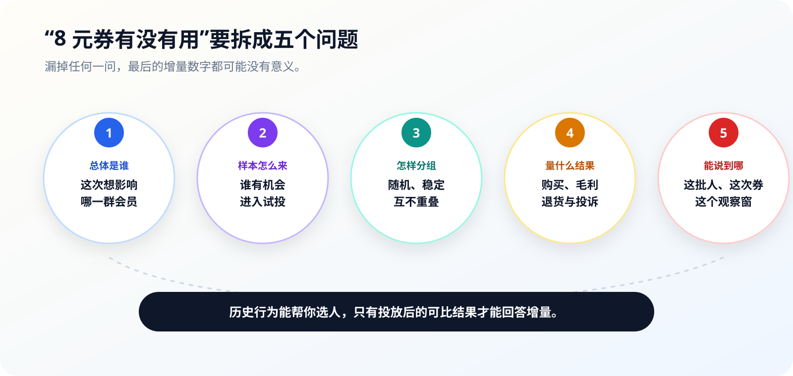

# 第3章 从样本走向可验证的结论

朋友说：“我给三位老客发了券，他们都下单了，8 元券肯定有效。”这句话听上去有数据、有行动、还有结果，但它还回答不了“券带来了多少新增购买”。三位老客本来就可能下单，没有发券的人发生了什么也不知道。

演绎推理检查一条链是否从前提有效地走到结论；归纳推理则从有限观察中寻找模式。后者永远要多问一步：这批观察能代表谁，换一个时间和人群还成立吗？

## 3.1 数据不是数字堆，归纳也不是凭经验

### 3.1.1 演绎给确定结论，归纳给可检验猜想

已知规则“资料不全不得提交”，当前任务确实缺材料，于是推出“当前不得提交”，这是演绎。只要规则、事实和推理形式都成立，结论就必须成立。

连续七天都出现温度偏离，于是提出“可能存在共同原因，值得检查”，这是归纳。样本越完整、测量越稳定，猜想越有根据；它仍然可能被新数据推翻。

| 方法 | 起点 | 结果 | 常见错误 |
|---|---|---|---|
| 演绎 | 已确认规则与当前事实 | 当前对象的必然判断 | 规则没有核实，或条件被省略 |
| 归纳 | 样本中的重复现象 | 值得继续验证的模式 | 把有限样本写成普遍规律 |

AI 产品里两种方法会接力：数据分析发现候选模式，规则与人工复核决定能做什么。让模型从样本直接跳到高风险动作，等于把归纳猜想伪装成演绎结论。

### 3.1.2 数据、对象、变量和信息要分开

数据可以是数字、文字、图片、传感器序列或操作日志。它只有放回对象和变量，才会产生信息。

`8` 本身几乎没有意义。它可能是券面金额、购买次数、用户等级或观察天数。写成“用户 U00002 在整理后的历史窗口中 `buy_count=8`”，对象、变量和口径才出现。

分析前先做四件事：

1. 说明每一行代表什么对象；
2. 说明每一列怎样产生、单位是什么；
3. 区分原始字段、派生字段和人为标签；
4. 标出缺失、截断、去重和观察窗口。

变量越多，不代表信息越多。与问题无关的字段会增加偶然相关，也会让模型更容易编出解释。

## 3.2 先看分布，再看一个平均数

### 3.2.1 图形让异常和分布露出来

一串考试成绩很难直接形成感觉，画成点图或直方图以后，集中在哪、有没有长尾和异常值会立刻出现。不同图形回答不同问题：

- 点图或直方图看单个变量怎样分布；
- 箱线图看中位数、四分位数和离群点；
- 散点图看两个变量是否一起变化；
- 时间序列看先后顺序、趋势和突变。

平均数容易被极端值拉动。十个普通工单两小时办结，一个复杂工单拖了七天，均值会显著上升；中位数更接近多数任务的体验。均值没有错，只是它回答的问题和“典型任务要多久”不同。

B002 会员表里 5,000 人的浏览和加购次数都被截到 12 次，购买次数从 4 到 12；购买次数中位数为 8，75 分位数为 12。`engagement_score` 的差异主要由购买次数造成。这个分布说明分数是课程筛选工具，不能把四个等分层级描述成自然形成的客户群。

### 3.2.2 一个数字要放进参照系

考试 90 分值得高兴吗？要看班级分布、试卷难度和本人历史。脱离参照系的数字只有大小，没有意义。

比较两组数据时至少对齐：

- 同一指标定义；
- 同一观察窗口；
- 相近对象与业务环境；
- 缺失和异常处理方式；
- 足以解释差异的样本量。

体操裁判打分的争议也一样。一位裁判平均低 0.8 分，不足以单独证明偏袒；还要比较他对不同选手、不同难度动作和其他裁判的系统差异。正确参照系能把情绪争论变成可分析的问题。

## 3.3 样本能代表谁，取决于怎样抽

### 3.3.1 总体、抽样框和样本缺一不可

国家统计局把抽样调查拆成总体、个体样本、抽样方法、统计推断和总误差等要素。对产品来说，先问三个更直白的问题：

1. 你想把结论用到哪一群对象，也就是目标总体；
2. 哪些对象有机会被抽到，也就是抽样框；
3. 最后进入分析的是谁，也就是样本。

想了解全体会员，却只从“最近打开过 App 的人”里抽样，沉默用户从一开始就没有机会进入样本。样本量再大，也不能修复抽样框遗漏。

概率抽样让总体中每个个体有已知的入样机会，因而可以估计抽样误差。方便抽样、志愿者样本和平台评论仍有用，但结论只能说到这些参与者，不能自动外推到总体。

### 3.3.2 幸存者、无回答和测量方式都会改写结论

二战飞机的经典故事提醒我们：只看返航飞机上的弹孔，会漏掉中弹后没有返航的飞机。产品里的幸存者偏差更隐蔽：只分析已办结投诉的满意度，就看不到一直没办结、被退回和中途流失的任务。

调查还有两类常见问题：不愿回答的人可能与回答者系统不同；问题的措辞和入口会改变答案。前排同学对课程的评价不能代表全班，弹窗里主动打分的人也不等于全部用户。

每次看到“用户普遍认为”，先寻找分母、抽样框、无回答比例和问卷原文。找不到，就把结论收回到“在当前样本中观察到”。

## 3.4 调查观察世界，实验主动制造比较

### 3.4.1 观察性数据发现关系，实验尝试识别影响

调查和日志记录的是已经发生的世界。它们适合描述现状、寻找模式，却常常无法区分原因。

实验会主动改变一个或几个因素，再观察响应变量。NIST 的实验设计方法强调：先确定目标、因素、实验单位和响应，再预先安排分组与分析。一次活动上线以后才临时挑指标，很容易只留下看起来好看的结果。



会员发券里：

- 实验单位是一名符合条件的匿名会员；
- 因素是收到 8 元券或不收到；
- 主要响应可以是观察窗内购买率或每名用户毛利；
- 限制指标可以是退款率、投诉率和预算；
- 观察窗与停止条件要在投放前写下。

### 3.4.2 随机分组是为了让两组可比

完全随机设计把处理水平随机分配给实验单位。它不能保证每个小样本在所有特征上都完全相同，但能减少运营人员按主观判断把“本来就会买”的人集中放入发券组。

B002 的课程试投从 300 人中按固定种子分成 240 人发券组和 60 人对照组，券面预算为 `240 × 8 = 1,920 元`。固定种子让同一条件得到同一名单，便于复核；它不等于真实投放已经随机、也不等于已经产生结果。

双盲在药物实验中用于减少参与者和研究者预期的影响。营销实验很难完全照搬，但仍可把分析口径预先冻结，避免分析者知道结果后更换指标或人群。

## 3.5 相关、回归和因果各回答不同问题

### 3.5.1 相关能找线索，回归能做条件预测

两个变量一起变化，称为相关。相关可以是正、负、强、弱，也可能由第三个变量共同造成。

回归模型根据已有关系预测未知值。它的价值在预测：例如根据任务类别、渠道和历史时长估计本次处理时间。预测准确，也没有自动证明其中某个字段是原因。

回归会在几种情况下失灵：关系很弱、真实关系不是线性的、把模型外推到训练范围之外、环境已经变化，或者少数异常点牵着拟合线走。遇到这些情况，应先回到散点图、残差和数据范围，不急着换更复杂的模型。

### 3.5.2 因果问题需要一个可信的“如果没发生”

要问“8 元券带来了多少新增购买”，就要比较同一批人在“收到券”和“没收到券”两种情况下的结果。但同一个人在同一时刻只能处于一种状态，另一种结果看不到。

随机对照实验用可比的处理组和对照组近似这个看不到的反事实。若发券组本来就是高活跃会员，购买率更高可能来自历史活跃，而不是券。

所以：

- 历史购买次数适合筛选或分层；
- 分组后的购买差异才用于估计处理效果；
- 观察到差异以后还要看随机误差、执行偏差和限制指标；
- 一次实验的结果只适用于相近人群、券面和观察窗。

## 3.6 从局部结论回到现实世界

### 3.6.1 统计量不是总体参数，规律也会漂移

样本均值、转化率和回归系数都是统计量；我们想知道的总体真实特征是参数。统计量会受抽样误差、无回答、测量误差和数据处理影响。

二战中用缴获坦克序列号估计产量，是从局部推总体的经典例子。它之所以有用，不是因为样本多，而是编号生成机制提供了结构信息。换一种编号规则，估计方法就会失效。

产品环境还会改变规律。优惠券被大量使用后，用户可能学会等待发券；模型上线后，工作人员会调整录入方式；去年有效的规则今年可能遇到新渠道。一次验证通过不等于永久有效，需要持续检查人群、流程和数据分布是否变化。

### 3.6.2 显著不等于值得做，不显著也不等于完全没影响

假设检验通常从一个原假设出发，例如“发券组与对照组没有差异”，再问当前差异在原假设成立时有多罕见。它帮助控制把随机波动当成效果的风险，但不能替业务决定价值。

一个很小的提升在巨大样本中可能具有统计显著性，却覆盖不了券成本；一个有业务价值的提升也可能因样本太小暂时没有足够把握。

课堂上不用把 p 值背成口令，先检查四件事：

1. 主要指标是否在实验前确定；
2. 效果大小和不确定范围是多少；
3. 券成本、毛利和限制指标是否可接受；
4. 结论适用于哪一批人和哪段时间。

## 3.7 综合案例：8 元券到底带来了多少增量

### 3.7.1 当前数据能选人，不能回答增量

B002 使用公开 Beibei 用户行为数据。课程从 162,933 条行为记录整理出 5,000 名匿名用户，保留 `view_count`、`cart_count`、`buy_count`、`engagement_score` 和 `value_segment`。

当前表没有消费金额、优惠券曝光、领取、核销和投放后购买记录。因此它能回答：哪些人符合历史行为条件、固定种子是否得到稳定名单、券面预算是多少。它不能回答：谁会核销、券增加了多少购买、活动赚了多少钱。


把“没有结果数据”写在案例正中间，比生成一条漂亮的转化曲线更重要。页面上的“确认试投”只表示名单可以进入真实投放，不表示券已经有效。

### 3.7.2 把下一轮数据提前设计出来

要回答增量，投放日志至少需要：

| 字段 | 用途 |
|---|---|
| `experiment_id`、`user_id` | 固定实验与匿名会员 |
| `assigned_group`、`assigned_at` | 记录随机分组及时间 |
| `coupon_exposed_at`、`coupon_redeemed_at` | 区分分配、曝光与核销 |
| `orders`、`revenue_yuan`、`gross_margin_yuan` | 计算购买与经济结果 |
| `refund_flag`、`complaint_flag` | 检查限制指标 |
| `window_start`、`window_end` | 固定观察范围 |

下面的 Prompt 用于设计实验，不用于捏造结果：

```text
为“8元券是否带来新增购买”设计一次小流量随机对照实验。

已知：
- dataset/B002-member-value-experiment/case.csv 只有历史浏览、加购和购买次数；
- 计划抽取300名匿名会员，80%发券、20%对照；
- 单张8元，券面预算上限3000元；
- 当前没有曝光、核销、投放后订单、收入、毛利、退款和投诉数据。

请依次输出：
1. 目标总体与入排条件；
2. 固定种子的随机分组方法；
3. 一个主要指标、两个限制指标及其计算字段；
4. 观察窗、停止条件和数据质量检查；
5. 投放后必须新增的事件字段；
6. 哪些结论在当前数据下明确不能说。

不得预测核销率、转化提升或新增收入；
不得把value_segment解释为自然客户价值；
不得把确认名单写成已经投放；
相同条件和种子必须得到相同名单。
```

这一步的产物应是一份可执行实验方案和一张待采集字段表，增量结果仍然留空。等真实投放完成，才能按预先确定的指标比较两组。完整产品见 [`B002 会员试投案例`](../md/cases/B002-member-value-experiment.md)。

三章逻辑基础到这里形成一条连续路径：先把想法写成命题，再把命题连成推理链，最后用样本、比较和实验判断结论能说到哪一步。接下来进入 Prompt 工程，把这套判断方法写进一次可以交付给模型的任务。
