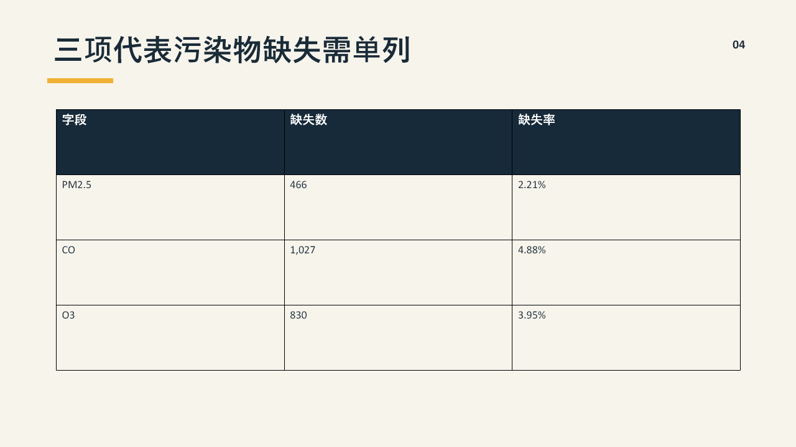
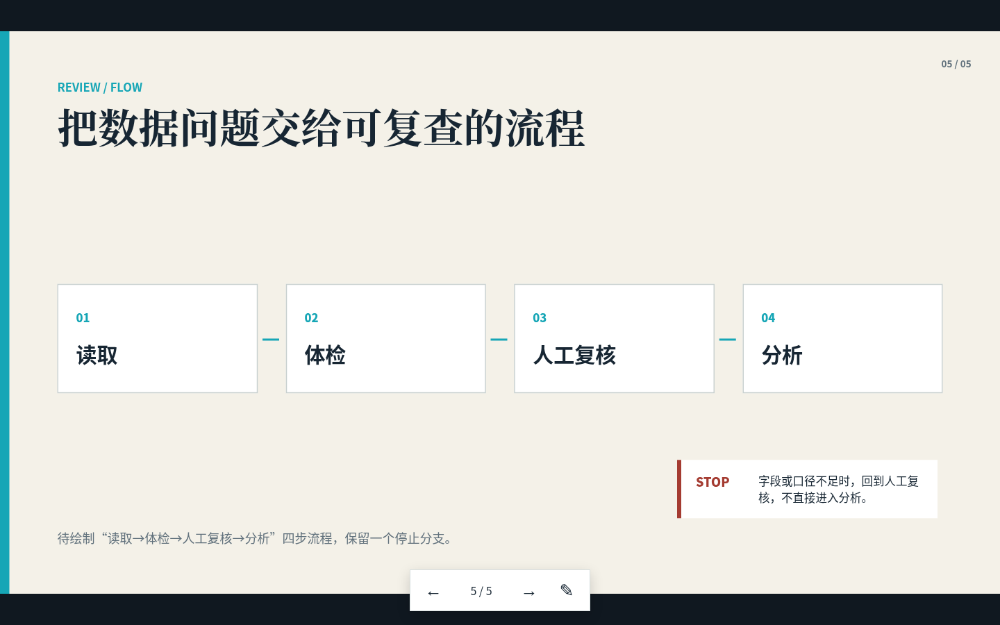
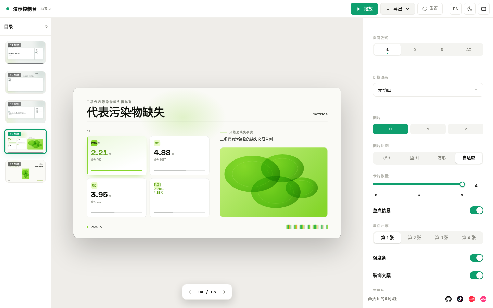
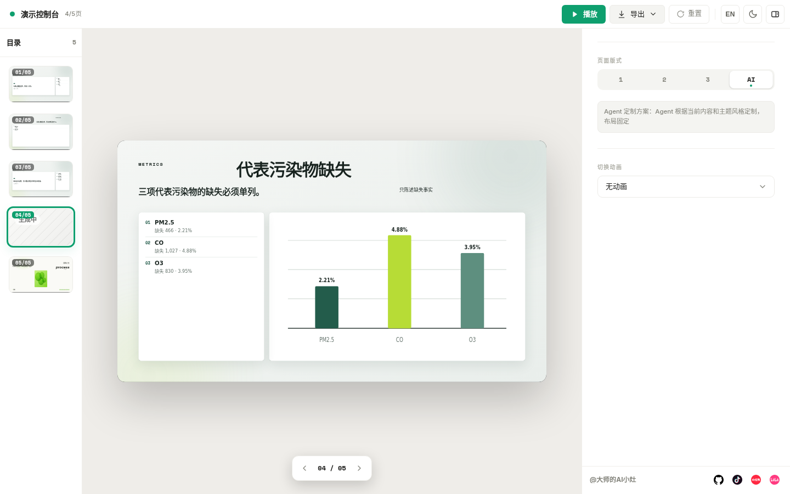

# S06：同一份大纲，普通 Prompt、PPTX Skill 和两个 HTML Skill 有什么差别？

> 固定输入：`assets/skill-cases/S06/outline.md`  
> 实测日期：2026-09-17  
> 结论边界：A 组只保存 Prompt，不伪造未调用模型的默认输出；B/C/D 均有实际文件和检查回执。

## 1. 为什么要做同题实验

“帮我做一份好看的 PPT”把内容拆页、事实保持、版式、交互和验收全交给模型猜。Skill 的价值不应靠展示截图证明，而要看同一份输入经过不同流程后留下了什么可复查工件。

本案例固定为 5 页数据质量大纲，不允许改题：标题、章节、三条原则、三项污染物缺失表、带停止分支的四步流程。

## 2. 四组怎样分

| 组 | 输入或工具 | 实际产物 | 当前状态 |
|---|---|---|---|
| A 普通 Prompt | “把大纲做成好看的演示文稿” | [完整 Prompt](../assets/skill-cases/S06/comparison/prompts/A-ordinary.txt) | 未调用外部模型，不伪造结果 |
| B 结构化 Prompt + 课程 `slide-plan` | 明确 5 种页型、事实和验收 | [可编辑 PPTX](../assets/skill-cases/S06/presentation.pptx) | 已生成并审计 |
| C GitHub `frontend-slides` | 固定 1920×1080、单文件 HTML、浏览器交互 | [离线 HTML](../assets/skill-cases/S06/frontend-slides/index.html) | 已生成并做桌面/手机实测 |
| D GitHub `dashi-ppt` | PageContentPack + 每页 3 个模板方案 + 1 个定制方案 | [Dashi HTML](../assets/skill-cases/S06/dashi/ppt/index.html) | 5 页、20 个方案状态已逐一实测 |

A/B 的完整输入分别保存在 [A-ordinary.txt](../assets/skill-cases/S06/comparison/prompts/A-ordinary.txt) 和 [B-structured.txt](../assets/skill-cases/S06/comparison/prompts/B-structured.txt)。A 没有输出并不是失败，而是证据边界：当前任务没有调用一个“默认生成 PPT”的外部模型，因此不能凭想象补一份结果。

## 3. GitHub Skill 是否真的下载并使用

是。两项外部 Skill 都按固定 commit 下载到项目 `skills/`，先做源码语义审查，再用于本案例。

| Skill | GitHub 固定版本 | 本地位置 | 许可证 | 实际使用 |
|---|---|---|---|---|
| `frontend-slides` | `zarazhangrui/frontend-slides@9906a34d640d2111f724544cbc50f7f130569ae1` | `skills/frontend-slides/` | MIT | 读取固定舞台、导航、动画与交付规程；生成单文件 HTML 并浏览器验收 |
| `dashi-ppt` | `chuspeeism/dashi-ppt-skill@21dc7e5fc8c3a0d7f6a94948153dd1ee954f4e64` | `skills/dashi-ppt/` | AGPL-3.0 | 真实运行 `goal-scaffold`、`validate-goal-spec`、`render-goal-deck`、Swiss 校验和浏览器方案切换 |

两项均标为 `CAUTION`。`frontend-slides` 的部署和 PDF 脚本可安装工具、启动服务或公网部署，本案例没有运行；`dashi-ppt` 包含依赖安装、子进程、本地服务与导出链，本案例只补齐固定版本 `esbuild 0.28.0` 并运行生成所需的本地脚本。

## 4. B 组：可编辑 PPTX 解决什么

B 组输出 23,339 字节的 5 页 PPTX，并保存 `slide-plan.json`、逐页备注、来源块、5 张预览和结构审计。5 页标题、备注、来源、空白、越界、重叠和文字溢出检查均通过。

它的优势不是动画，而是 Office 对象可继续编辑。限制也很明确：第 5 页保留的是待绘图对象合同，适合继续制作，不应冒充已经完成的流程图。

## 5. C 组：轻量 HTML Skill 带来什么

C 组是 13,736 字节的单文件 HTML，无远程字体、图片或脚本。它固定使用 1920×1080 舞台，整体缩放到桌面和手机窗口，不在手机上重排演示内容。

真实浏览器检查结果：

| 检查 | 结果 |
|---|---|
| 5 页键盘翻页 | 通过，始终只有 1 个 active 页面 |
| 鼠标滚轮、触摸、Home/End | 已实现 |
| 16:9 舞台 | 桌面和 390×844 手机均为 1.7778 |
| 元素越界 | 两个窗口、5 页均为 0 |
| 浏览器内文字编辑 | `E` 键或铅笔按钮可启用，`localStorage` 保存通过 |
| 控制台 | 0 error |

这里对上游规则做了一项有意偏离：原 Skill 推荐在线字体，本案例为了真正离线使用保留本地中文字体栈。偏离写进回执，不把“遵循 Skill”理解为机械复制所有建议。

## 6. D 组：更多模板不等于自动更好

D 组先把 5 页事实写入唯一的 `page-content-pack.json`，再由 Skill 用固定 seed 为每页生成 3 个模板方案和 1 个 Agent 定制方案。HTML 本体约 540 KB，连同运行时约 8.5 MB。浏览器逐页切换并检查了 20 个方案状态：全部非空，未出现 `AI Capital`、`SoundWave`、`OpenAI`、`Anthropic`、`Roadmap` 或“请输入文本”等默认文案。

但真实运行也暴露了三项问题：

1. 第 4 页 v3 把缺失率错误配上了模板默认单位“亿”，说明结构映射不能只靠自动选页；
2. 第 5 页 v1 只突出“读取”一个步骤，内容覆盖弱于 v2/v4；
3. 390×844 手机窗口中编辑侧栏遮住舞台，适合桌面制作，不适合直接当手机播放页。

此外，`validate:goal-copy` 报告所有动态 `projection` 数组未覆写；真实浏览器中这些内容已经正确注入，因此这部分是校验器未识别新投影模型的误报。报告不能删除，但也不能把误报当成可见缺陷。

## 7. 同题结论

| 维度 | B `slide-plan` | C `frontend-slides` | D `dashi-ppt` |
|---|---|---|---|
| 内容覆盖 | 5/5；第 5 页为待绘图合同 | 5/5；流程图已完成 | 5/5，但个别模板候选覆盖较弱 |
| 事实保持 | 三项数字一致 | 三项数字一致 | 主方案一致；v3 出现错误单位 |
| 可编辑性 | PowerPoint 对象 | 浏览器文字编辑 | 浏览器面板和方案切换 |
| 离线体积 | 23 KB PPTX | 14 KB 单 HTML | 约 8.5 MB |
| 视觉探索 | 一套稳定版式 | 一套定制编辑风格 | 每页 4 套，探索面最广 |
| 移动端 | 依赖查看器 | 固定舞台可正常查看 | 编辑侧栏遮挡舞台 |
| 维护成本 | 中 | 低 | 高；Node 20、依赖、模板筛选和 AGPL |

没有单一赢家。需要 Office 后续编辑时选 B；需要零依赖、可分享的轻量演示时选 C；需要一次看到大量模板方向、且有人负责筛选和修正时才选 D。D 的功能最多，但它也最能说明：Skill 是流程和约束，不是“自动正确”的保证。

## 8. 不需要 API Key 的原因

本案例没有调用云模型生成 PPT，也没有调用图片生成服务。B 是本地 PPTX 工具链，C 是本地 Python 生成 HTML，D 是下载后的本地 Node/React 模板渲染器。因此三条实际产物轨道都不需要 API Key；只有将来要调用在线模型改写文案、生成图片或部署到公网时，才可能需要对应服务的账号或 Key。

完整浏览器回执位于：

- `assets/skill-cases/S06/frontend-slides/browser-check/browser-verification.json`
- `assets/skill-cases/S06/dashi/browser-check/browser-verification.json`
