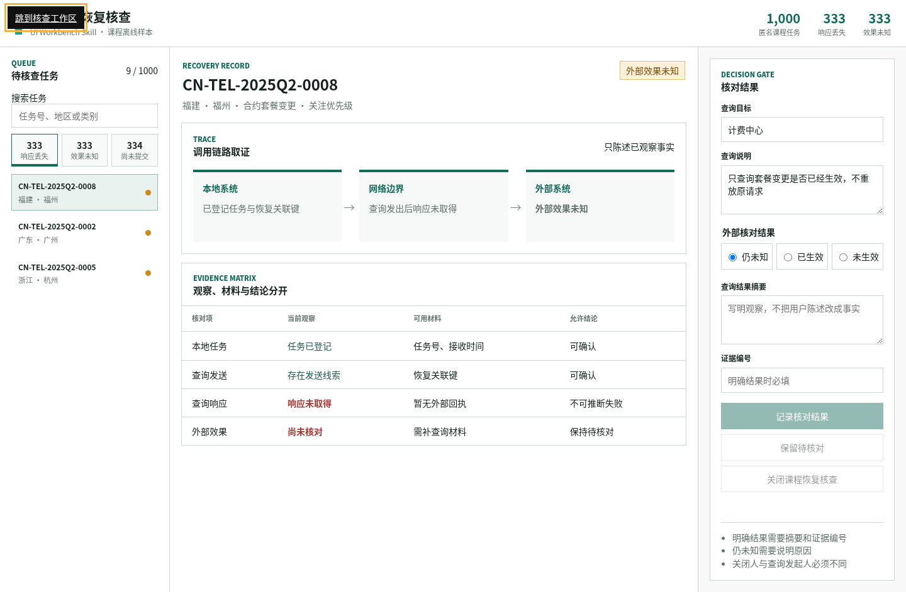
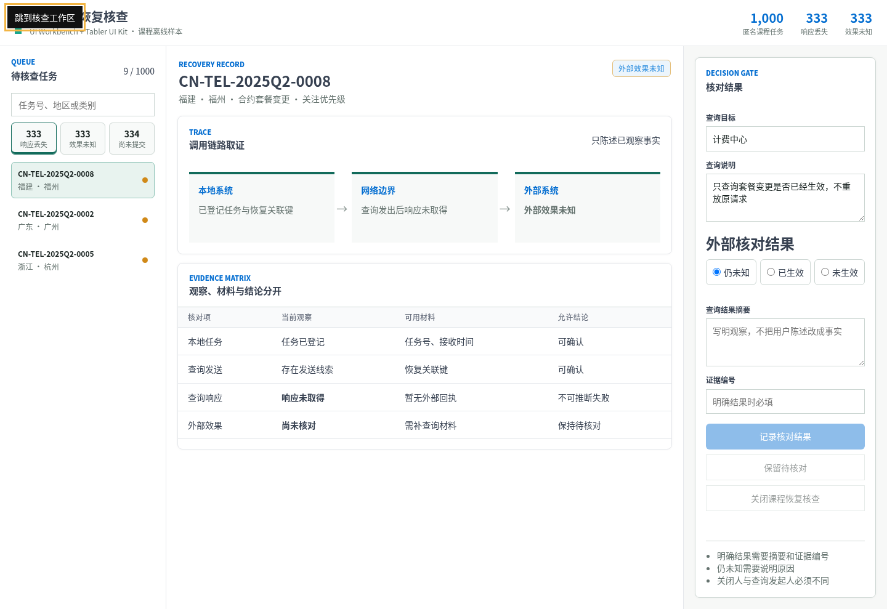

# S10：Prompt、Skill 和 UI Kit 到底各自解决什么？

> 固定数据：`dataset/10-telecom-complaint-orchestration/case.csv`  
> 实测日期：2026-09-17  
> 结论边界：A/B 只保存完整 Prompt，不冒充独立模型运行；C/D 为本地实际生成页面，并完成桌面、手机、键盘和状态切换检查。

## 1. 为什么要拆开比较

“做一个好看的后台”没有说明业务任务、状态、证据边界和验收方式。结构化 Prompt 能把需求说清楚，Skill 能把工作流和检查步骤固定下来，UI Kit 能统一组件外观；三者不是同一种东西，也不能互相替代。

本实验复用 B10 的 1,000 条匿名课程数据，不另编业务故事。页面任务固定为“通信请求恢复核查”：工作人员可以查看调用链和证据，记录“仍未知 / 已生效 / 未生效”，但不得把缺少外部回执误写成失败或成功。

## 2. 四组怎样分

| 组 | 唯一变化 | 当前证据 |
|---|---|---|
| A 普通 Prompt | 只有“做一个好看的通信投诉后台” | [完整 Prompt](../assets/skill-cases/S10/prompts/A-ordinary.txt)，未做独立模型调用 |
| B 结构化 Prompt | 补齐布局、状态、响应式、可访问性和禁止项 | [完整 Prompt](../assets/skill-cases/S10/prompts/B-structured.txt)，未做独立模型调用 |
| C `ui-workbench` Skill | 用固定工作流、状态矩阵和浏览器验收生成页面 | [实际页面](../assets/skill-cases/S10/skill-only/index.html) |
| D `ui-workbench` + Tabler | 保持 C 的内容和交互，只增加固定版本 UI Kit | [实际页面](../assets/skill-cases/S10/tabler/index.html) |

A/B 可以真实比较“指令写进了什么”，不能比较“页面谁更好”，因为本轮没有启动两个隔离模型会话分别生成页面。把当前 Agent 在已经读过 Skill 后补写的 HTML 冒充普通 Prompt 输出，会污染实验，反而不真实。

## 3. 数据与状态不是装饰

构建器只读扫描 CSV，得到 1,000 条记录和三种场景分布：响应丢失 333 条、效果未知 333 条、尚未提交 334 条。代表任务为 `CN-TEL-2025Q2-0008`，地区显示为福建福州。

页面把事实、未知和动作分开：

- 本地任务已登记，可以陈述；
- 查询发出后未取得响应，可以陈述；
- 外部效果未知，不能推断成失败；
- “仍未知”必须填写原因；
- “已生效 / 未生效”必须同时填写结果摘要和证据编号；
- 演示按钮只更新页面状态，不向任何外部系统发请求。



## 4. Skill 实际做了什么

课程自有 [`ui-workbench`](../code/skills/ui-workbench/SKILL.md) 不是一段“让页面更高级”的形容词，而是一套可重复执行的合同：先读数据和禁止结论，再定义队列、记录、证据、决策和完成门；随后补齐空白、待核对、明确结果、禁用和错误状态；最后做键盘、手机、控制台和水平溢出检查。

它由 Skill Creator 初始化并在本项目内实现，不是从 GitHub 冒充下载的第三方 Skill。生成器使用 Python 标准库，输入受 `--allowed-root` 限制，不修改源 CSV。

## 5. Tabler 带来了什么

D 组使用 `@tabler/core@1.4.0` 的官方 CSS。项目副本与官方 npm tarball 逐字节一致，SHA-256 为 `7ef750bd10546a695d0b12767ad8048bd8f3ec5de7daefb1067f9d0daa3d1c9a`；同时核对了 GitHub 仓库 `tabler/tabler` 的 commit `b295d84b3eb57b05003ba155f4da925be71f1214` 和 MIT 许可证。

Tabler 是 UI Kit，不是 Skill。它没有决定“外部效果未知时要停下来”，也没有替页面补齐证据门槛；这些来自 Skill。它实际改善的是按钮、徽标、边框、表格和间距的一致性，代价是额外引入 536,141 字节 CSS。



## 6. 真实浏览器检查

两份页面用同一套交互脚本验收，结果一致：

| 检查 | C Skill-only | D Skill + Tabler |
|---|---|---|
| 初始“响应丢失”可见项 | 3 | 3 |
| 切换“效果未知”后 | 3 | 3 |
| 搜索 `0003` 后 | 1 | 1 |
| 空表单记录按钮 | 禁用 | 禁用 |
| “仍未知 + 原因” | 可保留待核对 | 可保留待核对 |
| 明确结果但无证据 | 仍禁用 | 仍禁用 |
| 补齐证据编号 | 可记录 | 可记录 |
| 首个 Tab 焦点 | `skip-link` | `skip-link` |
| 1440×900 / 390×844 页面横向溢出 | 0 / 0 | 0 / 0 |
| 控制台 error | 0 | 0 |

手机端把三区工作台改成纵向任务流；宽表格只在自己的容器内横向滚动，不让整个页面溢出。截图左上角出现“跳到核查工作区”，是键盘验收时获得焦点的跳转链接，不是版式故障。

## 7. 可以得出什么结论

Prompt 负责表达需求，但它不会自动保证执行者逐项验收；Skill 固定流程、状态和证据边界；UI Kit 提供成熟组件样式；模型或 Agent 负责读取这些约束并生成工件。

C 和 D 的业务正确性相同，说明 UI Kit 没有让业务规则“更聪明”。D 的视觉一致性更好，但多出约 523 KiB 依赖。对一次性离线演示，C 更轻；对需要持续扩展且已有 Tabler 设计体系的后台，D 更容易保持组件一致。

## 8. 不需要 API Key，怎样复跑

本实验是本地 CSV、Python 生成器、静态 HTML 和浏览器检查，没有调用云模型或外部业务接口，因此不需要 API Key：

```bash
python3 -B code/skills/ui-workbench/scripts/build_ui_comparison.py \
  --input dataset/10-telecom-complaint-orchestration/case.csv \
  --allowed-root dataset/10-telecom-complaint-orchestration \
  --tabler-css vendor/tabler/1.4.0/tabler.min.css \
  --output-dir assets/skill-cases/S10
```

生成回执见 [receipt.json](../assets/skill-cases/S10/receipt.json)，浏览器回执见 [browser-verification.json](../assets/skill-cases/S10/browser-check/browser-verification.json)。
