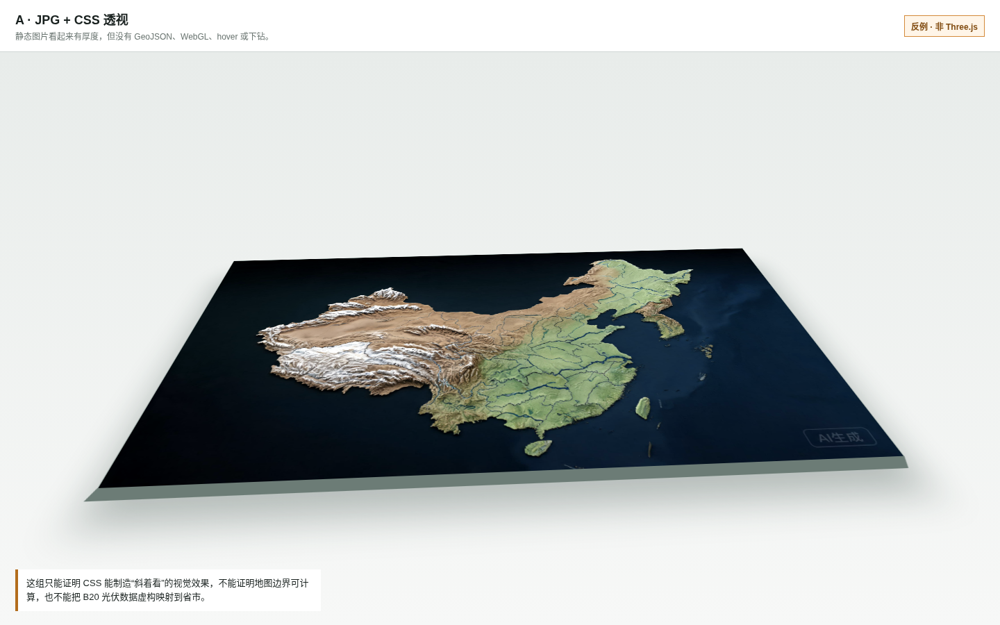
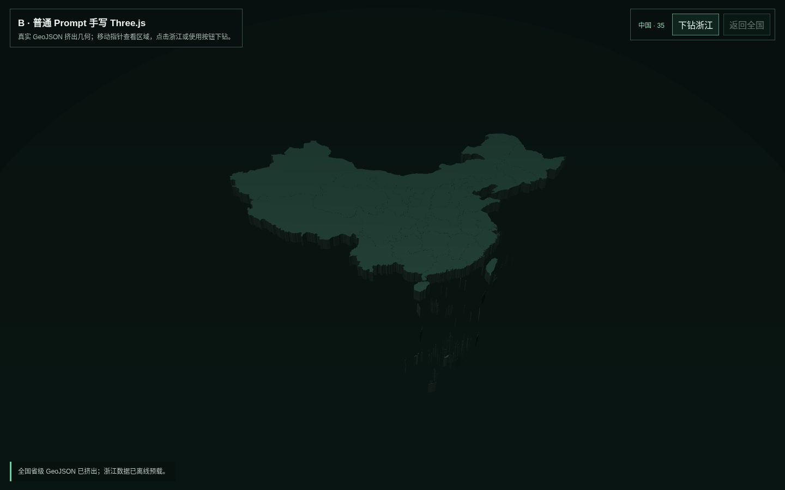
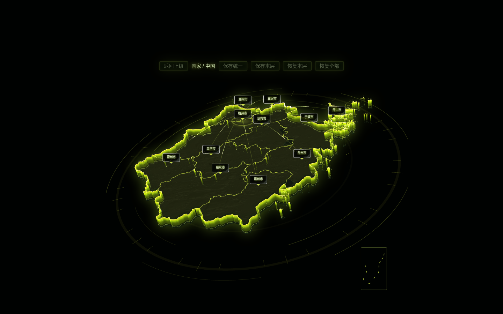
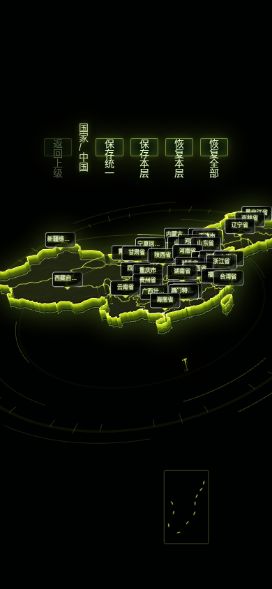

# S11：看起来立体，和真正的 Three.js 地图差在哪里？

> 数据来源：DataV 行政区边界公共接口  
> 实测日期：2026-09-17  
> 结论边界：只展示行政区边界、hover 和下钻，不把 B20 光伏数据虚构映射到省市。

## 1. 三组不是同一种“3D”

| 组 | 实际实现 | 当前产物 |
|---|---|---|
| A CSS 伪 3D | JPG 倾斜、阴影和假厚度 | [A 组页面](../assets/S11/A-css-fake/index.html) |
| B 普通 Prompt 手写 | Three.js 读取真实 GeoJSON，生成挤出几何 | [B 组页面](../assets/S11/B-three/index.html) |
| C GitHub Skill | `three-scope-map` 固定 Vue/Three.js 模板 | [C 组源码与构建配置](../assets/S11/C-skill/) |

A 看起来有透视，但页面中没有 canvas，不能 hover、计算边界或下钻。它适合做反例：一张斜放的地图图片不能证明“Three.js 地图已经完成”。



## 2. GeoJSON 从哪里来

本案例没有把现有业务数据硬塞到地图。全国和浙江边界由已审查的 Skill 数据解析器从明确 URL 下载，并在写入前验证层级、要素数量、坐标范围和行政代码。

| 数据 | URL | 要素 | 层级 | SHA-256 |
|---|---|---:|---|---|
| 中国 | `https://geo.datav.aliyun.com/areas_v3/bound/100000_full.json` | 35 | 省级 | `99adfeded5223848bbe37a0a12f8023e11ee12161c7800521c27db42fdeac275` |
| 浙江 | `https://geo.datav.aliyun.com/areas_v3/bound/330000_full.json` | 11 | 市级 | `f87241d47687264861aa619b8dc37ffeb61a2be5d6018a8c01ec0ce0acb5cb38` |

全国数据与 GitHub Skill 模板自带 `china.json` 哈希完全一致。浙江使用本轮重新下载的当前公开数据，保存在 `assets/S11/data/`，不依赖浏览器临时联网。

## 3. GitHub Skill 是否真的下载和运行

是。C 组使用固定 commit 的真实源码副本，不是根据文字说明重新仿写。

| 字段 | 证据 |
|---|---|
| GitHub | `songsummer920-dazzle/three-scope-map-skill` |
| 固定 commit | `605867c0dc7f3a3b3ce601e76a695e4d9fe7a943` |
| 本地位置 | `skills/three-scope-map/` |
| 许可证 | GPL-3.0-or-later |
| 署名 | `作者全平台ID：宋夏天Dazzle；公众号：送你整个夏天` |
| 安全结论 | `CAUTION` |

我重新从 GitHub 下载该 commit 的 19,358,400 字节归档，将其中 `three-scope-map/` 与本地目录逐文件比较：59 个文件完全一致；`SKILL.md` SHA-256 为 `11593171e9de7decade8385fdff90d3c43ffad084f75c7b8567c50cc4f4c4193`。

随后真实运行了模板完整性校验、GeoJSON 解析器、严格项目检查、依赖安装、Vue 类型检查、Vite 生产构建和浏览器交互。`LICENSE`、`NOTICE`、`CITATION.cff`、SPDX 和原作者代码署名均保留在 C 组运行副本。

本机没有 `skillspector` CLI，因此 `CAUTION` 是源码语义审查结论。Skill 包含可联网的数据解析器、浏览器 `localStorage` 相机配置和较大的构建依赖，但未发现密钥读取、持久化、混淆或任意命令执行。本案例没有运行无关主题脚本，也没有写入密钥。

## 4. B：普通 Prompt 能做出真 Three.js，但能力有限

B 组用本地 Three.js 0.178.0 把 Polygon / MultiPolygon 转为 `ExtrudeGeometry`，实现：

- 全国 35 个省级要素；
- WebGL canvas，而不是 SVG 或图片；
- 鼠标射线 hover；
- 浙江 11 个市级要素离线下钻；
- 返回全国；
- 桌面和手机自适应。



浏览器实测记录到 hover“黑龙江省”，状态按 `35 → 11 → 35` 完成下钻和返回。canvas 像素 spread 为 37.17，非空；桌面和 390×844 手机均只有 1 个 WebGL canvas、无页面级横向溢出、0 console error。

它的限制也很明显：没有标签体系、飞线、追光、地形材质、南海插图和 Earth 入口，视觉层次远弱于 C。

## 5. C：Skill 的真实增益

C 从 Skill 自带的一对一模板开始，没有重新凭印象手写。严格检查确认存在：Earth 球体、China 曲面、挤出侧壁、行政边界、地形纹理、hover 抬升、标签、飞线、外轮廓追光、南海插图、层级栈、相机配置和资源释放。


真实浏览器操作顺序为：Earth 上 hover 中国 → 点击进入全国地图 → hover 浙江省 → 下钻至 11 个市 → 返回全国。桌面截图中的发光侧壁、标签和轮廓不是后期图片，而是通过 Chrome 运行的 WebGL canvas。



## 6. C 不是无条件更好

| 维度 | B 手写 | C Skill 模板 |
|---|---:|---:|
| 生产页面代码 | 10,334 B | 15 文件，共 9,964,445 B |
| 本地依赖目录 | 复用课程 Three.js | 111,223,489 B |
| 主 JS | 本地 ESM 两文件约 1.99 MB | 4,730 KB，gzip 1,623 KB |
| 功能 | hover、浙江下钻、返回 | Earth、材质、标签、飞线、追光、下钻、相机 |
| 桌面可读性 | 通过，较素 | 通过，表现力强 |
| 手机可读性 | 通过 | 自动检查无横向溢出，但人工视觉检查不通过 |

C 的 390×844 截图暴露了真实问题：顶部控制栏被压成竖排，全国 35 个标签相互拥挤。canvas 非空和 `scrollWidth == clientWidth` 并不能替代人工看图。



安装时还发现 `nanoid@3.3.16` 的高危公告 `GHSA-2v37-7h3g-55p8`。它是 Vite → PostCSS 的间接开发依赖，本案例只在运行副本升级到 `nanoid@3.3.19`，再次审计为 0 vulnerability；原始 `skills/three-scope-map/` 固定版本没有改动。

## 7. 结论

真正的 Skill 增益不只是“颜色更亮”，而是把 GeoJSON 层级、材质、交互、下钻、过渡、验证和署名绑成一套可复用流程。C 在桌面展示中明显领先 B；代价是包体、构建复杂度、GPL 义务和移动端适配工作。

如果目标只是一个轻量离线行政区选择器，B 更合适；如果要做高表现力的大屏入口，并且愿意承担筛选、适配和许可证要求，C 才值得采用。A 只能当视觉草图，不能算 Three.js 交付。

## 8. 不需要 API Key，怎样展示

GeoJSON 下载是公开 URL，页面构建和浏览器渲染都在本机完成，不需要 OpenAI Key 或地图商业 API Key。数据已保存在仓库，后续离线展示只需本地静态服务器：

```bash
cd assets/skill-cases/S11
python3 -m http.server 5292 --bind 127.0.0.1
```

打开 `http://127.0.0.1:5292/`。完整运行回执见 [receipt.json](../assets/S11/receipt.json)，浏览器回执见 [browser-verification.json](../assets/S11/browser-check/browser-verification.json)。
