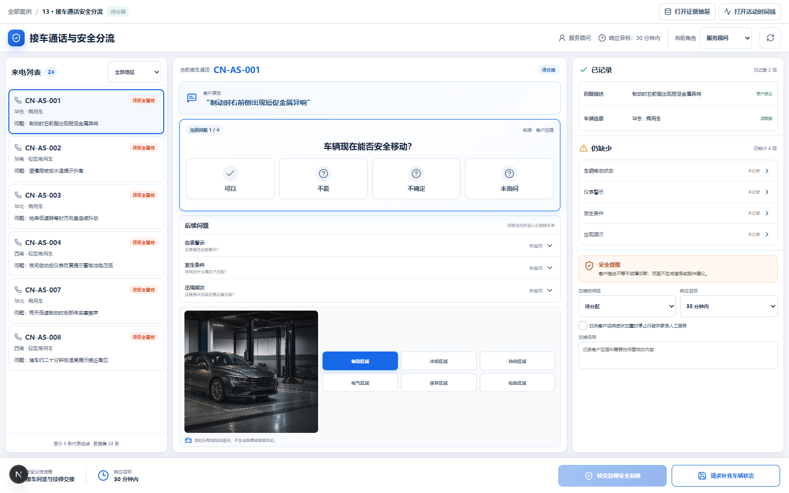
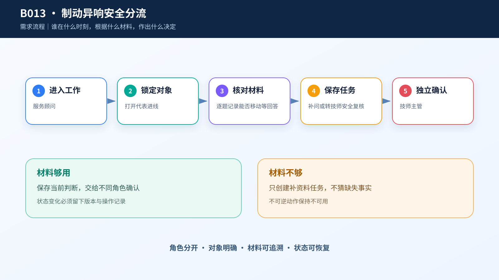
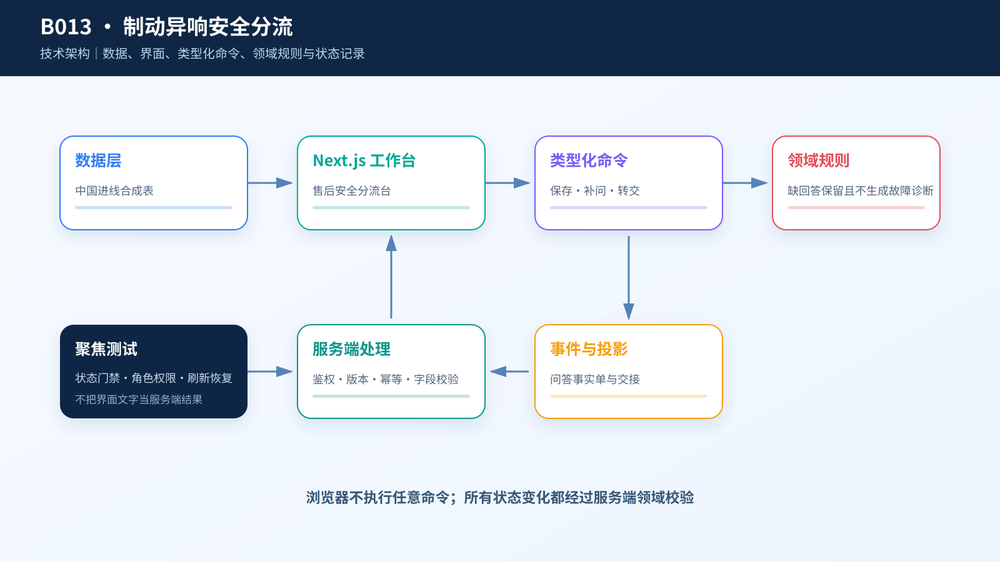

# 综合案例 B013　CN-AS-001 制动异响：客户回答够不够转技师？

## 制动异响，先问能不能继续移动

汽车售后接车要用结构化追问补齐车型、现象、发生条件和安全影响，信息足够后再转技师，不自动给出维修结论。

进线 `CN-AS-001` 的客户说：“制动时右前侧出现短促金属异响。”服务顾问必须在通话中问清车辆能否移动、仪表有无警示、异响在什么条件下出现、是否反复发生。下一步取决于客户的实际回答，不能只看问题是否问过。

如果客户明确说不能安全移动，或无法确认，系统允许先转给技师，再补其他信息；普通情况则先补齐四项回答。页面只保存接车事实和交接记录，不替客户判断道路安全，也不生成维修方案。

## 接车事实单只记录客户说过什么

`case.csv` 有 24 条确定性合成的中国匿名进线，覆盖制动、冷却、转向、电气、保养和轮胎六类。24 条客户原话互不重复，16 条需要安全复核，全部禁止自动维修。

旁边的 `public-reference.csv` 有 508 条 CC0 公开维修摘要，来源地域是印度，只用于参考字段组织；它与中国进线没有行级关系。案例没有真实客户身份、VIN、里程、故障码、车辆位置或维修结果。







左侧只显示六条代表进线；中间一次追问一个问题，并提供“可以、不能、不确定、未询问”等可保存回答。回答后，右侧接车事实单立即增加一项，“仍缺少”同步减少。车辆图缩为部位定位辅助，不再占据主任务。底部只保留“保存并请求补充”和“转交技师安全复核”。

```text
服务顾问：记录已有回答并请求补充 → 待补充信息
服务顾问：补齐回答，或收到“不能移动/不确定”的高风险回答
          → 转交技师安全复核 → 技师复核已提交
技师主管：确认复核已接收 → 技师已接收
```

**CodeBuddy 任务**

```text
请实现案例 B013 的接车通话与安全分流单。

读取 dataset/B013-auto-service-triage/case.csv，默认选择 CN-AS-001，原样显示 symptom_text。左侧最多展示六条代表进线；不要把 24 条合成进线说成真实维修工单，也不要把 public-reference.csv 与它们做行级关联。

四个问题分别保存回答、中文标签和进线编号；“已回答”和“仍缺少”必须来自同一组问题。普通进线完成四项回答、安全提示、技师组和交接说明后才能转交；客户回答“不能移动”或“不确定”时，可以先转技师，未回答项继续留在待补清单。

补充请求保存已回答内容和未回答问题；安全转交只能由与服务顾问不同的技师主管接收。刷新后回答、缺项和交接记录不能丢失。不得生成故障诊断、维修、换件或救援结果。
```

## 答案不足也可以先做安全转交

**操作**：打开案例 B013，选择 `CN-AS-001`。先回答“可以”，观察右侧接车事实单和缺项数量变化；再保存补充请求。恢复初始状态后，回答“不能”，勾选安全提示，选择安全检视组并填写交接说明，确认其他三项尚未回答时也能优先转交。最后切换技师主管，填写接收说明并确认。

**结果**：客户回答、缺项和交接记录在刷新后继续保留，最终状态为“技师已接收”。页面没有把制动异响改写成故障诊断。

**代码与排查**

- 实现：[`code/cases/B013-auto-service-triage`](../../code/cases/B013-auto-service-triage/)。
- 聚焦测试：[`case-B013-auto-service.test.tsx`](../../code/app/tests/case-B013-auto-service.test.tsx)。
- 排查：若客户回答“不能移动”后仍不能转技师，检查安全回答的优先规则；未问完的问题应保留，但不能阻断高风险转交。

---
