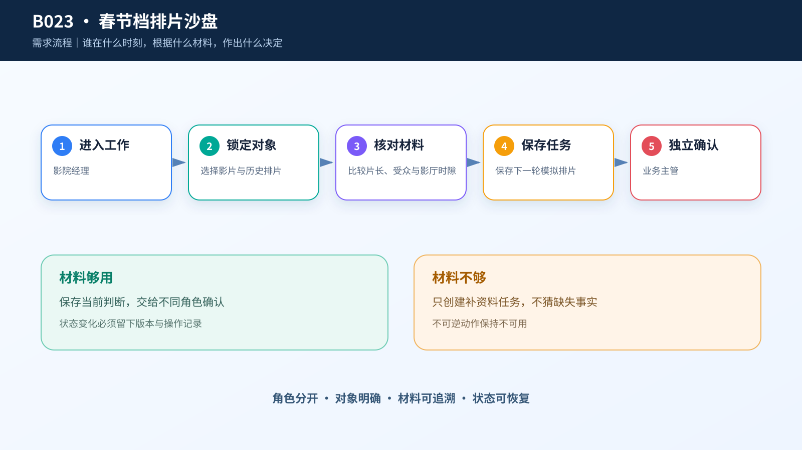
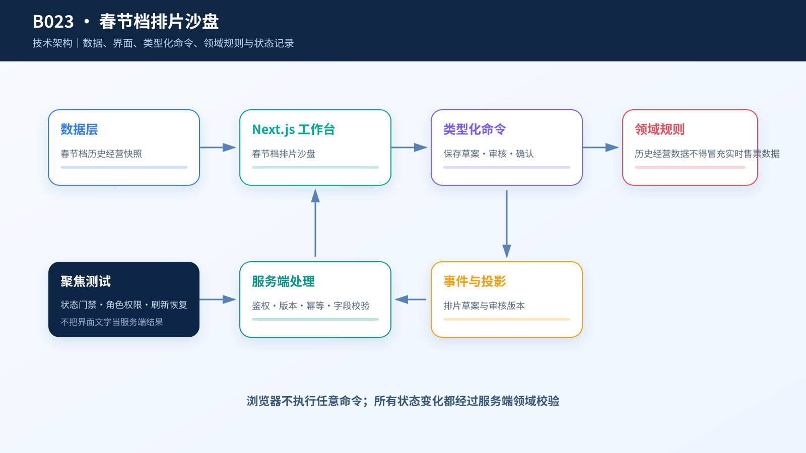

# 综合案例 B023　黄金场只有 6 个：下一轮该给哪部片？

## 需求

一家六厅影院要用春节档历史数据做排片训练。影院经理需要同时看影片片长、历史排片占比、累计观影人次和影厅时隙，排出下一轮草案，再交给业务主管审核。

## 问题

总票房最高不等于适合每个黄金场。片长会影响周转，影厅容量会改变单场收益，晚场散场时间还会影响下一场。数据来自 2022 年历史快照，无法代表某家影院今天的预售，因此这里做的是沙盘，不是实时排片系统。

## 数据

- `case.csv`：10 部影片的类型、片长、累计票房、累计人次和历史排片占比。
- `daily-box-office.csv`：38 条历史日度票房。
- `screening-schedule.csv`：70 条历史排片统计。

页面中的六个影厅和时隙是课程沙盘约束，影片指标来自数据，二者不能混写成真实影院经营记录。

## 解决方案






主区是一张六厅排片网格，黄金场用暖色突出；右侧把历史趋势、影片比较和容量提醒放在同一视线。点击影片会切换当前分析对象，但不会自动改变排片。经理保存草案后，主管可以确认，也可以退回重新平衡。

```text
影院经理：保存下一轮排片草案 → 排片待审
业务主管：确认模拟排片 → 排片方案已确认
业务主管：退回重新平衡 → 方案待调整
```

## CodeBuddy Prompt

```text
实现“春节档排片沙盘”，使用 React 19 与 Next.js 16。

从 case.csv 读取影片，以 movie_id 为业务对象；从两个补充 CSV 读取历史日度票房和排片统计。页面用 6×6 网格表示六个影厅和六个时隙，黄金场醒目标记。影片卡显示 movie_name、main_genre、runtime_minutes、cumulative_audience 和 latest_schedule_share_pct。

必须在页面写明“历史沙盘，不是实时售票数据”。保存草案时提交影片、影厅、时隙和理由；主管只能确认已保存版本或退回。不要按总票房自动分配黄金场，也不要生成实时上座率。
```

## 演示

先比较一部长片和一部短片，再点击黄金场，说明片长为何会改变影厅周转。保存草案并由主管确认，刷新后检查状态。最后让听众指出界面中哪些数字来自历史数据，哪些只是沙盘容量。

## 实现与排错

- 代码：[`code/cases/B023-spring-festival-screening`](../../code/cases/B023-spring-festival-screening/)。
- 若排片网格在 1440×900 下留出大片空白，检查网格行是否按可用高度均分。
- 若“历史上座率”被写成“当前上座率”，改回历史口径。

---
