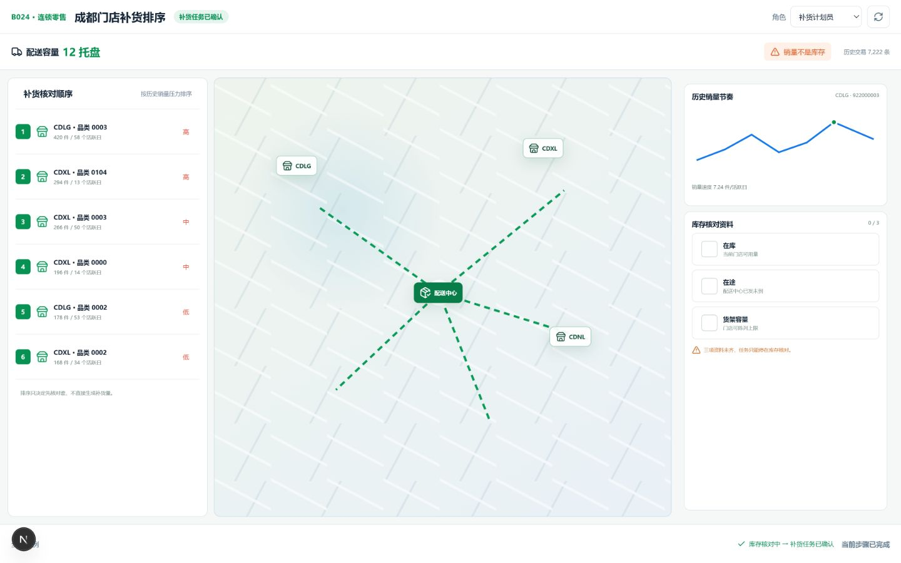
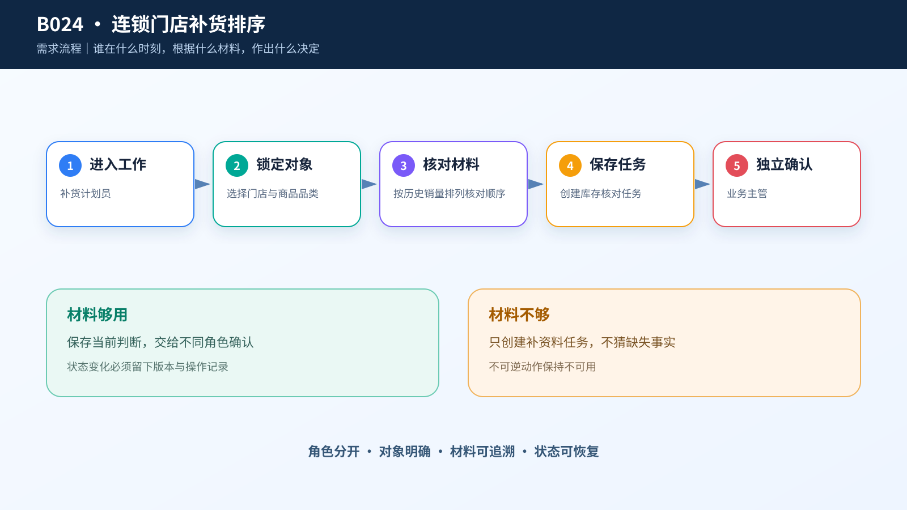
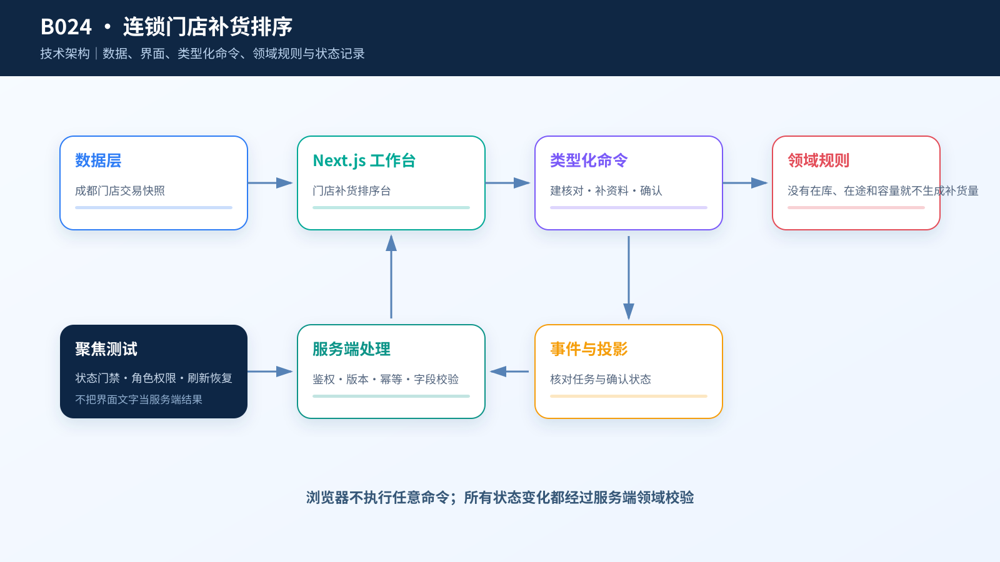

# 综合案例 B024　配送车只剩 12 个托盘：哪家门店先补？

## 需求

成都三家门店共用一辆配送车。补货计划员要先用历史销量找出需要优先核对的门店—品类，再补齐在库、在途和货架容量。系统不能把销量排名直接变成补货量。

## 问题

销量高可能是库存快见底，也可能只是库存本来就充足。没有在库和在途，任何“建议补 20 箱”都是编造。产品的第一步应是安排核对顺序，而不是假装已经具备库存优化条件。

## 数据

`case.csv` 有 7,222 条历史交易，保留门店、品类、商品、成交单价、数量、时间和订单号；`sales-pressure.csv` 汇总出 704 条门店—品类销量压力记录。数据覆盖 `CDLG`、`CDXL` 和 `CDNL` 三家门店，但没有实时库存、在途、保质期或货架容量。

## 解决方案







左侧按历史销量压力列核对顺序，中间只画真实门店与配送中心，右侧展示选中品类的销量节奏和三项待补资料。页面明确写“销量不是库存”。创建任务后仍停在库存核对阶段，主管确认的是核对任务，不是补货数量。

```text
补货计划员：创建库存核对任务 → 库存核对中
补货计划员：请求补齐库存资料 → 库存资料待补
业务主管：确认补货任务 → 补货任务已确认
```

## CodeBuddy Prompt

```text
实现“连锁门店补货排序台”，使用 React 19 与 Next.js 16。

从 case.csv 读取历史交易，从 sales-pressure.csv 读取门店—品类汇总。门店地图只展示数据中真实出现的 store_id。压力榜显示 units_sold、active_days 和 sales_velocity_units_per_day，标题明确为“补货核对顺序”。

库存核对区包含在库、在途和货架容量三项；没有实际值时保持未完成，不显示勾选，不计算补货量。创建任务时提交 storeId、categoryId、salesPressureRank 和 missingEvidence。主管确认必须复用同一任务。
```

## 演示

先比较三家门店的高压品类，再指出右侧三项库存资料都是空的。创建核对任务并由主管确认，刷新页面验证状态。课堂结论是：当数据不够时，专业产品不会硬算，而会把“下一步该补什么”做得足够清楚。

## 实现与排错

- 代码：[`code/cases/B024-supermarket-replenishment`](../../code/cases/B024-supermarket-replenishment/)。
- 若地图出现数据中不存在的门店名，改为从全量压力表去重生成。
- 若资料未填却显示勾选，视为业务误导，必须修正后再截图。

---
