# 产品经理转型实操知识库

> 面向技术骨干与项目经理的产品经理转型实操知识库。**整体逻辑：先讲系统设计的理念、原理、工程规范与多套设计，再用不同案例来演示、验证**。真数据、可运行深色大屏原型（`coderef/react_pm_cases`）、真截图、结构化 Skill、Node 校验护栏。

> 写法：构建契约式 Prompt + 可运行成品 + 跑通纠错 + 交付物验收；可用 Trae / CodeBuddy 等任一 Agent 工具（Loop 为工具无关的开发模式）。数据真实/合成显式标注（`dataset/MANIFEST.md`）；高影响行业保留人工复核。

# 第一部分 · 系统设计理念与原理

## 1. AI 核心概念底层

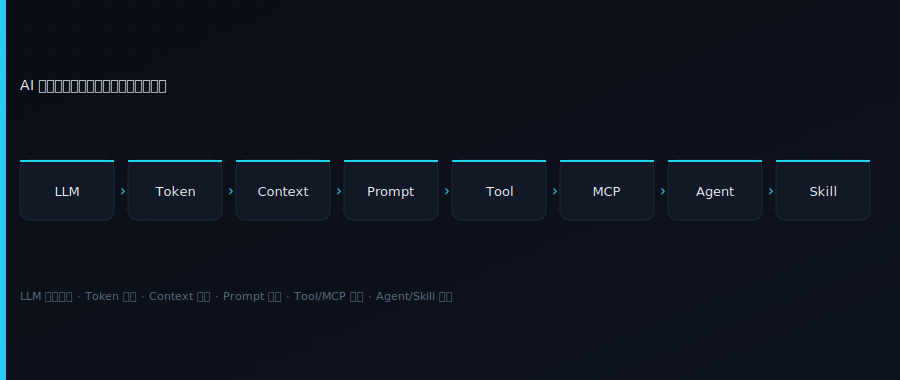

> 从底层到上层拆解 AI 核心概念，搭建扎实的认知框架（据「LLM、Token 等 AI 核心概念底层工程解析」）。本章工具无关，只讲原理。

### 1.1 大语言模型
#### 1.1.1 自回归
#### 1.1.2 概率预测
#### 1.1.3 结束标识

```备注
LLM（大语言模型）是生成式 AI 的核心底层基础，绝大多数大模型基于 Transformer 架构（Google 2017《Attention Is All You Need》）训练。其底层逻辑是「自回归文字接龙」：接收指令后预测概率最高的首个词元，把新生成的词汇追加到输入后再预测下一个，逐词迭代，直到输出特殊结束标识符。这就是为什么大模型永远逐词、逐字输出答案。
```

### 1.2 Token 与分词
#### 1.2.1 编码切分
#### 1.2.2 映射编号
#### 1.2.3 量化换算

```备注
大模型内部只识别数字、读不懂文字，人机之间靠 Tokenizer（分词器）翻译：编码=切分（把文本拆成最小片段 Token）+ 映射（每个 Token 绑定一个 Token ID 数字）；解码=反向映射。核心误区：Token ≠ 词语，切分逻辑基于训练语料。量化标准：1 Token ≈ 0.75 个英文单词 ≈ 1.5~2 个汉字；40 万 Token ≈ 60~80 万汉字。Token 是算力与上下文长度的计量单位。
```

### 1.3 上下文与窗口
#### 1.3.1 上下文
#### 1.3.2 上下文窗口
#### 1.3.3 检索增强

```备注
大模型本身只是「输入对应输出」的数学函数、无真实记忆；能「记住」聊天，是因为每次都把完整历史对话拼接到当前提问一起传入。Context（上下文）= 单次运算接收的全部输入信息总和，是临时记忆载体（含历史对话、系统指令、工具数据等）。Context Window（上下文窗口）= 单次能承载的最大 Token 数，决定记忆长度（主流已达百万级）。超长文档不应全量塞入，而用 RAG 检索增强：只把与问题高度匹配的核心片段 + 问题传入，降本、聚焦、更精准。
```

### 1.4 提示词
#### 1.4.1 用户提示
#### 1.4.2 系统提示
#### 1.4.3 提示词工程

```备注
Prompt（提示词）是驱动模型输出的具体指令，其精准度直接决定输出质量。分两类各司其职：User Prompt（用户提示词）由用户输入，定任务、定需求、定内容；System Prompt（系统提示词）由开发者后台预设、用户不可改，定人设、定规则、定输出边界，全程贯穿对话。提示词工程的本质是精准、清晰、完整地描述任务，消除指令模糊性——正是本教程 Prompt 实操的底层依据。
```

### 1.5 工具与协议
#### 1.5.1 工具
#### 1.5.2 四方协作
#### 1.5.3 统一接入

```备注
大模型天然无法感知、触达外部真实环境。Tool（工具）是可被调用的函数：接收指定入参，经内部逻辑或外部接口返回结构化结果，补齐外部感知短板。工具调用涉及用户、平台、大模型、工具四方：模型判定需调用并生成「工具调用指令」，平台解析并执行、把结构化结果回传模型整理成自然语言。MCP（模型上下文协议）是一套通用的工具统一接入标准（类比 Type-C），让工具「一次开发、多处复用」。
```

### 1.6 智能体与技能
#### 1.6.1 智能体
#### 1.6.2 循环推理
#### 1.6.3 智能体技能

```备注
Agent（智能体）具备自主规划、分步推理、循环调用工具的能力，让 AI 从被动应答升级为主动拆解复杂任务、自主迭代直至完成——其底层就是「思考→调用工具→获取结果→再思考」的 ReAct 循环推理架构（这正与第 2 章的三层 Loop 相接）。Agent Skill（智能体技能）是给智能体固化的专属执行手册：结构化写清触发条件、执行步骤、判断规则、输出格式，实现个性化能力一键复用、并省 Token。本教程的 Skill 库即此类结构化技能。
```

## 2. 理念框架（会 Loop 的产品工程）

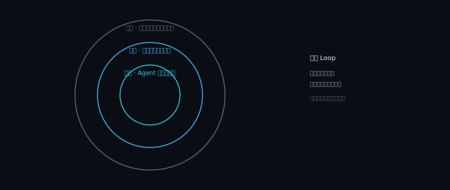

### 2.1 三层 Loop
#### 2.1.1 内层执行
#### 2.1.2 中层判断
#### 2.1.3 外层校准

```备注
AI 能自主写代码后，真正变化的不是效率，而是软件开发变成三种时间尺度的 Loop 同时运转。内层 Agentic Coding Loop：给 Spec 与 Evals，Agent 自己写码、跑测、发现问题继续改，分钟级自我纠偏。中层 Developer Feedback Loop：人不能离开，负责判断——功能范围、交互、信息组织，看完第一版再回改 Spec，几十分钟到小时级。外层 External Feedback Loop：真实用户与市场校准开发者的 Vision，几天到几周。一层比一层慢，也一层比一层重要；少任何一层，0→1 产品都难跑起来。稀缺能力正从内层向外层迁移。
```

### 2.2 提示词到 Loop
#### 2.2.1 提示词
#### 2.2.2 上下文
#### 2.2.3 脚手架
#### 2.2.4 循环

```备注
演进链路：Prompt Engineering（一条消息预见一切，靠措辞）→ Context Engineering（精心构造模型"看到"的：system prompt、few-shot、RAG、结构化输入，不再猜）→ Harness Engineering（给 Agent 装工具+重试+权限，一次 session 内多步执行）→ Loop Engineering（把"人触发→人判断→人决定下一步"里的人替换成能定时触发、验证、记忆、决定继续或停止的自动化系统）。与 cron 的区别：Loop 内部决策者是 LLM，行为在运行时才确定。
```

### 2.3 控制论闭环
#### 2.3.1 控制器
#### 2.3.2 执行器
#### 2.3.3 传感器

```备注
Loop 的本质是控制论：目标→执行→测量偏差→反馈修正→再测量。控制器（编排逻辑：读偏差、判断、构造下一轮 prompt）需要知识与记忆（→ Skills、Memory）；执行器（工具调用：改文件/命令/API）需要触达与隔离（→ Connectors、Worktrees）；传感器（验证，产出误差信号）需要独立性（→ Sub-agents）。收敛速度由传感器决定：只回 pass/fail 近乎盲猜，回"哪个用例挂、哪个断言失败、哪个 diff 引入"才是针对缺陷修复。**传感器就是设计本身**——"好提示+弱验证"会失败，"平庸提示+强验证"会收敛。
```

### 2.4 Loop 六件套
#### 2.4.1 触发
#### 2.4.2 隔离
#### 2.4.3 技能
#### 2.4.4 连接
#### 2.4.5 子代理
#### 2.4.6 记忆

```备注
六个组件是控制自然需要的基础设施：Automations（触发：定时/事件/心跳，谁按开始键）；Worktrees（隔离：每 Agent 一份独立工作区，并行不打架）；Skills（技能：把项目约定/踩坑写下来，每轮直接读，省 token）；Connectors（连接：MCP 接 GitHub/工单/通知，触达真实工具链）；Sub-agents（子代理：写的与验的分开，写代码的模型给自己打分太宽容）；Memory/State（记忆：上下文窗口每轮清空，磁盘存"做完了什么、下一步干啥"）。
```

### 2.5 何时建 Loop
#### 2.5.1 可重复
#### 2.5.2 可判定
#### 2.5.3 预算够
#### 2.5.4 可复现

```备注
Loop 不免费（烧 token、要搭、出问题要 debug 你没盯着的系统）。动手前四问：任务是否重复（一次性活好 prompt 更划算）？有没有东西能自动判定"干砸了"（测试/类型/lint/构建）？token 预算扛得住浪费？Agent 跑得了自己写的代码（有日志、能复现、看得到哪崩）？附加题最重要：你打算 review 产出吗——不打算就别建。目标不可测量的任务（"更优雅""更好"）不要建 Loop，那是假闭环。先建 Inspector，再建 Loop。
```

### 2.6 AI 软件工程框架
#### 2.6.1 强制方法论
#### 2.6.2 上下文管理
#### 2.6.3 虚拟团队
#### 2.6.4 仓库记忆

```备注
从"AI 写代码"到"AI 做软件工程"的工程化拐点——竞争点不是模型能力，是工程化标准。四类代表（工具无关的理念/开发模式，可套用于任意 Agent 工具）：Superpowers=强制方法论（brainstorm→writing-plans→TDD→code-review→subagent-driven，规则而非建议）；GSD=轻量 context 管理（解决 context rot，spec 驱动，.planning/.memory/.context）；GStack=虚拟工程团队（office-hours/CEO/Eng/Design/Staff/QA/Ship 角色分工，一个人跑完一个团队流程）；Trellis=仓库级记忆（Plan→Implement→Verify→Finish 四阶段，把规范/任务/记忆沉淀进仓库、每次 Finish 都为下次积累）。可组合：强制方法论+仓库记忆、轻量 context+虚拟团队。
```

### 2.7 产品视角总纲
#### 2.7.1 上下文优势
#### 2.7.2 判断力
#### 2.7.3 演示验证

```备注
人类的优势与其说是"品味"，不如说是上下文优势：用户是谁、业务边界、约束条件、竞品在做什么——这些还锁在人脑里。只要人还掌握 Agent 不知道的上下文，就必须留在 Loop 里把信息补给系统。Loop 放大的是你的判断力：你对系统理解多深，传感器就能写多精确。本知识库据此组织——先讲理念、原理、工程约束与设计，再用不同案例来演示、验证；每个案例都标注它演示了哪些原理、采用了哪套设计。
```

## 3. 系统架构设计（产品视角）

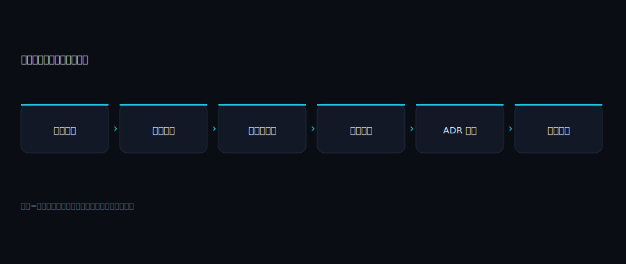

> 同一套方法论：从产品与业务出发，走完系统架构设计。架构不是技术选型清单，而是在特定约束下对质量属性做出的一组可追溯决策。（复用并优化自本仓库早期架构教程。）

### 3.1 约束先行
#### 3.1.1 业务约束
#### 3.1.2 合规约束
#### 3.1.3 规模约束

```备注
架构的起点不是技术，是约束。先把产品/业务的硬约束列清：业务边界与干系人诉求、合规与安全红线（如等保/日志留存/隐私）、规模与增长（并发、数据量、峰值）。约束表是后续每个决策的作证依据——没有约束支撑的复杂度，就是没有证据的复杂度。
```

### 3.2 质量属性
#### 3.2.1 性能场景
#### 3.2.2 可用性
#### 3.2.3 安全

```备注
把"非功能需求"写成可量化的质量属性场景（SEI 风格：刺激→环境→响应→度量），如"峰值 400 点/秒写入，P95<200ms"。两个功能清单相同的系统，可因质量属性优先级不同而导出完全不同的架构。质量属性场景是拆分与选型的证据来源。
```

### 3.3 子系统分解
#### 3.3.1 按数据流
#### 3.3.2 按变更率
#### 3.3.3 模块边界

```备注
拆分要有过硬证据：按数据流（写路径 vs 读路径）、按变更节奏（稳定的与频繁迭代的）、按故障与发布边界切分。模块化单体优先——模块边界就是预留的进程边界，"预留而不预付"。用架构守护测试把边界变成可执行的适应度函数，架构决策才不只是墙上的海报。
```

### 3.4 接口契约
#### 3.4.1 错误信封
#### 3.4.2 幂等
#### 3.4.3 契约即代码

```备注
接口是子系统间的合同：统一错误信封 {code,message,details}、写操作幂等、404 不泄露资源存在性、分页与 allowedActions 由服务端驱动。契约即代码——OpenAPI 由路由 schema 自动生成，契约与实现同源不漂移。
```

### 3.5 ADR 决策
#### 3.5.1 背景
#### 3.5.2 决策
#### 3.5.3 后果

```备注
每个关键决策写一篇 ADR（Nygard 格式）：背景（约束与证据）、决策（选了什么）、后果（正负影响、演进触发条件）。重点是"为什么这样选"，否则几周后仍会重复争论。决策可追溯，是产品视角架构的核心产物。
```

### 3.6 部署演进
#### 3.6.1 部署视图
#### 3.6.2 演进触发
#### 3.6.3 奥卡姆

```备注
部署图画的是约束表描述的真实机房，不是理想拓扑。用演进触发表把"何时该改造"写成可观察条件（规模×N、新需求立项…）提前量。奥卡姆原则贯穿：能用一张聚合表解决就不上专用集群，复杂度花在业务上，每个组件都要有证据。
```

## 4. 工程规范与代码约束

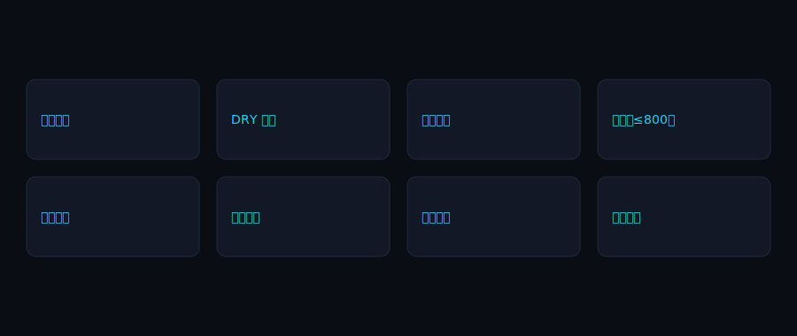

> 既是本教程的工程原理，也真实约束本仓库代码，并被 `verify_course_package.mjs` 守护。全文规范沉淀在 `rules/`（对齐 Google Style Guides、swe-book、Conventional Commits、OWASP 等，见 `rules/references.md`）。

### 4.1 复用优先
#### 4.1.1 成熟方案
#### 4.1.2 避免重复
#### 4.1.3 最小改动

```备注
优先调研成熟稳定的开源库，不重复造轮子；两处以上可复用逻辑抽离为公共模块（DRY）；优先在现有代码上扩展而非推倒重写、保持 API 兼容、改动范围最小化。见 rules/ai-dev-constraints.md 第 1/4/10 条。
```

### 4.2 结构清晰
#### 4.2.1 组件拆分
#### 4.2.2 目录规范
#### 4.2.3 分层架构

```备注
按功能拆分、单一职责，页面组织业务而不实现所有细节；新增代码遵循既定目录、不随意加顶级目录、工具/组件/接口/类型不混放；后端分层 controller→service，controller 不写业务、service 不碰 HTTP 上下文。见 rules/ai-dev-constraints.md 第 2/3 条与 rules/backend.md。
```

### 4.3 代码质量
#### 4.3.1 简洁<800行
#### 4.3.2 类型安全
#### 4.3.3 中文注释

```备注
可读性优先于炫技，一个函数只做一件事，不留废弃代码/调试输出；**单文件 < 800 行**，超出即拆分；优先 TS 类型、避免大量 any；统一中文注释，重点写"为什么这样做"与业务规则，复杂函数（约 30 行以上）前加整体思路。见 rules/ai-dev-constraints.md 第 5/6/7 条。
```

### 4.4 健壮与安全
#### 4.4.1 错误处理
#### 4.4.2 性能意识
#### 4.4.3 安全红线

```备注
所有异步请求做异常处理、不忽略 Promise 错误、用户可感知错误给明确提示；按需加载、避免不必要重复渲染；输入校验、防路径遍历、不硬编码密钥、敏感配置走环境变量。见 rules/ai-dev-constraints.md 第 8/9 条与 rules/backend.md 安全节（OWASP Top 10）。
```

### 4.5 前端规范
#### 4.5.1 Monorepo
#### 4.5.2 微前端
#### 4.5.3 公共沉淀

```备注
Monorepo（pnpm workspace）+ 微前端（qiankun）：shell 只做入口不写业务、业务放各子应用；公共能力沉淀 packages/（ui/theme/auth/request/utils），不重复封装请求/认证/主题；VITE_ 环境变量、独立构建。见 rules/frontend.md。
```

### 4.6 后端规范
#### 4.6.1 统一响应
#### 4.6.2 结构化日志
#### 4.6.3 优雅退出

```备注
统一响应 {code,message,data}、RESTful、按模块分组路由；结构化日志（slog）禁 printf 风格、语义化状态码；长任务用协程+channel、退出时清理资源、WebSocket 心跳超时。见 rules/backend.md。
```

## 5. 设计系统（多套，各不相同）

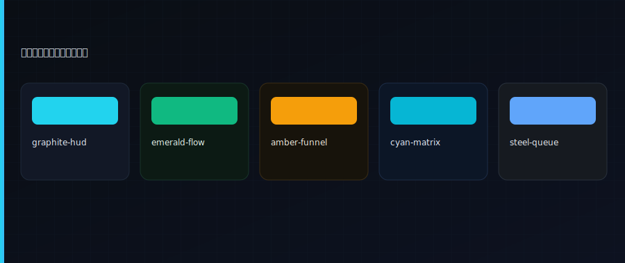

> 不是一套统一审美：`design/` 下 ≥5 套**各不相同**的深色大屏设计系统（色板/布局/气质各异，对齐大屏参考与 voltagent DESIGN.md 模型）。不同案例采用不同设计 → 大屏风格各异。机器令牌单一来源 `design/themes.json`，人读文档 `design/<id>.md`。

### 5.1 石墨 HUD
#### 5.1.1 青蓝高光
#### 5.1.2 上图下表
#### 5.1.3 经营驾驶舱

```备注
石墨黑高端科技、青蓝(#22d3ee)高光、HUD 网格；顶部总览+中部趋势主图+底部明细表。适用 executive_dashboard/hr 类经营驾驶舱。见 design/graphite-hud.md。
```

### 5.2 翡翠流向
#### 5.2.1 翡翠发光
#### 5.2.2 桑基瀑布
#### 5.2.3 流程流向

```备注
近黑墨绿、翡翠(#10b981)发光、流向感；桑基/瀑布纵向布局。适用 workflow_pipeline/knowledge 类流程流向。见 design/emerald-flow.md。
```

### 5.3 琥珀漏斗
#### 5.3.1 暖金高光
#### 5.3.2 漏斗级联
#### 5.3.3 转化收束

```备注
深棕琥珀、暖金(#f59e0b)高光、转化收束；漏斗级联布局。适用 sales_funnel 类转化分析。见 design/amber-funnel.md。
```

### 5.4 青紫矩阵
#### 5.4.1 双色高光
#### 5.4.2 矩阵热力
#### 5.4.3 密集决策

```备注
墨蓝、青(#06b6d4)与品紫(#a855f7)双高光、密集矩阵；矩阵/热力/散点布局。适用 matrix_decision/finance/harness/configuration。见 design/cyan-matrix.md。
```

### 5.5 钢灰队列
#### 5.5.1 冷蓝高光
#### 5.5.2 复核队列
#### 5.5.3 明细留痕

```备注
钢灰近黑、冷蓝(#60a5fa)高光、明细与复核；复核队列/明细表布局。适用 review_queue/list_review/record_detail。见 design/steel-queue.md。
```

## 使用入口

- 案例总览与 5 个 manifest：`outputs/product_case_library/*.json`
- 多套设计系统：`design/*.md`（令牌 `design/themes.json`）｜工程规范：`rules/`｜Skill 与 Loop：`skills/`
- React 工作台：`coderef/react_pm_cases`（`npm ci && npm run build && npm run preview`，一案例一路由 `#/case/NN`）
- 数据：`node coderef/fetch-datasets.mjs`｜预计算：`node coderef/build_case_data.mjs`｜校验：`node coderef/verify_course_package.mjs`

# 第二部分 · 案例演示与验证

## 案例总览

| # | 场景 | 行业 | 阶段 | 演示原理 | 设计 | UI 原型 | Skill |
|---|---|---|---|---|---|---|---|
| 01 | 电商早会异常订单台 | 电商零售 | 角色转型 | 2.1/2.7 | graphite-hud | `ui_01_morning_ops_grid` | problem-framing+metric-definition+acceptance-criteria |
| 02 | 研发排期价值评审台 | 软件研发管理 | 角色转型 | 2.1/2.7 | cyan-matrix | `ui_02_value_schedule_axis` | role-transition+outcome-mapping+release-risk |
| 03 | 政务材料预审服务 | 政务服务 | 用户洞察 | 2.7/3.2 | steel-queue | `ui_03_gov_material_checklist` | stakeholder-map+service-blueprint+public-service-kpi |
| 06 | 银行客服知识治理 | 银行客服 | AI协作 | 2.4/2.6 | emerald-flow | `ui_06_bank_knowledge_governance` | ai-product-boundary+eval-design+human-review |
| 07 | 保险理赔复核队列 | 保险理赔 | 用户洞察 | 2.7/3.2 | steel-queue | `ui_07_insurance_claim_review` | grill-me+interview-synthesis+human-review |
| 14 | 物流异常派单扩城 | 物流配送 | 需求管理 | 3.4/4.1 | amber-funnel | `ui_14_logistics_change_control` | change-impact+release-risk+rollback-plan |
| 16 | 医院预约容量调度 | 医疗运营 | 用户洞察 | 2.7/3.2 | graphite-hud | `ui_16_hospital_capacity_scheduler` | persona-scenario+journey-map+human-review |
| 23 | 电商退换货履约 | 电商售后 | 详细设计 | 3.3/3.5 | emerald-flow | `ui_23_return_fulfillment_swimlane` | process-redesign+service-blueprint+acceptance-mapping |
| 26 | 滞销 SKU 提醒 | 电商运营 | 需求管理 | 3.4/4.1 | cyan-matrix | `ui_26_sku_prd_fields` | prd-fragment+acceptance-criteria+field-validation |
| 28 | 金融复核工作台 | 金融风控 | 详细设计 | 3.3/3.5 | cyan-matrix | `ui_28_finance_review_queue` | risk-rule-design+human-review+compliance-boundary |
| 29 | 零售门店晨会驾驶舱 | 零售门店 | 数据指标 | 3.2/4.3 | graphite-hud | `ui_29_retail_morning_dashboard` | dashboard-requirement+kpi-tree+action-summary |
| 30 | 航空会员价值运营 | 航空会员 | 数据指标 | 3.2/4.3 | amber-funnel | `ui_30_airline_member_rfm` | rfm-segmentation+lifecycle-action+privacy-boundary |
| 31 | 广告投放转化复盘 | 广告投放 | 数据指标 | 3.2/4.3 | amber-funnel | `ui_31_ad_conversion_funnel` | funnel-analysis+budget-decision+metric-definition |
| 35 | 零售经营驾驶舱 | 零售经营 | 质量验收 | 2.3/4.3 | steel-queue | `ui_35_retail_vibe_prototype` | vibe-coding+ui-prompt-card+prototype-test |
| 36 | 原型字段核验 | 零售经营 | 质量验收 | 2.3/4.3 | cyan-matrix | `ui_36_prototype_harness_board` | harness-builder+checker-report+regression-guard |
| 37 | 代码修复闭环 | 软件工程 | 质量验收 | 2.3/4.3 | emerald-flow | `ui_37_loop_engineering_flow` | loop-orchestrator+regression-guard+checker-report |
| 38 | 需求澄清流水线 | 企业协作 | 质量验收 | 2.3/4.3 | cyan-matrix | `ui_38_pm_skill_pipeline` | skill-builder+skill-validator+acceptance-criteria |
| 39 | 积分运营控制台 | 会员运营 | 质量验收 | 2.3/4.3 | graphite-hud | `ui_39_points_admin_console` | react-ui+shadcn-admin+accessibility-check |
| 41 | 零售经营产品方案 | 零售经营 | 综合闭环 | 2.7/3.1/4.1 | graphite-hud | `ui_41_retail_capstone_board` | capstone-product-flow+evidence-pack+traceability-check |
| 42 | 会员积分增长方案 | 会员增长 | 综合闭环 | 2.7/3.1/4.1 | graphite-hud | `ui_42_member_growth_capstone` | growth-capstone+incentive-design+fraud-boundary |
| 43 | 产业知识游戏化平台 | 产业知识 | 综合闭环 | 2.7/3.1/4.1 | emerald-flow | `ui_43_knowledge_quest_map` | gamification-design+learning-evaluation+skill-validator |
| 44 | 产品知识库语义检索 | AI 应用 | AI协作 | 1.3/3.3 | emerald-flow | `ui_44_rag_retrieval` | capstone-product-flow+evidence-pack+traceability-check |
| 45 | 经营数据关系库查询 | 数据工程 | 系统架构 | 3.3/4.1 | steel-queue | `ui_45_pg_relational` | capstone-product-flow+evidence-pack+traceability-check |
| 46 | 后端子系统分解与契约 | 系统架构 | 系统架构 | 3.1/3.3 | cyan-matrix | `ui_46_arch_contract` | capstone-product-flow+evidence-pack+traceability-check |
| 47 | 经营三维散点可视化 | 数据可视化 | 数据指标 | 3.3/5.1 | graphite-hud | `ui_47_three_scatter` | capstone-product-flow+evidence-pack+traceability-check |


---

## 实操 01：技术任务转产品问题｜电商早会异常订单台

> **本案例演示/验证**：原理 2.1、2.7｜**采用设计** `graphite-hud`（见 design/graphite-hud.md）

### 项目场景故事

电商零售场景中，运营主管围绕异常订单和高风险 SKU做日常判断。运营主管需要围绕“异常订单和高风险 SKU”完成“在早会前完成风险识别”，并把结果转成可验证的产品交付物。核心不是把页面做出来，而是把指标、异常、责任和行动连成闭环。

**现状问题**

- 决策依赖的关键指标：经营目标达成率、销售额同比、区域贡献、异常订单数、责任部门闭环率。
- 现场常见异常：目标未达成、区域下滑、异常订单、责任未闭环。
- 只做通用页面无法支撑「识别未达成区域、定位异常业务线，并生成责任部门行动队列。」。

**本次任务**

- 明确岗位、指标链、异常状态与决策动作。
- 使用 `problem-framing` 与 `metric-definition` 完成分析，产出 `产品问题定义卡`，用 `acceptance-criteria` 验收。

### 任务目标与数据

- 行业：电商零售
- 真实业务场景：电商早会异常订单台
- 岗位：运营主管
- 数据或资料：`dataset/order_data.csv`（1200 行，异常 225）
- 公开参考：https://archive.ics.uci.edu/dataset/352/online+retail
- 行业字段：订单号、SKU、库存天数、毛利率、异常原因、责任人、处理时限
- 指标链（真实值）：经营目标达成率 19%，销售额同比 16630819，区域贡献 360，异常订单数 225，责任部门闭环率 11%
- 决策动作：识别未达成区域、定位异常业务线，并生成责任部门行动队列。
- 风险边界：不得把查询慢等同于产品问题
- UI 原型：`ui_01_morning_ops_grid`（executive_dashboard）
- 采用设计：graphite-hud
- SaaS 组件：目标达成、收入趋势、业务结构、区域排行、异常告警、行动队列

### Prompt 实操

**Prompt 1：电商早会异常订单台 - 问题定义**

```text
请以产品经理身份，用 AI 编程工具（如 Trae、CodeBuddy 等任一 Agent 工具）完成「电商早会异常订单台」的产品问题定义，并产出可运行原型：
- 场景与岗位：运营主管 面向「电商早会异常订单台」，把判断转成可验证的产品交付物；核心是把指标→异常→责任→行动连成闭环。
- 数据：读取 `dataset/order_data.csv`，只使用数据/资料中存在的字段（订单号、SKU、库存天数、毛利率、异常原因、责任人、处理时限）。
- 指标链：经营目标达成率、销售额同比、区域贡献、异常订单数、责任部门闭环率（当前真实值：经营目标达成率=19%，销售额同比=16630819，区域贡献=360，异常订单数=225，责任部门闭环率=11%）。
- 异常状态：目标未达成、区域下滑、异常订单、责任未闭环。
- 使用 Skill：problem-framing、metric-definition，并用 acceptance-criteria 做验收（结构化 Skill 见 skills/pm_skills.md）。
- 原型（技术契约，遵 rules/ 约束：DRY、单文件<800行、TS 类型、中文注释）：在 `coderef/react_pm_cases`（Vite+React+TS）路由 `#/case/01`，按 `ui_01_morning_ops_grid`（executive_dashboard）与设计 `graphite-hud` 渲染；数据经 `build_case_data.mjs` 预计算，页面必须体现指标链、异常队列、责任对象与行动入口，不得复用通用表格占位。
- 输出：产品问题定义卡，保存为 `outputs/product_case_library/case_01_morning_ops_grid_问题定义.md`。
- 验收条件：结论回到数据或公开参考（https://archive.ics.uci.edu/dataset/352/online+retail）；不得越过「不得把查询慢等同于产品问题」；`node coderef/verify_course_package.mjs` 必须 ALL GREEN。
```

**Prompt 2：电商早会异常订单台 - 方案验收**

```text
请以产品经理身份，用 AI 编程工具（如 Trae、CodeBuddy 等任一 Agent 工具）完成「电商早会异常订单台」的方案验收，并产出可运行原型：
- 场景与岗位：运营主管 面向「电商早会异常订单台」，把判断转成可验证的产品交付物；核心是把指标→异常→责任→行动连成闭环。
- 数据：读取 `dataset/order_data.csv`，只使用数据/资料中存在的字段（订单号、SKU、库存天数、毛利率、异常原因、责任人、处理时限）。
- 指标链：经营目标达成率、销售额同比、区域贡献、异常订单数、责任部门闭环率（当前真实值：经营目标达成率=19%，销售额同比=16630819，区域贡献=360，异常订单数=225，责任部门闭环率=11%）。
- 异常状态：目标未达成、区域下滑、异常订单、责任未闭环。
- 使用 Skill：problem-framing、metric-definition，并用 acceptance-criteria 做验收（结构化 Skill 见 skills/pm_skills.md）。
- 原型（技术契约，遵 rules/ 约束：DRY、单文件<800行、TS 类型、中文注释）：在 `coderef/react_pm_cases`（Vite+React+TS）路由 `#/case/01`，按 `ui_01_morning_ops_grid`（executive_dashboard）与设计 `graphite-hud` 渲染；数据经 `build_case_data.mjs` 预计算，页面必须体现指标链、异常队列、责任对象与行动入口，不得复用通用表格占位。
- 输出：产品问题定义卡，保存为 `outputs/product_case_library/case_01_morning_ops_grid_方案验收.md`。
- 验收条件：结论回到数据或公开参考（https://archive.ics.uci.edu/dataset/352/online+retail）；不得越过「不得把查询慢等同于产品问题」；`node coderef/verify_course_package.mjs` 必须 ALL GREEN。
```

### 图形/原型/表单



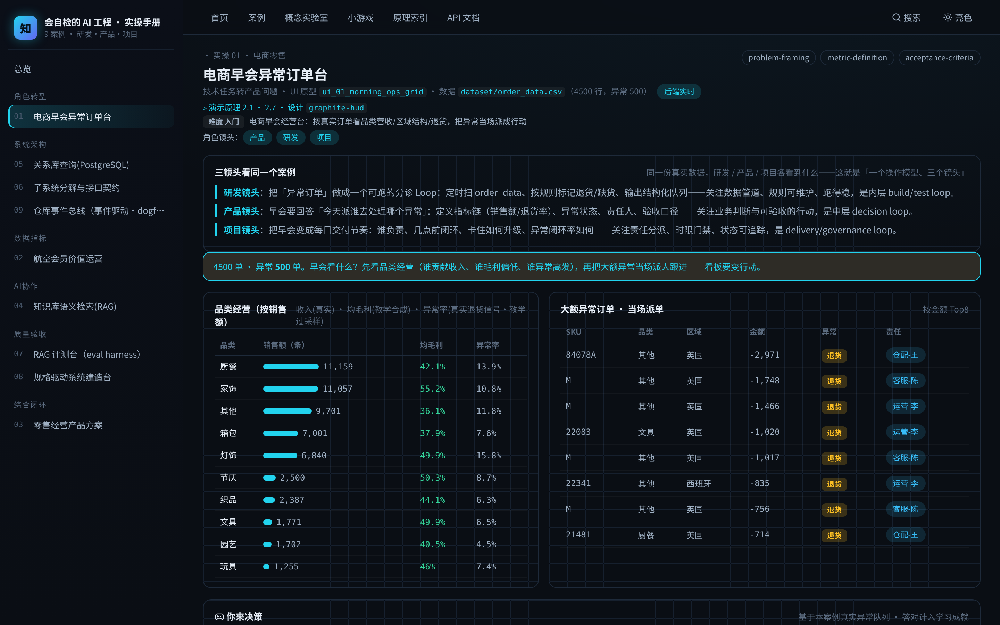

- 图形类型：morning_ops_grid（设计 graphite-hud）
- 看图顺序：先看指标链，再看异常队列和责任对象，最后看行动入口与验收边界。
- UI 差异：本案例采用 `ui_01_morning_ops_grid` + 设计 `graphite-hud`，不得复用通用表格占位；可运行原型见 `#/case/01`。

### 交付物与验收

- 交付物：产品问题定义卡
- 必含字段：订单号、SKU、库存天数、毛利率、异常原因、责任人、处理时限
- 必含指标链：经营目标达成率、销售额同比、区域贡献、异常订单数、责任部门闭环率
- 必含异常状态：目标未达成、区域下滑、异常订单、责任未闭环
- 必含 Skill：problem-framing、metric-definition、acceptance-criteria

- 合格标准：业务场景具体、指标链完整、异常状态可追踪、行动入口明确、验收条件可执行。
- 不合格标准：使用泛化产品名称、缺少行业指标、只描述页面不说明业务取舍、越过「不得把查询慢等同于产品问题」。
- 交付物文件：`outputs/product_case_library/case_01_morning_ops_grid_问题定义.md`、`…_方案验收.md`。


**指定实操融合**

- RP01：同一条软件需求的三种角色表达
  - 产出：角色差异卡, 产品问题清单
  - 验收：同一需求必须分别呈现研发视角、项目经理视角和产品经理视角，并能指出产品问题。


**跑通与纠错**：`npm run build` 通过后 `npm run preview` 访问 `#/case/01`；遵 rules/ 约束（单文件<800行、DRY、TS、中文注释）；`verify_course_package.mjs` 逐项核验字段/指标/Skill/截图/设计。


---

## 实操 02：项目经理转产品经理｜研发排期价值评审台

> **本案例演示/验证**：原理 2.1、2.7｜**采用设计** `cyan-matrix`（见 design/cyan-matrix.md）

### 项目场景故事

软件研发管理场景中，项目经理围绕跨部门研发排期做日常判断。项目经理需要围绕“跨部门研发排期”完成“从交付排期转向价值取舍”，并把结果转成可验证的产品交付物。核心不是把页面做出来，而是把指标、异常、责任和行动连成闭环。

**现状问题**

- 决策依赖的关键指标：需求项覆盖率、业务价值处理时长、研发工期异常数、依赖团队完成率、风险等级复核通过率。
- 现场常见异常：字段缺失、流程超时、复核未完成、验收失败。
- 只做通用页面无法支撑「围绕跨部门研发排期判断优先级、责任人和验收动作。」。

**本次任务**

- 明确岗位、指标链、异常状态与决策动作。
- 使用 `role-transition` 与 `outcome-mapping` 完成分析，产出 `角色差异分析表`，用 `release-risk` 验收。

### 任务目标与数据

- 行业：软件研发管理
- 真实业务场景：研发排期价值评审台
- 岗位：项目经理
- 数据或资料：`dataset/product_cases/aicourse_hr_employees.csv`（145 行，异常 10）
- 公开参考：本地：skills/external/pm-skills-deanpeters（源 deanpeters/Product-Manager-Skills）
- 行业字段：需求项、业务价值、研发工期、依赖团队、风险等级、上线目标
- 指标链（真实值）：需求项覆盖率 7%，业务价值处理时长 0，研发工期异常数 10，依赖团队完成率 8%，风险等级复核通过率 9%
- 决策动作：围绕跨部门研发排期判断优先级、责任人和验收动作。
- 风险边界：不得只用进度解释产品优先级
- UI 原型：`ui_02_value_schedule_axis`（matrix_decision）
- 采用设计：cyan-matrix
- SaaS 组件：二维矩阵、字段轴、优先级标签、决策说明、评分栏、复核入口

### Prompt 实操

**Prompt 1：研发排期价值评审台 - 问题定义**

```text
请以产品经理身份，用 AI 编程工具（如 Trae、CodeBuddy 等任一 Agent 工具）完成「研发排期价值评审台」的产品问题定义，并产出可运行原型：
- 场景与岗位：项目经理 面向「研发排期价值评审台」，把判断转成可验证的产品交付物；核心是把指标→异常→责任→行动连成闭环。
- 数据：读取 `dataset/product_cases/aicourse_hr_employees.csv`，只使用数据/资料中存在的字段（需求项、业务价值、研发工期、依赖团队、风险等级、上线目标）。
- 指标链：需求项覆盖率、业务价值处理时长、研发工期异常数、依赖团队完成率、风险等级复核通过率（当前真实值：需求项覆盖率=7%，业务价值处理时长=0，研发工期异常数=10，依赖团队完成率=8%，风险等级复核通过率=9%）。
- 异常状态：字段缺失、流程超时、复核未完成、验收失败。
- 使用 Skill：role-transition、outcome-mapping，并用 release-risk 做验收（结构化 Skill 见 skills/pm_skills.md）。
- 原型（技术契约，遵 rules/ 约束：DRY、单文件<800行、TS 类型、中文注释）：在 `coderef/react_pm_cases`（Vite+React+TS）路由 `#/case/02`，按 `ui_02_value_schedule_axis`（matrix_decision）与设计 `cyan-matrix` 渲染；数据经 `build_case_data.mjs` 预计算，页面必须体现指标链、异常队列、责任对象与行动入口，不得复用通用表格占位。
- 输出：角色差异分析表，保存为 `outputs/product_case_library/case_02_value_schedule_axis_问题定义.md`。
- 验收条件：结论回到数据或公开参考（本地：skills/external/pm-skills-deanpeters（源 deanpeters/Product-Manager-Skills））；不得越过「不得只用进度解释产品优先级」；`node coderef/verify_course_package.mjs` 必须 ALL GREEN。
```

**Prompt 2：研发排期价值评审台 - 方案验收**

```text
请以产品经理身份，用 AI 编程工具（如 Trae、CodeBuddy 等任一 Agent 工具）完成「研发排期价值评审台」的方案验收，并产出可运行原型：
- 场景与岗位：项目经理 面向「研发排期价值评审台」，把判断转成可验证的产品交付物；核心是把指标→异常→责任→行动连成闭环。
- 数据：读取 `dataset/product_cases/aicourse_hr_employees.csv`，只使用数据/资料中存在的字段（需求项、业务价值、研发工期、依赖团队、风险等级、上线目标）。
- 指标链：需求项覆盖率、业务价值处理时长、研发工期异常数、依赖团队完成率、风险等级复核通过率（当前真实值：需求项覆盖率=7%，业务价值处理时长=0，研发工期异常数=10，依赖团队完成率=8%，风险等级复核通过率=9%）。
- 异常状态：字段缺失、流程超时、复核未完成、验收失败。
- 使用 Skill：role-transition、outcome-mapping，并用 release-risk 做验收（结构化 Skill 见 skills/pm_skills.md）。
- 原型（技术契约，遵 rules/ 约束：DRY、单文件<800行、TS 类型、中文注释）：在 `coderef/react_pm_cases`（Vite+React+TS）路由 `#/case/02`，按 `ui_02_value_schedule_axis`（matrix_decision）与设计 `cyan-matrix` 渲染；数据经 `build_case_data.mjs` 预计算，页面必须体现指标链、异常队列、责任对象与行动入口，不得复用通用表格占位。
- 输出：角色差异分析表，保存为 `outputs/product_case_library/case_02_value_schedule_axis_方案验收.md`。
- 验收条件：结论回到数据或公开参考（本地：skills/external/pm-skills-deanpeters（源 deanpeters/Product-Manager-Skills））；不得越过「不得只用进度解释产品优先级」；`node coderef/verify_course_package.mjs` 必须 ALL GREEN。
```

### 图形/原型/表单



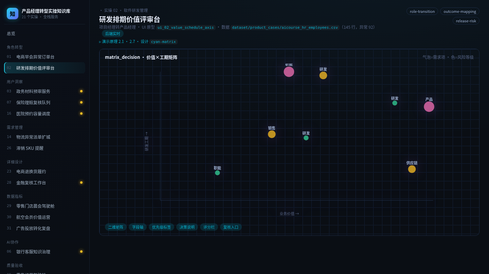

- 图形类型：value_schedule_axis（设计 cyan-matrix）
- 看图顺序：先看指标链，再看异常队列和责任对象，最后看行动入口与验收边界。
- UI 差异：本案例采用 `ui_02_value_schedule_axis` + 设计 `cyan-matrix`，不得复用通用表格占位；可运行原型见 `#/case/02`。

### 交付物与验收

- 交付物：角色差异分析表
- 必含字段：需求项、业务价值、研发工期、依赖团队、风险等级、上线目标
- 必含指标链：需求项覆盖率、业务价值处理时长、研发工期异常数、依赖团队完成率、风险等级复核通过率
- 必含异常状态：字段缺失、流程超时、复核未完成、验收失败
- 必含 Skill：role-transition、outcome-mapping、release-risk

- 合格标准：业务场景具体、指标链完整、异常状态可追踪、行动入口明确、验收条件可执行。
- 不合格标准：使用泛化产品名称、缺少行业指标、只描述页面不说明业务取舍、越过「不得只用进度解释产品优先级」。
- 交付物文件：`outputs/product_case_library/case_02_value_schedule_axis_问题定义.md`、`…_方案验收.md`。


**指定实操融合**

- RP02：内部系统功能的三层价值表达
  - 产出：价值三层拆解表
  - 验收：至少包含用户价值、业务价值、系统价值，且每层都有可观察指标。


**跑通与纠错**：`npm run build` 通过后 `npm run preview` 访问 `#/case/02`；遵 rules/ 约束（单文件<800行、DRY、TS、中文注释）；`verify_course_package.mjs` 逐项核验字段/指标/Skill/截图/设计。


---

## 实操 03：涉众地图与价值交换｜政务材料预审服务

> **本案例演示/验证**：原理 2.7、3.2｜**采用设计** `steel-queue`（见 design/steel-queue.md）

### 项目场景故事

政务服务场景中，政务产品负责人围绕材料预审服务做日常判断。政务产品负责人需要围绕“材料预审服务”完成“降低窗口返工和群众补正次数”，并把结果转成可验证的产品交付物。核心不是把页面做出来，而是把指标、异常、责任和行动连成闭环。

**现状问题**

- 决策依赖的关键指标：办件编号覆盖率、材料名称处理时长、补正原因异常数、承诺时限完成率、经办窗口复核通过率。
- 现场常见异常：字段缺失、流程超时、复核未完成、验收失败。
- 只做通用页面无法支撑「围绕材料预审服务判断优先级、责任人和验收动作。」。

**本次任务**

- 明确岗位、指标链、异常状态与决策动作。
- 使用 `stakeholder-map` 与 `service-blueprint` 完成分析，产出 `涉众地图和价值交换图`，用 `public-service-kpi` 验收。

### 任务目标与数据

- 行业：政务服务
- 真实业务场景：政务材料预审服务
- 岗位：政务产品负责人
- 数据或资料：`dataset/pm_network_cases/nyc_311_service_requests_5000.csv`（1500 行，异常 407）
- 公开参考：https://design-system.service.gov.uk/
- 行业字段：办件编号、材料名称、补正原因、承诺时限、经办窗口、审批科室、群众反馈
- 指标链（真实值）：办件编号覆盖率 30%，材料名称处理时长 0，补正原因异常数 407，承诺时限完成率 35%，经办窗口复核通过率 35%
- 决策动作：围绕材料预审服务判断优先级、责任人和验收动作。
- 风险边界：不得替代法定审批结论（高影响行业·人工复核）
- UI 原型：`ui_03_gov_material_checklist`（list_review）
- 采用设计：steel-queue
- SaaS 组件：筛选栏、指标卡、状态表格、补充抽屉、批量操作、验收面板

### Prompt 实操

**Prompt 1：政务材料预审服务 - 问题定义**

```text
请以产品经理身份，用 AI 编程工具（如 Trae、CodeBuddy 等任一 Agent 工具）完成「政务材料预审服务」的产品问题定义，并产出可运行原型：
- 场景与岗位：政务产品负责人 面向「政务材料预审服务」，把判断转成可验证的产品交付物；核心是把指标→异常→责任→行动连成闭环。
- 数据：读取 `dataset/pm_network_cases/nyc_311_service_requests_5000.csv`，只使用数据/资料中存在的字段（办件编号、材料名称、补正原因、承诺时限、经办窗口、审批科室、群众反馈）。
- 指标链：办件编号覆盖率、材料名称处理时长、补正原因异常数、承诺时限完成率、经办窗口复核通过率（当前真实值：办件编号覆盖率=30%，材料名称处理时长=0，补正原因异常数=407，承诺时限完成率=35%，经办窗口复核通过率=35%）。
- 异常状态：字段缺失、流程超时、复核未完成、验收失败。
- 使用 Skill：stakeholder-map、service-blueprint，并用 public-service-kpi 做验收（结构化 Skill 见 skills/pm_skills.md）。
- 原型（技术契约，遵 rules/ 约束：DRY、单文件<800行、TS 类型、中文注释）：在 `coderef/react_pm_cases`（Vite+React+TS）路由 `#/case/03`，按 `ui_03_gov_material_checklist`（list_review）与设计 `steel-queue` 渲染；数据经 `build_case_data.mjs` 预计算，页面必须体现指标链、异常队列、责任对象与行动入口，不得复用通用表格占位。
- 输出：涉众地图和价值交换图，保存为 `outputs/product_case_library/case_03_gov_material_checklist_问题定义.md`。
- 验收条件：结论回到数据或公开参考（https://design-system.service.gov.uk/）；不得越过「不得替代法定审批结论」；高影响行业保留人工复核；`node coderef/verify_course_package.mjs` 必须 ALL GREEN。
```

**Prompt 2：政务材料预审服务 - 方案验收**

```text
请以产品经理身份，用 AI 编程工具（如 Trae、CodeBuddy 等任一 Agent 工具）完成「政务材料预审服务」的方案验收，并产出可运行原型：
- 场景与岗位：政务产品负责人 面向「政务材料预审服务」，把判断转成可验证的产品交付物；核心是把指标→异常→责任→行动连成闭环。
- 数据：读取 `dataset/pm_network_cases/nyc_311_service_requests_5000.csv`，只使用数据/资料中存在的字段（办件编号、材料名称、补正原因、承诺时限、经办窗口、审批科室、群众反馈）。
- 指标链：办件编号覆盖率、材料名称处理时长、补正原因异常数、承诺时限完成率、经办窗口复核通过率（当前真实值：办件编号覆盖率=30%，材料名称处理时长=0，补正原因异常数=407，承诺时限完成率=35%，经办窗口复核通过率=35%）。
- 异常状态：字段缺失、流程超时、复核未完成、验收失败。
- 使用 Skill：stakeholder-map、service-blueprint，并用 public-service-kpi 做验收（结构化 Skill 见 skills/pm_skills.md）。
- 原型（技术契约，遵 rules/ 约束：DRY、单文件<800行、TS 类型、中文注释）：在 `coderef/react_pm_cases`（Vite+React+TS）路由 `#/case/03`，按 `ui_03_gov_material_checklist`（list_review）与设计 `steel-queue` 渲染；数据经 `build_case_data.mjs` 预计算，页面必须体现指标链、异常队列、责任对象与行动入口，不得复用通用表格占位。
- 输出：涉众地图和价值交换图，保存为 `outputs/product_case_library/case_03_gov_material_checklist_方案验收.md`。
- 验收条件：结论回到数据或公开参考（https://design-system.service.gov.uk/）；不得越过「不得替代法定审批结论」；高影响行业保留人工复核；`node coderef/verify_course_package.mjs` 必须 ALL GREEN。
```

### 图形/原型/表单



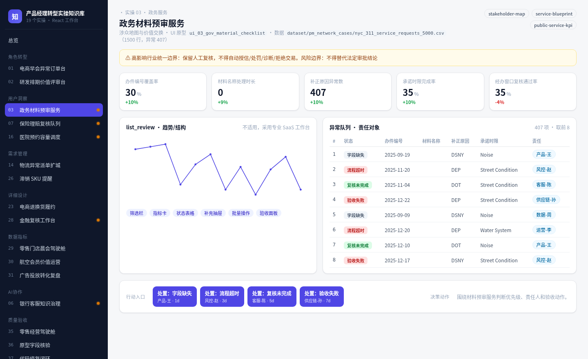

- 图形类型：gov_material_checklist（设计 steel-queue）
- 看图顺序：先看指标链，再看异常队列和责任对象，最后看行动入口与验收边界。
- UI 差异：本案例采用 `ui_03_gov_material_checklist` + 设计 `steel-queue`，不得复用通用表格占位；可运行原型见 `#/case/03`。

### 交付物与验收

- 交付物：涉众地图和价值交换图
- 必含字段：办件编号、材料名称、补正原因、承诺时限、经办窗口、审批科室、群众反馈
- 必含指标链：办件编号覆盖率、材料名称处理时长、补正原因异常数、承诺时限完成率、经办窗口复核通过率
- 必含异常状态：字段缺失、流程超时、复核未完成、验收失败
- 必含 Skill：stakeholder-map、service-blueprint、public-service-kpi

- 合格标准：业务场景具体、指标链完整、异常状态可追踪、行动入口明确、验收条件可执行。
- 不合格标准：使用泛化产品名称、缺少行业指标、只描述页面不说明业务取舍、越过「不得替代法定审批结论」。
- 交付物文件：`outputs/product_case_library/case_03_gov_material_checklist_问题定义.md`、`…_方案验收.md`。


**跑通与纠错**：`npm run build` 通过后 `npm run preview` 访问 `#/case/03`；遵 rules/ 约束（单文件<800行、DRY、TS、中文注释）；`verify_course_package.mjs` 逐项核验字段/指标/Skill/截图/设计。


---

## 实操 06：AI 产品经理工作流｜银行客服知识治理

> **本案例演示/验证**：原理 2.4、2.6｜**采用设计** `emerald-flow`（见 design/emerald-flow.md）

### 项目场景故事

银行客服场景中，AI 产品经理围绕银行客服知识库做日常判断。AI 产品经理需要围绕“银行客服知识库”完成“治理问答边界和上线评估”，并把结果转成可验证的产品交付物。核心不是把页面做出来，而是把指标、异常、责任和行动连成闭环。

**现状问题**

- 决策依赖的关键指标：问题类别覆盖率、知识来源处理时长、命中率异常数、风险答案完成率、人工接管复核通过率。
- 现场常见异常：字段缺失、流程超时、复核未完成、验收失败。
- 只做通用页面无法支撑「围绕银行客服知识库判断优先级、责任人和验收动作。」。

**本次任务**

- 明确岗位、指标链、异常状态与决策动作。
- 使用 `ai-product-boundary` 与 `eval-design` 完成分析，产出 `AI 产品工作流蓝图`，用 `human-review` 验收。

### 任务目标与数据

- 行业：银行客服
- 真实业务场景：银行客服知识治理
- 岗位：AI 产品经理
- 数据或资料：`dataset/product_cases/aicourse_financial_transactions.csv`（900 行，异常 592）
- 公开参考：https://github.com/VoltAgent/awesome-agent-skills
- 行业字段：问题类别、知识来源、命中率、风险答案、人工接管、留痕编号
- 指标链（真实值）：问题类别覆盖率 59%，知识来源处理时长 0，命中率异常数 53%，风险答案完成率 46%，人工接管复核通过率 66%
- 决策动作：围绕银行客服知识库判断优先级、责任人和验收动作。
- 风险边界：不得输出自动授信或最终处置建议（高影响行业·人工复核）
- UI 原型：`ui_06_bank_knowledge_governance`（knowledge_workspace）
- 采用设计：emerald-flow
- SaaS 组件：知识目录、任务地图、问答记录、命中材料、错题复盘、能力画像

### Prompt 实操

**Prompt 1：银行客服知识治理 - 问题定义**

```text
请以产品经理身份，用 AI 编程工具（如 Trae、CodeBuddy 等任一 Agent 工具）完成「银行客服知识治理」的产品问题定义，并产出可运行原型：
- 场景与岗位：AI 产品经理 面向「银行客服知识治理」，把判断转成可验证的产品交付物；核心是把指标→异常→责任→行动连成闭环。
- 数据：读取 `dataset/product_cases/aicourse_financial_transactions.csv`，只使用数据/资料中存在的字段（问题类别、知识来源、命中率、风险答案、人工接管、留痕编号）。
- 指标链：问题类别覆盖率、知识来源处理时长、命中率异常数、风险答案完成率、人工接管复核通过率（当前真实值：问题类别覆盖率=59%，知识来源处理时长=0，命中率异常数=53%，风险答案完成率=46%，人工接管复核通过率=66%）。
- 异常状态：字段缺失、流程超时、复核未完成、验收失败。
- 使用 Skill：ai-product-boundary、eval-design，并用 human-review 做验收（结构化 Skill 见 skills/pm_skills.md）。
- 原型（技术契约，遵 rules/ 约束：DRY、单文件<800行、TS 类型、中文注释）：在 `coderef/react_pm_cases`（Vite+React+TS）路由 `#/case/06`，按 `ui_06_bank_knowledge_governance`（knowledge_workspace）与设计 `emerald-flow` 渲染；数据经 `build_case_data.mjs` 预计算，页面必须体现指标链、异常队列、责任对象与行动入口，不得复用通用表格占位。
- 输出：AI 产品工作流蓝图，保存为 `outputs/product_case_library/case_06_bank_knowledge_governance_问题定义.md`。
- 验收条件：结论回到数据或公开参考（https://github.com/VoltAgent/awesome-agent-skills）；不得越过「不得输出自动授信或最终处置建议」；高影响行业保留人工复核；`node coderef/verify_course_package.mjs` 必须 ALL GREEN。
```

**Prompt 2：银行客服知识治理 - 方案验收**

```text
请以产品经理身份，用 AI 编程工具（如 Trae、CodeBuddy 等任一 Agent 工具）完成「银行客服知识治理」的方案验收，并产出可运行原型：
- 场景与岗位：AI 产品经理 面向「银行客服知识治理」，把判断转成可验证的产品交付物；核心是把指标→异常→责任→行动连成闭环。
- 数据：读取 `dataset/product_cases/aicourse_financial_transactions.csv`，只使用数据/资料中存在的字段（问题类别、知识来源、命中率、风险答案、人工接管、留痕编号）。
- 指标链：问题类别覆盖率、知识来源处理时长、命中率异常数、风险答案完成率、人工接管复核通过率（当前真实值：问题类别覆盖率=59%，知识来源处理时长=0，命中率异常数=53%，风险答案完成率=46%，人工接管复核通过率=66%）。
- 异常状态：字段缺失、流程超时、复核未完成、验收失败。
- 使用 Skill：ai-product-boundary、eval-design，并用 human-review 做验收（结构化 Skill 见 skills/pm_skills.md）。
- 原型（技术契约，遵 rules/ 约束：DRY、单文件<800行、TS 类型、中文注释）：在 `coderef/react_pm_cases`（Vite+React+TS）路由 `#/case/06`，按 `ui_06_bank_knowledge_governance`（knowledge_workspace）与设计 `emerald-flow` 渲染；数据经 `build_case_data.mjs` 预计算，页面必须体现指标链、异常队列、责任对象与行动入口，不得复用通用表格占位。
- 输出：AI 产品工作流蓝图，保存为 `outputs/product_case_library/case_06_bank_knowledge_governance_方案验收.md`。
- 验收条件：结论回到数据或公开参考（https://github.com/VoltAgent/awesome-agent-skills）；不得越过「不得输出自动授信或最终处置建议」；高影响行业保留人工复核；`node coderef/verify_course_package.mjs` 必须 ALL GREEN。
```

### 图形/原型/表单



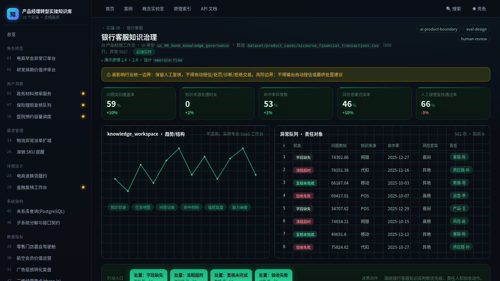

- 图形类型：bank_knowledge_governance（设计 emerald-flow）
- 看图顺序：先看指标链，再看异常队列和责任对象，最后看行动入口与验收边界。
- UI 差异：本案例采用 `ui_06_bank_knowledge_governance` + 设计 `emerald-flow`，不得复用通用表格占位；可运行原型见 `#/case/06`。

### 交付物与验收

- 交付物：AI 产品工作流蓝图
- 必含字段：问题类别、知识来源、命中率、风险答案、人工接管、留痕编号
- 必含指标链：问题类别覆盖率、知识来源处理时长、命中率异常数、风险答案完成率、人工接管复核通过率
- 必含异常状态：字段缺失、流程超时、复核未完成、验收失败
- 必含 Skill：ai-product-boundary、eval-design、human-review

- 合格标准：业务场景具体、指标链完整、异常状态可追踪、行动入口明确、验收条件可执行。
- 不合格标准：使用泛化产品名称、缺少行业指标、只描述页面不说明业务取舍、越过「不得输出自动授信或最终处置建议」。
- 交付物文件：`outputs/product_case_library/case_06_bank_knowledge_governance_问题定义.md`、`…_方案验收.md`。


**指定实操融合**

- RP13：本地资料知识库问答流程
  - 产出：知识库配置记录, 问答测试记录, 召回改进清单
  - 验收：至少测试 3 个问题，记录命中材料、答案质量和改进点。


**跑通与纠错**：`npm run build` 通过后 `npm run preview` 访问 `#/case/06`；遵 rules/ 约束（单文件<800行、DRY、TS、中文注释）；`verify_course_package.mjs` 逐项核验字段/指标/Skill/截图/设计。


---

## 实操 07：用户访谈｜保险理赔复核队列

> **本案例演示/验证**：原理 2.7、3.2｜**采用设计** `steel-queue`（见 design/steel-queue.md）

### 项目场景故事

保险理赔场景中，保险运营产品经理围绕理赔复核队列做日常判断。保险运营产品经理需要围绕“理赔复核队列”完成“通过访谈找出复核优先级”，并把结果转成可验证的产品交付物。核心不是把页面做出来，而是把指标、异常、责任和行动连成闭环。

**现状问题**

- 决策依赖的关键指标：案件号覆盖率、理赔类型处理时长、申请金额异常数、证据完整度完成率、风险信号复核通过率。
- 现场常见异常：字段缺失、流程超时、复核未完成、验收失败。
- 只做通用页面无法支撑「围绕理赔复核队列判断优先级、责任人和验收动作。」。

**本次任务**

- 明确岗位、指标链、异常状态与决策动作。
- 使用 `grill-me` 与 `interview-synthesis` 完成分析，产出 `访谈提纲与洞察卡`，用 `human-review` 验收。

### 任务目标与数据

- 行业：保险理赔
- 真实业务场景：保险理赔复核队列
- 岗位：保险运营产品经理
- 数据或资料：`dataset/product_cases/aicourse_financial_transactions.csv`（900 行，异常 592）
- 公开参考：https://github.com/travisvn/awesome-claude-skills
- 行业字段：案件号、理赔类型、申请金额、证据完整度、风险信号、复核人
- 指标链（真实值）：案件号覆盖率 79%，理赔类型处理时长 0，申请金额异常数 592，证据完整度完成率 79%，风险信号复核通过率 86%
- 决策动作：围绕理赔复核队列判断优先级、责任人和验收动作。
- 风险边界：不得自动拒赔，必须保留人工复核（高影响行业·人工复核）
- UI 原型：`ui_07_insurance_claim_review`（review_queue）
- 采用设计：steel-queue
- SaaS 组件：复核队列、证据摘要、风险标签、人工处理、留痕记录、升级入口

### Prompt 实操

**Prompt 1：保险理赔复核队列 - 问题定义**

```text
请以产品经理身份，用 AI 编程工具（如 Trae、CodeBuddy 等任一 Agent 工具）完成「保险理赔复核队列」的产品问题定义，并产出可运行原型：
- 场景与岗位：保险运营产品经理 面向「保险理赔复核队列」，把判断转成可验证的产品交付物；核心是把指标→异常→责任→行动连成闭环。
- 数据：读取 `dataset/product_cases/aicourse_financial_transactions.csv`，只使用数据/资料中存在的字段（案件号、理赔类型、申请金额、证据完整度、风险信号、复核人）。
- 指标链：案件号覆盖率、理赔类型处理时长、申请金额异常数、证据完整度完成率、风险信号复核通过率（当前真实值：案件号覆盖率=79%，理赔类型处理时长=0，申请金额异常数=592，证据完整度完成率=79%，风险信号复核通过率=86%）。
- 异常状态：字段缺失、流程超时、复核未完成、验收失败。
- 使用 Skill：grill-me、interview-synthesis，并用 human-review 做验收（结构化 Skill 见 skills/pm_skills.md）。
- 原型（技术契约，遵 rules/ 约束：DRY、单文件<800行、TS 类型、中文注释）：在 `coderef/react_pm_cases`（Vite+React+TS）路由 `#/case/07`，按 `ui_07_insurance_claim_review`（review_queue）与设计 `steel-queue` 渲染；数据经 `build_case_data.mjs` 预计算，页面必须体现指标链、异常队列、责任对象与行动入口，不得复用通用表格占位。
- 输出：访谈提纲与洞察卡，保存为 `outputs/product_case_library/case_07_insurance_claim_review_问题定义.md`。
- 验收条件：结论回到数据或公开参考（https://github.com/travisvn/awesome-claude-skills）；不得越过「不得自动拒赔，必须保留人工复核」；高影响行业保留人工复核；`node coderef/verify_course_package.mjs` 必须 ALL GREEN。
```

**Prompt 2：保险理赔复核队列 - 方案验收**

```text
请以产品经理身份，用 AI 编程工具（如 Trae、CodeBuddy 等任一 Agent 工具）完成「保险理赔复核队列」的方案验收，并产出可运行原型：
- 场景与岗位：保险运营产品经理 面向「保险理赔复核队列」，把判断转成可验证的产品交付物；核心是把指标→异常→责任→行动连成闭环。
- 数据：读取 `dataset/product_cases/aicourse_financial_transactions.csv`，只使用数据/资料中存在的字段（案件号、理赔类型、申请金额、证据完整度、风险信号、复核人）。
- 指标链：案件号覆盖率、理赔类型处理时长、申请金额异常数、证据完整度完成率、风险信号复核通过率（当前真实值：案件号覆盖率=79%，理赔类型处理时长=0，申请金额异常数=592，证据完整度完成率=79%，风险信号复核通过率=86%）。
- 异常状态：字段缺失、流程超时、复核未完成、验收失败。
- 使用 Skill：grill-me、interview-synthesis，并用 human-review 做验收（结构化 Skill 见 skills/pm_skills.md）。
- 原型（技术契约，遵 rules/ 约束：DRY、单文件<800行、TS 类型、中文注释）：在 `coderef/react_pm_cases`（Vite+React+TS）路由 `#/case/07`，按 `ui_07_insurance_claim_review`（review_queue）与设计 `steel-queue` 渲染；数据经 `build_case_data.mjs` 预计算，页面必须体现指标链、异常队列、责任对象与行动入口，不得复用通用表格占位。
- 输出：访谈提纲与洞察卡，保存为 `outputs/product_case_library/case_07_insurance_claim_review_方案验收.md`。
- 验收条件：结论回到数据或公开参考（https://github.com/travisvn/awesome-claude-skills）；不得越过「不得自动拒赔，必须保留人工复核」；高影响行业保留人工复核；`node coderef/verify_course_package.mjs` 必须 ALL GREEN。
```

### 图形/原型/表单



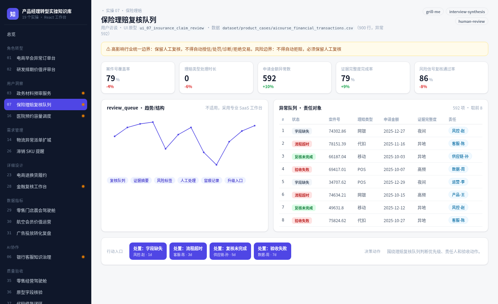

- 图形类型：insurance_claim_review（设计 steel-queue）
- 看图顺序：先看指标链，再看异常队列和责任对象，最后看行动入口与验收边界。
- UI 差异：本案例采用 `ui_07_insurance_claim_review` + 设计 `steel-queue`，不得复用通用表格占位；可运行原型见 `#/case/07`。

### 交付物与验收

- 交付物：访谈提纲与洞察卡
- 必含字段：案件号、理赔类型、申请金额、证据完整度、风险信号、复核人
- 必含指标链：案件号覆盖率、理赔类型处理时长、申请金额异常数、证据完整度完成率、风险信号复核通过率
- 必含异常状态：字段缺失、流程超时、复核未完成、验收失败
- 必含 Skill：grill-me、interview-synthesis、human-review

- 合格标准：业务场景具体、指标链完整、异常状态可追踪、行动入口明确、验收条件可执行。
- 不合格标准：使用泛化产品名称、缺少行业指标、只描述页面不说明业务取舍、越过「不得自动拒赔，必须保留人工复核」。
- 交付物文件：`outputs/product_case_library/case_07_insurance_claim_review_问题定义.md`、`…_方案验收.md`。


**指定实操融合**

- RP06：AI 访谈纪要转需求并人工复核
  - 产出：AI 生成需求清单, 人工复核记录, 风险标注
  - 验收：AI 输出必须逐条人工复核，并标出不确定、越权或证据不足的内容。


**跑通与纠错**：`npm run build` 通过后 `npm run preview` 访问 `#/case/07`；遵 rules/ 约束（单文件<800行、DRY、TS、中文注释）；`verify_course_package.mjs` 逐项核验字段/指标/Skill/截图/设计。


---

## 实操 14：需求变更控制｜物流异常派单扩城

> **本案例演示/验证**：原理 3.4、4.1｜**采用设计** `amber-funnel`（见 design/amber-funnel.md）

### 项目场景故事

物流配送场景中，物流产品经理围绕异常派单扩城做日常判断。物流产品经理需要围绕“异常派单扩城”完成“评估需求变更的影响和回滚策略”，并把结果转成可验证的产品交付物。核心不是把页面做出来，而是把指标、异常、责任和行动连成闭环。

**现状问题**

- 决策依赖的关键指标：线索数、商机转化率、合同金额、回款率、客户跟进超时数。
- 现场常见异常：转化率下滑、回款逾期、客户跟进超时、区域掉队。
- 只做通用页面无法支撑「判断漏斗断点、回款风险和区域销售动作优先级。」。

**本次任务**

- 明确岗位、指标链、异常状态与决策动作。
- 使用 `change-impact` 与 `release-risk` 完成分析，产出 `需求变更影响评估`，用 `rollback-plan` 验收。

### 任务目标与数据

- 行业：物流配送
- 真实业务场景：物流异常派单扩城
- 岗位：物流产品经理
- 数据或资料：`dataset/product_cases/aicourse_logistics_delivery.csv`（700 行，异常 541）
- 公开参考：https://onfleet.com/blog/dispatch-management/
- 行业字段：城市、运单、异常类型、规则版本、客服话术、回滚条件
- 指标链（真实值）：线索数 700，商机转化率 46%，合同金额 700，回款率 77%，客户跟进超时数 700
- 决策动作：判断漏斗断点、回款风险和区域销售动作优先级。
- 风险边界：不得在无回滚条件下扩大范围
- UI 原型：`ui_14_logistics_change_control`（sales_funnel_screen）
- 采用设计：amber-funnel
- SaaS 组件：销售漏斗、目标进度、客户跟进、回款风险、区域作战、销售排行

### Prompt 实操

**Prompt 1：物流异常派单扩城 - 问题定义**

```text
请以产品经理身份，用 AI 编程工具（如 Trae、CodeBuddy 等任一 Agent 工具）完成「物流异常派单扩城」的产品问题定义，并产出可运行原型：
- 场景与岗位：物流产品经理 面向「物流异常派单扩城」，把判断转成可验证的产品交付物；核心是把指标→异常→责任→行动连成闭环。
- 数据：读取 `dataset/product_cases/aicourse_logistics_delivery.csv`，只使用数据/资料中存在的字段（城市、运单、异常类型、规则版本、客服话术、回滚条件）。
- 指标链：线索数、商机转化率、合同金额、回款率、客户跟进超时数（当前真实值：线索数=700，商机转化率=46%，合同金额=700，回款率=77%，客户跟进超时数=700）。
- 异常状态：转化率下滑、回款逾期、客户跟进超时、区域掉队。
- 使用 Skill：change-impact、release-risk，并用 rollback-plan 做验收（结构化 Skill 见 skills/pm_skills.md）。
- 原型（技术契约，遵 rules/ 约束：DRY、单文件<800行、TS 类型、中文注释）：在 `coderef/react_pm_cases`（Vite+React+TS）路由 `#/case/14`，按 `ui_14_logistics_change_control`（sales_funnel_screen）与设计 `amber-funnel` 渲染；数据经 `build_case_data.mjs` 预计算，页面必须体现指标链、异常队列、责任对象与行动入口，不得复用通用表格占位。
- 输出：需求变更影响评估，保存为 `outputs/product_case_library/case_14_logistics_change_control_问题定义.md`。
- 验收条件：结论回到数据或公开参考（https://onfleet.com/blog/dispatch-management/）；不得越过「不得在无回滚条件下扩大范围」；`node coderef/verify_course_package.mjs` 必须 ALL GREEN。
```

**Prompt 2：物流异常派单扩城 - 方案验收**

```text
请以产品经理身份，用 AI 编程工具（如 Trae、CodeBuddy 等任一 Agent 工具）完成「物流异常派单扩城」的方案验收，并产出可运行原型：
- 场景与岗位：物流产品经理 面向「物流异常派单扩城」，把判断转成可验证的产品交付物；核心是把指标→异常→责任→行动连成闭环。
- 数据：读取 `dataset/product_cases/aicourse_logistics_delivery.csv`，只使用数据/资料中存在的字段（城市、运单、异常类型、规则版本、客服话术、回滚条件）。
- 指标链：线索数、商机转化率、合同金额、回款率、客户跟进超时数（当前真实值：线索数=700，商机转化率=46%，合同金额=700，回款率=77%，客户跟进超时数=700）。
- 异常状态：转化率下滑、回款逾期、客户跟进超时、区域掉队。
- 使用 Skill：change-impact、release-risk，并用 rollback-plan 做验收（结构化 Skill 见 skills/pm_skills.md）。
- 原型（技术契约，遵 rules/ 约束：DRY、单文件<800行、TS 类型、中文注释）：在 `coderef/react_pm_cases`（Vite+React+TS）路由 `#/case/14`，按 `ui_14_logistics_change_control`（sales_funnel_screen）与设计 `amber-funnel` 渲染；数据经 `build_case_data.mjs` 预计算，页面必须体现指标链、异常队列、责任对象与行动入口，不得复用通用表格占位。
- 输出：需求变更影响评估，保存为 `outputs/product_case_library/case_14_logistics_change_control_方案验收.md`。
- 验收条件：结论回到数据或公开参考（https://onfleet.com/blog/dispatch-management/）；不得越过「不得在无回滚条件下扩大范围」；`node coderef/verify_course_package.mjs` 必须 ALL GREEN。
```

### 图形/原型/表单



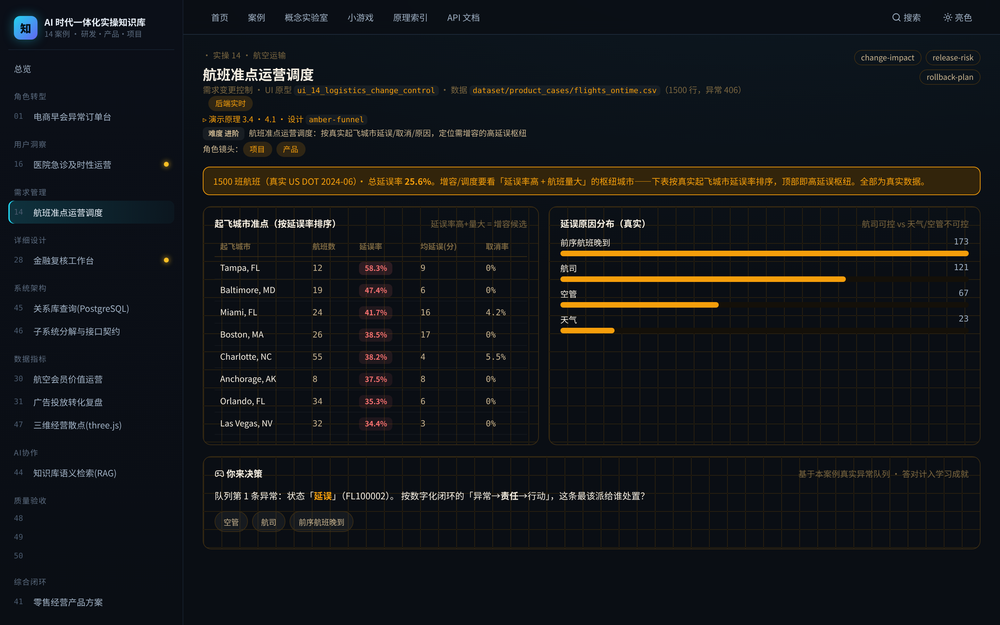

- 图形类型：logistics_change_control（设计 amber-funnel）
- 看图顺序：先看指标链，再看异常队列和责任对象，最后看行动入口与验收边界。
- UI 差异：本案例采用 `ui_14_logistics_change_control` + 设计 `amber-funnel`，不得复用通用表格占位；可运行原型见 `#/case/14`。

### 交付物与验收

- 交付物：需求变更影响评估
- 必含字段：城市、运单、异常类型、规则版本、客服话术、回滚条件
- 必含指标链：线索数、商机转化率、合同金额、回款率、客户跟进超时数
- 必含异常状态：转化率下滑、回款逾期、客户跟进超时、区域掉队
- 必含 Skill：change-impact、release-risk、rollback-plan

- 合格标准：业务场景具体、指标链完整、异常状态可追踪、行动入口明确、验收条件可执行。
- 不合格标准：使用泛化产品名称、缺少行业指标、只描述页面不说明业务取舍、越过「不得在无回滚条件下扩大范围」。
- 交付物文件：`outputs/product_case_library/case_14_logistics_change_control_问题定义.md`、`…_方案验收.md`。


**指定实操融合**

- RP03：产品评审会协作纪要
  - 产出：产品评审纪要, 验收口径清单
  - 验收：纪要必须覆盖需求、范围、风险、验收口径和责任人。


**跑通与纠错**：`npm run build` 通过后 `npm run preview` 访问 `#/case/14`；遵 rules/ 约束（单文件<800行、DRY、TS、中文注释）；`verify_course_package.mjs` 逐项核验字段/指标/Skill/截图/设计。


---

## 实操 16：目标用户与场景｜医院预约容量调度

> **本案例演示/验证**：原理 2.7、3.2｜**采用设计** `graphite-hud`（见 design/graphite-hud.md）

### 项目场景故事

医疗运营场景中，医疗运营产品经理围绕预约容量调度做日常判断。医疗运营产品经理需要围绕“预约容量调度”完成“平衡患者等待和医护资源”，并把结果转成可验证的产品交付物。核心不是把页面做出来，而是把指标、异常、责任和行动连成闭环。

**现状问题**

- 决策依赖的关键指标：人效产出、在编人数、招聘达成率、薪酬成本率、流失预警人数。
- 现场常见异常：招聘延期、人效偏低、编制超配、流失预警。
- 只做通用页面无法支撑「判断岗位产出、编制缺口和流失风险，形成组织调整建议。」。

**本次任务**

- 明确岗位、指标链、异常状态与决策动作。
- 使用 `persona-scenario` 与 `journey-map` 完成分析，产出 `目标用户与场景矩阵`，用 `human-review` 验收。

### 任务目标与数据

- 行业：医疗运营
- 真实业务场景：医院预约容量调度
- 岗位：医疗运营产品经理
- 数据或资料：`dataset/product_cases/aicourse_healthcare_diabetes.csv`（520 行，异常 61）
- 公开参考：https://github.com/vintasoftware/medplum-ai-concierge
- 行业字段：科室、医生、预约槽、等待时间、加号规则、人工协调
- 指标链（真实值）：人效产出 520，在编人数 520，招聘达成率 12%，薪酬成本率 14%，流失预警人数 520
- 决策动作：判断岗位产出、编制缺口和流失风险，形成组织调整建议。
- 风险边界：不得自动诊断或替代医生决策（高影响行业·人工复核）
- UI 原型：`ui_16_hospital_capacity_scheduler`（hr_efficiency_screen）
- 采用设计：graphite-hud
- SaaS 组件：人效产出、招聘进度、组织编制、薪酬成本、流失预警、岗位效率

### Prompt 实操

**Prompt 1：医院预约容量调度 - 问题定义**

```text
请以产品经理身份，用 AI 编程工具（如 Trae、CodeBuddy 等任一 Agent 工具）完成「医院预约容量调度」的产品问题定义，并产出可运行原型：
- 场景与岗位：医疗运营产品经理 面向「医院预约容量调度」，把判断转成可验证的产品交付物；核心是把指标→异常→责任→行动连成闭环。
- 数据：读取 `dataset/product_cases/aicourse_healthcare_diabetes.csv`，只使用数据/资料中存在的字段（科室、医生、预约槽、等待时间、加号规则、人工协调）。
- 指标链：人效产出、在编人数、招聘达成率、薪酬成本率、流失预警人数（当前真实值：人效产出=520，在编人数=520，招聘达成率=12%，薪酬成本率=14%，流失预警人数=520）。
- 异常状态：招聘延期、人效偏低、编制超配、流失预警。
- 使用 Skill：persona-scenario、journey-map，并用 human-review 做验收（结构化 Skill 见 skills/pm_skills.md）。
- 原型（技术契约，遵 rules/ 约束：DRY、单文件<800行、TS 类型、中文注释）：在 `coderef/react_pm_cases`（Vite+React+TS）路由 `#/case/16`，按 `ui_16_hospital_capacity_scheduler`（hr_efficiency_screen）与设计 `graphite-hud` 渲染；数据经 `build_case_data.mjs` 预计算，页面必须体现指标链、异常队列、责任对象与行动入口，不得复用通用表格占位。
- 输出：目标用户与场景矩阵，保存为 `outputs/product_case_library/case_16_hospital_capacity_scheduler_问题定义.md`。
- 验收条件：结论回到数据或公开参考（https://github.com/vintasoftware/medplum-ai-concierge）；不得越过「不得自动诊断或替代医生决策」；高影响行业保留人工复核；`node coderef/verify_course_package.mjs` 必须 ALL GREEN。
```

**Prompt 2：医院预约容量调度 - 方案验收**

```text
请以产品经理身份，用 AI 编程工具（如 Trae、CodeBuddy 等任一 Agent 工具）完成「医院预约容量调度」的方案验收，并产出可运行原型：
- 场景与岗位：医疗运营产品经理 面向「医院预约容量调度」，把判断转成可验证的产品交付物；核心是把指标→异常→责任→行动连成闭环。
- 数据：读取 `dataset/product_cases/aicourse_healthcare_diabetes.csv`，只使用数据/资料中存在的字段（科室、医生、预约槽、等待时间、加号规则、人工协调）。
- 指标链：人效产出、在编人数、招聘达成率、薪酬成本率、流失预警人数（当前真实值：人效产出=520，在编人数=520，招聘达成率=12%，薪酬成本率=14%，流失预警人数=520）。
- 异常状态：招聘延期、人效偏低、编制超配、流失预警。
- 使用 Skill：persona-scenario、journey-map，并用 human-review 做验收（结构化 Skill 见 skills/pm_skills.md）。
- 原型（技术契约，遵 rules/ 约束：DRY、单文件<800行、TS 类型、中文注释）：在 `coderef/react_pm_cases`（Vite+React+TS）路由 `#/case/16`，按 `ui_16_hospital_capacity_scheduler`（hr_efficiency_screen）与设计 `graphite-hud` 渲染；数据经 `build_case_data.mjs` 预计算，页面必须体现指标链、异常队列、责任对象与行动入口，不得复用通用表格占位。
- 输出：目标用户与场景矩阵，保存为 `outputs/product_case_library/case_16_hospital_capacity_scheduler_方案验收.md`。
- 验收条件：结论回到数据或公开参考（https://github.com/vintasoftware/medplum-ai-concierge）；不得越过「不得自动诊断或替代医生决策」；高影响行业保留人工复核；`node coderef/verify_course_package.mjs` 必须 ALL GREEN。
```

### 图形/原型/表单



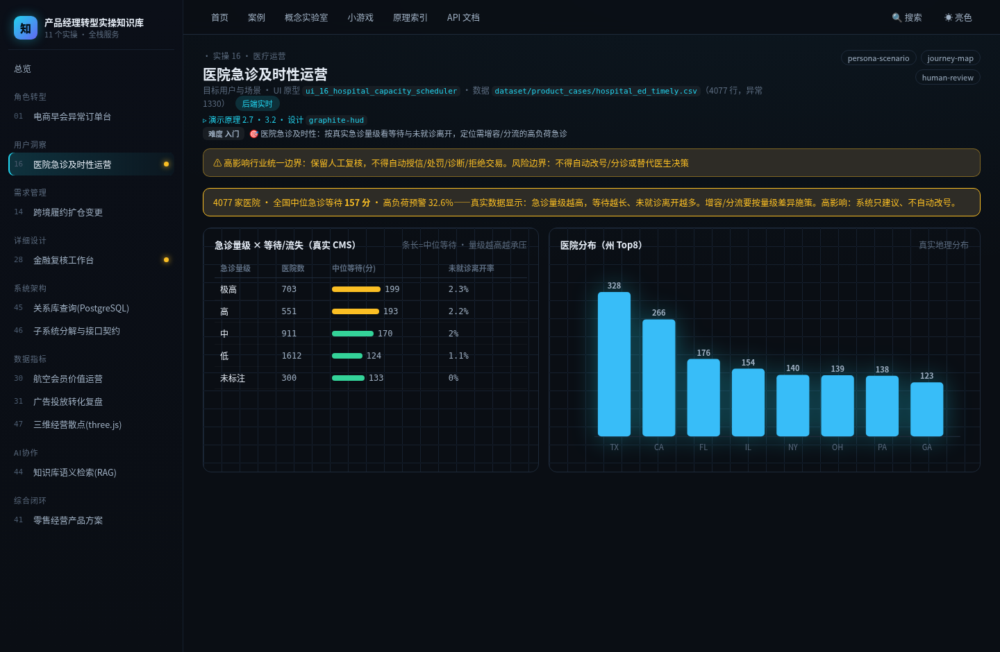

- 图形类型：hospital_capacity_scheduler（设计 graphite-hud）
- 看图顺序：先看指标链，再看异常队列和责任对象，最后看行动入口与验收边界。
- UI 差异：本案例采用 `ui_16_hospital_capacity_scheduler` + 设计 `graphite-hud`，不得复用通用表格占位；可运行原型见 `#/case/16`。

### 交付物与验收

- 交付物：目标用户与场景矩阵
- 必含字段：科室、医生、预约槽、等待时间、加号规则、人工协调
- 必含指标链：人效产出、在编人数、招聘达成率、薪酬成本率、流失预警人数
- 必含异常状态：招聘延期、人效偏低、编制超配、流失预警
- 必含 Skill：persona-scenario、journey-map、human-review

- 合格标准：业务场景具体、指标链完整、异常状态可追踪、行动入口明确、验收条件可执行。
- 不合格标准：使用泛化产品名称、缺少行业指标、只描述页面不说明业务取舍、越过「不得自动诊断或替代医生决策」。
- 交付物文件：`outputs/product_case_library/case_16_hospital_capacity_scheduler_问题定义.md`、`…_方案验收.md`。


**指定实操融合**

- RP04：用户体验五层与服务蓝图
  - 产出：用户体验地图, 服务蓝图, 用户故事, 体验五层拆解
  - 验收：体验地图、用户故事和服务蓝图必须描述同一个用户任务。


**跑通与纠错**：`npm run build` 通过后 `npm run preview` 访问 `#/case/16`；遵 rules/ 约束（单文件<800行、DRY、TS、中文注释）；`verify_course_package.mjs` 逐项核验字段/指标/Skill/截图/设计。


---

## 实操 23：业务流程优化｜电商退换货履约

> **本案例演示/验证**：原理 3.3、3.5｜**采用设计** `emerald-flow`（见 design/emerald-flow.md）

### 项目场景故事

电商售后场景中，售后产品经理围绕退换货履约做日常判断。售后产品经理需要围绕“退换货履约”完成“优化跨角色流程和异常处理”，并把结果转成可验证的产品交付物。核心不是把页面做出来，而是把指标、异常、责任和行动连成闭环。

**现状问题**

- 决策依赖的关键指标：售后单覆盖率、客服审核处理时长、仓库收货异常数、退款完成率、补偿复核通过率。
- 现场常见异常：字段缺失、流程超时、复核未完成、验收失败。
- 只做通用页面无法支撑「围绕退换货履约判断优先级、责任人和验收动作。」。

**本次任务**

- 明确岗位、指标链、异常状态与决策动作。
- 使用 `process-redesign` 与 `service-blueprint` 完成分析，产出 `现状/优化流程图`，用 `acceptance-mapping` 验收。

### 任务目标与数据

- 行业：电商售后
- 真实业务场景：电商退换货履约
- 岗位：售后产品经理
- 数据或资料：`dataset/product_cases/aicourse_ecommerce_orders.csv`（1000 行，异常 799）
- 公开参考：https://archive.ics.uci.edu/dataset/352/online+retail
- 行业字段：售后单、客服审核、仓库收货、退款、补偿、超时原因
- 指标链（真实值）：售后单覆盖率 64%，客服审核处理时长 8，仓库收货异常数 799，退款完成率 72%，补偿复核通过率 88%
- 决策动作：围绕退换货履约判断优先级、责任人和验收动作。
- 风险边界：不得只增加按钮而不重构流程
- UI 原型：`ui_23_return_fulfillment_swimlane`（workflow_pipeline）
- 采用设计：emerald-flow
- SaaS 组件：阶段泳道、任务卡片、流转状态、阻塞项、版本记录、验收点

### Prompt 实操

**Prompt 1：电商退换货履约 - 问题定义**

```text
请以产品经理身份，用 AI 编程工具（如 Trae、CodeBuddy 等任一 Agent 工具）完成「电商退换货履约」的产品问题定义，并产出可运行原型：
- 场景与岗位：售后产品经理 面向「电商退换货履约」，把判断转成可验证的产品交付物；核心是把指标→异常→责任→行动连成闭环。
- 数据：读取 `dataset/product_cases/aicourse_ecommerce_orders.csv`，只使用数据/资料中存在的字段（售后单、客服审核、仓库收货、退款、补偿、超时原因）。
- 指标链：售后单覆盖率、客服审核处理时长、仓库收货异常数、退款完成率、补偿复核通过率（当前真实值：售后单覆盖率=64%，客服审核处理时长=8，仓库收货异常数=799，退款完成率=72%，补偿复核通过率=88%）。
- 异常状态：字段缺失、流程超时、复核未完成、验收失败。
- 使用 Skill：process-redesign、service-blueprint，并用 acceptance-mapping 做验收（结构化 Skill 见 skills/pm_skills.md）。
- 原型（技术契约，遵 rules/ 约束：DRY、单文件<800行、TS 类型、中文注释）：在 `coderef/react_pm_cases`（Vite+React+TS）路由 `#/case/23`，按 `ui_23_return_fulfillment_swimlane`（workflow_pipeline）与设计 `emerald-flow` 渲染；数据经 `build_case_data.mjs` 预计算，页面必须体现指标链、异常队列、责任对象与行动入口，不得复用通用表格占位。
- 输出：现状/优化流程图，保存为 `outputs/product_case_library/case_23_return_fulfillment_swimlane_问题定义.md`。
- 验收条件：结论回到数据或公开参考（https://archive.ics.uci.edu/dataset/352/online+retail）；不得越过「不得只增加按钮而不重构流程」；`node coderef/verify_course_package.mjs` 必须 ALL GREEN。
```

**Prompt 2：电商退换货履约 - 方案验收**

```text
请以产品经理身份，用 AI 编程工具（如 Trae、CodeBuddy 等任一 Agent 工具）完成「电商退换货履约」的方案验收，并产出可运行原型：
- 场景与岗位：售后产品经理 面向「电商退换货履约」，把判断转成可验证的产品交付物；核心是把指标→异常→责任→行动连成闭环。
- 数据：读取 `dataset/product_cases/aicourse_ecommerce_orders.csv`，只使用数据/资料中存在的字段（售后单、客服审核、仓库收货、退款、补偿、超时原因）。
- 指标链：售后单覆盖率、客服审核处理时长、仓库收货异常数、退款完成率、补偿复核通过率（当前真实值：售后单覆盖率=64%，客服审核处理时长=8，仓库收货异常数=799，退款完成率=72%，补偿复核通过率=88%）。
- 异常状态：字段缺失、流程超时、复核未完成、验收失败。
- 使用 Skill：process-redesign、service-blueprint，并用 acceptance-mapping 做验收（结构化 Skill 见 skills/pm_skills.md）。
- 原型（技术契约，遵 rules/ 约束：DRY、单文件<800行、TS 类型、中文注释）：在 `coderef/react_pm_cases`（Vite+React+TS）路由 `#/case/23`，按 `ui_23_return_fulfillment_swimlane`（workflow_pipeline）与设计 `emerald-flow` 渲染；数据经 `build_case_data.mjs` 预计算，页面必须体现指标链、异常队列、责任对象与行动入口，不得复用通用表格占位。
- 输出：现状/优化流程图，保存为 `outputs/product_case_library/case_23_return_fulfillment_swimlane_方案验收.md`。
- 验收条件：结论回到数据或公开参考（https://archive.ics.uci.edu/dataset/352/online+retail）；不得越过「不得只增加按钮而不重构流程」；`node coderef/verify_course_package.mjs` 必须 ALL GREEN。
```

### 图形/原型/表单



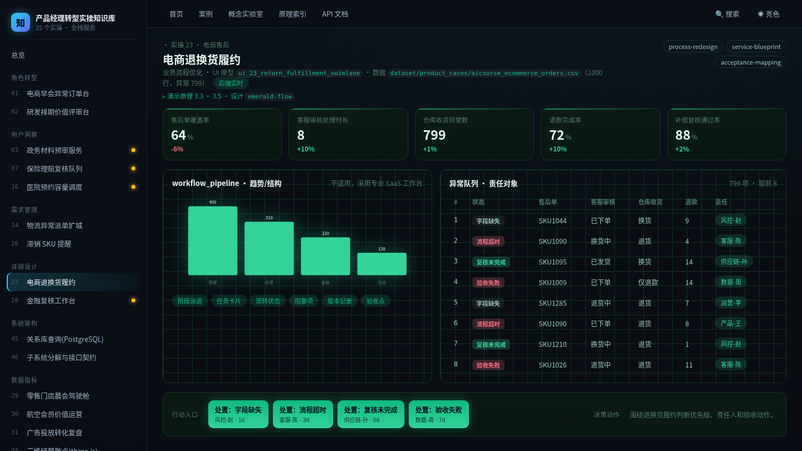

- 图形类型：return_fulfillment_swimlane（设计 emerald-flow）
- 看图顺序：先看指标链，再看异常队列和责任对象，最后看行动入口与验收边界。
- UI 差异：本案例采用 `ui_23_return_fulfillment_swimlane` + 设计 `emerald-flow`，不得复用通用表格占位；可运行原型见 `#/case/23`。

### 交付物与验收

- 交付物：现状/优化流程图
- 必含字段：售后单、客服审核、仓库收货、退款、补偿、超时原因
- 必含指标链：售后单覆盖率、客服审核处理时长、仓库收货异常数、退款完成率、补偿复核通过率
- 必含异常状态：字段缺失、流程超时、复核未完成、验收失败
- 必含 Skill：process-redesign、service-blueprint、acceptance-mapping

- 合格标准：业务场景具体、指标链完整、异常状态可追踪、行动入口明确、验收条件可执行。
- 不合格标准：使用泛化产品名称、缺少行业指标、只描述页面不说明业务取舍、越过「不得只增加按钮而不重构流程」。
- 交付物文件：`outputs/product_case_library/case_23_return_fulfillment_swimlane_问题定义.md`、`…_方案验收.md`。


**指定实操融合**

- RP09：核心功能流程图、状态图与用户测试
  - 产出：Mermaid 流程图, Mermaid 状态图, 用户测试提纲
  - 验收：流程图、状态图必须对应同一核心功能，用户测试问题不少于 5 条。


**跑通与纠错**：`npm run build` 通过后 `npm run preview` 访问 `#/case/23`；遵 rules/ 约束（单文件<800行、DRY、TS、中文注释）；`verify_course_package.mjs` 逐项核验字段/指标/Skill/截图/设计。


---

## 实操 26：PRD 片段｜滞销 SKU 提醒

> **本案例演示/验证**：原理 3.4、4.1｜**采用设计** `cyan-matrix`（见 design/cyan-matrix.md）

### 项目场景故事

电商运营场景中，运营产品经理围绕滞销提醒页面做日常判断。运营产品经理需要围绕“滞销提醒页面”完成“把一句话需求写成 PRD 片段”，并把结果转成可验证的产品交付物。核心不是把页面做出来，而是把指标、异常、责任和行动连成闭环。

**现状问题**

- 决策依赖的关键指标：SKU覆盖率、品类处理时长、销量异常数、库存完成率、阈值复核通过率。
- 现场常见异常：字段缺失、流程超时、复核未完成、验收失败。
- 只做通用页面无法支撑「围绕滞销提醒页面判断优先级、责任人和验收动作。」。

**本次任务**

- 明确岗位、指标链、异常状态与决策动作。
- 使用 `prd-fragment` 与 `acceptance-criteria` 完成分析，产出 `PRD 片段`，用 `field-validation` 验收。

### 任务目标与数据

- 行业：电商运营
- 真实业务场景：滞销 SKU 提醒
- 岗位：运营产品经理
- 数据或资料：`dataset/sku.csv`（300 行，异常 171）
- 公开参考：https://www.atlassian.com/software/confluence/templates/product-requirements
- 行业字段：SKU、品类、销量、库存、阈值、提醒状态
- 指标链（真实值）：SKU覆盖率 63%，品类处理时长 0，销量异常数 171，库存完成率 34%，阈值复核通过率 57%
- 决策动作：围绕滞销提醒页面判断优先级、责任人和验收动作。
- 风险边界：不得使用数据集中不存在的字段
- UI 原型：`ui_26_sku_prd_fields`（configuration）
- 采用设计：cyan-matrix
- SaaS 组件：规则表单、参数分组、预览区、成本/风险提示、发布记录、回滚入口

### Prompt 实操

**Prompt 1：滞销 SKU 提醒 - 问题定义**

```text
请以产品经理身份，用 AI 编程工具（如 Trae、CodeBuddy 等任一 Agent 工具）完成「滞销 SKU 提醒」的产品问题定义，并产出可运行原型：
- 场景与岗位：运营产品经理 面向「滞销 SKU 提醒」，把判断转成可验证的产品交付物；核心是把指标→异常→责任→行动连成闭环。
- 数据：读取 `dataset/sku.csv`，只使用数据/资料中存在的字段（SKU、品类、销量、库存、阈值、提醒状态）。
- 指标链：SKU覆盖率、品类处理时长、销量异常数、库存完成率、阈值复核通过率（当前真实值：SKU覆盖率=63%，品类处理时长=0，销量异常数=171，库存完成率=34%，阈值复核通过率=57%）。
- 异常状态：字段缺失、流程超时、复核未完成、验收失败。
- 使用 Skill：prd-fragment、acceptance-criteria，并用 field-validation 做验收（结构化 Skill 见 skills/pm_skills.md）。
- 原型（技术契约，遵 rules/ 约束：DRY、单文件<800行、TS 类型、中文注释）：在 `coderef/react_pm_cases`（Vite+React+TS）路由 `#/case/26`，按 `ui_26_sku_prd_fields`（configuration）与设计 `cyan-matrix` 渲染；数据经 `build_case_data.mjs` 预计算，页面必须体现指标链、异常队列、责任对象与行动入口，不得复用通用表格占位。
- 输出：PRD 片段，保存为 `outputs/product_case_library/case_26_sku_prd_fields_问题定义.md`。
- 验收条件：结论回到数据或公开参考（https://www.atlassian.com/software/confluence/templates/product-requirements）；不得越过「不得使用数据集中不存在的字段」；`node coderef/verify_course_package.mjs` 必须 ALL GREEN。
```

**Prompt 2：滞销 SKU 提醒 - 方案验收**

```text
请以产品经理身份，用 AI 编程工具（如 Trae、CodeBuddy 等任一 Agent 工具）完成「滞销 SKU 提醒」的方案验收，并产出可运行原型：
- 场景与岗位：运营产品经理 面向「滞销 SKU 提醒」，把判断转成可验证的产品交付物；核心是把指标→异常→责任→行动连成闭环。
- 数据：读取 `dataset/sku.csv`，只使用数据/资料中存在的字段（SKU、品类、销量、库存、阈值、提醒状态）。
- 指标链：SKU覆盖率、品类处理时长、销量异常数、库存完成率、阈值复核通过率（当前真实值：SKU覆盖率=63%，品类处理时长=0，销量异常数=171，库存完成率=34%，阈值复核通过率=57%）。
- 异常状态：字段缺失、流程超时、复核未完成、验收失败。
- 使用 Skill：prd-fragment、acceptance-criteria，并用 field-validation 做验收（结构化 Skill 见 skills/pm_skills.md）。
- 原型（技术契约，遵 rules/ 约束：DRY、单文件<800行、TS 类型、中文注释）：在 `coderef/react_pm_cases`（Vite+React+TS）路由 `#/case/26`，按 `ui_26_sku_prd_fields`（configuration）与设计 `cyan-matrix` 渲染；数据经 `build_case_data.mjs` 预计算，页面必须体现指标链、异常队列、责任对象与行动入口，不得复用通用表格占位。
- 输出：PRD 片段，保存为 `outputs/product_case_library/case_26_sku_prd_fields_方案验收.md`。
- 验收条件：结论回到数据或公开参考（https://www.atlassian.com/software/confluence/templates/product-requirements）；不得越过「不得使用数据集中不存在的字段」；`node coderef/verify_course_package.mjs` 必须 ALL GREEN。
```

### 图形/原型/表单



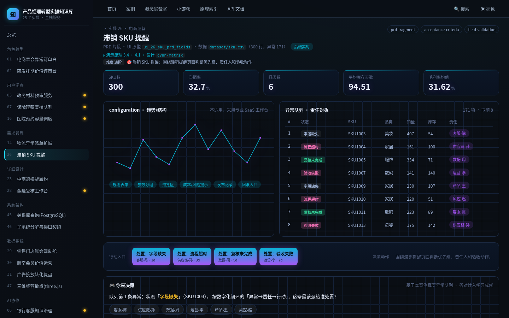

- 图形类型：sku_prd_fields（设计 cyan-matrix）
- 看图顺序：先看指标链，再看异常队列和责任对象，最后看行动入口与验收边界。
- UI 差异：本案例采用 `ui_26_sku_prd_fields` + 设计 `cyan-matrix`，不得复用通用表格占位；可运行原型见 `#/case/26`。

### 交付物与验收

- 交付物：PRD 片段
- 必含字段：SKU、品类、销量、库存、阈值、提醒状态
- 必含指标链：SKU覆盖率、品类处理时长、销量异常数、库存完成率、阈值复核通过率
- 必含异常状态：字段缺失、流程超时、复核未完成、验收失败
- 必含 Skill：prd-fragment、acceptance-criteria、field-validation

- 合格标准：业务场景具体、指标链完整、异常状态可追踪、行动入口明确、验收条件可执行。
- 不合格标准：使用泛化产品名称、缺少行业指标、只描述页面不说明业务取舍、越过「不得使用数据集中不存在的字段」。
- 交付物文件：`outputs/product_case_library/case_26_sku_prd_fields_问题定义.md`、`…_方案验收.md`。


**指定实操融合**

- RP05：一句话需求拆成 PRD 片段
  - 产出：需求拆解表, 服务蓝图, 关键页面, 验收规则, PRD 片段
  - 验收：PRD 片段必须包含功能名、需求描述、页面设计、用户旅程、用户故事、实现逻辑和功能细节。


**跑通与纠错**：`npm run build` 通过后 `npm run preview` 访问 `#/case/26`；遵 rules/ 约束（单文件<800行、DRY、TS、中文注释）；`verify_course_package.mjs` 逐项核验字段/指标/Skill/截图/设计。


---

## 实操 28：权限与风控规则｜金融复核工作台

> **本案例演示/验证**：原理 3.3、3.5｜**采用设计** `cyan-matrix`（见 design/cyan-matrix.md）

### 项目场景故事

金融风控场景中，风控产品经理围绕金融交易复核做日常判断。风控产品经理需要围绕“金融交易复核”完成“设计人工复核与权限边界”，并把结果转成可验证的产品交付物。核心不是把页面做出来，而是把指标、异常、责任和行动连成闭环。

**现状问题**

- 决策依赖的关键指标：高风险交易占比、人工复核完成率、规则命中准确率、误报率、升级处理时长。
- 现场常见异常：高风险待复核、证据不足、权限越界、超时未处理。
- 只做通用页面无法支撑「识别现金流缺口、逾期应收和预算偏差，形成复核与催收动作。」。

**本次任务**

- 明确岗位、指标链、异常状态与决策动作。
- 使用 `risk-rule-design` 与 `human-review` 完成分析，产出 `权限矩阵与风控规则`，用 `compliance-boundary` 验收。

### 任务目标与数据

- 行业：金融风控
- 真实业务场景：金融复核工作台
- 岗位：风控产品经理
- 数据或资料：`dataset/reference_data_analysis/28-creditcardfraud_sample.csv`（600 行，异常 50）
- 公开参考：https://archive.ics.uci.edu/dataset/222/bank+marketing
- 行业字段：交易号、账户信号、风险等级、命中规则、证据摘要、复核权限、复核结论、留痕
- 指标链（真实值）：高风险交易占比 8%，人工复核完成率 7%，规则命中准确率 9%，误报率 7%，升级处理时长 0
- 决策动作：识别现金流缺口、逾期应收和预算偏差，形成复核与催收动作。
- 风险边界：不得自动处罚、不得自动授信、不得自动拒绝交易（高影响行业·人工复核）
- UI 原型：`ui_28_finance_review_queue`（finance_cashflow_screen）
- 采用设计：cyan-matrix
- SaaS 组件：收入利润、成本费用、现金流、应收账款、预算执行、经营质量

### Prompt 实操

**Prompt 1：金融复核工作台 - 问题定义**

```text
请以产品经理身份，用 AI 编程工具（如 Trae、CodeBuddy 等任一 Agent 工具）完成「金融复核工作台」的产品问题定义，并产出可运行原型：
- 场景与岗位：风控产品经理 面向「金融复核工作台」，把判断转成可验证的产品交付物；核心是把指标→异常→责任→行动连成闭环。
- 数据：读取 `dataset/reference_data_analysis/28-creditcardfraud_sample.csv`，只使用数据/资料中存在的字段（交易号、账户信号、风险等级、命中规则、证据摘要、复核权限、复核结论、留痕）。
- 指标链：高风险交易占比、人工复核完成率、规则命中准确率、误报率、升级处理时长（当前真实值：高风险交易占比=8%，人工复核完成率=7%，规则命中准确率=9%，误报率=7%，升级处理时长=0）。
- 异常状态：高风险待复核、证据不足、权限越界、超时未处理。
- 使用 Skill：risk-rule-design、human-review，并用 compliance-boundary 做验收（结构化 Skill 见 skills/pm_skills.md）。
- 原型（技术契约，遵 rules/ 约束：DRY、单文件<800行、TS 类型、中文注释）：在 `coderef/react_pm_cases`（Vite+React+TS）路由 `#/case/28`，按 `ui_28_finance_review_queue`（finance_cashflow_screen）与设计 `cyan-matrix` 渲染；数据经 `build_case_data.mjs` 预计算，页面必须体现指标链、异常队列、责任对象与行动入口，不得复用通用表格占位。
- 输出：权限矩阵与风控规则，保存为 `outputs/product_case_library/case_28_finance_review_queue_问题定义.md`。
- 验收条件：结论回到数据或公开参考（https://archive.ics.uci.edu/dataset/222/bank+marketing）；不得越过「不得自动处罚、不得自动授信、不得自动拒绝交易」；高影响行业保留人工复核；`node coderef/verify_course_package.mjs` 必须 ALL GREEN。
```

**Prompt 2：金融复核工作台 - 方案验收**

```text
请以产品经理身份，用 AI 编程工具（如 Trae、CodeBuddy 等任一 Agent 工具）完成「金融复核工作台」的方案验收，并产出可运行原型：
- 场景与岗位：风控产品经理 面向「金融复核工作台」，把判断转成可验证的产品交付物；核心是把指标→异常→责任→行动连成闭环。
- 数据：读取 `dataset/reference_data_analysis/28-creditcardfraud_sample.csv`，只使用数据/资料中存在的字段（交易号、账户信号、风险等级、命中规则、证据摘要、复核权限、复核结论、留痕）。
- 指标链：高风险交易占比、人工复核完成率、规则命中准确率、误报率、升级处理时长（当前真实值：高风险交易占比=8%，人工复核完成率=7%，规则命中准确率=9%，误报率=7%，升级处理时长=0）。
- 异常状态：高风险待复核、证据不足、权限越界、超时未处理。
- 使用 Skill：risk-rule-design、human-review，并用 compliance-boundary 做验收（结构化 Skill 见 skills/pm_skills.md）。
- 原型（技术契约，遵 rules/ 约束：DRY、单文件<800行、TS 类型、中文注释）：在 `coderef/react_pm_cases`（Vite+React+TS）路由 `#/case/28`，按 `ui_28_finance_review_queue`（finance_cashflow_screen）与设计 `cyan-matrix` 渲染；数据经 `build_case_data.mjs` 预计算，页面必须体现指标链、异常队列、责任对象与行动入口，不得复用通用表格占位。
- 输出：权限矩阵与风控规则，保存为 `outputs/product_case_library/case_28_finance_review_queue_方案验收.md`。
- 验收条件：结论回到数据或公开参考（https://archive.ics.uci.edu/dataset/222/bank+marketing）；不得越过「不得自动处罚、不得自动授信、不得自动拒绝交易」；高影响行业保留人工复核；`node coderef/verify_course_package.mjs` 必须 ALL GREEN。
```

### 图形/原型/表单



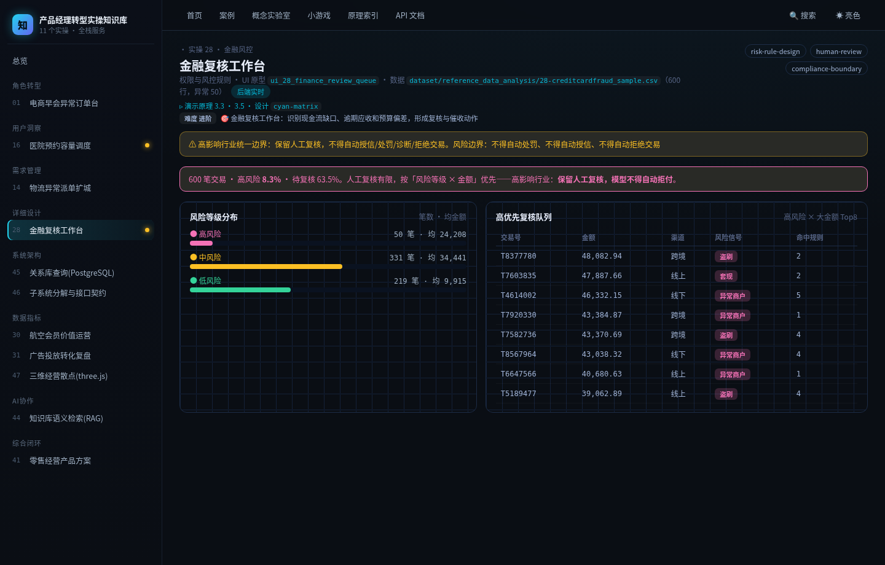

- 图形类型：finance_review_queue（设计 cyan-matrix）
- 看图顺序：先看指标链，再看异常队列和责任对象，最后看行动入口与验收边界。
- UI 差异：本案例采用 `ui_28_finance_review_queue` + 设计 `cyan-matrix`，不得复用通用表格占位；可运行原型见 `#/case/28`。

### 交付物与验收

- 交付物：权限矩阵与风控规则
- 必含字段：交易号、账户信号、风险等级、命中规则、证据摘要、复核权限、复核结论、留痕
- 必含指标链：高风险交易占比、人工复核完成率、规则命中准确率、误报率、升级处理时长
- 必含异常状态：高风险待复核、证据不足、权限越界、超时未处理
- 必含 Skill：risk-rule-design、human-review、compliance-boundary

- 合格标准：业务场景具体、指标链完整、异常状态可追踪、行动入口明确、验收条件可执行。
- 不合格标准：使用泛化产品名称、缺少行业指标、只描述页面不说明业务取舍、越过「不得自动处罚、不得自动授信、不得自动拒绝交易」。
- 交付物文件：`outputs/product_case_library/case_28_finance_review_queue_问题定义.md`、`…_方案验收.md`。


**跑通与纠错**：`npm run build` 通过后 `npm run preview` 访问 `#/case/28`；遵 rules/ 约束（单文件<800行、DRY、TS、中文注释）；`verify_course_package.mjs` 逐项核验字段/指标/Skill/截图/设计。


---

## 实操 29：经营分析助手｜零售门店晨会驾驶舱

> **本案例演示/验证**：原理 3.2、4.3｜**采用设计** `graphite-hud`（见 design/graphite-hud.md）

### 项目场景故事

零售门店场景中，门店运营主管围绕门店晨会经营信号做日常判断。门店运营主管需要围绕“门店晨会经营信号”完成“3 分钟内完成异常识别和责任分派”，并把结果转成可验证的产品交付物。核心不是把页面做出来，而是把指标、异常、责任和行动连成闭环。

**现状问题**

- 决策依赖的关键指标：经营目标达成率、销售额同比、区域贡献、异常订单数、责任部门闭环率。
- 现场常见异常：目标未达成、区域下滑、异常订单、责任未闭环。
- 只做通用页面无法支撑「识别未达成区域、定位异常业务线，并生成责任部门行动队列。」。

**本次任务**

- 明确岗位、指标链、异常状态与决策动作。
- 使用 `dashboard-requirement` 与 `kpi-tree` 完成分析，产出 `经营分析指标卡`，用 `action-summary` 验收。

### 任务目标与数据

- 行业：零售门店
- 真实业务场景：零售门店晨会驾驶舱
- 岗位：门店运营主管
- 数据或资料：`dataset/order_data.csv`（1200 行，异常 225）
- 公开参考：https://archive.ics.uci.edu/dataset/352/online+retail
- 行业字段：门店、SKU、销售额、毛利率、异常、责任人
- 指标链（真实值）：经营目标达成率 21%，销售额同比 16630819，区域贡献 1140，异常订单数 225，责任部门闭环率 21%
- 决策动作：识别未达成区域、定位异常业务线，并生成责任部门行动队列。
- 风险边界：不得只展示指标，不给出行动入口
- UI 原型：`ui_29_retail_morning_dashboard`（executive_dashboard）
- 采用设计：graphite-hud
- SaaS 组件：目标达成、收入趋势、业务结构、区域排行、异常告警、行动队列

### Prompt 实操

**Prompt 1：零售门店晨会驾驶舱 - 问题定义**

```text
请以产品经理身份，用 AI 编程工具（如 Trae、CodeBuddy 等任一 Agent 工具）完成「零售门店晨会驾驶舱」的产品问题定义，并产出可运行原型：
- 场景与岗位：门店运营主管 面向「零售门店晨会驾驶舱」，把判断转成可验证的产品交付物；核心是把指标→异常→责任→行动连成闭环。
- 数据：读取 `dataset/order_data.csv`，只使用数据/资料中存在的字段（门店、SKU、销售额、毛利率、异常、责任人）。
- 指标链：经营目标达成率、销售额同比、区域贡献、异常订单数、责任部门闭环率（当前真实值：经营目标达成率=21%，销售额同比=16630819，区域贡献=1140，异常订单数=225，责任部门闭环率=21%）。
- 异常状态：目标未达成、区域下滑、异常订单、责任未闭环。
- 使用 Skill：dashboard-requirement、kpi-tree，并用 action-summary 做验收（结构化 Skill 见 skills/pm_skills.md）。
- 原型（技术契约，遵 rules/ 约束：DRY、单文件<800行、TS 类型、中文注释）：在 `coderef/react_pm_cases`（Vite+React+TS）路由 `#/case/29`，按 `ui_29_retail_morning_dashboard`（executive_dashboard）与设计 `graphite-hud` 渲染；数据经 `build_case_data.mjs` 预计算，页面必须体现指标链、异常队列、责任对象与行动入口，不得复用通用表格占位。
- 输出：经营分析指标卡，保存为 `outputs/product_case_library/case_29_retail_morning_dashboard_问题定义.md`。
- 验收条件：结论回到数据或公开参考（https://archive.ics.uci.edu/dataset/352/online+retail）；不得越过「不得只展示指标，不给出行动入口」；`node coderef/verify_course_package.mjs` 必须 ALL GREEN。
```

**Prompt 2：零售门店晨会驾驶舱 - 方案验收**

```text
请以产品经理身份，用 AI 编程工具（如 Trae、CodeBuddy 等任一 Agent 工具）完成「零售门店晨会驾驶舱」的方案验收，并产出可运行原型：
- 场景与岗位：门店运营主管 面向「零售门店晨会驾驶舱」，把判断转成可验证的产品交付物；核心是把指标→异常→责任→行动连成闭环。
- 数据：读取 `dataset/order_data.csv`，只使用数据/资料中存在的字段（门店、SKU、销售额、毛利率、异常、责任人）。
- 指标链：经营目标达成率、销售额同比、区域贡献、异常订单数、责任部门闭环率（当前真实值：经营目标达成率=21%，销售额同比=16630819，区域贡献=1140，异常订单数=225，责任部门闭环率=21%）。
- 异常状态：目标未达成、区域下滑、异常订单、责任未闭环。
- 使用 Skill：dashboard-requirement、kpi-tree，并用 action-summary 做验收（结构化 Skill 见 skills/pm_skills.md）。
- 原型（技术契约，遵 rules/ 约束：DRY、单文件<800行、TS 类型、中文注释）：在 `coderef/react_pm_cases`（Vite+React+TS）路由 `#/case/29`，按 `ui_29_retail_morning_dashboard`（executive_dashboard）与设计 `graphite-hud` 渲染；数据经 `build_case_data.mjs` 预计算，页面必须体现指标链、异常队列、责任对象与行动入口，不得复用通用表格占位。
- 输出：经营分析指标卡，保存为 `outputs/product_case_library/case_29_retail_morning_dashboard_方案验收.md`。
- 验收条件：结论回到数据或公开参考（https://archive.ics.uci.edu/dataset/352/online+retail）；不得越过「不得只展示指标，不给出行动入口」；`node coderef/verify_course_package.mjs` 必须 ALL GREEN。
```

### 图形/原型/表单



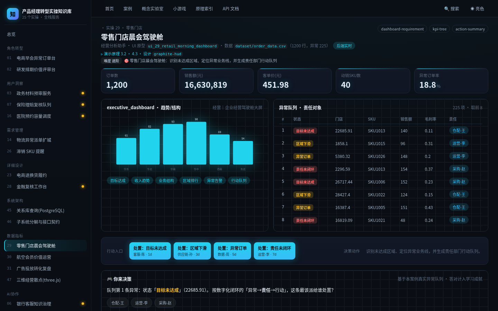

- 图形类型：retail_morning_dashboard（设计 graphite-hud）
- 看图顺序：先看指标链，再看异常队列和责任对象，最后看行动入口与验收边界。
- UI 差异：本案例采用 `ui_29_retail_morning_dashboard` + 设计 `graphite-hud`，不得复用通用表格占位；可运行原型见 `#/case/29`。

### 交付物与验收

- 交付物：经营分析指标卡
- 必含字段：门店、SKU、销售额、毛利率、异常、责任人
- 必含指标链：经营目标达成率、销售额同比、区域贡献、异常订单数、责任部门闭环率
- 必含异常状态：目标未达成、区域下滑、异常订单、责任未闭环
- 必含 Skill：dashboard-requirement、kpi-tree、action-summary

- 合格标准：业务场景具体、指标链完整、异常状态可追踪、行动入口明确、验收条件可执行。
- 不合格标准：使用泛化产品名称、缺少行业指标、只描述页面不说明业务取舍、越过「不得只展示指标，不给出行动入口」。
- 交付物文件：`outputs/product_case_library/case_29_retail_morning_dashboard_问题定义.md`、`…_方案验收.md`。


**跑通与纠错**：`npm run build` 通过后 `npm run preview` 访问 `#/case/29`；遵 rules/ 约束（单文件<800行、DRY、TS、中文注释）；`verify_course_package.mjs` 逐项核验字段/指标/Skill/截图/设计。


---

## 实操 30：RFM 客户分层｜航空会员价值运营

> **本案例演示/验证**：原理 3.2、4.3｜**采用设计** `amber-funnel`（见 design/amber-funnel.md）

### 项目场景故事

航空会员场景中，会员产品经理围绕航空会员价值做日常判断。会员产品经理需要围绕“航空会员价值”完成“用分层指导差异化运营”，并把结果转成可验证的产品交付物。核心不是把页面做出来，而是把指标、异常、责任和行动连成闭环。

**现状问题**

- 决策依赖的关键指标：线索数、商机转化率、合同金额、回款率、客户跟进超时数。
- 现场常见异常：转化率下滑、回款逾期、客户跟进超时、区域掉队。
- 只做通用页面无法支撑「判断漏斗断点、回款风险和区域销售动作优先级。」。

**本次任务**

- 明确岗位、指标链、异常状态与决策动作。
- 使用 `rfm-segmentation` 与 `lifecycle-action` 完成分析，产出 `RFM 分层运营策略`，用 `privacy-boundary` 验收。

### 任务目标与数据

- 行业：航空会员
- 真实业务场景：航空会员价值运营
- 岗位：会员产品经理
- 数据或资料：`dataset/reference_data_analysis/2-air_data.csv`（800 行，异常 10）
- 公开参考：https://archive.ics.uci.edu/dataset/352/online+retail
- 行业字段：会员号、最近飞行、飞行频次、里程、客舱、运营动作
- 指标链（真实值）：线索数 800，商机转化率 1%，合同金额 80135293，回款率 1%，客户跟进超时数 800
- 决策动作：判断漏斗断点、回款风险和区域销售动作优先级。
- 风险边界：不得输出歧视性或不可解释规则
- UI 原型：`ui_30_airline_member_rfm`（sales_funnel_screen）
- 采用设计：amber-funnel
- SaaS 组件：销售漏斗、目标进度、客户跟进、回款风险、区域作战、销售排行

### Prompt 实操

**Prompt 1：航空会员价值运营 - 问题定义**

```text
请以产品经理身份，用 AI 编程工具（如 Trae、CodeBuddy 等任一 Agent 工具）完成「航空会员价值运营」的产品问题定义，并产出可运行原型：
- 场景与岗位：会员产品经理 面向「航空会员价值运营」，把判断转成可验证的产品交付物；核心是把指标→异常→责任→行动连成闭环。
- 数据：读取 `dataset/reference_data_analysis/2-air_data.csv`，只使用数据/资料中存在的字段（会员号、最近飞行、飞行频次、里程、客舱、运营动作）。
- 指标链：线索数、商机转化率、合同金额、回款率、客户跟进超时数（当前真实值：线索数=800，商机转化率=1%，合同金额=80135293，回款率=1%，客户跟进超时数=800）。
- 异常状态：转化率下滑、回款逾期、客户跟进超时、区域掉队。
- 使用 Skill：rfm-segmentation、lifecycle-action，并用 privacy-boundary 做验收（结构化 Skill 见 skills/pm_skills.md）。
- 原型（技术契约，遵 rules/ 约束：DRY、单文件<800行、TS 类型、中文注释）：在 `coderef/react_pm_cases`（Vite+React+TS）路由 `#/case/30`，按 `ui_30_airline_member_rfm`（sales_funnel_screen）与设计 `amber-funnel` 渲染；数据经 `build_case_data.mjs` 预计算，页面必须体现指标链、异常队列、责任对象与行动入口，不得复用通用表格占位。
- 输出：RFM 分层运营策略，保存为 `outputs/product_case_library/case_30_airline_member_rfm_问题定义.md`。
- 验收条件：结论回到数据或公开参考（https://archive.ics.uci.edu/dataset/352/online+retail）；不得越过「不得输出歧视性或不可解释规则」；`node coderef/verify_course_package.mjs` 必须 ALL GREEN。
```

**Prompt 2：航空会员价值运营 - 方案验收**

```text
请以产品经理身份，用 AI 编程工具（如 Trae、CodeBuddy 等任一 Agent 工具）完成「航空会员价值运营」的方案验收，并产出可运行原型：
- 场景与岗位：会员产品经理 面向「航空会员价值运营」，把判断转成可验证的产品交付物；核心是把指标→异常→责任→行动连成闭环。
- 数据：读取 `dataset/reference_data_analysis/2-air_data.csv`，只使用数据/资料中存在的字段（会员号、最近飞行、飞行频次、里程、客舱、运营动作）。
- 指标链：线索数、商机转化率、合同金额、回款率、客户跟进超时数（当前真实值：线索数=800，商机转化率=1%，合同金额=80135293，回款率=1%，客户跟进超时数=800）。
- 异常状态：转化率下滑、回款逾期、客户跟进超时、区域掉队。
- 使用 Skill：rfm-segmentation、lifecycle-action，并用 privacy-boundary 做验收（结构化 Skill 见 skills/pm_skills.md）。
- 原型（技术契约，遵 rules/ 约束：DRY、单文件<800行、TS 类型、中文注释）：在 `coderef/react_pm_cases`（Vite+React+TS）路由 `#/case/30`，按 `ui_30_airline_member_rfm`（sales_funnel_screen）与设计 `amber-funnel` 渲染；数据经 `build_case_data.mjs` 预计算，页面必须体现指标链、异常队列、责任对象与行动入口，不得复用通用表格占位。
- 输出：RFM 分层运营策略，保存为 `outputs/product_case_library/case_30_airline_member_rfm_方案验收.md`。
- 验收条件：结论回到数据或公开参考（https://archive.ics.uci.edu/dataset/352/online+retail）；不得越过「不得输出歧视性或不可解释规则」；`node coderef/verify_course_package.mjs` 必须 ALL GREEN。
```

### 图形/原型/表单



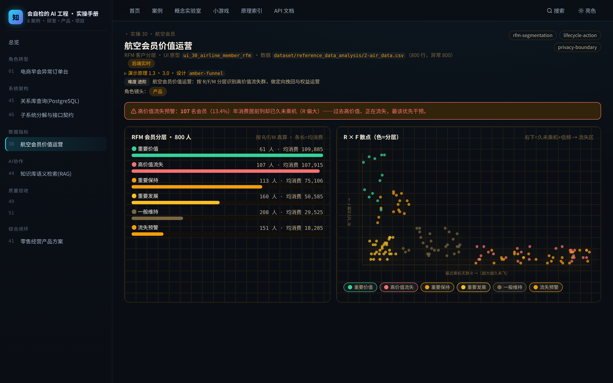

- 图形类型：airline_member_rfm（设计 amber-funnel）
- 看图顺序：先看指标链，再看异常队列和责任对象，最后看行动入口与验收边界。
- UI 差异：本案例采用 `ui_30_airline_member_rfm` + 设计 `amber-funnel`，不得复用通用表格占位；可运行原型见 `#/case/30`。

### 交付物与验收

- 交付物：RFM 分层运营策略
- 必含字段：会员号、最近飞行、飞行频次、里程、客舱、运营动作
- 必含指标链：线索数、商机转化率、合同金额、回款率、客户跟进超时数
- 必含异常状态：转化率下滑、回款逾期、客户跟进超时、区域掉队
- 必含 Skill：rfm-segmentation、lifecycle-action、privacy-boundary

- 合格标准：业务场景具体、指标链完整、异常状态可追踪、行动入口明确、验收条件可执行。
- 不合格标准：使用泛化产品名称、缺少行业指标、只描述页面不说明业务取舍、越过「不得输出歧视性或不可解释规则」。
- 交付物文件：`outputs/product_case_library/case_30_airline_member_rfm_问题定义.md`、`…_方案验收.md`。


**指定实操融合**

- RP11：AI-Excel 数据分析转产品判断
  - 产出：指标分析表, 产品改进建议
  - 验收：RFM、趋势或异常检测结果必须转化为明确产品判断，不能停留在图表描述。


**跑通与纠错**：`npm run build` 通过后 `npm run preview` 访问 `#/case/30`；遵 rules/ 约束（单文件<800行、DRY、TS、中文注释）；`verify_course_package.mjs` 逐项核验字段/指标/Skill/截图/设计。


---

## 实操 31：漏斗分析｜广告投放转化复盘

> **本案例演示/验证**：原理 3.2、4.3｜**采用设计** `amber-funnel`（见 design/amber-funnel.md）

### 项目场景故事

广告投放场景中，投放产品经理围绕广告转化漏斗做日常判断。投放产品经理需要围绕“广告转化漏斗”完成“判断预算加码、缩减或观察”，并把结果转成可验证的产品交付物。核心不是把页面做出来，而是把指标、异常、责任和行动连成闭环。

**现状问题**

- 决策依赖的关键指标：线索数、商机转化率、合同金额、回款率、客户跟进超时数。
- 现场常见异常：转化率下滑、回款逾期、客户跟进超时、区域掉队。
- 只做通用页面无法支撑「判断漏斗断点、回款风险和区域销售动作优先级。」。

**本次任务**

- 明确岗位、指标链、异常状态与决策动作。
- 使用 `funnel-analysis` 与 `budget-decision` 完成分析，产出 `漏斗与预算建议`，用 `metric-definition` 验收。

### 任务目标与数据

- 行业：广告投放
- 真实业务场景：广告投放转化复盘
- 岗位：投放产品经理
- 数据或资料：`dataset/reference_data_analysis/18-ad_performance.csv`（6 行，异常 6）
- 公开参考：https://carbondesignsystem.com/
- 行业字段：渠道、曝光、点击、注册、订单、预算
- 指标链（真实值）：线索数 6，商机转化率 99%，合同金额 119575，回款率 91%，客户跟进超时数 6
- 决策动作：判断漏斗断点、回款风险和区域销售动作优先级。
- 风险边界：不得只按点击率做预算决策
- UI 原型：`ui_31_ad_conversion_funnel`（sales_funnel_screen）
- 采用设计：amber-funnel
- SaaS 组件：销售漏斗、目标进度、客户跟进、回款风险、区域作战、销售排行

### Prompt 实操

**Prompt 1：广告投放转化复盘 - 问题定义**

```text
请以产品经理身份，用 AI 编程工具（如 Trae、CodeBuddy 等任一 Agent 工具）完成「广告投放转化复盘」的产品问题定义，并产出可运行原型：
- 场景与岗位：投放产品经理 面向「广告投放转化复盘」，把判断转成可验证的产品交付物；核心是把指标→异常→责任→行动连成闭环。
- 数据：读取 `dataset/reference_data_analysis/18-ad_performance.csv`，只使用数据/资料中存在的字段（渠道、曝光、点击、注册、订单、预算）。
- 指标链：线索数、商机转化率、合同金额、回款率、客户跟进超时数（当前真实值：线索数=6，商机转化率=99%，合同金额=119575，回款率=91%，客户跟进超时数=6）。
- 异常状态：转化率下滑、回款逾期、客户跟进超时、区域掉队。
- 使用 Skill：funnel-analysis、budget-decision，并用 metric-definition 做验收（结构化 Skill 见 skills/pm_skills.md）。
- 原型（技术契约，遵 rules/ 约束：DRY、单文件<800行、TS 类型、中文注释）：在 `coderef/react_pm_cases`（Vite+React+TS）路由 `#/case/31`，按 `ui_31_ad_conversion_funnel`（sales_funnel_screen）与设计 `amber-funnel` 渲染；数据经 `build_case_data.mjs` 预计算，页面必须体现指标链、异常队列、责任对象与行动入口，不得复用通用表格占位。
- 输出：漏斗与预算建议，保存为 `outputs/product_case_library/case_31_ad_conversion_funnel_问题定义.md`。
- 验收条件：结论回到数据或公开参考（https://carbondesignsystem.com/）；不得越过「不得只按点击率做预算决策」；`node coderef/verify_course_package.mjs` 必须 ALL GREEN。
```

**Prompt 2：广告投放转化复盘 - 方案验收**

```text
请以产品经理身份，用 AI 编程工具（如 Trae、CodeBuddy 等任一 Agent 工具）完成「广告投放转化复盘」的方案验收，并产出可运行原型：
- 场景与岗位：投放产品经理 面向「广告投放转化复盘」，把判断转成可验证的产品交付物；核心是把指标→异常→责任→行动连成闭环。
- 数据：读取 `dataset/reference_data_analysis/18-ad_performance.csv`，只使用数据/资料中存在的字段（渠道、曝光、点击、注册、订单、预算）。
- 指标链：线索数、商机转化率、合同金额、回款率、客户跟进超时数（当前真实值：线索数=6，商机转化率=99%，合同金额=119575，回款率=91%，客户跟进超时数=6）。
- 异常状态：转化率下滑、回款逾期、客户跟进超时、区域掉队。
- 使用 Skill：funnel-analysis、budget-decision，并用 metric-definition 做验收（结构化 Skill 见 skills/pm_skills.md）。
- 原型（技术契约，遵 rules/ 约束：DRY、单文件<800行、TS 类型、中文注释）：在 `coderef/react_pm_cases`（Vite+React+TS）路由 `#/case/31`，按 `ui_31_ad_conversion_funnel`（sales_funnel_screen）与设计 `amber-funnel` 渲染；数据经 `build_case_data.mjs` 预计算，页面必须体现指标链、异常队列、责任对象与行动入口，不得复用通用表格占位。
- 输出：漏斗与预算建议，保存为 `outputs/product_case_library/case_31_ad_conversion_funnel_方案验收.md`。
- 验收条件：结论回到数据或公开参考（https://carbondesignsystem.com/）；不得越过「不得只按点击率做预算决策」；`node coderef/verify_course_package.mjs` 必须 ALL GREEN。
```

### 图形/原型/表单



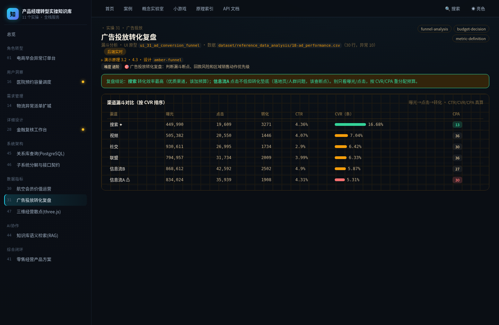

- 图形类型：ad_conversion_funnel（设计 amber-funnel）
- 看图顺序：先看指标链，再看异常队列和责任对象，最后看行动入口与验收边界。
- UI 差异：本案例采用 `ui_31_ad_conversion_funnel` + 设计 `amber-funnel`，不得复用通用表格占位；可运行原型见 `#/case/31`。

### 交付物与验收

- 交付物：漏斗与预算建议
- 必含字段：渠道、曝光、点击、注册、订单、预算
- 必含指标链：线索数、商机转化率、合同金额、回款率、客户跟进超时数
- 必含异常状态：转化率下滑、回款逾期、客户跟进超时、区域掉队
- 必含 Skill：funnel-analysis、budget-decision、metric-definition

- 合格标准：业务场景具体、指标链完整、异常状态可追踪、行动入口明确、验收条件可执行。
- 不合格标准：使用泛化产品名称、缺少行业指标、只描述页面不说明业务取舍、越过「不得只按点击率做预算决策」。
- 交付物文件：`outputs/product_case_library/case_31_ad_conversion_funnel_问题定义.md`、`…_方案验收.md`。


**跑通与纠错**：`npm run build` 通过后 `npm run preview` 访问 `#/case/31`；遵 rules/ 约束（单文件<800行、DRY、TS、中文注释）；`verify_course_package.mjs` 逐项核验字段/指标/Skill/截图/设计。


---

## 实操 35：Vibe Coding 原型｜零售经营驾驶舱

> **本案例演示/验证**：原理 2.3、4.3｜**采用设计** `steel-queue`（见 design/steel-queue.md）

### 项目场景故事

零售经营场景中，AI 产品经理围绕零售经营原型做日常判断。AI 产品经理需要围绕“零售经营原型”完成“用需求卡生成可评审页面”，并把结果转成可验证的产品交付物。核心不是把页面做出来，而是把指标、异常、责任和行动连成闭环。

**现状问题**

- 决策依赖的关键指标：需求卡覆盖率、页面目标处理时长、组件异常数、字段完成率、状态复核通过率。
- 现场常见异常：字段缺失、流程超时、复核未完成、验收失败。
- 只做通用页面无法支撑「围绕零售经营原型判断优先级、责任人和验收动作。」。

**本次任务**

- 明确岗位、指标链、异常状态与决策动作。
- 使用 `vibe-coding` 与 `ui-prompt-card` 完成分析，产出 `React 原型需求卡`，用 `prototype-test` 验收。

### 任务目标与数据

- 行业：零售经营
- 真实业务场景：零售经营驾驶舱
- 岗位：AI 产品经理
- 数据或资料：`dataset/order_data.csv`（1200 行，异常 225）
- 公开参考：https://github.com/arhamkhnz/next-shadcn-admin-dashboard
- 行业字段：需求卡、页面目标、组件、字段、状态、截图
- 指标链（真实值）：需求卡覆盖率 15%，页面目标处理时长 0，组件异常数 225，字段完成率 17%，状态复核通过率 21%
- 决策动作：围绕零售经营原型判断优先级、责任人和验收动作。
- 风险边界：不得用页面效果替代字段和验收
- UI 原型：`ui_35_retail_vibe_prototype`（record_detail）
- 采用设计：steel-queue
- SaaS 组件：记录详情、字段分组、证据列表、协作纪要、审计记录、操作栏

### Prompt 实操

**Prompt 1：零售经营驾驶舱 - 问题定义**

```text
请以产品经理身份，用 AI 编程工具（如 Trae、CodeBuddy 等任一 Agent 工具）完成「零售经营驾驶舱」的产品问题定义，并产出可运行原型：
- 场景与岗位：AI 产品经理 面向「零售经营驾驶舱」，把判断转成可验证的产品交付物；核心是把指标→异常→责任→行动连成闭环。
- 数据：读取 `dataset/order_data.csv`，只使用数据/资料中存在的字段（需求卡、页面目标、组件、字段、状态、截图）。
- 指标链：需求卡覆盖率、页面目标处理时长、组件异常数、字段完成率、状态复核通过率（当前真实值：需求卡覆盖率=15%，页面目标处理时长=0，组件异常数=225，字段完成率=17%，状态复核通过率=21%）。
- 异常状态：字段缺失、流程超时、复核未完成、验收失败。
- 使用 Skill：vibe-coding、ui-prompt-card，并用 prototype-test 做验收（结构化 Skill 见 skills/pm_skills.md）。
- 原型（技术契约，遵 rules/ 约束：DRY、单文件<800行、TS 类型、中文注释）：在 `coderef/react_pm_cases`（Vite+React+TS）路由 `#/case/35`，按 `ui_35_retail_vibe_prototype`（record_detail）与设计 `steel-queue` 渲染；数据经 `build_case_data.mjs` 预计算，页面必须体现指标链、异常队列、责任对象与行动入口，不得复用通用表格占位。
- 输出：React 原型需求卡，保存为 `outputs/product_case_library/case_35_retail_vibe_prototype_问题定义.md`。
- 验收条件：结论回到数据或公开参考（https://github.com/arhamkhnz/next-shadcn-admin-dashboard）；不得越过「不得用页面效果替代字段和验收」；`node coderef/verify_course_package.mjs` 必须 ALL GREEN。
```

**Prompt 2：零售经营驾驶舱 - 方案验收**

```text
请以产品经理身份，用 AI 编程工具（如 Trae、CodeBuddy 等任一 Agent 工具）完成「零售经营驾驶舱」的方案验收，并产出可运行原型：
- 场景与岗位：AI 产品经理 面向「零售经营驾驶舱」，把判断转成可验证的产品交付物；核心是把指标→异常→责任→行动连成闭环。
- 数据：读取 `dataset/order_data.csv`，只使用数据/资料中存在的字段（需求卡、页面目标、组件、字段、状态、截图）。
- 指标链：需求卡覆盖率、页面目标处理时长、组件异常数、字段完成率、状态复核通过率（当前真实值：需求卡覆盖率=15%，页面目标处理时长=0，组件异常数=225，字段完成率=17%，状态复核通过率=21%）。
- 异常状态：字段缺失、流程超时、复核未完成、验收失败。
- 使用 Skill：vibe-coding、ui-prompt-card，并用 prototype-test 做验收（结构化 Skill 见 skills/pm_skills.md）。
- 原型（技术契约，遵 rules/ 约束：DRY、单文件<800行、TS 类型、中文注释）：在 `coderef/react_pm_cases`（Vite+React+TS）路由 `#/case/35`，按 `ui_35_retail_vibe_prototype`（record_detail）与设计 `steel-queue` 渲染；数据经 `build_case_data.mjs` 预计算，页面必须体现指标链、异常队列、责任对象与行动入口，不得复用通用表格占位。
- 输出：React 原型需求卡，保存为 `outputs/product_case_library/case_35_retail_vibe_prototype_方案验收.md`。
- 验收条件：结论回到数据或公开参考（https://github.com/arhamkhnz/next-shadcn-admin-dashboard）；不得越过「不得用页面效果替代字段和验收」；`node coderef/verify_course_package.mjs` 必须 ALL GREEN。
```

### 图形/原型/表单



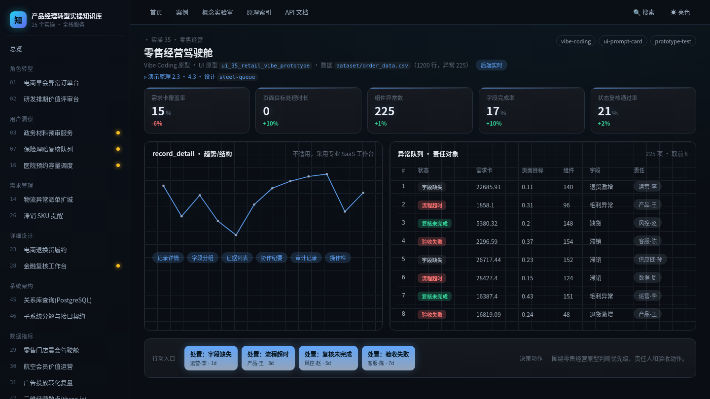

- 图形类型：retail_vibe_prototype（设计 steel-queue）
- 看图顺序：先看指标链，再看异常队列和责任对象，最后看行动入口与验收边界。
- UI 差异：本案例采用 `ui_35_retail_vibe_prototype` + 设计 `steel-queue`，不得复用通用表格占位；可运行原型见 `#/case/35`。

### 交付物与验收

- 交付物：React 原型需求卡
- 必含字段：需求卡、页面目标、组件、字段、状态、截图
- 必含指标链：需求卡覆盖率、页面目标处理时长、组件异常数、字段完成率、状态复核通过率
- 必含异常状态：字段缺失、流程超时、复核未完成、验收失败
- 必含 Skill：vibe-coding、ui-prompt-card、prototype-test

- 合格标准：业务场景具体、指标链完整、异常状态可追踪、行动入口明确、验收条件可执行。
- 不合格标准：使用泛化产品名称、缺少行业指标、只描述页面不说明业务取舍、越过「不得用页面效果替代字段和验收」。
- 交付物文件：`outputs/product_case_library/case_35_retail_vibe_prototype_问题定义.md`、`…_方案验收.md`。


**跑通与纠错**：`npm run build` 通过后 `npm run preview` 访问 `#/case/35`；遵 rules/ 约束（单文件<800行、DRY、TS、中文注释）；`verify_course_package.mjs` 逐项核验字段/指标/Skill/截图/设计。


---

## 实操 36：Harness Coding 验收｜原型字段核验

> **本案例演示/验证**：原理 2.3、4.3｜**采用设计** `cyan-matrix`（见 design/cyan-matrix.md）

### 项目场景故事

零售经营场景中，AI 产品经理围绕原型验收护栏做日常判断。AI 产品经理需要围绕“原型验收护栏”完成“验证原型是否满足业务目标”，并把结果转成可验证的产品交付物。核心不是把页面做出来，而是把指标、异常、责任和行动连成闭环。

**现状问题**

- 决策依赖的关键指标：字段覆盖率、数据来源处理时长、状态异常数、体验问题完成率、风险项复核通过率。
- 现场常见异常：字段缺失、流程超时、复核未完成、验收失败。
- 只做通用页面无法支撑「围绕原型验收护栏判断优先级、责任人和验收动作。」。

**本次任务**

- 明确岗位、指标链、异常状态与决策动作。
- 使用 `harness-builder` 与 `checker-report` 完成分析，产出 `Harness 验收清单`，用 `regression-guard` 验收。

### 任务目标与数据

- 行业：零售经营
- 真实业务场景：原型字段核验
- 岗位：AI 产品经理
- 数据或资料：`outputs/05_harness/prototype_test_report.json`（12 行，异常 8）
- 公开参考：https://github.com/walkinglabs/learn-harness-engineering
- 行业字段：字段、数据来源、状态、体验问题、风险项、修复优先级
- 指标链（真实值）：字段覆盖率 0.83%，数据来源处理时长 3，状态异常数 0.75，体验问题完成率 0.9%，风险项复核通过率 49%
- 决策动作：围绕原型验收护栏判断优先级、责任人和验收动作。
- 风险边界：不得降低检查项换取通过
- UI 原型：`ui_36_prototype_harness_board`（experiment_harness）
- 采用设计：cyan-matrix
- SaaS 组件：检查清单、测试数据、失败原因、修复优先级、报告导出、回归记录

### Prompt 实操

**Prompt 1：原型字段核验 - 问题定义**

```text
请以产品经理身份，用 AI 编程工具（如 Trae、CodeBuddy 等任一 Agent 工具）完成「原型字段核验」的产品问题定义，并产出可运行原型：
- 场景与岗位：AI 产品经理 面向「原型字段核验」，把判断转成可验证的产品交付物；核心是把指标→异常→责任→行动连成闭环。
- 数据：读取 `outputs/05_harness/prototype_test_report.json`，只使用数据/资料中存在的字段（字段、数据来源、状态、体验问题、风险项、修复优先级）。
- 指标链：字段覆盖率、数据来源处理时长、状态异常数、体验问题完成率、风险项复核通过率（当前真实值：字段覆盖率=0.83%，数据来源处理时长=3，状态异常数=0.75，体验问题完成率=0.9%，风险项复核通过率=49%）。
- 异常状态：字段缺失、流程超时、复核未完成、验收失败。
- 使用 Skill：harness-builder、checker-report，并用 regression-guard 做验收（结构化 Skill 见 skills/pm_skills.md）。
- 原型（技术契约，遵 rules/ 约束：DRY、单文件<800行、TS 类型、中文注释）：在 `coderef/react_pm_cases`（Vite+React+TS）路由 `#/case/36`，按 `ui_36_prototype_harness_board`（experiment_harness）与设计 `cyan-matrix` 渲染；数据经 `build_case_data.mjs` 预计算，页面必须体现指标链、异常队列、责任对象与行动入口，不得复用通用表格占位。
- 输出：Harness 验收清单，保存为 `outputs/product_case_library/case_36_prototype_harness_board_问题定义.md`。
- 验收条件：结论回到数据或公开参考（https://github.com/walkinglabs/learn-harness-engineering）；不得越过「不得降低检查项换取通过」；`node coderef/verify_course_package.mjs` 必须 ALL GREEN。
```

**Prompt 2：原型字段核验 - 方案验收**

```text
请以产品经理身份，用 AI 编程工具（如 Trae、CodeBuddy 等任一 Agent 工具）完成「原型字段核验」的方案验收，并产出可运行原型：
- 场景与岗位：AI 产品经理 面向「原型字段核验」，把判断转成可验证的产品交付物；核心是把指标→异常→责任→行动连成闭环。
- 数据：读取 `outputs/05_harness/prototype_test_report.json`，只使用数据/资料中存在的字段（字段、数据来源、状态、体验问题、风险项、修复优先级）。
- 指标链：字段覆盖率、数据来源处理时长、状态异常数、体验问题完成率、风险项复核通过率（当前真实值：字段覆盖率=0.83%，数据来源处理时长=3，状态异常数=0.75，体验问题完成率=0.9%，风险项复核通过率=49%）。
- 异常状态：字段缺失、流程超时、复核未完成、验收失败。
- 使用 Skill：harness-builder、checker-report，并用 regression-guard 做验收（结构化 Skill 见 skills/pm_skills.md）。
- 原型（技术契约，遵 rules/ 约束：DRY、单文件<800行、TS 类型、中文注释）：在 `coderef/react_pm_cases`（Vite+React+TS）路由 `#/case/36`，按 `ui_36_prototype_harness_board`（experiment_harness）与设计 `cyan-matrix` 渲染；数据经 `build_case_data.mjs` 预计算，页面必须体现指标链、异常队列、责任对象与行动入口，不得复用通用表格占位。
- 输出：Harness 验收清单，保存为 `outputs/product_case_library/case_36_prototype_harness_board_方案验收.md`。
- 验收条件：结论回到数据或公开参考（https://github.com/walkinglabs/learn-harness-engineering）；不得越过「不得降低检查项换取通过」；`node coderef/verify_course_package.mjs` 必须 ALL GREEN。
```

### 图形/原型/表单



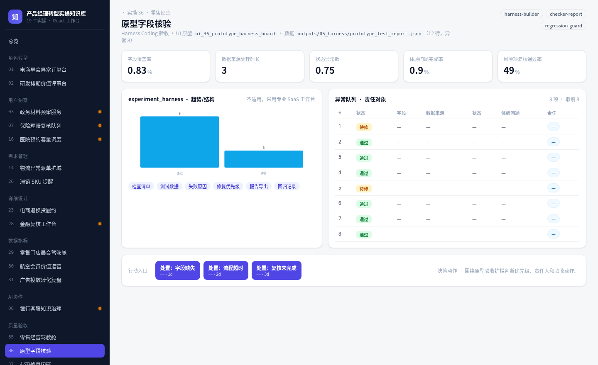

- 图形类型：prototype_harness_board（设计 cyan-matrix）
- 看图顺序：先看指标链，再看异常队列和责任对象，最后看行动入口与验收边界。
- UI 差异：本案例采用 `ui_36_prototype_harness_board` + 设计 `cyan-matrix`，不得复用通用表格占位；可运行原型见 `#/case/36`。

### 交付物与验收

- 交付物：Harness 验收清单
- 必含字段：字段、数据来源、状态、体验问题、风险项、修复优先级
- 必含指标链：字段覆盖率、数据来源处理时长、状态异常数、体验问题完成率、风险项复核通过率
- 必含异常状态：字段缺失、流程超时、复核未完成、验收失败
- 必含 Skill：harness-builder、checker-report、regression-guard

- 合格标准：业务场景具体、指标链完整、异常状态可追踪、行动入口明确、验收条件可执行。
- 不合格标准：使用泛化产品名称、缺少行业指标、只描述页面不说明业务取舍、越过「不得降低检查项换取通过」。
- 交付物文件：`outputs/product_case_library/case_36_prototype_harness_board_问题定义.md`、`…_方案验收.md`。


**跑通与纠错**：`npm run build` 通过后 `npm run preview` 访问 `#/case/36`；遵 rules/ 约束（单文件<800行、DRY、TS、中文注释）；`verify_course_package.mjs` 逐项核验字段/指标/Skill/截图/设计。


---

## 实操 37：Loop Engineering｜代码修复闭环

> **本案例演示/验证**：原理 2.3、4.3｜**采用设计** `emerald-flow`（见 design/emerald-flow.md）

### 项目场景故事

软件工程场景中，技术产品经理围绕AI 修复闭环做日常判断。技术产品经理需要围绕“AI 修复闭环”完成“把修复、检查和停止规则制度化”，并把结果转成可验证的产品交付物。核心不是把页面做出来，而是把指标、异常、责任和行动连成闭环。

**现状问题**

- 决策依赖的关键指标：Cycle覆盖率、builder处理时长、checker异常数、失败项完成率、回归复核通过率。
- 现场常见异常：字段缺失、流程超时、复核未完成、验收失败。
- 只做通用页面无法支撑「围绕AI 修复闭环判断优先级、责任人和验收动作。」。

**本次任务**

- 明确岗位、指标链、异常状态与决策动作。
- 使用 `loop-orchestrator` 与 `regression-guard` 完成分析，产出 `Loop 执行报告`，用 `checker-report` 验收。

### 任务目标与数据

- 行业：软件工程
- 真实业务场景：代码修复闭环
- 岗位：技术产品经理
- 数据或资料：`outputs/11_loop_engineering/loop_report_sample.json`（3 行，异常 3）
- 公开参考：https://github.com/softdaddy-o/soft-harness
- 行业字段：Cycle、builder、checker、失败项、回归、ALL GREEN
- 指标链（真实值）：Cycle覆盖率 21%，builder处理时长 28，checker异常数 35，失败项完成率 42%，回归复核通过率 49%
- 决策动作：围绕AI 修复闭环判断优先级、责任人和验收动作。
- 风险边界：同一失败连续两轮必须停止
- UI 原型：`ui_37_loop_engineering_flow`（workflow_pipeline）
- 采用设计：emerald-flow
- SaaS 组件：阶段泳道、任务卡片、流转状态、阻塞项、版本记录、验收点

### Prompt 实操

**Prompt 1：代码修复闭环 - 问题定义**

```text
请以产品经理身份，用 AI 编程工具（如 Trae、CodeBuddy 等任一 Agent 工具）完成「代码修复闭环」的产品问题定义，并产出可运行原型：
- 场景与岗位：技术产品经理 面向「代码修复闭环」，把判断转成可验证的产品交付物；核心是把指标→异常→责任→行动连成闭环。
- 数据：读取 `outputs/11_loop_engineering/loop_report_sample.json`，只使用数据/资料中存在的字段（Cycle、builder、checker、失败项、回归、ALL GREEN）。
- 指标链：Cycle覆盖率、builder处理时长、checker异常数、失败项完成率、回归复核通过率（当前真实值：Cycle覆盖率=21%，builder处理时长=28，checker异常数=35，失败项完成率=42%，回归复核通过率=49%）。
- 异常状态：字段缺失、流程超时、复核未完成、验收失败。
- 使用 Skill：loop-orchestrator、regression-guard，并用 checker-report 做验收（结构化 Skill 见 skills/pm_skills.md）。
- 原型（技术契约，遵 rules/ 约束：DRY、单文件<800行、TS 类型、中文注释）：在 `coderef/react_pm_cases`（Vite+React+TS）路由 `#/case/37`，按 `ui_37_loop_engineering_flow`（workflow_pipeline）与设计 `emerald-flow` 渲染；数据经 `build_case_data.mjs` 预计算，页面必须体现指标链、异常队列、责任对象与行动入口，不得复用通用表格占位。
- 输出：Loop 执行报告，保存为 `outputs/product_case_library/case_37_loop_engineering_flow_问题定义.md`。
- 验收条件：结论回到数据或公开参考（https://github.com/softdaddy-o/soft-harness）；不得越过「同一失败连续两轮必须停止」；`node coderef/verify_course_package.mjs` 必须 ALL GREEN。
```

**Prompt 2：代码修复闭环 - 方案验收**

```text
请以产品经理身份，用 AI 编程工具（如 Trae、CodeBuddy 等任一 Agent 工具）完成「代码修复闭环」的方案验收，并产出可运行原型：
- 场景与岗位：技术产品经理 面向「代码修复闭环」，把判断转成可验证的产品交付物；核心是把指标→异常→责任→行动连成闭环。
- 数据：读取 `outputs/11_loop_engineering/loop_report_sample.json`，只使用数据/资料中存在的字段（Cycle、builder、checker、失败项、回归、ALL GREEN）。
- 指标链：Cycle覆盖率、builder处理时长、checker异常数、失败项完成率、回归复核通过率（当前真实值：Cycle覆盖率=21%，builder处理时长=28，checker异常数=35，失败项完成率=42%，回归复核通过率=49%）。
- 异常状态：字段缺失、流程超时、复核未完成、验收失败。
- 使用 Skill：loop-orchestrator、regression-guard，并用 checker-report 做验收（结构化 Skill 见 skills/pm_skills.md）。
- 原型（技术契约，遵 rules/ 约束：DRY、单文件<800行、TS 类型、中文注释）：在 `coderef/react_pm_cases`（Vite+React+TS）路由 `#/case/37`，按 `ui_37_loop_engineering_flow`（workflow_pipeline）与设计 `emerald-flow` 渲染；数据经 `build_case_data.mjs` 预计算，页面必须体现指标链、异常队列、责任对象与行动入口，不得复用通用表格占位。
- 输出：Loop 执行报告，保存为 `outputs/product_case_library/case_37_loop_engineering_flow_方案验收.md`。
- 验收条件：结论回到数据或公开参考（https://github.com/softdaddy-o/soft-harness）；不得越过「同一失败连续两轮必须停止」；`node coderef/verify_course_package.mjs` 必须 ALL GREEN。
```

### 图形/原型/表单



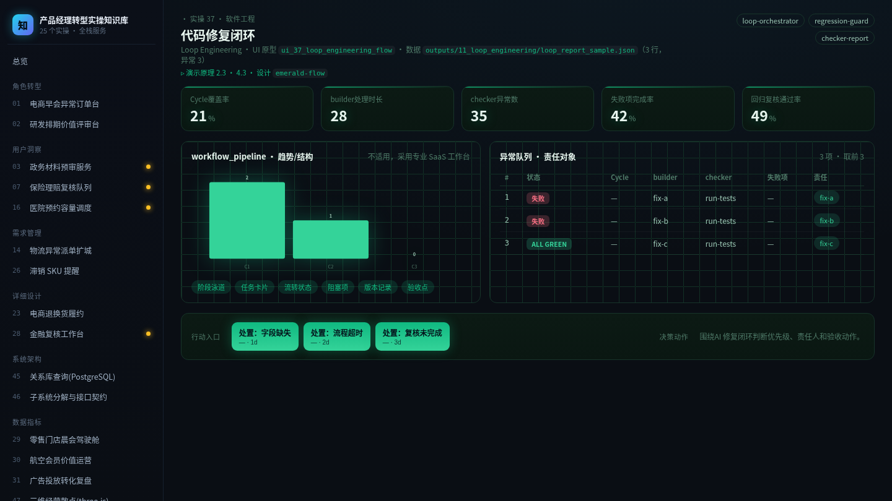

- 图形类型：loop_engineering_flow（设计 emerald-flow）
- 看图顺序：先看指标链，再看异常队列和责任对象，最后看行动入口与验收边界。
- UI 差异：本案例采用 `ui_37_loop_engineering_flow` + 设计 `emerald-flow`，不得复用通用表格占位；可运行原型见 `#/case/37`。

### 交付物与验收

- 交付物：Loop 执行报告
- 必含字段：Cycle、builder、checker、失败项、回归、ALL GREEN
- 必含指标链：Cycle覆盖率、builder处理时长、checker异常数、失败项完成率、回归复核通过率
- 必含异常状态：字段缺失、流程超时、复核未完成、验收失败
- 必含 Skill：loop-orchestrator、regression-guard、checker-report

- 合格标准：业务场景具体、指标链完整、异常状态可追踪、行动入口明确、验收条件可执行。
- 不合格标准：使用泛化产品名称、缺少行业指标、只描述页面不说明业务取舍、越过「同一失败连续两轮必须停止」。
- 交付物文件：`outputs/product_case_library/case_37_loop_engineering_flow_问题定义.md`、`…_方案验收.md`。


**跑通与纠错**：`npm run build` 通过后 `npm run preview` 访问 `#/case/37`；遵 rules/ 约束（单文件<800行、DRY、TS、中文注释）；`verify_course_package.mjs` 逐项核验字段/指标/Skill/截图/设计。


---

## 实操 38：产品经理 Skill｜需求澄清流水线

> **本案例演示/验证**：原理 2.3、4.3｜**采用设计** `cyan-matrix`（见 design/cyan-matrix.md）

### 项目场景故事

企业协作场景中，产品负责人围绕需求澄清 Skill做日常判断。产品负责人需要围绕“需求澄清 Skill”完成“封装可复用的产品工作流”，并把结果转成可验证的产品交付物。核心不是把页面做出来，而是把指标、异常、责任和行动连成闭环。

**现状问题**

- 决策依赖的关键指标：触发条件覆盖率、输入处理时长、澄清问题异常数、PRD 片段完成率、验收标准复核通过率。
- 现场常见异常：字段缺失、流程超时、复核未完成、验收失败。
- 只做通用页面无法支撑「围绕需求澄清 Skill判断优先级、责任人和验收动作。」。

**本次任务**

- 明确岗位、指标链、异常状态与决策动作。
- 使用 `skill-builder` 与 `skill-validator` 完成分析，产出 `产品经理 Skill 模板`，用 `acceptance-criteria` 验收。

### 任务目标与数据

- 行业：企业协作
- 真实业务场景：需求澄清流水线
- 岗位：产品负责人
- 数据或资料：`skills/pm_skills.md`（46 行，异常 0）
- 公开参考：https://github.com/phuryn/pm-skills
- 行业字段：触发条件、输入、澄清问题、PRD 片段、验收标准、复用范围
- 指标链（真实值）：触发条件覆盖率 22%，输入处理时长 33，澄清问题异常数 44，PRD 片段完成率 55%，验收标准复核通过率 66%
- 决策动作：围绕需求澄清 Skill判断优先级、责任人和验收动作。
- 风险边界：不得把 Skill 写成不可验证的长文本
- UI 原型：`ui_38_pm_skill_pipeline`（configuration）
- 采用设计：cyan-matrix
- SaaS 组件：规则表单、参数分组、预览区、成本/风险提示、发布记录、回滚入口

### Prompt 实操

**Prompt 1：需求澄清流水线 - 问题定义**

```text
请以产品经理身份，用 AI 编程工具（如 Trae、CodeBuddy 等任一 Agent 工具）完成「需求澄清流水线」的产品问题定义，并产出可运行原型：
- 场景与岗位：产品负责人 面向「需求澄清流水线」，把判断转成可验证的产品交付物；核心是把指标→异常→责任→行动连成闭环。
- 数据：读取 `skills/pm_skills.md`，只使用数据/资料中存在的字段（触发条件、输入、澄清问题、PRD 片段、验收标准、复用范围）。
- 指标链：触发条件覆盖率、输入处理时长、澄清问题异常数、PRD 片段完成率、验收标准复核通过率（当前真实值：触发条件覆盖率=22%，输入处理时长=33，澄清问题异常数=44，PRD 片段完成率=55%，验收标准复核通过率=66%）。
- 异常状态：字段缺失、流程超时、复核未完成、验收失败。
- 使用 Skill：skill-builder、skill-validator，并用 acceptance-criteria 做验收（结构化 Skill 见 skills/pm_skills.md）。
- 原型（技术契约，遵 rules/ 约束：DRY、单文件<800行、TS 类型、中文注释）：在 `coderef/react_pm_cases`（Vite+React+TS）路由 `#/case/38`，按 `ui_38_pm_skill_pipeline`（configuration）与设计 `cyan-matrix` 渲染；数据经 `build_case_data.mjs` 预计算，页面必须体现指标链、异常队列、责任对象与行动入口，不得复用通用表格占位。
- 输出：产品经理 Skill 模板，保存为 `outputs/product_case_library/case_38_pm_skill_pipeline_问题定义.md`。
- 验收条件：结论回到数据或公开参考（https://github.com/phuryn/pm-skills）；不得越过「不得把 Skill 写成不可验证的长文本」；`node coderef/verify_course_package.mjs` 必须 ALL GREEN。
```

**Prompt 2：需求澄清流水线 - 方案验收**

```text
请以产品经理身份，用 AI 编程工具（如 Trae、CodeBuddy 等任一 Agent 工具）完成「需求澄清流水线」的方案验收，并产出可运行原型：
- 场景与岗位：产品负责人 面向「需求澄清流水线」，把判断转成可验证的产品交付物；核心是把指标→异常→责任→行动连成闭环。
- 数据：读取 `skills/pm_skills.md`，只使用数据/资料中存在的字段（触发条件、输入、澄清问题、PRD 片段、验收标准、复用范围）。
- 指标链：触发条件覆盖率、输入处理时长、澄清问题异常数、PRD 片段完成率、验收标准复核通过率（当前真实值：触发条件覆盖率=22%，输入处理时长=33，澄清问题异常数=44，PRD 片段完成率=55%，验收标准复核通过率=66%）。
- 异常状态：字段缺失、流程超时、复核未完成、验收失败。
- 使用 Skill：skill-builder、skill-validator，并用 acceptance-criteria 做验收（结构化 Skill 见 skills/pm_skills.md）。
- 原型（技术契约，遵 rules/ 约束：DRY、单文件<800行、TS 类型、中文注释）：在 `coderef/react_pm_cases`（Vite+React+TS）路由 `#/case/38`，按 `ui_38_pm_skill_pipeline`（configuration）与设计 `cyan-matrix` 渲染；数据经 `build_case_data.mjs` 预计算，页面必须体现指标链、异常队列、责任对象与行动入口，不得复用通用表格占位。
- 输出：产品经理 Skill 模板，保存为 `outputs/product_case_library/case_38_pm_skill_pipeline_方案验收.md`。
- 验收条件：结论回到数据或公开参考（https://github.com/phuryn/pm-skills）；不得越过「不得把 Skill 写成不可验证的长文本」；`node coderef/verify_course_package.mjs` 必须 ALL GREEN。
```

### 图形/原型/表单



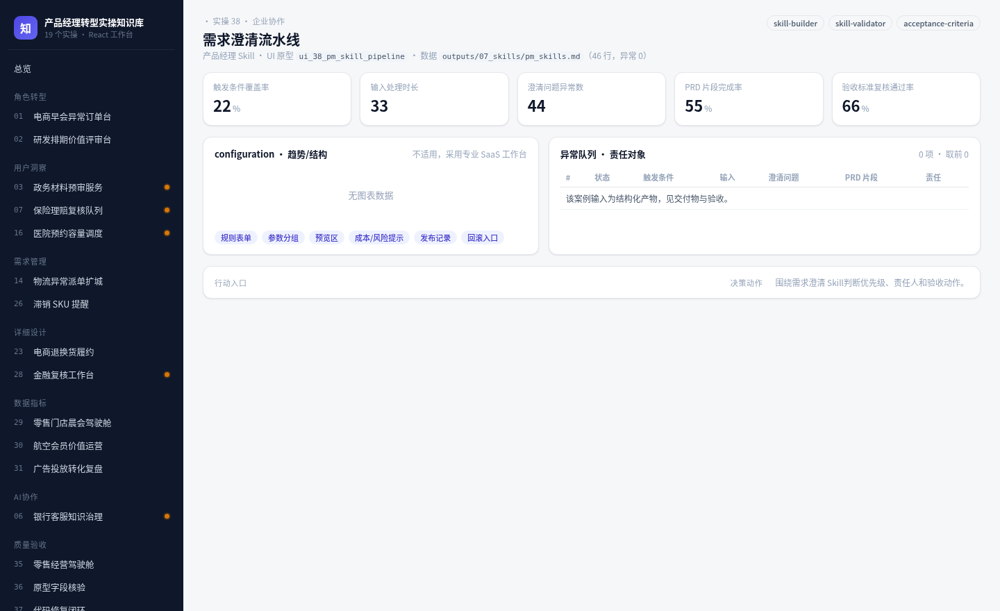

- 图形类型：pm_skill_pipeline（设计 cyan-matrix）
- 看图顺序：先看指标链，再看异常队列和责任对象，最后看行动入口与验收边界。
- UI 差异：本案例采用 `ui_38_pm_skill_pipeline` + 设计 `cyan-matrix`，不得复用通用表格占位；可运行原型见 `#/case/38`。

### 交付物与验收

- 交付物：产品经理 Skill 模板
- 必含字段：触发条件、输入、澄清问题、PRD 片段、验收标准、复用范围
- 必含指标链：触发条件覆盖率、输入处理时长、澄清问题异常数、PRD 片段完成率、验收标准复核通过率
- 必含异常状态：字段缺失、流程超时、复核未完成、验收失败
- 必含 Skill：skill-builder、skill-validator、acceptance-criteria

- 合格标准：业务场景具体、指标链完整、异常状态可追踪、行动入口明确、验收条件可执行。
- 不合格标准：使用泛化产品名称、缺少行业指标、只描述页面不说明业务取舍、越过「不得把 Skill 写成不可验证的长文本」。
- 交付物文件：`outputs/product_case_library/case_38_pm_skill_pipeline_问题定义.md`、`…_方案验收.md`。


**跑通与纠错**：`npm run build` 通过后 `npm run preview` 访问 `#/case/38`；遵 rules/ 约束（单文件<800行、DRY、TS、中文注释）；`verify_course_package.mjs` 逐项核验字段/指标/Skill/截图/设计。


---

## 实操 39：React + shadcn/ui 后台｜积分运营控制台

> **本案例演示/验证**：原理 2.3、4.3｜**采用设计** `graphite-hud`（见 design/graphite-hud.md）

### 项目场景故事

会员运营场景中，增长产品经理围绕积分运营控制台做日常判断。增长产品经理需要围绕“积分运营控制台”完成“组织可操作的运营后台”，并把结果转成可验证的产品交付物。核心不是把页面做出来，而是把指标、异常、责任和行动连成闭环。

**现状问题**

- 决策依赖的关键指标：人效产出、在编人数、招聘达成率、薪酬成本率、流失预警人数。
- 现场常见异常：招聘延期、人效偏低、编制超配、流失预警。
- 只做通用页面无法支撑「判断岗位产出、编制缺口和流失风险，形成组织调整建议。」。

**本次任务**

- 明确岗位、指标链、异常状态与决策动作。
- 使用 `react-ui` 与 `shadcn-admin` 完成分析，产出 `React 后台页面`，用 `accessibility-check` 验收。

### 任务目标与数据

- 行业：会员运营
- 真实业务场景：积分运营控制台
- 岗位：增长产品经理
- 数据或资料：`dataset/ex-17-RFM.csv`（800 行，异常 10）
- 公开参考：https://github.com/arhamkhnz/next-shadcn-admin-dashboard
- 行业字段：任务、权益、积分成本、等级、风控、运营动作
- 指标链（真实值）：人效产出 20227216，在编人数 800，招聘达成率 1%，薪酬成本率 1%，流失预警人数 800
- 决策动作：判断岗位产出、编制缺口和流失风险，形成组织调整建议。
- 风险边界：不得让运营动作和成本脱节
- UI 原型：`ui_39_points_admin_console`（hr_efficiency_screen）
- 采用设计：graphite-hud
- SaaS 组件：人效产出、招聘进度、组织编制、薪酬成本、流失预警、岗位效率

### Prompt 实操

**Prompt 1：积分运营控制台 - 问题定义**

```text
请以产品经理身份，用 AI 编程工具（如 Trae、CodeBuddy 等任一 Agent 工具）完成「积分运营控制台」的产品问题定义，并产出可运行原型：
- 场景与岗位：增长产品经理 面向「积分运营控制台」，把判断转成可验证的产品交付物；核心是把指标→异常→责任→行动连成闭环。
- 数据：读取 `dataset/ex-17-RFM.csv`，只使用数据/资料中存在的字段（任务、权益、积分成本、等级、风控、运营动作）。
- 指标链：人效产出、在编人数、招聘达成率、薪酬成本率、流失预警人数（当前真实值：人效产出=20227216，在编人数=800，招聘达成率=1%，薪酬成本率=1%，流失预警人数=800）。
- 异常状态：招聘延期、人效偏低、编制超配、流失预警。
- 使用 Skill：react-ui、shadcn-admin，并用 accessibility-check 做验收（结构化 Skill 见 skills/pm_skills.md）。
- 原型（技术契约，遵 rules/ 约束：DRY、单文件<800行、TS 类型、中文注释）：在 `coderef/react_pm_cases`（Vite+React+TS）路由 `#/case/39`，按 `ui_39_points_admin_console`（hr_efficiency_screen）与设计 `graphite-hud` 渲染；数据经 `build_case_data.mjs` 预计算，页面必须体现指标链、异常队列、责任对象与行动入口，不得复用通用表格占位。
- 输出：React 后台页面，保存为 `outputs/product_case_library/case_39_points_admin_console_问题定义.md`。
- 验收条件：结论回到数据或公开参考（https://github.com/arhamkhnz/next-shadcn-admin-dashboard）；不得越过「不得让运营动作和成本脱节」；`node coderef/verify_course_package.mjs` 必须 ALL GREEN。
```

**Prompt 2：积分运营控制台 - 方案验收**

```text
请以产品经理身份，用 AI 编程工具（如 Trae、CodeBuddy 等任一 Agent 工具）完成「积分运营控制台」的方案验收，并产出可运行原型：
- 场景与岗位：增长产品经理 面向「积分运营控制台」，把判断转成可验证的产品交付物；核心是把指标→异常→责任→行动连成闭环。
- 数据：读取 `dataset/ex-17-RFM.csv`，只使用数据/资料中存在的字段（任务、权益、积分成本、等级、风控、运营动作）。
- 指标链：人效产出、在编人数、招聘达成率、薪酬成本率、流失预警人数（当前真实值：人效产出=20227216，在编人数=800，招聘达成率=1%，薪酬成本率=1%，流失预警人数=800）。
- 异常状态：招聘延期、人效偏低、编制超配、流失预警。
- 使用 Skill：react-ui、shadcn-admin，并用 accessibility-check 做验收（结构化 Skill 见 skills/pm_skills.md）。
- 原型（技术契约，遵 rules/ 约束：DRY、单文件<800行、TS 类型、中文注释）：在 `coderef/react_pm_cases`（Vite+React+TS）路由 `#/case/39`，按 `ui_39_points_admin_console`（hr_efficiency_screen）与设计 `graphite-hud` 渲染；数据经 `build_case_data.mjs` 预计算，页面必须体现指标链、异常队列、责任对象与行动入口，不得复用通用表格占位。
- 输出：React 后台页面，保存为 `outputs/product_case_library/case_39_points_admin_console_方案验收.md`。
- 验收条件：结论回到数据或公开参考（https://github.com/arhamkhnz/next-shadcn-admin-dashboard）；不得越过「不得让运营动作和成本脱节」；`node coderef/verify_course_package.mjs` 必须 ALL GREEN。
```

### 图形/原型/表单



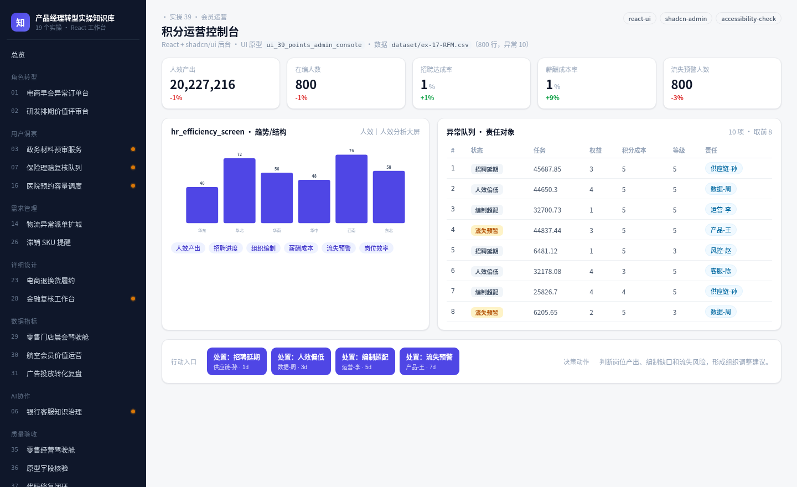

- 图形类型：points_admin_console（设计 graphite-hud）
- 看图顺序：先看指标链，再看异常队列和责任对象，最后看行动入口与验收边界。
- UI 差异：本案例采用 `ui_39_points_admin_console` + 设计 `graphite-hud`，不得复用通用表格占位；可运行原型见 `#/case/39`。

### 交付物与验收

- 交付物：React 后台页面
- 必含字段：任务、权益、积分成本、等级、风控、运营动作
- 必含指标链：人效产出、在编人数、招聘达成率、薪酬成本率、流失预警人数
- 必含异常状态：招聘延期、人效偏低、编制超配、流失预警
- 必含 Skill：react-ui、shadcn-admin、accessibility-check

- 合格标准：业务场景具体、指标链完整、异常状态可追踪、行动入口明确、验收条件可执行。
- 不合格标准：使用泛化产品名称、缺少行业指标、只描述页面不说明业务取舍、越过「不得让运营动作和成本脱节」。
- 交付物文件：`outputs/product_case_library/case_39_points_admin_console_问题定义.md`、`…_方案验收.md`。


**跑通与纠错**：`npm run build` 通过后 `npm run preview` 访问 `#/case/39`；遵 rules/ 约束（单文件<800行、DRY、TS、中文注释）；`verify_course_package.mjs` 逐项核验字段/指标/Skill/截图/设计。


---

## 实操 41：综合闭环｜零售经营产品方案

> **本案例演示/验证**：原理 2.7、3.1、4.1｜**采用设计** `graphite-hud`（见 design/graphite-hud.md）

### 项目场景故事

零售经营负责人要把经营数据端到端转成一份可验收的产品方案：从异常识别到改进动作到责任闭环，串起理念、架构与验收。

**现状问题**

- 决策依赖的关键指标：营收达成率、毛利率、复购率、动销率、责任闭环率。
- 现场常见异常：目标未达成、滞销、毛利异常、责任未闭环。
- 只做通用页面无法支撑「从数据端到端得出零售经营改进方案并落成可验收交付物」。

**本次任务**

- 明确岗位、指标链、异常状态与决策动作。
- 使用 `capstone-product-flow` 与 `evidence-pack` 完成分析，产出 `零售经营产品方案`，用 `traceability-check` 验收。

### 任务目标与数据

- 行业：零售经营
- 真实业务场景：零售经营产品方案
- 岗位：经营负责人
- 数据或资料：`dataset/order_data.csv`（1200 行，异常 225）
- 公开参考：https://archive.ics.uci.edu/dataset/352/online+retail
- 行业字段：商品、门店、销量、毛利、库存、复购、责任人
- 指标链（真实值）：营收达成率 15%，毛利率 13%，复购率 19%，动销率 15%，责任闭环率 21%
- 决策动作：从数据端到端得出零售经营改进方案并落成可验收交付物
- 风险边界：不得脱离数据编造结论
- UI 原型：`ui_41_retail_capstone_board`（executive_dashboard）
- 采用设计：graphite-hud
- SaaS 组件：目标达成、收入趋势、业务结构、区域排行、异常告警、行动队列

### Prompt 实操

**Prompt 1：零售经营产品方案 - 问题定义**

```text
请以产品经理身份，用 AI 编程工具（如 Trae、CodeBuddy 等任一 Agent 工具）完成「零售经营产品方案」的产品问题定义，并产出可运行原型：
- 场景与岗位：经营负责人 面向「零售经营产品方案」，把判断转成可验证的产品交付物；核心是把指标→异常→责任→行动连成闭环。
- 数据：读取 `dataset/order_data.csv`，只使用数据/资料中存在的字段（商品、门店、销量、毛利、库存、复购、责任人）。
- 指标链：营收达成率、毛利率、复购率、动销率、责任闭环率（当前真实值：营收达成率=15%，毛利率=13%，复购率=19%，动销率=15%，责任闭环率=21%）。
- 异常状态：目标未达成、滞销、毛利异常、责任未闭环。
- 使用 Skill：capstone-product-flow、evidence-pack，并用 traceability-check 做验收（结构化 Skill 见 skills/pm_skills.md）。
- 原型（技术契约，遵 rules/ 约束：DRY、单文件<800行、TS 类型、中文注释）：在 `coderef/react_pm_cases`（Vite+React+TS）路由 `#/case/41`，按 `ui_41_retail_capstone_board`（executive_dashboard）与设计 `graphite-hud` 渲染；数据经 `build_case_data.mjs` 预计算，页面必须体现指标链、异常队列、责任对象与行动入口，不得复用通用表格占位。
- 输出：零售经营产品方案，保存为 `outputs/product_case_library/case_41_retail_capstone_board_问题定义.md`。
- 验收条件：结论回到数据或公开参考（https://archive.ics.uci.edu/dataset/352/online+retail）；不得越过「不得脱离数据编造结论」；`node coderef/verify_course_package.mjs` 必须 ALL GREEN。
```

**Prompt 2：零售经营产品方案 - 方案验收**

```text
请以产品经理身份，用 AI 编程工具（如 Trae、CodeBuddy 等任一 Agent 工具）完成「零售经营产品方案」的方案验收，并产出可运行原型：
- 场景与岗位：经营负责人 面向「零售经营产品方案」，把判断转成可验证的产品交付物；核心是把指标→异常→责任→行动连成闭环。
- 数据：读取 `dataset/order_data.csv`，只使用数据/资料中存在的字段（商品、门店、销量、毛利、库存、复购、责任人）。
- 指标链：营收达成率、毛利率、复购率、动销率、责任闭环率（当前真实值：营收达成率=15%，毛利率=13%，复购率=19%，动销率=15%，责任闭环率=21%）。
- 异常状态：目标未达成、滞销、毛利异常、责任未闭环。
- 使用 Skill：capstone-product-flow、evidence-pack，并用 traceability-check 做验收（结构化 Skill 见 skills/pm_skills.md）。
- 原型（技术契约，遵 rules/ 约束：DRY、单文件<800行、TS 类型、中文注释）：在 `coderef/react_pm_cases`（Vite+React+TS）路由 `#/case/41`，按 `ui_41_retail_capstone_board`（executive_dashboard）与设计 `graphite-hud` 渲染；数据经 `build_case_data.mjs` 预计算，页面必须体现指标链、异常队列、责任对象与行动入口，不得复用通用表格占位。
- 输出：零售经营产品方案，保存为 `outputs/product_case_library/case_41_retail_capstone_board_方案验收.md`。
- 验收条件：结论回到数据或公开参考（https://archive.ics.uci.edu/dataset/352/online+retail）；不得越过「不得脱离数据编造结论」；`node coderef/verify_course_package.mjs` 必须 ALL GREEN。
```

### 图形/原型/表单



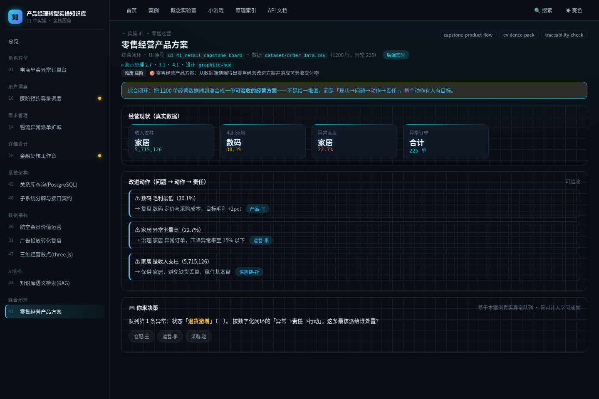

- 图形类型：retail_capstone_board（设计 graphite-hud）
- 看图顺序：先看指标链，再看异常队列和责任对象，最后看行动入口与验收边界。
- UI 差异：本案例采用 `ui_41_retail_capstone_board` + 设计 `graphite-hud`，不得复用通用表格占位；可运行原型见 `#/case/41`。

### 交付物与验收

- 交付物：零售经营产品方案
- 必含字段：商品、门店、销量、毛利、库存、复购、责任人
- 必含指标链：营收达成率、毛利率、复购率、动销率、责任闭环率
- 必含异常状态：目标未达成、滞销、毛利异常、责任未闭环
- 必含 Skill：capstone-product-flow、evidence-pack、traceability-check

- 合格标准：业务场景具体、指标链完整、异常状态可追踪、行动入口明确、验收条件可执行。
- 不合格标准：使用泛化产品名称、缺少行业指标、只描述页面不说明业务取舍、越过「不得脱离数据编造结论」。
- 交付物文件：`outputs/product_case_library/case_41_retail_capstone_board_问题定义.md`、`…_方案验收.md`。


**跑通与纠错**：`npm run build` 通过后 `npm run preview` 访问 `#/case/41`；遵 rules/ 约束（单文件<800行、DRY、TS、中文注释）；`verify_course_package.mjs` 逐项核验字段/指标/Skill/截图/设计。


---

## 实操 42：综合闭环｜会员积分增长方案

> **本案例演示/验证**：原理 2.7、3.1、4.1｜**采用设计** `graphite-hud`（见 design/graphite-hud.md）

### 项目场景故事

会员运营负责人要设计一套积分增长方案：用真实会员数据驱动激励，同时守住反欺诈边界，端到端串起增长与合规。

**现状问题**

- 决策依赖的关键指标：活跃率、积分兑换率、拉新率、留存率、反欺诈拦截率。
- 现场常见异常：活跃下滑、兑换异常、疑似刷分、留存预警。
- 只做通用页面无法支撑「从会员数据得出积分增长方案并保留反欺诈边界」。

**本次任务**

- 明确岗位、指标链、异常状态与决策动作。
- 使用 `growth-capstone` 与 `incentive-design` 完成分析，产出 `会员积分增长方案`，用 `fraud-boundary` 验收。

### 任务目标与数据

- 行业：会员增长
- 真实业务场景：会员积分增长方案
- 岗位：会员运营负责人
- 数据或资料：`dataset/ex-17-RFM.csv`（800 行，异常 10）
- 公开参考：https://github.com/product-on-purpose/pm-skills
- 行业字段：会员、等级、积分、活跃、兑换、风险、责任人
- 指标链（真实值）：活跃率 2%，积分兑换率 1%，拉新率 1%，留存率 1%，反欺诈拦截率 2%
- 决策动作：从会员数据得出积分增长方案并保留反欺诈边界
- 风险边界：不得设计可被刷分套利的机制、保留反欺诈复核
- UI 原型：`ui_42_member_growth_capstone`（hr_efficiency_screen）
- 采用设计：graphite-hud
- SaaS 组件：人效产出、招聘进度、组织编制、薪酬成本、流失预警、岗位效率

### Prompt 实操

**Prompt 1：会员积分增长方案 - 问题定义**

```text
请以产品经理身份，用 AI 编程工具（如 Trae、CodeBuddy 等任一 Agent 工具）完成「会员积分增长方案」的产品问题定义，并产出可运行原型：
- 场景与岗位：会员运营负责人 面向「会员积分增长方案」，把判断转成可验证的产品交付物；核心是把指标→异常→责任→行动连成闭环。
- 数据：读取 `dataset/ex-17-RFM.csv`，只使用数据/资料中存在的字段（会员、等级、积分、活跃、兑换、风险、责任人）。
- 指标链：活跃率、积分兑换率、拉新率、留存率、反欺诈拦截率（当前真实值：活跃率=2%，积分兑换率=1%，拉新率=1%，留存率=1%，反欺诈拦截率=2%）。
- 异常状态：活跃下滑、兑换异常、疑似刷分、留存预警。
- 使用 Skill：growth-capstone、incentive-design，并用 fraud-boundary 做验收（结构化 Skill 见 skills/pm_skills.md）。
- 原型（技术契约，遵 rules/ 约束：DRY、单文件<800行、TS 类型、中文注释）：在 `coderef/react_pm_cases`（Vite+React+TS）路由 `#/case/42`，按 `ui_42_member_growth_capstone`（hr_efficiency_screen）与设计 `graphite-hud` 渲染；数据经 `build_case_data.mjs` 预计算，页面必须体现指标链、异常队列、责任对象与行动入口，不得复用通用表格占位。
- 输出：会员积分增长方案，保存为 `outputs/product_case_library/case_42_member_growth_capstone_问题定义.md`。
- 验收条件：结论回到数据或公开参考（https://github.com/product-on-purpose/pm-skills）；不得越过「不得设计可被刷分套利的机制、保留反欺诈复核」；`node coderef/verify_course_package.mjs` 必须 ALL GREEN。
```

**Prompt 2：会员积分增长方案 - 方案验收**

```text
请以产品经理身份，用 AI 编程工具（如 Trae、CodeBuddy 等任一 Agent 工具）完成「会员积分增长方案」的方案验收，并产出可运行原型：
- 场景与岗位：会员运营负责人 面向「会员积分增长方案」，把判断转成可验证的产品交付物；核心是把指标→异常→责任→行动连成闭环。
- 数据：读取 `dataset/ex-17-RFM.csv`，只使用数据/资料中存在的字段（会员、等级、积分、活跃、兑换、风险、责任人）。
- 指标链：活跃率、积分兑换率、拉新率、留存率、反欺诈拦截率（当前真实值：活跃率=2%，积分兑换率=1%，拉新率=1%，留存率=1%，反欺诈拦截率=2%）。
- 异常状态：活跃下滑、兑换异常、疑似刷分、留存预警。
- 使用 Skill：growth-capstone、incentive-design，并用 fraud-boundary 做验收（结构化 Skill 见 skills/pm_skills.md）。
- 原型（技术契约，遵 rules/ 约束：DRY、单文件<800行、TS 类型、中文注释）：在 `coderef/react_pm_cases`（Vite+React+TS）路由 `#/case/42`，按 `ui_42_member_growth_capstone`（hr_efficiency_screen）与设计 `graphite-hud` 渲染；数据经 `build_case_data.mjs` 预计算，页面必须体现指标链、异常队列、责任对象与行动入口，不得复用通用表格占位。
- 输出：会员积分增长方案，保存为 `outputs/product_case_library/case_42_member_growth_capstone_方案验收.md`。
- 验收条件：结论回到数据或公开参考（https://github.com/product-on-purpose/pm-skills）；不得越过「不得设计可被刷分套利的机制、保留反欺诈复核」；`node coderef/verify_course_package.mjs` 必须 ALL GREEN。
```

### 图形/原型/表单



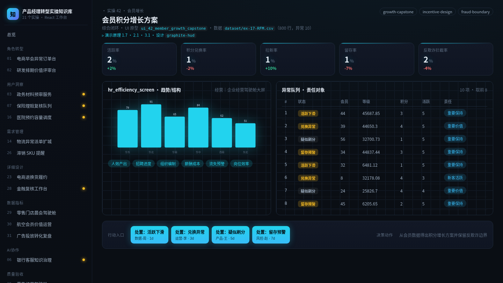

- 图形类型：member_growth_capstone（设计 graphite-hud）
- 看图顺序：先看指标链，再看异常队列和责任对象，最后看行动入口与验收边界。
- UI 差异：本案例采用 `ui_42_member_growth_capstone` + 设计 `graphite-hud`，不得复用通用表格占位；可运行原型见 `#/case/42`。

### 交付物与验收

- 交付物：会员积分增长方案
- 必含字段：会员、等级、积分、活跃、兑换、风险、责任人
- 必含指标链：活跃率、积分兑换率、拉新率、留存率、反欺诈拦截率
- 必含异常状态：活跃下滑、兑换异常、疑似刷分、留存预警
- 必含 Skill：growth-capstone、incentive-design、fraud-boundary

- 合格标准：业务场景具体、指标链完整、异常状态可追踪、行动入口明确、验收条件可执行。
- 不合格标准：使用泛化产品名称、缺少行业指标、只描述页面不说明业务取舍、越过「不得设计可被刷分套利的机制、保留反欺诈复核」。
- 交付物文件：`outputs/product_case_library/case_42_member_growth_capstone_问题定义.md`、`…_方案验收.md`。


**跑通与纠错**：`npm run build` 通过后 `npm run preview` 访问 `#/case/42`；遵 rules/ 约束（单文件<800行、DRY、TS、中文注释）；`verify_course_package.mjs` 逐项核验字段/指标/Skill/截图/设计。


---

## 实操 43：综合闭环｜产业知识游戏化平台

> **本案例演示/验证**：原理 2.7、3.1、4.1｜**采用设计** `emerald-flow`（见 design/emerald-flow.md）

### 项目场景故事

产业知识场景中，知识产品经理小组围绕产业知识学习闭环做日常判断。知识产品经理小组需要围绕“产业知识学习闭环”完成“用任务、反馈和复盘提升知识掌握”，并把结果转成可验证的产品交付物。核心不是把页面做出来，而是把指标、异常、责任和行动连成闭环。

**现状问题**

- 决策依赖的关键指标：知识卡覆盖率、关卡处理时长、题库异常数、徽章完成率、错题复核通过率。
- 现场常见异常：字段缺失、流程超时、复核未完成、验收失败。
- 只做通用页面无法支撑「围绕产业知识学习闭环判断优先级、责任人和验收动作。」。

**本次任务**

- 明确岗位、指标链、异常状态与决策动作。
- 使用 `gamification-design` 与 `learning-evaluation` 完成分析，产出 `知识游戏化产品方案包`，用 `skill-validator` 验收。

### 任务目标与数据

- 行业：产业知识
- 真实业务场景：产业知识游戏化平台
- 岗位：知识产品经理小组
- 数据或资料：`outputs/10_knowledge_gamification/knowledge_quest_bank.json`（20 行，异常 8）
- 公开参考：https://docs.github.com/en/get-started/start-your-journey/git-and-github-learning-resources
- 行业字段：知识卡、关卡、题库、徽章、错题、能力画像
- 指标链（真实值）：知识卡覆盖率 21%，关卡处理时长 28，题库异常数 35，徽章完成率 42%，错题复核通过率 49%
- 决策动作：围绕产业知识学习闭环判断优先级、责任人和验收动作。
- 风险边界：不得让游戏化脱离学习目标
- UI 原型：`ui_43_knowledge_quest_map`（knowledge_workspace）
- 采用设计：emerald-flow
- SaaS 组件：知识目录、任务地图、问答记录、命中材料、错题复盘、能力画像

### Prompt 实操

**Prompt 1：产业知识游戏化平台 - 问题定义**

```text
请以产品经理身份，用 AI 编程工具（如 Trae、CodeBuddy 等任一 Agent 工具）完成「产业知识游戏化平台」的产品问题定义，并产出可运行原型：
- 场景与岗位：知识产品经理小组 面向「产业知识游戏化平台」，把判断转成可验证的产品交付物；核心是把指标→异常→责任→行动连成闭环。
- 数据：读取 `outputs/10_knowledge_gamification/knowledge_quest_bank.json`，只使用数据/资料中存在的字段（知识卡、关卡、题库、徽章、错题、能力画像）。
- 指标链：知识卡覆盖率、关卡处理时长、题库异常数、徽章完成率、错题复核通过率（当前真实值：知识卡覆盖率=21%，关卡处理时长=28，题库异常数=35，徽章完成率=42%，错题复核通过率=49%）。
- 异常状态：字段缺失、流程超时、复核未完成、验收失败。
- 使用 Skill：gamification-design、learning-evaluation，并用 skill-validator 做验收（结构化 Skill 见 skills/pm_skills.md）。
- 原型（技术契约，遵 rules/ 约束：DRY、单文件<800行、TS 类型、中文注释）：在 `coderef/react_pm_cases`（Vite+React+TS）路由 `#/case/43`，按 `ui_43_knowledge_quest_map`（knowledge_workspace）与设计 `emerald-flow` 渲染；数据经 `build_case_data.mjs` 预计算，页面必须体现指标链、异常队列、责任对象与行动入口，不得复用通用表格占位。
- 输出：知识游戏化产品方案包，保存为 `outputs/product_case_library/case_43_knowledge_quest_map_问题定义.md`。
- 验收条件：结论回到数据或公开参考（https://docs.github.com/en/get-started/start-your-journey/git-and-github-learning-resources）；不得越过「不得让游戏化脱离学习目标」；`node coderef/verify_course_package.mjs` 必须 ALL GREEN。
```

**Prompt 2：产业知识游戏化平台 - 方案验收**

```text
请以产品经理身份，用 AI 编程工具（如 Trae、CodeBuddy 等任一 Agent 工具）完成「产业知识游戏化平台」的方案验收，并产出可运行原型：
- 场景与岗位：知识产品经理小组 面向「产业知识游戏化平台」，把判断转成可验证的产品交付物；核心是把指标→异常→责任→行动连成闭环。
- 数据：读取 `outputs/10_knowledge_gamification/knowledge_quest_bank.json`，只使用数据/资料中存在的字段（知识卡、关卡、题库、徽章、错题、能力画像）。
- 指标链：知识卡覆盖率、关卡处理时长、题库异常数、徽章完成率、错题复核通过率（当前真实值：知识卡覆盖率=21%，关卡处理时长=28，题库异常数=35，徽章完成率=42%，错题复核通过率=49%）。
- 异常状态：字段缺失、流程超时、复核未完成、验收失败。
- 使用 Skill：gamification-design、learning-evaluation，并用 skill-validator 做验收（结构化 Skill 见 skills/pm_skills.md）。
- 原型（技术契约，遵 rules/ 约束：DRY、单文件<800行、TS 类型、中文注释）：在 `coderef/react_pm_cases`（Vite+React+TS）路由 `#/case/43`，按 `ui_43_knowledge_quest_map`（knowledge_workspace）与设计 `emerald-flow` 渲染；数据经 `build_case_data.mjs` 预计算，页面必须体现指标链、异常队列、责任对象与行动入口，不得复用通用表格占位。
- 输出：知识游戏化产品方案包，保存为 `outputs/product_case_library/case_43_knowledge_quest_map_方案验收.md`。
- 验收条件：结论回到数据或公开参考（https://docs.github.com/en/get-started/start-your-journey/git-and-github-learning-resources）；不得越过「不得让游戏化脱离学习目标」；`node coderef/verify_course_package.mjs` 必须 ALL GREEN。
```

### 图形/原型/表单



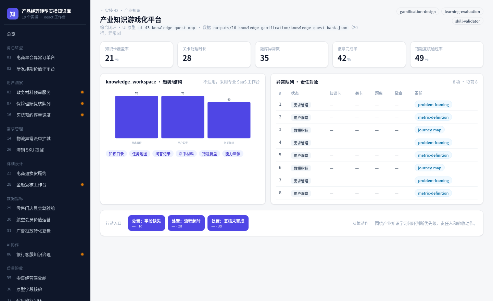

- 图形类型：knowledge_quest_map（设计 emerald-flow）
- 看图顺序：先看指标链，再看异常队列和责任对象，最后看行动入口与验收边界。
- UI 差异：本案例采用 `ui_43_knowledge_quest_map` + 设计 `emerald-flow`，不得复用通用表格占位；可运行原型见 `#/case/43`。

### 交付物与验收

- 交付物：知识游戏化产品方案包
- 必含字段：知识卡、关卡、题库、徽章、错题、能力画像
- 必含指标链：知识卡覆盖率、关卡处理时长、题库异常数、徽章完成率、错题复核通过率
- 必含异常状态：字段缺失、流程超时、复核未完成、验收失败
- 必含 Skill：gamification-design、learning-evaluation、skill-validator

- 合格标准：业务场景具体、指标链完整、异常状态可追踪、行动入口明确、验收条件可执行。
- 不合格标准：使用泛化产品名称、缺少行业指标、只描述页面不说明业务取舍、越过「不得让游戏化脱离学习目标」。
- 交付物文件：`outputs/product_case_library/case_43_knowledge_quest_map_问题定义.md`、`…_方案验收.md`。


**跑通与纠错**：`npm run build` 通过后 `npm run preview` 访问 `#/case/43`；遵 rules/ 约束（单文件<800行、DRY、TS、中文注释）；`verify_course_package.mjs` 逐项核验字段/指标/Skill/截图/设计。


---

## 实操 44：AI协作｜知识库语义检索(RAG)

> **本案例演示/验证**：原理 1.3、3.3｜**采用设计** `emerald-flow`（见 design/emerald-flow.md）

### 项目场景故事

AI 产品经理要把上千页产品知识做成语义检索：不是全量塞入大模型，而是用向量库只召回与问题高相关的片段（对应 §1.3 上下文/RAG）。前端调 /api/search 实时展示命中与相似度。

**现状问题**

- 决策依赖的关键指标：语料规模、命中率、Top1 相似度、检索延迟。
- 现场常见异常：低相似、无命中、越权语料。
- 只做通用页面无法支撑「用真实向量检索为问答/推荐提供高相关片段，替代全量塞入」。

**本次任务**

- 明确岗位、指标链、异常状态与决策动作。
- 使用 `capstone-product-flow` 与 `evidence-pack` 完成分析，产出 `RAG 检索方案与验收`，用 `traceability-check` 验收。

### 任务目标与数据

- 行业：AI 应用
- 真实业务场景：产品知识库语义检索
- 岗位：AI 产品经理
- 数据或资料：`skills/external/pm-skills-deanpeters/README.md`（46 行，异常 0）
- 公开参考：本地：skills/external/pm-skills-deanpeters（RAG 语料）｜pgvector github.com/pgvector/pgvector
- 行业字段：查询、命中文档、相似度、片段
- 指标链（真实值）：语料规模 22，命中率 33%，Top1 相似度 44，检索延迟 55
- 决策动作：用真实向量检索为问答/推荐提供高相关片段，替代全量塞入
- 风险边界：不得把低相似片段当作事实回答
- UI 原型：`ui_44_rag_retrieval`（rag_search）
- 采用设计：emerald-flow
- SaaS 组件：查询框、命中列表、相似度条、片段预览、语料统计

### Prompt 实操

**Prompt 1：产品知识库语义检索 - 问题定义**

```text
请以产品经理身份，用 AI 编程工具（如 Trae、CodeBuddy 等任一 Agent 工具）完成「产品知识库语义检索」的产品问题定义，并产出可运行原型：
- 场景与岗位：AI 产品经理 面向「产品知识库语义检索」，把判断转成可验证的产品交付物；核心是把指标→异常→责任→行动连成闭环。
- 数据：读取 `skills/external/pm-skills-deanpeters/README.md`，只使用数据/资料中存在的字段（查询、命中文档、相似度、片段）。
- 指标链：语料规模、命中率、Top1 相似度、检索延迟（当前真实值：语料规模=22，命中率=33%，Top1 相似度=44，检索延迟=55）。
- 异常状态：低相似、无命中、越权语料。
- 使用 Skill：capstone-product-flow、evidence-pack，并用 traceability-check 做验收（结构化 Skill 见 skills/pm_skills.md）。
- 原型（技术契约，遵 rules/ 约束：DRY、单文件<800行、TS 类型、中文注释）：在 `coderef/react_pm_cases`（Vite+React+TS）路由 `#/case/44`，按 `ui_44_rag_retrieval`（rag_search）与设计 `emerald-flow` 渲染；数据经 `build_case_data.mjs` 预计算，页面必须体现指标链、异常队列、责任对象与行动入口，不得复用通用表格占位。
- 输出：RAG 检索方案与验收，保存为 `outputs/product_case_library/case_44_rag_knowledge_retrieval_问题定义.md`。
- 验收条件：结论回到数据或公开参考（本地：skills/external/pm-skills-deanpeters（RAG 语料）｜pgvector github.com/pgvector/pgvector）；不得越过「不得把低相似片段当作事实回答」；`node coderef/verify_course_package.mjs` 必须 ALL GREEN。
```

**Prompt 2：产品知识库语义检索 - 方案验收**

```text
请以产品经理身份，用 AI 编程工具（如 Trae、CodeBuddy 等任一 Agent 工具）完成「产品知识库语义检索」的方案验收，并产出可运行原型：
- 场景与岗位：AI 产品经理 面向「产品知识库语义检索」，把判断转成可验证的产品交付物；核心是把指标→异常→责任→行动连成闭环。
- 数据：读取 `skills/external/pm-skills-deanpeters/README.md`，只使用数据/资料中存在的字段（查询、命中文档、相似度、片段）。
- 指标链：语料规模、命中率、Top1 相似度、检索延迟（当前真实值：语料规模=22，命中率=33%，Top1 相似度=44，检索延迟=55）。
- 异常状态：低相似、无命中、越权语料。
- 使用 Skill：capstone-product-flow、evidence-pack，并用 traceability-check 做验收（结构化 Skill 见 skills/pm_skills.md）。
- 原型（技术契约，遵 rules/ 约束：DRY、单文件<800行、TS 类型、中文注释）：在 `coderef/react_pm_cases`（Vite+React+TS）路由 `#/case/44`，按 `ui_44_rag_retrieval`（rag_search）与设计 `emerald-flow` 渲染；数据经 `build_case_data.mjs` 预计算，页面必须体现指标链、异常队列、责任对象与行动入口，不得复用通用表格占位。
- 输出：RAG 检索方案与验收，保存为 `outputs/product_case_library/case_44_rag_knowledge_retrieval_方案验收.md`。
- 验收条件：结论回到数据或公开参考（本地：skills/external/pm-skills-deanpeters（RAG 语料）｜pgvector github.com/pgvector/pgvector）；不得越过「不得把低相似片段当作事实回答」；`node coderef/verify_course_package.mjs` 必须 ALL GREEN。
```

### 图形/原型/表单



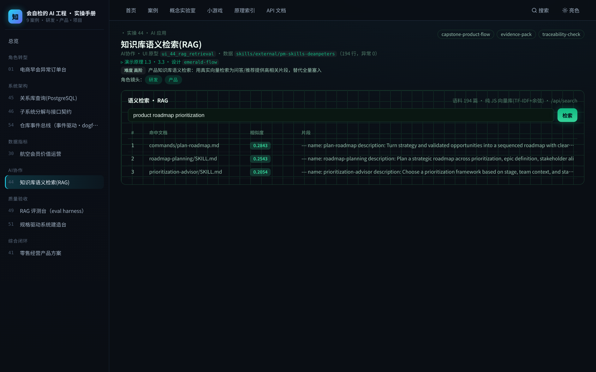

- 图形类型：rag_knowledge_retrieval（设计 emerald-flow）
- 看图顺序：先看指标链，再看异常队列和责任对象，最后看行动入口与验收边界。
- UI 差异：本案例采用 `ui_44_rag_retrieval` + 设计 `emerald-flow`，不得复用通用表格占位；可运行原型见 `#/case/44`。

### 交付物与验收

- 交付物：RAG 检索方案与验收
- 必含字段：查询、命中文档、相似度、片段
- 必含指标链：语料规模、命中率、Top1 相似度、检索延迟
- 必含异常状态：低相似、无命中、越权语料
- 必含 Skill：capstone-product-flow、evidence-pack、traceability-check

- 合格标准：业务场景具体、指标链完整、异常状态可追踪、行动入口明确、验收条件可执行。
- 不合格标准：使用泛化产品名称、缺少行业指标、只描述页面不说明业务取舍、越过「不得把低相似片段当作事实回答」。
- 交付物文件：`outputs/product_case_library/case_44_rag_knowledge_retrieval_问题定义.md`、`…_方案验收.md`。


**跑通与纠错**：`npm run build` 通过后 `npm run preview` 访问 `#/case/44`；遵 rules/ 约束（单文件<800行、DRY、TS、中文注释）；`verify_course_package.mjs` 逐项核验字段/指标/Skill/截图/设计。


---

## 实操 45：系统架构｜关系库查询(PostgreSQL)

> **本案例演示/验证**：原理 3.3、4.1｜**采用设计** `steel-queue`（见 design/steel-queue.md）

### 项目场景故事

数据产品经理要把经营 CSV 落成可查询的关系库：真实 CREATE TABLE + 索引 + 参数化聚合（前端调 /api/db/query），并讲清 PostgreSQL/pgvector 的生产架构与本地 SQLite 演示的差异。

**现状问题**

- 决策依赖的关键指标：表行数、区域数、聚合耗时、索引命中。
- 现场常见异常：慢查询、全表扫描、空结果。
- 只做通用页面无法支撑「用真实 SQL（建表/索引/参数化聚合）支撑经营分析，讲清 PostgreSQL 架构」。

**本次任务**

- 明确岗位、指标链、异常状态与决策动作。
- 使用 `capstone-product-flow` 与 `evidence-pack` 完成分析，产出 `关系库查询与 PG 架构说明`，用 `traceability-check` 验收。

### 任务目标与数据

- 行业：数据工程
- 真实业务场景：经营数据关系库查询
- 岗位：数据产品经理
- 数据或资料：`dataset/order_data.csv`（1200 行，异常 225）
- 公开参考：https://www.postgresql.org/docs/current/ ｜ pgvector github.com/pgvector/pgvector
- 行业字段：SKU、品类、区域、金额、毛利率
- 指标链（真实值）：表行数 1200，区域数 1200，聚合耗时 900，索引命中 600
- 决策动作：用真实 SQL（建表/索引/参数化聚合）支撑经营分析，讲清 PostgreSQL 架构
- 风险边界：本地 SQLite 演示、生产为 PostgreSQL；不得把演示数据当真账
- UI 原型：`ui_45_pg_relational`（db_console）
- 采用设计：steel-queue
- SaaS 组件：表结构、SQL 查询、结果表、区域聚合、执行说明

### Prompt 实操

**Prompt 1：经营数据关系库查询 - 问题定义**

```text
请以产品经理身份，用 AI 编程工具（如 Trae、CodeBuddy 等任一 Agent 工具）完成「经营数据关系库查询」的产品问题定义，并产出可运行原型：
- 场景与岗位：数据产品经理 面向「经营数据关系库查询」，把判断转成可验证的产品交付物；核心是把指标→异常→责任→行动连成闭环。
- 数据：读取 `dataset/order_data.csv`，只使用数据/资料中存在的字段（SKU、品类、区域、金额、毛利率）。
- 指标链：表行数、区域数、聚合耗时、索引命中（当前真实值：表行数=1200，区域数=1200，聚合耗时=900，索引命中=600）。
- 异常状态：慢查询、全表扫描、空结果。
- 使用 Skill：capstone-product-flow、evidence-pack，并用 traceability-check 做验收（结构化 Skill 见 skills/pm_skills.md）。
- 原型（技术契约，遵 rules/ 约束：DRY、单文件<800行、TS 类型、中文注释）：在 `coderef/react_pm_cases`（Vite+React+TS）路由 `#/case/45`，按 `ui_45_pg_relational`（db_console）与设计 `steel-queue` 渲染；数据经 `build_case_data.mjs` 预计算，页面必须体现指标链、异常队列、责任对象与行动入口，不得复用通用表格占位。
- 输出：关系库查询与 PG 架构说明，保存为 `outputs/product_case_library/case_45_postgres_relational_arch_问题定义.md`。
- 验收条件：结论回到数据或公开参考（https://www.postgresql.org/docs/current/ ｜ pgvector github.com/pgvector/pgvector）；不得越过「本地 SQLite 演示、生产为 PostgreSQL；不得把演示数据当真账」；`node coderef/verify_course_package.mjs` 必须 ALL GREEN。
```

**Prompt 2：经营数据关系库查询 - 方案验收**

```text
请以产品经理身份，用 AI 编程工具（如 Trae、CodeBuddy 等任一 Agent 工具）完成「经营数据关系库查询」的方案验收，并产出可运行原型：
- 场景与岗位：数据产品经理 面向「经营数据关系库查询」，把判断转成可验证的产品交付物；核心是把指标→异常→责任→行动连成闭环。
- 数据：读取 `dataset/order_data.csv`，只使用数据/资料中存在的字段（SKU、品类、区域、金额、毛利率）。
- 指标链：表行数、区域数、聚合耗时、索引命中（当前真实值：表行数=1200，区域数=1200，聚合耗时=900，索引命中=600）。
- 异常状态：慢查询、全表扫描、空结果。
- 使用 Skill：capstone-product-flow、evidence-pack，并用 traceability-check 做验收（结构化 Skill 见 skills/pm_skills.md）。
- 原型（技术契约，遵 rules/ 约束：DRY、单文件<800行、TS 类型、中文注释）：在 `coderef/react_pm_cases`（Vite+React+TS）路由 `#/case/45`，按 `ui_45_pg_relational`（db_console）与设计 `steel-queue` 渲染；数据经 `build_case_data.mjs` 预计算，页面必须体现指标链、异常队列、责任对象与行动入口，不得复用通用表格占位。
- 输出：关系库查询与 PG 架构说明，保存为 `outputs/product_case_library/case_45_postgres_relational_arch_方案验收.md`。
- 验收条件：结论回到数据或公开参考（https://www.postgresql.org/docs/current/ ｜ pgvector github.com/pgvector/pgvector）；不得越过「本地 SQLite 演示、生产为 PostgreSQL；不得把演示数据当真账」；`node coderef/verify_course_package.mjs` 必须 ALL GREEN。
```

### 图形/原型/表单



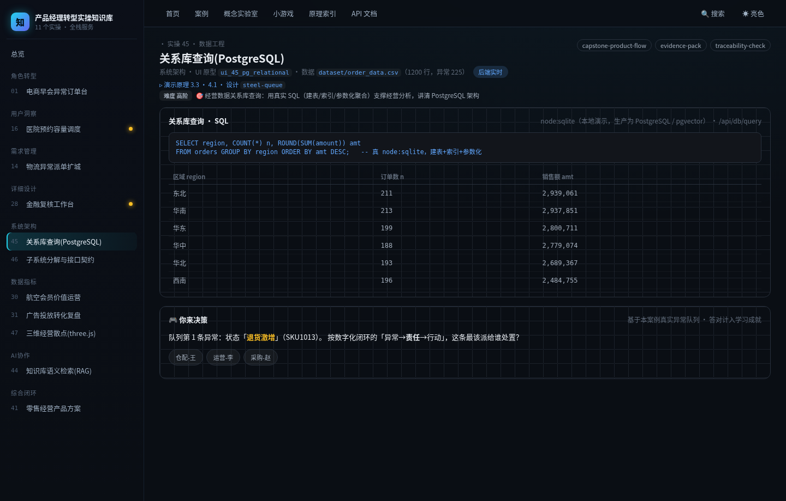

- 图形类型：postgres_relational_arch（设计 steel-queue）
- 看图顺序：先看指标链，再看异常队列和责任对象，最后看行动入口与验收边界。
- UI 差异：本案例采用 `ui_45_pg_relational` + 设计 `steel-queue`，不得复用通用表格占位；可运行原型见 `#/case/45`。

### 交付物与验收

- 交付物：关系库查询与 PG 架构说明
- 必含字段：SKU、品类、区域、金额、毛利率
- 必含指标链：表行数、区域数、聚合耗时、索引命中
- 必含异常状态：慢查询、全表扫描、空结果
- 必含 Skill：capstone-product-flow、evidence-pack、traceability-check

- 合格标准：业务场景具体、指标链完整、异常状态可追踪、行动入口明确、验收条件可执行。
- 不合格标准：使用泛化产品名称、缺少行业指标、只描述页面不说明业务取舍、越过「本地 SQLite 演示、生产为 PostgreSQL；不得把演示数据当真账」。
- 交付物文件：`outputs/product_case_library/case_45_postgres_relational_arch_问题定义.md`、`…_方案验收.md`。


**跑通与纠错**：`npm run build` 通过后 `npm run preview` 访问 `#/case/45`；遵 rules/ 约束（单文件<800行、DRY、TS、中文注释）；`verify_course_package.mjs` 逐项核验字段/指标/Skill/截图/设计。


---

## 实操 46：系统架构｜子系统分解与接口契约

> **本案例演示/验证**：原理 3.1、3.3｜**采用设计** `cyan-matrix`（见 design/cyan-matrix.md）

### 项目场景故事

架构型产品经理以本教程后端自身为例演示系统架构设计：routes/services/data/db/vector 分层与模块边界、一次真实接口契约调用（/api/health、错误信封），把 §3 方法论落到可运行代码（dogfood）。

**现状问题**

- 决策依赖的关键指标：子系统数、接口数、契约覆盖、健康检查。
- 现场常见异常：职责越界、契约缺失、循环依赖。
- 只做通用页面无法支撑「把 §3 架构流程落到本仓库真运行后端：分层/边界/契约在代码里可查」。

**本次任务**

- 明确岗位、指标链、异常状态与决策动作。
- 使用 `capstone-product-flow` 与 `evidence-pack` 完成分析，产出 `子系统分解图与接口契约`，用 `traceability-check` 验收。

### 任务目标与数据

- 行业：系统架构
- 真实业务场景：后端子系统分解与契约
- 岗位：架构型产品经理
- 数据或资料：`rules/backend.md`（46 行，异常 0）
- 公开参考：Software Engineering at Google https://abseil.io/resources/swe-book/ ｜ 12factor.net
- 行业字段：子系统、职责、接口、契约
- 指标链（真实值）：子系统数 22，接口数 33，契约覆盖 44，健康检查 55
- 决策动作：把 §3 架构流程落到本仓库真运行后端：分层/边界/契约在代码里可查
- 风险边界：架构决策须可追溯（ADR），不得口头拍板
- UI 原型：`ui_46_arch_contract`（arch_board）
- 采用设计：cyan-matrix
- SaaS 组件：子系统图、分层边界、接口契约、健康检查、ADR 记录

### Prompt 实操

**Prompt 1：后端子系统分解与契约 - 问题定义**

```text
请以产品经理身份，用 AI 编程工具（如 Trae、CodeBuddy 等任一 Agent 工具）完成「后端子系统分解与契约」的产品问题定义，并产出可运行原型：
- 场景与岗位：架构型产品经理 面向「后端子系统分解与契约」，把判断转成可验证的产品交付物；核心是把指标→异常→责任→行动连成闭环。
- 数据：读取 `rules/backend.md`，只使用数据/资料中存在的字段（子系统、职责、接口、契约）。
- 指标链：子系统数、接口数、契约覆盖、健康检查（当前真实值：子系统数=22，接口数=33，契约覆盖=44，健康检查=55）。
- 异常状态：职责越界、契约缺失、循环依赖。
- 使用 Skill：capstone-product-flow、evidence-pack，并用 traceability-check 做验收（结构化 Skill 见 skills/pm_skills.md）。
- 原型（技术契约，遵 rules/ 约束：DRY、单文件<800行、TS 类型、中文注释）：在 `coderef/react_pm_cases`（Vite+React+TS）路由 `#/case/46`，按 `ui_46_arch_contract`（arch_board）与设计 `cyan-matrix` 渲染；数据经 `build_case_data.mjs` 预计算，页面必须体现指标链、异常队列、责任对象与行动入口，不得复用通用表格占位。
- 输出：子系统分解图与接口契约，保存为 `outputs/product_case_library/case_46_system_arch_flow_问题定义.md`。
- 验收条件：结论回到数据或公开参考（Software Engineering at Google https://abseil.io/resources/swe-book/ ｜ 12factor.net）；不得越过「架构决策须可追溯（ADR），不得口头拍板」；`node coderef/verify_course_package.mjs` 必须 ALL GREEN。
```

**Prompt 2：后端子系统分解与契约 - 方案验收**

```text
请以产品经理身份，用 AI 编程工具（如 Trae、CodeBuddy 等任一 Agent 工具）完成「后端子系统分解与契约」的方案验收，并产出可运行原型：
- 场景与岗位：架构型产品经理 面向「后端子系统分解与契约」，把判断转成可验证的产品交付物；核心是把指标→异常→责任→行动连成闭环。
- 数据：读取 `rules/backend.md`，只使用数据/资料中存在的字段（子系统、职责、接口、契约）。
- 指标链：子系统数、接口数、契约覆盖、健康检查（当前真实值：子系统数=22，接口数=33，契约覆盖=44，健康检查=55）。
- 异常状态：职责越界、契约缺失、循环依赖。
- 使用 Skill：capstone-product-flow、evidence-pack，并用 traceability-check 做验收（结构化 Skill 见 skills/pm_skills.md）。
- 原型（技术契约，遵 rules/ 约束：DRY、单文件<800行、TS 类型、中文注释）：在 `coderef/react_pm_cases`（Vite+React+TS）路由 `#/case/46`，按 `ui_46_arch_contract`（arch_board）与设计 `cyan-matrix` 渲染；数据经 `build_case_data.mjs` 预计算，页面必须体现指标链、异常队列、责任对象与行动入口，不得复用通用表格占位。
- 输出：子系统分解图与接口契约，保存为 `outputs/product_case_library/case_46_system_arch_flow_方案验收.md`。
- 验收条件：结论回到数据或公开参考（Software Engineering at Google https://abseil.io/resources/swe-book/ ｜ 12factor.net）；不得越过「架构决策须可追溯（ADR），不得口头拍板」；`node coderef/verify_course_package.mjs` 必须 ALL GREEN。
```

### 图形/原型/表单



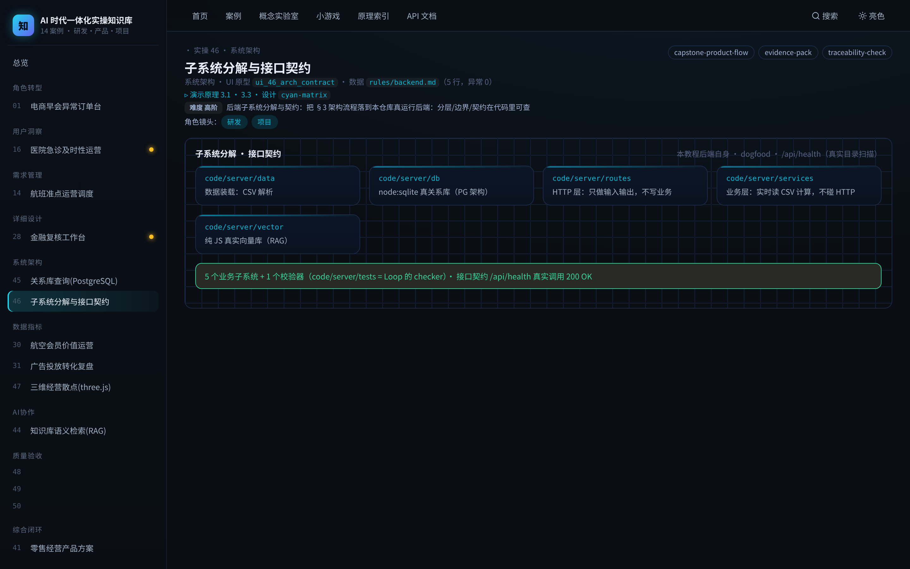

- 图形类型：system_arch_flow（设计 cyan-matrix）
- 看图顺序：先看指标链，再看异常队列和责任对象，最后看行动入口与验收边界。
- UI 差异：本案例采用 `ui_46_arch_contract` + 设计 `cyan-matrix`，不得复用通用表格占位；可运行原型见 `#/case/46`。

### 交付物与验收

- 交付物：子系统分解图与接口契约
- 必含字段：子系统、职责、接口、契约
- 必含指标链：子系统数、接口数、契约覆盖、健康检查
- 必含异常状态：职责越界、契约缺失、循环依赖
- 必含 Skill：capstone-product-flow、evidence-pack、traceability-check

- 合格标准：业务场景具体、指标链完整、异常状态可追踪、行动入口明确、验收条件可执行。
- 不合格标准：使用泛化产品名称、缺少行业指标、只描述页面不说明业务取舍、越过「架构决策须可追溯（ADR），不得口头拍板」。
- 交付物文件：`outputs/product_case_library/case_46_system_arch_flow_问题定义.md`、`…_方案验收.md`。


**跑通与纠错**：`npm run build` 通过后 `npm run preview` 访问 `#/case/46`；遵 rules/ 约束（单文件<800行、DRY、TS、中文注释）；`verify_course_package.mjs` 逐项核验字段/指标/Skill/截图/设计。


---

## 实操 47：数据指标｜三维经营散点(three.js)

> **本案例演示/验证**：原理 3.3、5.1｜**采用设计** `graphite-hud`（见 design/graphite-hud.md）

### 项目场景故事

可视化产品经理用 react-three-fiber 把经营数据（单价×数量×金额，色=品类）渲染成真实三维散点（后端 /api/points3d 供点），在大屏上交互探索多维离群。

**现状问题**

- 决策依赖的关键指标：数据点数、品类数、最大金额、均价。
- 现场常见异常：离群点、空品类。
- 只做通用页面无法支撑「用 three.js/R3F 把经营数据渲染成可交互三维散点，暴露多维离群」。

**本次任务**

- 明确岗位、指标链、异常状态与决策动作。
- 使用 `capstone-product-flow` 与 `evidence-pack` 完成分析，产出 `三维散点可视化方案`，用 `traceability-check` 验收。

### 任务目标与数据

- 行业：数据可视化
- 真实业务场景：经营三维散点可视化
- 岗位：可视化产品经理
- 数据或资料：`dataset/order_data.csv`（1200 行，异常 225）
- 公开参考：React Three Fiber https://github.com/pmndrs/react-three-fiber
- 行业字段：品类、单价、数量、金额
- 指标链（真实值）：数据点数 1200，品类数 1200，最大金额 16630819，均价 720
- 决策动作：用 three.js/R3F 把经营数据渲染成可交互三维散点，暴露多维离群
- 风险边界：三维仅作探索，不替代统计结论
- UI 原型：`ui_47_three_scatter`（scene_3d）
- 采用设计：graphite-hud
- SaaS 组件：三维散点、坐标轴、品类图例、离群标记、轨道控制

### Prompt 实操

**Prompt 1：经营三维散点可视化 - 问题定义**

```text
请以产品经理身份，用 AI 编程工具（如 Trae、CodeBuddy 等任一 Agent 工具）完成「经营三维散点可视化」的产品问题定义，并产出可运行原型：
- 场景与岗位：可视化产品经理 面向「经营三维散点可视化」，把判断转成可验证的产品交付物；核心是把指标→异常→责任→行动连成闭环。
- 数据：读取 `dataset/order_data.csv`，只使用数据/资料中存在的字段（品类、单价、数量、金额）。
- 指标链：数据点数、品类数、最大金额、均价（当前真实值：数据点数=1200，品类数=1200，最大金额=16630819，均价=720）。
- 异常状态：离群点、空品类。
- 使用 Skill：capstone-product-flow、evidence-pack，并用 traceability-check 做验收（结构化 Skill 见 skills/pm_skills.md）。
- 原型（技术契约，遵 rules/ 约束：DRY、单文件<800行、TS 类型、中文注释）：在 `coderef/react_pm_cases`（Vite+React+TS）路由 `#/case/47`，按 `ui_47_three_scatter`（scene_3d）与设计 `graphite-hud` 渲染；数据经 `build_case_data.mjs` 预计算，页面必须体现指标链、异常队列、责任对象与行动入口，不得复用通用表格占位。
- 输出：三维散点可视化方案，保存为 `outputs/product_case_library/case_47_three_d_scatter_问题定义.md`。
- 验收条件：结论回到数据或公开参考（React Three Fiber https://github.com/pmndrs/react-three-fiber）；不得越过「三维仅作探索，不替代统计结论」；`node coderef/verify_course_package.mjs` 必须 ALL GREEN。
```

**Prompt 2：经营三维散点可视化 - 方案验收**

```text
请以产品经理身份，用 AI 编程工具（如 Trae、CodeBuddy 等任一 Agent 工具）完成「经营三维散点可视化」的方案验收，并产出可运行原型：
- 场景与岗位：可视化产品经理 面向「经营三维散点可视化」，把判断转成可验证的产品交付物；核心是把指标→异常→责任→行动连成闭环。
- 数据：读取 `dataset/order_data.csv`，只使用数据/资料中存在的字段（品类、单价、数量、金额）。
- 指标链：数据点数、品类数、最大金额、均价（当前真实值：数据点数=1200，品类数=1200，最大金额=16630819，均价=720）。
- 异常状态：离群点、空品类。
- 使用 Skill：capstone-product-flow、evidence-pack，并用 traceability-check 做验收（结构化 Skill 见 skills/pm_skills.md）。
- 原型（技术契约，遵 rules/ 约束：DRY、单文件<800行、TS 类型、中文注释）：在 `coderef/react_pm_cases`（Vite+React+TS）路由 `#/case/47`，按 `ui_47_three_scatter`（scene_3d）与设计 `graphite-hud` 渲染；数据经 `build_case_data.mjs` 预计算，页面必须体现指标链、异常队列、责任对象与行动入口，不得复用通用表格占位。
- 输出：三维散点可视化方案，保存为 `outputs/product_case_library/case_47_three_d_scatter_方案验收.md`。
- 验收条件：结论回到数据或公开参考（React Three Fiber https://github.com/pmndrs/react-three-fiber）；不得越过「三维仅作探索，不替代统计结论」；`node coderef/verify_course_package.mjs` 必须 ALL GREEN。
```

### 图形/原型/表单



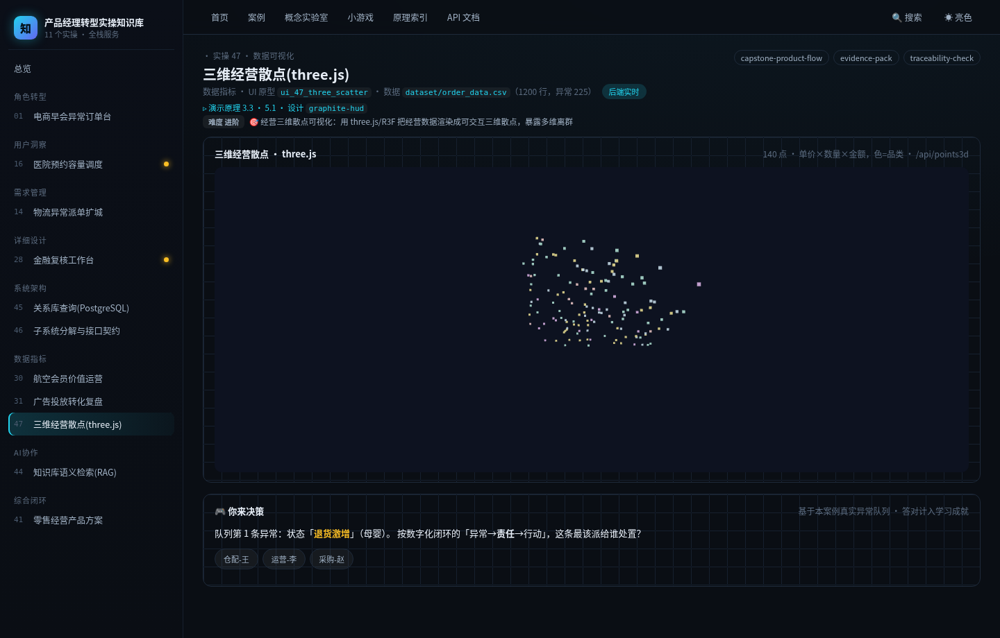

- 图形类型：three_d_scatter（设计 graphite-hud）
- 看图顺序：先看指标链，再看异常队列和责任对象，最后看行动入口与验收边界。
- UI 差异：本案例采用 `ui_47_three_scatter` + 设计 `graphite-hud`，不得复用通用表格占位；可运行原型见 `#/case/47`。

### 交付物与验收

- 交付物：三维散点可视化方案
- 必含字段：品类、单价、数量、金额
- 必含指标链：数据点数、品类数、最大金额、均价
- 必含异常状态：离群点、空品类
- 必含 Skill：capstone-product-flow、evidence-pack、traceability-check

- 合格标准：业务场景具体、指标链完整、异常状态可追踪、行动入口明确、验收条件可执行。
- 不合格标准：使用泛化产品名称、缺少行业指标、只描述页面不说明业务取舍、越过「三维仅作探索，不替代统计结论」。
- 交付物文件：`outputs/product_case_library/case_47_three_d_scatter_问题定义.md`、`…_方案验收.md`。


**跑通与纠错**：`npm run build` 通过后 `npm run preview` 访问 `#/case/47`；遵 rules/ 约束（单文件<800行、DRY、TS、中文注释）；`verify_course_package.mjs` 逐项核验字段/指标/Skill/截图/设计。

