# 信息化产品系统架构设计实操教程

> 面向有经验开发者的实操教程：同一套八步架构设计流程，在政务、企业管理、行业业务、SaaS 四个领域各完整走一遍。
> 全部图形为可直接渲染的 SVG（含 SMIL 动画，浏览器中查看）；全部代码与数据来自可运行的示例工程（`code/`，运行 `bash scripts/verify-all.sh` 验证）。
> 本文件由 `node scripts/build-single-md.mjs` 从 `docs/` 章节源文件合并生成，请勿直接编辑。

## 目录

- [1.1 为什么是"产品视角"的架构设计](#11-为什么是产品视角的架构设计)
- [1.2 八步流程总览](#12-八步流程总览)
- [1.3 第①~④步：从业务到架构风格](#13-第①④步从业务到架构风格)
- [1.4 第⑤~⑧步：从建模到决策归档](#14-第⑤⑧步从建模到决策归档)
- [1.5 奥卡姆原则与复杂度预算](#15-奥卡姆原则与复杂度预算)
- [2.1 业务与约束：一个区级审批系统的真实处境](#21-业务与约束一个区级审批系统的真实处境)
- [2.2 架构决策：为约束设计，而不是为流行设计](#22-架构决策为约束设计而不是为流行设计)
- [2.3 数据、接口与等保落地](#23-数据接口与等保落地)
- [2.4 部署、工程验证与演进](#24-部署工程验证与演进)
  - [ADR-001: 采用前后分离的模块化单体架构](#adr-001-采用前后分离的模块化单体架构)
  - [ADR-002: 事项规则配置化——数据驱动而非代码驱动，不引入低代码平台](#adr-002-事项规则配置化数据驱动而非代码驱动不引入低代码平台)
  - [ADR-003: 审批流用自研状态机迁移表实现，不引入工作流引擎](#adr-003-审批流用自研状态机迁移表实现不引入工作流引擎)
  - [ADR-004: 信创数据库兼容策略——面向 PG 系收敛，repo 层做缝合线](#adr-004-信创数据库兼容策略面向-pg-系收敛repo-层做缝合线)
- [3.1 业务与约束：当"规则由谁改"成为核心问题](#31-业务与约束当规则由谁改成为核心问题)
- [3.2 架构决策：同一个问题，被推翻的答案](#32-架构决策同一个问题被推翻的答案)
- [3.3 数据、接口与权限：规则即数据，链即快照](#33-数据接口与权限规则即数据链即快照)
- [3.4 集成、部署与演进](#34-集成部署与演进)
  - [ADR-001: 审批流采用表驱动条件路由（推翻案例一 ADR-003 的结论）](#adr-001-审批流采用表驱动条件路由推翻案例一-adr-003-的结论)
  - [ADR-002: 权限模型采用 RBAC + 数据范围，部门树用物化路径存储](#adr-002-权限模型采用-rbac-数据范围部门树用物化路径存储)
  - [ADR-003: 组织架构同步采用每日定时拉取 + 软删除 + 人工对账，不上消息队列](#adr-003-组织架构同步采用每日定时拉取-软删除-人工对账不上消息队列)
  - [ADR-004: 外部集成采用防腐层式点对点适配器 + 出站重试表，不建集成总线](#adr-004-外部集成采用防腐层式点对点适配器-出站重试表不建集成总线)
  - [ADR-005: 台账检索用 PostgreSQL 内置能力，全文检索列为演进项](#adr-005-台账检索用-postgresql-内置能力全文检索列为演进项)
- [4.1 业务与约束：负载形状第一次成为主角](#41-业务与约束负载形状第一次成为主角)
- [4.2 架构决策：全书第一次"拆"，拆的依据是数据流](#42-架构决策全书第一次拆拆的依据是数据流)
- [4.3 数据管道：从传感器到看板的一条河](#43-数据管道从传感器到看板的一条河)
- [4.4 部署、工程验证与演进](#44-部署工程验证与演进)
  - [ADR-001: 南向遥测接入采用 MQTT（QoS 1 + 网关本地缓存）](#adr-001-南向遥测接入采用-mqttqos-1-网关本地缓存)
  - [ADR-002: 时序存储采用 TimescaleDB（PostgreSQL 扩展）](#adr-002-时序存储采用-timescaledbpostgresql-扩展)
  - [ADR-003: 按数据流切分 ingest 与 api 两进程（全书第一次进程拆分）](#adr-003-按数据流切分-ingest-与-api-两进程全书第一次进程拆分)
  - [ADR-004: 告警在采集通路上内存规则匹配，不引入流处理引擎](#adr-004-告警在采集通路上内存规则匹配不引入流处理引擎)
  - [ADR-005: 看板实时推送采用 SSE，不用 WebSocket](#adr-005-看板实时推送采用-sse不用-websocket)
- [5.1 业务与约束：一次串租事故就能杀死一个产品](#51-业务与约束一次串租事故就能杀死一个产品)
- [5.2 架构决策：云原生的单体](#52-架构决策云原生的单体)
- [5.3 数据、接口与隔离纵深](#53-数据接口与隔离纵深)
- [5.4 部署、工程验证与演进](#54-部署工程验证与演进)
  - [ADR-001: 多租户数据模型采用 pool（共享表 + tenant_id）](#adr-001-多租户数据模型采用-pool共享表-tenantid)
  - [ADR-002: 隔离双保险——应用层强制 + PostgreSQL 行级安全（RLS）兜底](#adr-002-隔离双保险应用层强制-postgresql-行级安全rls兜底)
  - [ADR-003: 租户识别采用子域名 + JWT 内 tenant claim](#adr-003-租户识别采用子域名-jwt-内-tenant-claim)
  - [ADR-004: 计费采用自研订阅状态机 + 支付网关适配器](#adr-004-计费采用自研订阅状态机-支付网关适配器)
  - [ADR-005: 异步任务采用 BullMQ（Redis）——全书唯一被批准的 Redis](#adr-005-异步任务采用-bullmqredis全书唯一被批准的-redis)
- [第 6 章 四案例横向对比：同一个问题，为什么四个答案都对](#第-6-章-四案例横向对比同一个问题为什么四个答案都对)
- [附录 A：模板五件套](#附录-a模板五件套)
- [附录 B：SVG 图形规范](#附录-bsvg-图形规范)
- [附录 C：示例工程共用约定](#附录-c示例工程共用约定)

---

# 1.1 为什么是"产品视角"的架构设计

> 本章是全书唯一的方法论章。四个案例章（第 2~5 章）只做一件事：把本章的 8 步流程在四个真实领域各走一遍，展示**同样的流程如何在不同约束下导出不同的架构**。

## 从一个熟悉的失败场景说起

一个有经验的开发者接到"做一个合同管理系统"的任务，最常见的开场是这样的：当天下午，技术选型群里已经在讨论"用不用微服务""上不上 Redis""K8s 还是 Docker Compose"。两周后，脚手架搭好了：网关、注册中心、配置中心、三个服务、一套消息队列。三个月后，法务部门提出审批路由要按金额和合同类型变化、且要由法务自己配置——这个真正决定系统骨架的需求，没有出现在任何一次技术讨论里。

这就是**技术视角**的架构设计：从"我们要用什么技术"出发，把架构等同于技术栈清单。它的失败模式非常固定：

- 复杂度花在了没有需求支撑的地方（分布式事务、服务治理），而真正的难点（可配置的审批路由、组织架构月度变动下的数据权限）没有得到设计；
- 每一项技术都"没错"，但没有一项技术决策能回答"为什么"；
- 系统上线后，任何一个业务规则变化都要动代码，因为规则从未被当作设计对象。

**产品视角**的架构设计把出发点倒过来：先回答这个产品为谁解决什么问题、在什么约束下运行、哪些质量属性生死攸关，再让架构成为这些回答的推论。本书给这个视角一个可操作的定义：

> **架构是在特定约束下，对质量属性做出的一组可追溯的决策。**

三个关键词拆开看：

1. **约束**（constraints）：不可谈判的边界。政务系统部署在无公网出口的政务外网，这一条就直接否决了所有依赖外部 SaaS API 的方案，无论那些方案多优雅。约束是四个案例分道扬镳的第一现场。
2. **质量属性**（quality attributes）：性能、安全、可维护性这些"非功能需求"。功能决定系统"做什么"，质量属性决定系统"长什么样"：两个功能清单完全相同的系统，可以因为质量属性优先级不同而拥有完全不同的架构（第 4 章的设备监控和第 2 章的政务审批都有"数据写入"功能，但 400 点/秒的持续遥测写入和日均几百件的申报提交，导出的是两种数据架构）。
3. **可追溯的决策**（traceable decisions）：每个架构决策都能回答"依据哪条约束、哪个质量场景、否决了哪些备选、为什么"。本书用 ADR（架构决策记录）承载这件事，四个案例共 19 篇 ADR，全部按此标准写成。

## 产品视角不是产品经理视角

需要澄清：产品视角不等于"听产品经理的"。它是指架构师主动向上游走两步：

- 向**业务**走：搞清楚干系人是谁、他们的利益在哪里冲突。审批方要留痕免责、申请方要快速办结，这对矛盾不是需求文档里的一行字，而是整个流程引擎设计的原动力；
- 向**运行环境**走：搞清楚系统将在什么土壤里生长。有没有专职运维？内网还是公网？团队会什么技术？这些"工程社会学"因素对架构的影响，常常大于任何性能指标。

有经验的开发者最容易低估的恰恰是这一步的杠杆率：在需求与约束分析上多花一天，常常能省掉后期数月的返工；反过来，任何在错误问题上做出的精巧设计，价值都是零。

## 本书的方法论从哪里来

本章的 8 步流程是对四个成熟实践的组装（详见 [1.2 节](#12-八步流程总览)），并非发明：

- **arc42**（arc42.org，Gernot Starke / Peter Hruschka 维护，当前 v9）提供文档结构骨架——特别是它对"约束"独立成节的坚持；
- **C4 模型**（c4model.com，Simon Brown）提供建模分层——用四层缩放代替一张什么都想说的"架构总图"；
- **SEI 质量属性场景**（Bass/Clements/Kazman,《Software Architecture in Practice》）提供把"高性能"翻译成数字的方法；
- **ADR**（Michael Nygard, 2011,《Documenting Architecture Decisions》）提供决策留痕的最小格式。

架构描述的国际标准 ISO/IEC/IEEE 42010 与 Kruchten 的 4+1 视图是这些实践的理论先驱，本书不展开——它们回答"架构描述应包含什么"，而本书回答"周一早上你该做什么"。

## 贯穿全书的一条元原则：奥卡姆剃刀

如无必要，勿增实体。在架构语境下：**每引入一个组件、一层抽象、一项技术，都必须有一条编号的约束或质量场景为它作证；作证不出来的，砍掉。** 这条原则的完整操作化放在 [1.5 节](#15-奥卡姆原则与复杂度预算)，这里先剧透四个案例的最终形态，让读者感受它的实际力度（下图为动画 SVG，浏览器中打开可见"同一流程流经不同约束、落位为不同架构"的流动过程）：


| 案例 | 最终架构 | 没有上的东西 |
|---|---|---|
| 政务申报审批 | 模块化单体（单进程） | 微服务、工作流引擎、Redis、MQ |
| 企业合同管理 | 模块化单体（单进程） | BPMN 引擎、ESB、Elasticsearch、MQ |
| 设备监控 | 采集/查询两进程 | Kafka、Flink、时序数据库专用集群 |
| SaaS 工单 | 无状态单体 × N + Worker | 微服务、独立计费服务 |

四个案例没有一个上微服务。这不是立场而是推论：每一章都会用编号的约束与质量场景，当面论证"为什么不需要更复杂的方案"；案例四会同样严格地论证为什么 Redis 在那里配得上它的运维成本。复杂度不是罪，没有证据的复杂度才是。


---

# 1.2 八步流程总览

本节是全书的锚点：8 步流程的定义只在这里。案例章节每节开头的"流程进度条"与"方法回看 §1.x"都指向本节，不再复述。


## 流程一览表

| 步骤 | 名称 | 核心产出物 | 图形表达 | 方法来源 |
|---|---|---|---|---|
| ① | 业务与干系人分析 | 干系人清单、需求清单表（含"演进"档） | 业务流程泳道图 | arc42 §1–2 |
| ② | 约束识别 | 约束清单表（来源 + 可否谈判） | 表格，无需图 | arc42 §2 |
| ③ | 质量属性场景化 | 3~5 条带数字的质量场景 | 六要素结构图（本章 1 张） | ISO/IEC 25010:2023 + SEI 场景法 |
| ④ | 架构风格选型 | 风格对比表 + 首篇 ADR | 架构风格谱系图（本章 1 张） | MonolithFirst、模块化单体 |
| ⑤ | C4 分层建模 | 上下文图、容器图 | C4 图 | C4 模型 |
| ⑥ | 数据与接口设计 | ER 图、状态机、接口约定 | ER 图、状态机图 | ER 建模、OpenAPI 3.x |
| ⑦ | 横切设计 | 权限模型、审计方案、部署图 | 部署图 | RBAC/ABAC 谱系、等保要求 |
| ⑧ | ADR 与演进规划 | ADR 集、演进触发表 | 无需图 | Nygard ADR、演进式架构 |

四种表格类产出物（需求清单、约束清单、质量场景、ADR、演进触发表）的格式定义在[附录 A](#附录-a模板五件套)。

## 流程的三个性质

**它是瀑布的形状，迭代的用法。** 8 步有清晰的依赖关系：没有约束清单就无从评估架构风格，没有质量场景就无从裁决数据库选型。但实操中每一步都会反过来修正前面的产出物——画容器图时发现遗漏的外部系统（回到①补干系人），写 ADR 时发现两条质量场景冲突（回到③排优先级）。依赖关系是真的，一次走通是假的；按序开始，随时回头。

**它的产出物就是架构文档。** 走完 8 步，需求清单、约束清单、质量场景、C4 图、ER/状态机图、部署图、ADR 集、演进触发表装订起来就是一份完整的架构设计文档，结构大体对应 arc42 模板的第 1~9 节。本书不要求"先设计后写文档"，因为设计的过程就是填这些产出物的过程。

**它的重心在前四步。** 有经验的开发者拿到任务，手最痒的是第⑤⑥步（画图、建表），但四个案例会反复证明：第②步（约束）与第③步（质量场景）才是架构分岔的地方。第 2 章政务案例与第 3 章合同案例的第⑤⑥步产出物长得很像（都是模块化单体加 PostgreSQL），让它们内在完全不同的是第②③步：等保三级加政务外网，对上组织月变加法务自配路由。

## 与来源方法的对应关系

- **对 arc42**：本流程第①②步对应 arc42 §1（简介与目标）§2（约束），⑤对应 §3（上下文）§5（构件视图），⑥⑦对应 §5–§8，⑧对应 §9（架构决策）。差异：arc42 是文档模板（回答"写什么"），本流程是工作序列（回答"先做什么后做什么"）。
- **对 C4**：C4 只管第⑤步。Simon Brown 的建议本书照单全收：Context 与 Container 两层必画，Component 只画有争议的局部，Code 层交给代码本身。
- **对 ADR**：ADR 不是第⑧步才写。每一步里做出的显著决策当场记 ADR，第⑧步做的是把 ADR 集整理归档、补写演进触发表。案例章节的 ADR 编号顺序即真实决策顺序。
- **对 ISO/IEC 25010**：2023 修订版定义了 9 个质量特性（功能适合性、性能效率、兼容性、交互能力、可靠性、安全性 Security、可维护性、灵活性、安全性 Safety）。它是第③步的选维度菜单，防止漏项，而非要求全项覆盖。

## 案例章节的固定结构

四个案例章都是 4 节，与 8 步的对应关系固定：

| 案例章节 | 覆盖步骤 | 内容 |
|---|---|---|
| 第 1 节 业务与约束 | ①②③ | 场景、需求清单、约束清单、质量场景 |
| 第 2 节 架构决策 | ④⑤ | 风格选型、C4 上下文图与容器图、ADR 导读 |
| 第 3 节 数据·接口·安全 | ⑥⑦ | 状态机、ER、接口约定、权限与审计 |
| 第 4 节 部署与工程验证 | ⑦⑧ | 部署图、示例工程走读、生产映射表、演进触发表 |

每节顶部有一行进度指示（如 `流程进度：①②③ ▸ ④⑤ ▸ ⑥⑦ ▸ ⑧`，加粗当前段），方法论疑问一律回本章，案例章只讲"这个领域怎么不一样"。

1.3、1.4 两节逐步展开 8 步，每步讲三件事：产出物怎么做、用什么图表达、有经验的开发者最容易在哪里踩坑。


---

# 1.3 第①~④步：从业务到架构风格

## 第①步 业务与干系人分析

先弄清一件事：这个产品为谁、解决什么问题、各方的利益在哪里冲突。

### 做法与产出物

1. 列干系人清单。不只是"用户"：出钱的、使用的、审批的、运维的、被监管的、提供数据的。每个干系人记三样——角色、核心诉求、与其他干系人的冲突点。冲突点是这一步最有架构含金量的信息：
   - 申请企业要"快速办结"，审批人员要"留痕免责"，这对冲突直接决定了政务案例的状态机必须记录每一次流转的操作人与意见（第 2 章）；
   - 法务要"路由规则随时可调"，开发团队要"逻辑稳定可测"，这对冲突把合同案例推向了表驱动的审批流（第 3 章 ADR-001）。
2. 写核心业务流程。用一段话加一张泳道图描述主干流程。泳道按干系人划分，跨泳道的箭头就是未来系统的关键交互点。
3. 填需求清单表（格式见[附录 A.1](#附录-a模板五件套)）。两条纪律：每条需求要有可验证的验收要点，写不出验收要点的需求是还没想清楚的需求；**"演进"档必须非空**，明确"本期不做什么"与明确"做什么"同等重要，它是架构不为幻想需求预留复杂度的唯一保险。

### 冲突从哪来：三个可操作的提问

冲突点最有价值也最难挖，干系人不会主动说"我和隔壁部门有矛盾"。三个提问能把它逼出来：

1. **"这件事做慢了/做错了，谁来背锅？"** 追问担责的人，会发现审批方要留痕免责、申请方要快速办结——责任与效率的对立是流程类系统最普遍的冲突。
2. **"这条规则以后谁来改，改一次要走什么流程？"** 追问规则的所有权，会发现业务方要随时可调、开发方要稳定可测——配置权的归属决定了规则该做成数据还是代码（案例二 ADR-001 的起点）。
3. **"同一个数据，两个部门看到的应该一样还是不一样？"** 追问数据的可见边界，会挖出数据范围权限的需求（谁能看本部门、谁能看全公司）。

把每次提问的答案填进干系人清单的"冲突点"列。填不出冲突点的干系人，要么访谈还不够深，要么他本就不是关键干系人。

### 图形表达

业务流程泳道图（规范见[附录 B.4](#附录-bsvg-图形规范)）。干系人与系统的静态关系不单独画：它就是第⑤步 C4 上下文图的内容，画两遍必然失同步。

### 有经验开发者的三个坑

- **坑 1：把需求理解为功能列表。** 功能列表回答"做什么"，干系人冲突才回答"难在哪"。跳过冲突分析的架构，会在上线后被组织摩擦撕开。
- **坑 2：没有"不做清单"。** "以后可能要支持跨部门数据共享"如果不被显式列入演进档，就会以"预留扩展点"的名义渗入每一层设计，最终谁也说不清系统为什么这么复杂。
- **坑 3：简历驱动开发。** 拿到任务当天就开技术选型会。技术名词一旦先入为主，后面所有分析都会不自觉地为它辩护。纪律：第①②③步的产出物里不允许出现任何技术品牌名。

## 第②步 约束识别

这一步只问一件事：哪些边界是不可谈判的。

### 做法与产出物

约束与需求分开记录（arc42 把约束独立成节，本书视为其最重要的贡献）。按 arc42 的三分法扫描：

| 类别 | 典型来源 | 案例中的实例 |
|---|---|---|
| 技术约束 | 部署环境、既有系统、法规对技术的要求 | 政务外网无公网出口（第 2 章 C-02）；目标环境为信创软硬件（C-03） |
| 组织约束 | 团队规模与技能、运维力量、预算、工期 | 无专职 SRE，运维力量弱（第 2 章 C-05）；组织架构每月变动（第 3 章 C-02） |
| 惯例约束 | 编码规范、已购授权、集团技术路线 | 集团已有钉钉，触达必须走钉钉待办（第 3 章 C-04） |

每条约束记来源与可否谈判（格式见[附录 A.5](#a5-约束清单表)）。来源写不出来的"约束"，大概率是偏好："我们一直用 Oracle"值得谈判，"等保三级要求安全审计"没得谈。

### 坑

- **坑 1：把约束当需求排优先级。** 需求可以砍，约束不能砍，混在一张表里会让人产生"约束也可以商量"的幻觉。
- **坑 2：把偏好当约束。** 检验法就是追问来源：法规编号、合同条款、组织现状，三者都给不出的，移出约束表。
- **坑 3：漏掉环境类约束。** "部署在客户内网"五个字能否决一半的现代云原生工具链。设计依赖外部服务的任何能力前，先翻约束表：第 2 章的短信通知设计（政务短信网关适配器）就是这一条的产物。

约束是四个案例分道扬镳的第一现场。四个案例的第②步产出物几乎没有一条重叠，而它们的技术栈却高度相似，这说明架构差异来自约束，不来自技术偏好。

## 第③步 质量属性场景化

这一步要把"系统好不好"翻译成能验收的数字。

### 做法与产出物

1. 选维度：从 ISO/IEC 25010:2023 的 9 个质量特性里挑 3~5 个本系统生死攸关的。注意 2023 修订版的变化：可用性（usability）更名为交互能力（interaction capability），可移植性（portability）演进为灵活性（flexibility，包含可伸缩性子特性），并新增了安全性 Safety（免受危害）。引用旧版 8 特性表是常见的过时错误。
2. 写场景：每个选中的属性写 1~2 条 SEI 六要素场景（刺激源、刺激、制品、环境、响应、响应度量），格式见[附录 A.2](#a2-质量属性场景表)。


六要素的价值在于强制具体化。对比：

> ✗ "系统应具备高性能"
> ✓ "工作日 9:00 高峰期（环境），400 名审批人员（刺激源）并发查询待办列表（刺激），系统（制品）正常返回（响应），95 分位响应时间 < 800ms（响应度量）"

前者无法验收、无法证伪、无法指导任何设计决策；后者直接告诉你：这个量级根本不需要缓存层（第 2 章会算这笔账）。

3. 排优先级：质量属性之间是权衡关系（性能对可审计、灵活对简单）。案例章的做法是给场景表排序并在冲突处写明取舍。第 2 章政务案例明确"可审计性 > 性能"，所以每次状态流转同步写审计日志，哪怕多一次写库。

### 坑

- **坑 1：形容词场景。** "高可用、高性能、易扩展"这类不可证伪的句子不是设计输入，是护身符。
- **坑 2：全都要。** 9 个特性全选等于没有优先级，等于每个设计争议都会重新吵一遍。
- **坑 3：抄行业均值。** "电商系统都要扛万级 QPS"——你的区级审批系统日办件三百，写下这种场景，缓存、消息队列、读写分离就会跟着混进来。响应度量必须来自本系统的真实量级估算，案例章每一章都会把估算过程算给读者看。

## 第④步 架构风格选型

定系统的宏观形态，同时回答为什么不是更复杂的那一种。

### 做法与产出物

1. 认识谱系。备选风格不是"单体对微服务"二选一，而是一条复杂度递增的谱系：


单进程单体 → 模块化单体（进程内模块边界清晰、依赖方向受控）→ 按数据流/负载切分的少量进程 → 无状态多实例加任务进程 → 微服务。每右移一步，都要新增付出：进程间通信、部分失败处理、分布式追踪、发布协调、更高的运维技能要求。

2. 做对比表。行是候选风格，列是你自己第②③步的编号产出物（C-xx、Q-xx），不是网上抄来的"优点/缺点"。这是本步的关键纪律：脱离本系统约束与质量场景的对比表，结论可以随意操纵。
3. 写下第一篇 ADR。风格选型是系统最大的单项决策，必须留痕（格式见[附录 A.3](#a3-adr架构决策记录模板)），被否决的方案要写明否决理由与编号依据。

Martin Fowler 的 MonolithFirst（martinfowler.com/bliki/MonolithFirst.html）与 Shopify 的模块化单体实践（《Deconstructing the Monolith》，shopify.engineering）是本步的两篇必读源文。前者论证"几乎所有成功的微服务系统都从单体起步"，后者示范了单体内部如何建立可被工具守护的模块边界，本书四个示例工程的"架构守护测试"（[附录 C.5](#c5-架构守护测试)）就是这一思想的最小实现。

### 坑

- **坑 1："以后要扩展"。** 用不存在的未来规模为今天的复杂度辩护。正确姿势是把"以后"写进演进触发表（第⑧步）："当日办件量连续一个月超过 1 万时，评估拆分受理服务（ADR-xxx 已预分析）"。扩展的可能性用模块边界预留，而不是用进程边界预付。
- **坑 2：对比表维度与自己无关。** 表里出现"生态成熟度""社区活跃度"而没有一列对应你的 C-xx/Q-xx，就是在走过场。
- **坑 3：忽略团队这个隐性约束。** 三个人的团队维护八个服务，每人平均要懂 2.7 个服务的全部运行时行为。风格选型必须把第②步的组织约束当一等输入，四个案例中它两次成为决定性论据（第 2 章的弱运维、第 5 章的多实例发布能力）。

---

至此系统的宏观形态已定。第⑤~⑧步把它具体化：建模、数据、横切与决策归档。


---

# 1.4 第⑤~⑧步：从建模到决策归档

## 第⑤步 C4 分层建模

这一步把系统结构画出来，让每一张图都有明确的受众和问题。

### 做法与产出物

C4 模型（c4model.com，Simon Brown）用四层"缩放"代替一张什么都想说的架构总图：

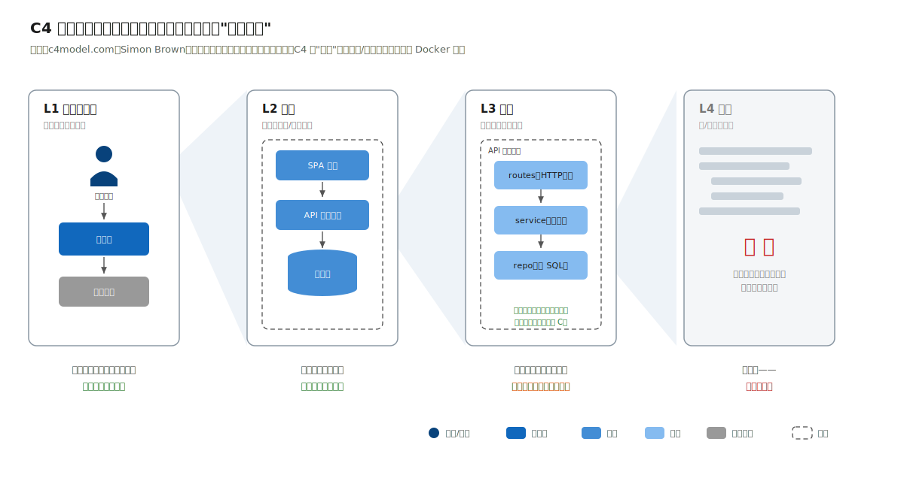

| 层 | 回答 | 受众 | 本书的态度 |
|---|---|---|---|
| L1 系统上下文（System Context） | 系统边界内外有谁 | 所有人（含非技术） | **每案例必画** |
| L2 容器（Container） | 系统由哪些可运行/可存储单元构成 | 开发与运维 | **每案例必画** |
| L3 组件（Component） | 某个容器内部的模块结构 | 该容器的开发者 | 只画有争议的局部 |
| L4 代码（Code） | 类/函数级结构 | —— | **不画**，代码即文档 |

"只画前两层"是 Simon Brown 本人的建议：L3 以下的图维护成本高于阅读价值，很快就会与代码脱节腐烂。本书四个示例工程用另一种方式表达 L3：目录结构即组件图（[附录 C.3](#c3-目录范式目录即架构)），配合架构守护测试保证它不会说谎。

两个必须澄清的术语：

- **C4 的"容器"不是 Docker 容器。** 它指"一个可独立运行或存储数据的单元"：一个进程、一个数据库、一个 SPA、一个文件存储，都是容器。
- **容器图不是部署图。** 容器图回答"有哪些运行单元、谁调谁"；部署图（第⑦步）回答"这些单元跑在哪台机器、哪个网络分区"。政务案例里两张图差异巨大（单进程应用部署为双机热备、跨三个安全分区），混画必然两头失真。

### 坑

- **坑 1：一张图塞进所有元素。** C4 的第一原则是一张图、一个抽象层级、一个受众。上下文图里出现"Redis"，就是层级泄漏。
- **坑 2：图与代码各说各话。** 图上的模块名、连线上的动作名必须与代码逐字一致：本书状态机图的边标注与 `service.ts` 中的 action 字符串完全相同（[附录 B.4](#b4-图形与连线) 的"图码同源"）。
- **坑 3：全量 Component 图。** 画了 20 个组件图，三个月后 15 张过期。只画当下有争议、要评审的局部。

## 第⑥步 数据与接口设计

这一步定核心实体、它们如何流转、系统边界上的契约长什么样。

### 做法与产出物

1. ER 图：只画核心业务实体与关系，配置表/日志表在图上合并为示意。建表 SQL 是 ER 图的最终事实（示例工程 `migrations/001_init.sql`），图负责让人一眼看懂。
2. 状态机：这是信息化系统数据设计的灵魂步骤。审批单、合同、告警、工单，流程类实体的本质就是状态机——枚举状态集合、枚举合法迁移（动作、前置状态、后置状态、执行角色），非法迁移必须被显式拒绝。四个案例每章都有至少一台状态机，且都在 `service.ts` 中以迁移表数据结构（而非 if-else 链）实现。
3. 接口约定：REST 风格加三项全局约定——错误响应结构（业务错误码加人话消息）、分页参数、幂等语义（对创建类接口给出重复提交的行为定义）。接口契约用 OpenAPI 3.x 表达，但不是手写 YAML：示例工程用 Fastify 路由的 JSON Schema 自动生成 `/openapi.json`（@fastify/swagger），校验、文档、契约三者同源，即"契约即代码"。

### 坑

- **坑 1：跳过状态机直接 CRUD。** 一个 `status` 字段加散落在各接口里的 if-else，是信息化系统最常见的腐烂源头：三个月后没人能说清"哪些状态能撤回"。状态机必须是一等公民数据结构：可打印成文档、可穷举测试、可拒绝非法迁移并告知调用方允许的动作（案例工程的 409 响应都带 `allowedActions`）。
- **坑 2：过早的存储优化。** 分库分表、读写分离、缓存，都要回到第③步的量化场景算一笔账。第 3 章会算：3000 员工的集团年合同量在万级，PostgreSQL 单表撑十年无压力；第 4 章会算：400 点/秒的遥测为什么同样不需要专用时序集群，却需要聚合表。
- **坑 3：按表设计接口。** `POST /api/approval_logs` 是把数据库泄漏到系统边界。接口按业务动作设计：`POST /api/applications/:applyNo/actions`，body 是 `{action: "accept", ...}`，动作进入接口签名，状态机就自然成为接口的守卫。

## 第⑦步 横切设计：权限、审计与部署

这一步处理那些每个模块都要碰的问题：谁能干什么、干过什么留没留痕、系统跑在哪里。

### 做法与产出物

1. 权限模型：按谱系选择——RBAC（角色到权限）→ RBAC 加数据范围（角色决定"能做什么"，数据范围决定"对哪些数据"：本人/本部门/本部门及以下/本公司/全部）→ ABAC（属性动态求值）。信息化系统绝大多数落在中间档。关键教训是数据范围必须进入数据模型与查询层设计（部门树的存储方案、每条查询的过滤注入），它不是最后补一个中间件能解决的（第 3 章展开）。多租户系统的租户隔离是数据范围的极端形态，隔离必须有纵深（第 5 章展开）。
2. 审计方案：审计日志不是应用日志。审计日志是业务产出物，记录"谁、何时、对什么、做了什么、结果如何"，要求不可篡改、可按对象回溯，且留存合规——《网络安全法》第 21 条要求网络日志留存不少于六个月（这是法律要求，等保标准 GB/T 22239-2019 在其上叠加技术要求）。实现上通常是状态流转表加独立审计表双轨（第 2 章展开）。
3. 部署图：容器（C4 意义）到机器/网络分区的映射。政务场景按等保分区（接入区/应用区/数据区）；工厂场景按车间/机房分层并标注网络隔离；SaaS 场景标注多实例与滚动发布。配置管理遵循十二要素应用（12factor.net）的"配置进环境变量"，四个示例工程的 `config.ts` 均如此。

### 坑

- **坑 1：权限最后补。** 数据范围权限影响每一条列表查询的 SQL 形状，上线前一周才做，等于重写数据访问层。
- **坑 2：拿应用日志当审计。** pino 打出来的请求日志滚动即删、可被运维修改、无业务语义，审计检查时一条都用不上。
- **坑 3：部署环境假设错误。** 在第②步漏掉"无公网出口"，第⑦步的对象存储、短信、地图选型全部作废。部署图要画的是约束表描述的那个真实机房，而非理想拓扑。

## 第⑧步 ADR 归档与演进规划

这一步把决策的"为什么"留给一年后的人，并让架构在不预支复杂度的前提下面向未来。

### 做法与产出物

1. ADR 集归档。ADR 在①~⑦步中随决策产生（格式见[附录 A.3](#a3-adr架构决策记录模板)），本步整理编号、补齐交叉引用。核心纪律是记录被否决的备选与否决理由——"为什么不"比"为什么"更值钱，因为下一个新人一定会重新提出被否决过的方案。
2. 演进触发表（格式见[附录 A.4](#a4-演进触发表)）。把所有"以后再说"翻译成"当指标 X 超过阈值 Y 时，启动改造 Z（预分析见 ADR-xxx）"。这是奥卡姆原则的配套设施：敢于今天不做，是因为清楚什么时候必须做、到时怎么做。
3. （可选）用场景挑战架构：邀请评审者拿着第③步的质量场景逐条质询设计。这是 SEI 的 ATAM 评审方法的简化用法，本书不走其完整流程。

演进思想的理论来源是《Building Evolutionary Architectures》（Neal Ford 等）的适应度函数（fitness function）概念：为架构特性建立可自动检验的函数。本书示例工程的架构守护测试（依赖方向、模块边界、租户隔离 SQL 扫描）就是最小可用的适应度函数。

### 坑

- **坑 1：只记结论。** 没有备选与否决理由的 ADR 只是通知，不是决策记录。
- **坑 2：ADR 写成设计文档。** 一篇 ADR 一个决策，800 字内说完；系统性设计放正文，ADR 只留决策及其依据。
- **坑 3：演进规划画成终极蓝图。** "二期上微服务、三期上中台"式的路线图承诺，会反过来绑架当期设计。演进是条件触发的，条件不到，蓝图无效。

---

八步走完，还剩一个元问题：这套流程处处强调"不要过度设计"，判断"过度"的标尺是什么。下一节把奥卡姆剃刀在架构上操作化。


---

# 1.5 奥卡姆原则与复杂度预算

> 如无必要，勿增实体。—— 奥卡姆的威廉（14 世纪）

哲学史上的奥卡姆剃刀讲的是解释的经济性：两个解释力相同的理论，选假设更少的那个。移植到架构设计，本书把它操作化为一条可执行的纪律：

> **每一个组件、每一层抽象、每一项技术的引入，都必须能指出一条编号的约束（C-xx）或质量场景（Q-xx）为它作证；作证不出来的，砍掉。**

## 为什么复杂度是"债"而不是"储备"

为不存在的需求引入的复杂度，不会安静地待在角落里等需求到来。它每天都在收息：

- 认知税：新人理解系统的时间随组件数超线性增长，组件之间的交互路径是 O(n²) 的；
- 运维税：每个中间件都要有人懂它的故障模式。Redis 不只是 `docker run redis`，它是持久化策略、内存淘汰、主从切换、大 key 排查的总和；
- 演进税：最讽刺的一条——为"未来灵活性"引入的抽象层常常猜错未来的变化方向，真正的需求来临时反而要先拆掉它。

所以本书把架构评审的默认质询方向反过来：不问"你为什么没用 X"，只问"你引入的每个 X，证据是什么"。

## 复杂度预算：一个实用的思维工具

把团队能承受的复杂度想象成一笔预算：额度由第②步的组织约束决定（团队人数、技能面、运维力量），花销是系统里每一个需要被理解、被运维、被演进的运动部件。

预算思维的价值在于强迫排序——**复杂度要花在业务最难的地方，而不是技术最有趣的地方**。四个案例各自的"预算大头"：

| 案例 | 复杂度花在哪 | 从哪省出来 |
|---|---|---|
| 政务审批 | 配置驱动的动态表单与材料校验、全量审计 | 单进程、无缓存、无 MQ、自研 60 行状态机 |
| 企业合同 | 表驱动条件路由、组织数据权限 | 无 BPMN 引擎、无 ESB、无搜索引擎 |
| 设备监控 | 时序写入管道、增量聚合、有状态告警 | 无 Kafka、无 Flink、告警在内存匹配 |
| SaaS 工单 | 租户隔离纵深、订阅计费状态机 | 仍是单体；Redis 是全书唯一被"批准报销"的中间件 |

注意第四行：奥卡姆不是"永远选最简单的"。案例四的 Q-03（SLA 计时精度）与 C-04（多实例竞争消费）联手为 Redis 作了证，于是它被引入。剃刀剃掉的是没有证据的复杂度，不是复杂度本身。

## 三个高频"伪必要"及其反驳

"以后量大了怎么办？" 写进演进触发表（[附录 A.4](#a4-演进触发表)）。"当日办件量连续一个月超过 1 万，启动拆分评估（预分析已在 ADR）"：扩展性用模块边界预留（改动成本低），不用进程边界预付（运维成本立刻发生）。四个示例工程的模块目录加架构守护测试，就是"预留而不预付"的实物。

"大厂都是这么做的。" 大厂方案是大厂约束（千人团队、亿级流量、专职平台部门）下的正确推论。你的约束表跟它一条都对不上，结论自然不可迁移。这是第③步"抄行业均值"之坑的架构版。

"加一层总没错。" 每一层间接都有认知成本。仓储层（repo）在本书被保留，因为它有编号证据（隔离数据库、可测性，各案例 ADR 有引用）；而"防止以后换框架"的 controller 之上再包一层 facade 之类，作不出证，剃掉。

## 剃刀的边界：什么时候该怀疑"简单"

奥卡姆剃刀有一个常被忽略的前件："解释力相同"。两个方案先要都能满足全部编号的约束与质量场景，才轮到比简单。三种典型的"假简单"：

1. 满足不了约束的简单：政务案例若用"Excel 台账加邮件审批"最简单，但 C-01（等保三级审计要求）直接否决；
2. 把复杂度转嫁给人的简单：省掉到期提醒功能，让法务每周人工翻台账，系统简单了，组织复杂了。系统边界内的简单不能靠边界外的人肉补偿（第 3 章"零调度器提醒"给出了两全的做法）；
3. 不可逆的简单：SQLite 起步是好的简单（repo 层隔离，换 PG 只改一个文件，附录 C 与各工程实证）；把 `tenant_id` 过滤散落在每个接口手写是坏的简单，它省掉的设计会以串租事故的形式连本带利收回（第 5 章 ADR-002）。

判断标准回到可逆性：**好的简单保留掉头的路，坏的简单堵死它**。这也是本书反复强调模块边界、仓储层、适配器的原因——它们是廉价的可逆性保险，是奥卡姆剃刀愿意留下的少数"实体"。

---

方法论至此完整。后面四章进入实操：同一套流程、四种约束、四种架构。建议先读与你工作最近的那一章，再用第 6 章的对照表回看其余三章的分岔点。


---

# 2.1 业务与约束：一个区级审批系统的真实处境

> 流程进度：**①②③** ▸ ④⑤ ▸ ⑥⑦ ▸ ⑧　（方法回看第 1 章 [1.3 节](#13-第①④步从业务到架构风格)）

## 业务场景

某区行政审批局要建设"事项申报审批系统"：企业和个体经营者在政务服务网上对行政许可/登记事项发起申报（如食品经营许可证新办，这是真实存在的行政审批事项），窗口人员受理（受理 / 不予受理 / 要求补正），业务科室审查，科长审批，通过后办结发证。全程留痕备查，承诺时限超期要预警。

参照真实政务服务体系交代两个背景事实：全国一体化在线政务服务平台于 2019 年 11 月整体上线试运行，截至 2024 年 5 月实名注册用户已超 **10.8 亿**、汇聚约 926 万项服务事项（来源：中国政府网、人民网 2024-06 报道），但那是"国家枢纽"的量级；一个区级审批系统的真实负载是日办件数百件，这个量级差异正是本章一切架构决策的底色。

《行政许可法》第四十二条规定行政许可应在受理后二十日内作出决定（可延长十日）；各地政务服务在此之上普遍作出更短的承诺办结时限（政务服务网事项页的真实字段）。时限监察因此是法定义务的系统化，不是锦上添花。

## 第①步产出物：干系人与需求清单

| 干系人 | 核心诉求 | 冲突点 |
|---|---|---|
| 申请企业/个体户 | 少跑腿、快办结、进度透明 | 与审批方的"留痕免责"天然拉扯 |
| 窗口人员 | 受理判断有据可依（材料清单明确） | 与科室在"退件还是补正"上有责任边界之争 |
| 业务科室/科长 | 审查留痕、超期免责有预警 | —— |
| 局领导/监察 | 全局办件统计、超期问责 | 统计口径要求数据不可被事后修改 |
| 省政务服务网 | 统一身份认证接入合规 | 认证方式不由本系统选择 |

主干业务流程的泳道图（第①步的图形产出物，跨泳道箭头即未来系统的关键交互点）：

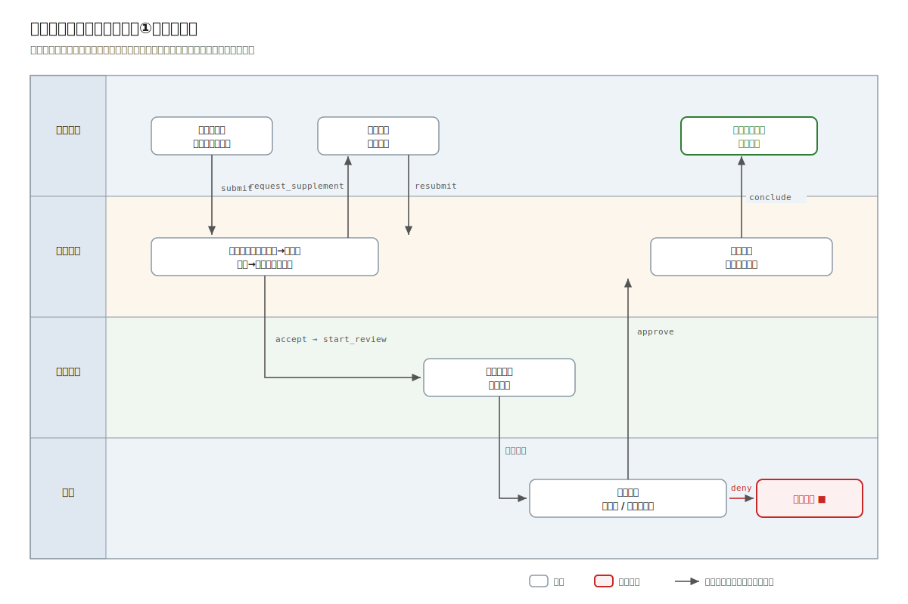

干系人冲突直接转化为设计输入："快办结"对"留痕免责"，决定了每一次状态流转必须同步写审计记录（哪怕多一次写库，见 Q-02）；"退件还是补正"的责任之争，决定了"补正"必须是状态机中的一等状态而非备注字段——谁、何时、要求补什么，都要可回溯。

需求清单（格式见[附录 A.1](#附录-a模板五件套)，节选核心项）：

| 编号 | 需求 | 优先级 | 验收要点 |
|---|---|---|---|
| R-01 | 企业用户浏览事项目录，查看材料清单与承诺时限 | 本期 | 目录页可见每事项的材料清单、法定/承诺时限 |
| R-02 | 企业用户按事项要求提交申报及材料 | 本期 | 缺任一必备材料时提交被拒，且提示缺哪几项 |
| R-03 | 窗口人员受理/不予受理/要求补正 | 本期 | 三种处理均留痕含意见；补正后可重新提交 |
| R-04 | 科室审查、科长审批，通过后办结发证 | 本期 | 审批环节顺序不可越级；办结产生证照编号 |
| R-05 | 每次流转记录操作人、时间、意见，不可修改 | 本期 | 任意申报单可回放全部操作历史 |
| R-06 | 超承诺时限的在办件可被查询预警 | 本期 | 超期件列表准确命中，含超期天数 |
| R-07 | 事项目录（材料清单、时限、环节）可配置 | 本期 | 新增一类事项不改代码 |
| R-08 | 对接省统一身份认证单点登录 | 本期 | 通过省网 OAuth2/OIDC 流程登录 |
| R-09 | 办结短信通知申请人 | 本期 | 经政务短信网关发送 |
| R-90 | 电子证照对接（办结自动签发） | 演进 | 触发条件见演进触发表 E-01 |
| R-91 | 跨部门数据共享核验（营业执照信息调用） | 演进 | 见 E-02 |
| R-92 | 电子印章 | 演进 | 见 E-03 |

"演进"档非空是纪律（第 1 章第①步坑 2）：电子证照、数据共享的对接规范由上级平台决定，本期为它们预留的只有模块边界，没有代码。

## 第②步产出物：约束清单

这是本案例与其他三案例分岔的第一现场。按 arc42 三分法：

| 编号 | 约束 | 来源 | 可谈判 |
|---|---|---|---|
| C-01 | 等保三级：双因子认证、访问控制、安全审计、数据备份，每年测评 | GB/T 22239-2019《信息安全技术 网络安全等级保护基本要求》+ 主管部门定级 | 否 |
| C-02 | 部署于政务外网，**无公网出口**；一切外部能力只能走政务网内服务 | 网络现状 | 否 |
| C-03 | 目标环境为信创软硬件：国产化 CPU/OS（麒麟系）、国产数据库 | 上级信息化主管部门文件 | 否 |
| C-04 | 必须对接省统一身份认证（政务服务网 SSO） | 全国一体化平台接入规范 | 否 |
| C-05 | 无专职 SRE；信息中心 3 人兼管全局十余套系统 | 组织现状 | 否（短期） |
| C-06 | 短信须经政务短信网关发送 | C-02 的推论 + 采购现状 | 否 |

注意 C-02 的杀伤半径：任何依赖公网 SaaS 的方案（云短信、公有云对象存储、外部地图/OCR API）直接出局，无论多优雅。第 1 章"部署环境假设错误"之坑在政务领域是最常见的翻车点。

## 第③步产出物：质量属性场景

从 ISO/IEC 25010:2023 的 9 个特性中选 4 个生死攸关的，写成六要素场景（格式见[附录 A.2](#a2-质量属性场景表)）：

| 编号 | 属性 | 场景（六要素浓缩） | 响应度量 |
|---|---|---|---|
| Q-01 | 性能效率 | 工作日 9:00 高峰，全区约 400 名窗口/科室人员并发查询待办与详情 | 95 分位 < 800ms |
| Q-02 | 安全性（可审计） | 监察部门对任意申报单发起追溯 | 100% 流转有留痕（操作人/时间/意见），留痕只增不改 |
| Q-03 | 可靠性 | 数据库主机故障 | RTO ≤ 4h，RPO ≤ 24h（每日备份 + 异地备份，见 C-01 三级要求） |
| Q-04 | 可维护性 | 新政策出台，需上线一类新审批事项 | 事项配置 ≤ 1 人日完成，零代码变更 |

**优先级排序：Q-02 > Q-04 > Q-03 > Q-01。** 在政务语境里，可审计性压倒性能：每次流转同步双写业务状态与审计日志，账面上多一次写库，但 Q-01 的量级（见下面的算账）证明这点开销买得起。

## 把量级算出来（拒绝"抄行业均值"）

第 1 章第③步的坑 3 说：响应度量必须来自本系统的真实量级估算，算给你看：

- 写入侧：高峰日办件 300 件（区级实际量级，示例假设值），每件全流程约 5 次状态流转 + 1 次申报 ≈ 1800 次写事务/日，折合 0.06 次/秒（8 小时工作制），峰值放大 20 倍也只有 1.2 次/秒；
- 读取侧：400 人 × 每人每分钟约 2 次查询 = 13 次/秒，峰值按 3 倍取 40 次/秒；
- 数据规模：年办件 7 万件 × 每件约 20 行相关记录（材料、留痕）≈ 140 万行/年，十年不过千万行量级。

结论清单（每一条都会在后续 ADR 里被引用）：这个量级下，缓存层、消息队列、分库分表、微服务全都没有证据（分别对应 Q-01 单库即达标、无异步削峰需求、数据量太小、见 ADR-001）。区级政务系统的难点从来不在吞吐，而在 C-01~C-06 的合规与环境约束，这正是架构决策的主战场。


---

# 2.2 架构决策：为约束设计，而不是为流行设计

> 流程进度：①②③ ▸ **④⑤** ▸ ⑥⑦ ▸ ⑧　（方法回看第 1 章 [1.3](#13-第①④步从业务到架构风格)、[1.4 节](#14-第⑤⑧步从建模到决策归档)）

## 第④步：架构风格选型

候选风格对比，列是 [2.1 节](#21-业务与约束一个区级审批系统的真实处境)的编号产出物（这是第 1 章的纪律：不抄网上的通用优缺点表）：

| 候选 | C-05 弱运维 | C-03 信创兼容 | Q-01 性能 | Q-04 可维护 | 结论 |
|---|---|---|---|---|---|
| 微服务（网关+注册中心+N服务） | ✗ 3 人兼职维护十余套系统，再加分布式组件不现实 | ✗ 每个中间件都要过信创兼容认证 | ✓（远超需求） | △ 边界清晰但变更涉及多服务 | 否决 |
| 传统三层单体（无模块纪律） | ✓ | ✓ | ✓ | ✗ 事项逻辑散落，R-07 难保障 | 否决 |
| **模块化单体** | ✓ 单进程单库 | ✓ 兼容面最小 | ✓ | ✓ 模块边界受工具守护 | **采纳** |

完整论证见 [ADR-001](#adr-001-采用前后分离的模块化单体架构)。这里强调否决微服务的两条硬证据：[2.1 节](#21-业务与约束一个区级审批系统的真实处境)算过的量级（峰值写 1.2 次/秒、读 40 次/秒）给不出任何一条需要独立伸缩的服务；C-05 说明团队的复杂度预算（第 1 章 [1.5 节](#15-奥卡姆原则与复杂度预算)）根本不够支付分布式的运维税。"以后量大了怎么办"已登记进演进触发表 E-05，不预付。

本章共 4 篇 ADR，每篇都能指出作证的编号：

| ADR | 决策 | 关键证据 |
|---|---|---|
| [ADR-001](#adr-001-采用前后分离的模块化单体架构) | 模块化单体，前后分离 | C-05、C-03、量级估算 |
| [ADR-002](#adr-002-事项规则配置化数据驱动而非代码驱动不引入低代码平台) | 事项规则配置化（数据驱动），不引低代码平台 | R-07、Q-04 |
| [ADR-003](#adr-003-审批流用自研状态机迁移表实现不引入工作流引擎) | 自研状态机迁移表，不引工作流引擎 | 流程线性、C-05；**案例二将当面推翻此决策**（上下文不同） |
| [ADR-004](#adr-004-信创数据库兼容策略面向-pg-系收敛repo-层做缝合线) | 面向 PG 系收敛 SQL，repo 层做缝合线 | C-03 |

## 第⑤步：C4 建模

### 系统上下文（L1）

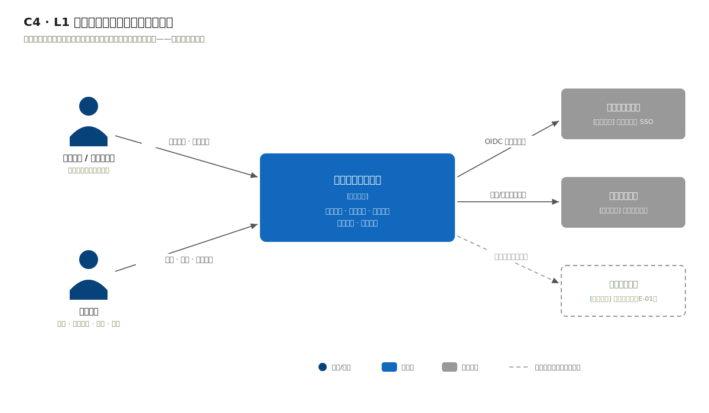

读图要点：系统边界外有三个不受我们控制的参与方：省统一身份认证（C-04，认证协议由对方规定）、政务短信网关（C-06）、以及虚线的电子证照平台（演进项 R-90，画进图但明确标注"本期不对接"）。上下文图的价值就在这里：它是与外部方对齐"谁调谁、什么协议"的谈判底图。

### 容器图（L2）

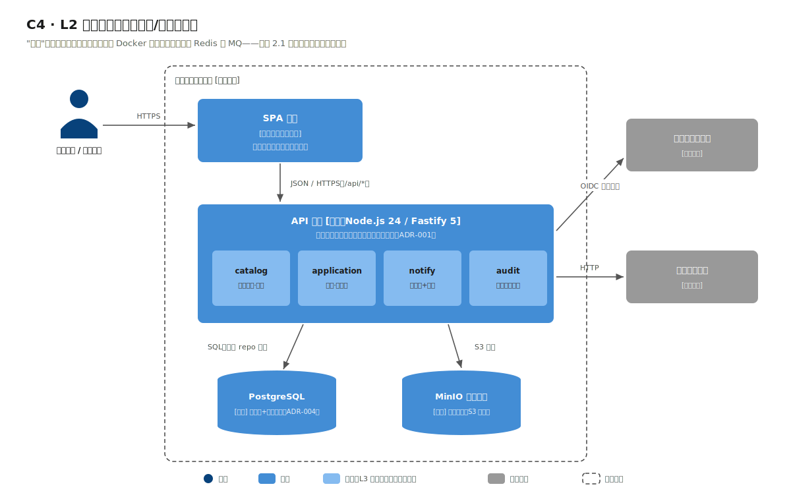

四个容器（C4 意义上的"可运行/可存储单元"，不是 Docker 容器，见第 1 章第⑤步的术语澄清）：

1. **SPA 前端**：申报端与审批端同一工程、按角色路由（区级系统不值得拆两个前端工程，奥卡姆）；
2. **API 单体（Node.js/Fastify）**：图中标注了内部模块分区（事项目录 catalog / 申报审批 application / 通知 notify / 审计 audit），这是对模块化单体"模块"的 L2 级预告，L3 级由工程目录直接表达（[附录 C.3](#c3-目录范式目录即架构)）；
3. **PostgreSQL**：业务库与审计留痕同库不同表（量级不支持拆库，Q-02 的"不可改"由应用层只增不改 + 数据库权限实现）；
4. **MinIO 对象存储**：申报材料文件。选它的理由在 C-02/C-03 语境下很实际：S3 协议是事实标准、政务网内可自部署、信创环境有多家兼容实现。

连线上的协议与动作都是真实接口语义（`POST /api/applications`、OIDC 授权码流程），与示例工程的 OpenAPI 文档同源。

### 为什么没有 Redis、没有 MQ

上下文图与容器图上找不到缓存与消息队列，这是 [2.1 节](#21-业务与约束一个区级审批系统的真实处境)算账的直接推论，并非遗漏。通知发送（R-09）这种"天然想上 MQ"的场景，在日均几百条短信的量级下用出站表加定时重试（notify 模块内一张表、一个 `setInterval`）就是全部所需：失败重试、发送留痕一样不少，少养一个中间件。这个手法在案例二会升级为跨系统集成的通用模式（防腐适配器 + 出站重试表），届时再展开。


---

# 2.3 数据、接口与等保落地

> 流程进度：①②③ ▸ ④⑤ ▸ **⑥⑦** ▸ ⑧　（方法回看第 1 章 [1.4 节](#14-第⑤⑧步从建模到决策归档)）

## 状态机：审批系统的心脏

申报单是典型的流程类实体，第 1 章第⑥步的判断在此全部兑现：它的本质是状态机，不是带 status 字段的 CRUD。


8 个状态、8 条合法迁移边。图上每条边的动作名与代码逐字一致（图码同源，[附录 B.4](#b4-图形与连线)）。下面就是示例工程 `src/modules/application/service.ts` 中的完整迁移表，全部业务流转规则 60 行不到：

```ts
export const TRANSITIONS: Record<Action, { from: Status; to: Status }> = {
  accept:             { from: 'submitted',     to: 'accepted' },
  reject_accept:      { from: 'submitted',     to: 'not_accepted' },
  request_supplement: { from: 'accepted',      to: 'supplementing' },
  resubmit:           { from: 'supplementing', to: 'accepted' },
  start_review:       { from: 'accepted',      to: 'in_review' },
  approve:            { from: 'in_review',     to: 'approved' },
  deny:               { from: 'in_review',     to: 'denied' },
  conclude:           { from: 'approved',      to: 'concluded' },
};
```

迁移表作为一等公民数据结构，带来三项直接收益：

1. **非法迁移被显式拒绝，且告诉调用方现在能做什么。** 以下是冒烟实录（对 `submitted` 状态的申报单直接审批）：

```bash
$ curl -s -X POST "http://localhost:3001/api/applications/310104-20260702-0007/actions" \
    -H 'Content-Type: application/json' \
    -d '{"action":"approve","operator":"科长-王建国"}'
# HTTP 409
{
  "error": {
    "code": "ILLEGAL_TRANSITION",
    "message": "当前状态 submitted 不允许动作 approve",
    "details": {
      "currentStatus": "submitted",
      "allowedActions": ["accept", "reject_accept"]
    }
  }
}
```

   `allowedActions` 由 `allowedActionsFrom(status)` 对迁移表过滤而得：前端的操作按钮、接口的错误提示、测试的断言，三者用的是同一份数据。消费侧因此不必硬编码"哪个状态显示哪些按钮"，照着接口返回渲染即可（下面是前端示意，本书不交付前端工程）：

   ```js
   // 详情接口返回 { status, allowedActions: ["accept","reject_accept"], ... }
   const { allowedActions } = await fetch(`/api/applications/${applyNo}`).then((r) => r.json());
   const LABEL = { accept: '受理', reject_accept: '不予受理', start_review: '转审查',
                   approve: '通过', deny: '不予通过', conclude: '办结', request_supplement: '要求补正' };
   // 按钮可用性完全由后端状态机决定，前端零状态规则
   renderButtons(allowedActions.map((a) => ({ action: a, label: LABEL[a] })));
   ```
2. **终态天然封闭。** `concluded / denied / not_accepted` 不出现在任何边的 `from` 里，任何动作都会 409，不需要写一行"如果已办结则禁止"的防御代码。
3. **可穷举测试。** 工程的测试直接遍历非法组合断言 409（`tests/application.test.ts`），状态机的正确性不靠人肉回归。

## 数据模型


四张业务表的角色分工（建表 SQL 见工程 `src/db/migrations/001_init.sql`，图上仅画核心列）：

- `catalog_items`（规则的家，ADR-002）：材料清单（JSON 数组）、法定/承诺时限都在这里，是 R-07"新增事项零代码"的物质基础；
- `applications`（状态的家）：唯一可变的业务表，可变列被压缩到最少（status 加三个时间戳加证照号）；
- `application_materials`：材料快照；
- `approval_logs`（审计的家，Q-02）：只增不改，应用层没有任何 UPDATE/DELETE 路径。每次流转在同一事务里双写 `applications` 与 `approval_logs`，这是"可审计性 > 性能"排序（[2.1 节](#21-业务与约束一个区级审批系统的真实处境)）的直接落点。

材料齐全性校验的数据驱动效果，冒烟实录（缺两项材料）：

```bash
# HTTP 400
{
  "error": {
    "code": "MATERIALS_MISSING",
    "message": "缺少必备材料 2 项",
    "details": { "missing": ["食品安全管理制度", "从业人员健康证明"] }
  }
}
```

缺哪几项由 `catalog_items.required_materials` 与提交材料求差集得出。换一个事项，规则跟着配置走，代码零变更（Q-04 达标的证明写在测试里）。

## 接口约定

按业务动作设计，不按表设计（第 1 章第⑥步坑 3）：流转统一走 `POST /api/applications/:applyNo/actions`，body 为 `{action, operator, opinion?}`，动作进入签名，状态机自然成为接口守卫。错误结构全局统一 `{error: {code, message, details?}}`。

契约即代码：路由上的 JSON Schema 同时承担入参校验（Fastify 内置 Ajv）与文档生成（@fastify/swagger），`GET /openapi.json` 的实录输出：

```json
{
  "openapi": "3.0.3",
  "paths": [
    "/api/items", "/api/items/{code}",
    "/api/applications", "/api/applications/{applyNo}",
    "/api/applications/{applyNo}/actions", "/api/notify/dispatch"
  ]
}
```

## 等保三级的架构落地（C-01）

GB/T 22239-2019 的条目很多，从架构师视角挑真正改变设计的四类（其余属于运维与管理制度范畴）：

| 等保关注点 | 本系统落地 | 对应设计元素 |
|---|---|---|
| 身份鉴别（双因子） | 省统一身份认证 SSO（C-04）+ 审批端短信验证码二次认证 | 上下文图的认证连线；notify 模块 |
| 访问控制 | RBAC：申请人/窗口/科室/科长/监察五角色，路由级 + 数据级双重校验 | 权限中间件（生产设计，见 2.4 映射表） |
| 安全审计 | 业务留痕 `approval_logs`（只增不改）；**网络与系统日志留存不少于六个月——注意此要求出自《网络安全法》第二十一条**，等保在其上叠加防篡改与定期备份的技术要求 | ER 图 approval_logs；部署图日志服务器 |
| 数据备份恢复 | 每日全量备份 + 备份介质异地存放（三级要求异地备份功能），支撑 Q-03 的 RPO ≤ 24h | 部署图备份链路 |

一个常见误区在此纠正：应用日志不是审计日志（第 1 章第⑦步坑 2）。Fastify/pino 打的请求日志滚动即删、可被运维修改，监察追溯（Q-02）一条都用不上；`approval_logs` 是业务产出物，进 ER 图、进备份策略、进测试断言。


---

# 2.4 部署、工程验证与演进

> 流程进度：①②③ ▸ ④⑤ ▸ ⑥⑦ ▸ **⑦⑧**　（方法回看第 1 章 [1.4 节](#14-第⑤⑧步从建模到决策归档)）

## 部署视图：按真实机房画（C-02）

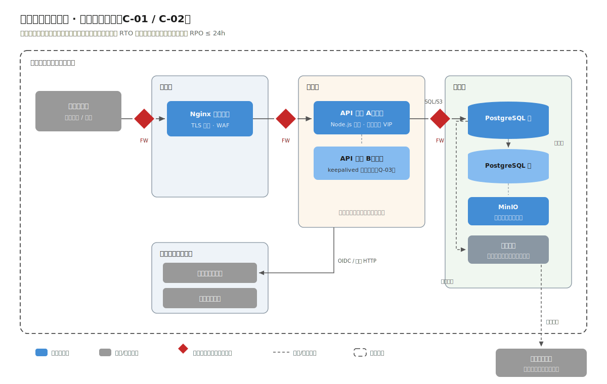

读图要点（第 1 章的提醒：部署图画的是约束表描述的那个真实机房，不是理想拓扑）：

- **三个安全分区**是等保定级备案时的标准分区法：接入区（Nginx 反代 + WAF）、应用区（API 单体双节点）、数据区（PostgreSQL 主备 + MinIO + 备份存储）。区间由防火墙策略控制最小开放端口；
- **双节点不是为了性能**（[2.1 节](#21-业务与约束一个区级审批系统的真实处境)算过，单节点余量巨大），而是为了 Q-03 的 RTO：主备热备（keepalived VIP 漂移思路），发布时也能滚动不中断；
- **没有画公网。** 政务外网与互联网的边界不归本系统管：申请人从政务服务网入口进来，流量经统一接入平台转发。这就是 C-02 在图上的样子；
- 备份链路指向异地备份存储：本地每日全备加定时批量传送至异地机房，对应 GB/T 22239-2019 三级"异地数据备份功能"的要求。

## 示例工程走读

运行工程后 `http://localhost:3001/` 是内嵌只读看板，直接读种子数据：

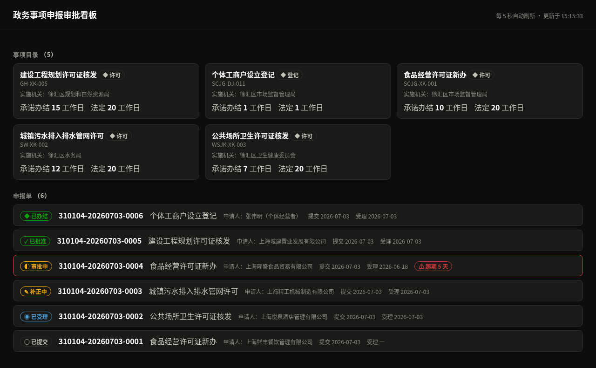

申报编号前缀 310104 是徐汇区的真实 GB/T 2260 区划码，实施机关按真实区划名限定（徐汇区市场监督管理局等，据 `dataset/01-gov-approval/divisions.json` 校验）；申请人企业名为脱敏虚构。

配套工程 `code/01-gov-approval/`（运行方式见工程 README 与[附录 C](#附录-c示例工程共用约定)）。工程不是玩具，它用可执行的方式作证本章的四个 ADR：

```
src/
├── app.ts                    # 组合根：全系统依赖图的唯一可视位置（ADR-001）
├── modules/
│   ├── catalog/              # 事项目录模块：规则的家（ADR-002）
│   │   └── {index,routes,service,repo,types}.ts
│   ├── application/          # 申报审批模块：状态机的家（ADR-003）
│   │   └── {index,routes,service,repo,types}.ts
│   └── notify/               # 通知模块：出站表 + 定时重试（办结即入队短信）
│       └── {index,routes,service,repo,types}.ts
├── shared/db.ts              # node:sqlite 封装：仓储层下面的缝合线（ADR-004）
└── db/{migrate.ts,seed.ts,migrations/{001_init,002_notify}.sql}
```

`notify` 模块把 [2.2 节](#22-架构决策为约束设计而不是为流行设计)讲的"出站表 + 定时重试"落成可运行代码：办结动作在业务事务里只写 `outbound_messages` 一张表（把"调用短信网关成功"改写为"落表成功"），真正的发送发生在事务之外：`server.ts` 每分钟调用 `notify.dispatchDue()` 扫描到期消息，失败按 1min/5min/30min/2h 退避重试，超出序列转 dead 人工处理。发送器（`Sender`）以参数注入，测试用可控 mock 替换真实网关，因此退避与转 dead 都能穷举测试。

三条验证命令与它们各自证明的事：

| 命令 | 证明 |
|---|---|
| `npm test`（24 个测试） | 状态机全部合法/非法迁移、条件更新守卫、材料校验、发号唯一性、超期口径一致、出站表退避转 dead——**行为有测试作证** |
| `tests/architecture.test.ts`（含于 npm test） | 依赖方向单向、跨模块只走 index、领域层不碰 HTTP，外加扫描器自检——**模块边界有机器守护**（第 1 章"适应度函数"的最小实现） |
| `npm run smoke`（9 场景） | 起真实 HTTP 服务跑完整业务剧本，含办结短信的出站与投递——本章引用的每段 curl/JSON 都来自它的输出 |

## 示例工程 ⇄ 生产架构映射表

示例工程为"零外部依赖可运行"做了三处替换。替换能这么干净，本身就是 repo/适配器分层（ADR-004）的实证——缝合线在哪，替换就发生在哪：

| 生产设计（本章正文） | 示例工程 | 缝合线位置 | 替换成本 |
|---|---|---|---|
| PostgreSQL（信创 PG 系） | node:sqlite | `shared/db.ts` + 各模块 `repo.ts` | 改一个文件 + SQL 方言微调 |
| MinIO 对象存储（材料文件） | `file_ref` 存引用字符串 | 材料写入点（repo） | 新增 storage 适配器 |
| 政务短信网关（出站发送） | notify 模块出站表 + 内置成功 Sender | `notify` 的 `Sender` 注入点 | 换一个 Sender 实现 |
| 省统一认证（SSO 登录） | 未实现（演示聚焦审批核心） | 上下文图已画界；auth 是独立模块位 | 新增 adapter 模块 |

## 第⑧步：演进触发表

把 [2.1 节](#21-业务与约束一个区级审批系统的真实处境)需求清单的"演进"档翻译成条件契约（格式见[附录 A.4](#a4-演进触发表)）：

| 编号 | 触发条件 | 启动改造 | 提前量 |
|---|---|---|---|
| E-01 | 省电子证照平台开放区级接入且下发接口规范 | notify 模块旁新增 licence 适配器模块，办结动作挂出站事件 | 2 个月 |
| E-02 | 跨部门核验接口（如营业执照信息）可用 | 申报校验处增加外部核验步骤（catalog 配置新增"核验项"类型） | 1 个月 |
| E-03 | 电子印章采购到位 | 办结文书生成处集成签章 SDK | 1 个月 |
| E-05 | 日办件量连续一个月 > 1 万件，或 95 分位响应 > 800ms 持续一周 | 重估架构：先查库（索引/慢查询），仍不足则按模块边界拆受理与审批服务（ADR-001 预分析） | 3 个月 |

E-05 是"以后量大了怎么办"的正确归宿：扩展的可能性用模块边界预留（已支付，成本≈0），实施则用触发条件挂账（未支付）。

---

## 本章小结（供第 6 章对照）

| 决策点 | 本案例答案 | 决定性证据 |
|---|---|---|
| 架构风格 | 模块化单体 | C-05 弱运维、量级估算 |
| 流程实现 | 自研状态机迁移表 | 流程线性、跳转有限 |
| Redis / MQ | 都不要 | 量级无证据 |
| 数据库 | PG 系收敛 + repo 缝合线 | C-03 信创 |
| 集成方式 | 适配器 + 出站重试表 | C-02 无公网、低频 |


---

# ADR-001: 采用前后分离的模块化单体架构

- 状态：已采纳
- 日期：2026-07-02
- 关联：C-03、C-05、Q-01、Q-04、R-90/91/92（演进档）

## 背景（Context）

区级审批系统，峰值写 1.2 次/秒、读 40 次/秒、数据量十年千万行级（见 [2.1 节](#21-业务与约束一个区级审批系统的真实处境)估算）。信息中心 3 人兼管十余套系统，无专职 SRE（C-05）；目标环境为信创软硬件，每引入一个中间件都要过兼容认证（C-03）。

## 备选方案

**A. 微服务（网关 + 注册中心 + 事项/申报/审批/通知四服务）**
否决理由：量级估算给不出任何一条需要独立伸缩或独立发布的服务（Q-01 反证）；运维面（服务发现、链路追踪、多进程部署）远超 C-05 的复杂度预算；每个组件的信创认证成本叠加（C-03）。

**B. 传统三层单体（controller/service/dao 分层但无模块纪律）**
否决理由：分层只约束技术方向，不约束业务边界；事项、申报、通知逻辑会互相渗透，R-90~92 三个演进项将来无处安放接缝，Q-04 的"新增事项零代码"也难维持。

**C. 模块化单体（单进程内按业务域分模块，边界受工具守护）——采纳**

## 决策（Decision）

单进程 Fastify 应用 + 单库；内部按 catalog / application / notify / audit 分模块；依赖方向与跨模块访问由架构守护测试强制（[附录 C.5](#c5-架构守护测试)）。前后分离，SPA 单工程按角色路由。

## 后果（Consequences）

- 好处：部署与备份是一个进程一个库（C-05 友好）；模块边界即未来拆分线（演进 E-05 预留）；信创兼容面最小。
- 代价：模块纪律需要测试守护（已支付：约 80 行）；全部负载同进程，无法按模块伸缩——量级证明十年内无此需求。
- 重新评估条件：E-05（日办件 > 1 万/月 或 95 分位 > 800ms 持续一周）。


---

# ADR-002: 事项规则配置化——数据驱动而非代码驱动，不引入低代码平台

- 状态：已采纳
- 日期：2026-07-02
- 关联：R-07、Q-04、C-05

## 背景（Context）

事项会持续增减（新政策出台即上线新事项），每个事项的差异集中在三处：材料清单、承诺时限、审批环节。Q-04 要求"新增一类事项 ≤ 1 人日、零代码变更"。

## 备选方案

**A. 每事项硬编码**（if (itemCode === 'SCJG-XK-001')…）
否决理由：直接违反 R-07/Q-04；每次新政策都走发版流程，审批局的时效要求等不起。

**B. 引入低代码/表单引擎平台**
否决理由：事项数量级是数十种、字段类型有限，低代码平台的能力上限远超需求下限；平台自身是重型组件（C-05 复杂度预算不足），且信创兼容面扩大（C-03 连带）。奥卡姆：为数十份表单买一座工厂，不划算。

**C. 配置数据驱动——采纳**：材料清单、时限存 `catalog_items` 表；校验、超期判断读配置执行。生产设计中申报表单同理：以 JSON Schema（真实标准，Ajv 原生校验）描述每事项表单，前端渲染与后端校验共用一份定义。

## 决策（Decision）

事项规则全部落在目录配置数据中；申报校验（材料差集）、超期判断（承诺时限）均为读配置的通用逻辑。示例工程以材料清单校验完整演示该机制（缺项 400 并列出缺项，有测试作证）。

## 后果（Consequences）

- 好处：新增事项 = 一条 INSERT（Q-04 达标）；规则可审计（配置变更即数据变更）。
- 代价：配置正确性成为运行时问题——需配套事项配置的管理界面与生效前校验（本期用受控 seed/管理接口，界面列入迭代）。
- 重新评估条件：事项表单出现跨字段联动/多步向导等复杂交互需求时，重估表单引擎（先看 JSON Schema 生态的 UI Schema 方案，再看平台）。


---

# ADR-003: 审批流用自研状态机迁移表实现，不引入工作流引擎

- 状态：已采纳（案例二 ADR-001 在不同上下文中推翻了本决策的结论——请务必对照阅读，见第 3 章）
- 日期：2026-07-02
- 关联：R-03、R-04、Q-02、C-05

## 背景（Context）

审批流程：提交 → 受理（可补正往返）→ 审查 → 审批 → 办结，含不予受理/不予通过两个否定终态。关键性质：流程形状固定且线性（环节由《行政许可法》程序决定，不因事项而变——变的只是材料与时限，那是 ADR-002 的领地）；分支只有"退回补正"一种回边。

## 备选方案

**A. 引入工作流引擎（BPMN）**
候选盘点（真实生态）：Camunda、Flowable 均为 Java 系，Node 侧只能走外置 REST 集成——意味着政务网内多部署一套 JVM 服务（C-05 复杂度预算、C-03 认证面）；Node 生态无同量级成熟等价物。
否决理由：本流程用不到 BPMN 的核心能力（并行网关、子流程、动态会签）；为一条线性流程养一个引擎，违反奥卡姆。

**B. status 字段 + 散落 if-else**
否决理由：第 1 章第⑥步"最常见腐烂源头"；非法迁移防不住，Q-02 的留痕一致性靠自觉。

**C. 自研状态机迁移表——采纳**：`Record<Action, {from, to}>` 一张表 + 通用 act() 函数（校验迁移 → 同事务更新状态并写留痕）。

## 决策（Decision）

状态机迁移表为一等公民数据结构（60 行内），非法迁移 409 并返回 allowedActions；全部迁移在同一事务内双写业务状态与审计留痕。

## 后果（Consequences）

- 好处：可穷举测试；图码同源；零新增组件。
- 代价：流程改动 = 代码改动。本案例接受此代价，因为流程由法定程序决定、由开发者维护。
- 一处易被单进程掩盖的功课：状态流转是"读当前态 → 判合法性 → 写新态"，单进程同步执行看不出问题，但移植到异步或多进程时，读与写之间状态可能被并发改动（TOCTOU）。示例工程的写入因此带条件守卫——`UPDATE … WHERE id = ? AND status = <当前态>`，命中 0 行即抛冲突而非静默覆盖（`repo.updateStatus` 返回受影响行数，service 据此判定）。这行守卫在单进程下永远命中，是提前为并发化交的保费。
- 重新评估条件：当"流程配置权"需要交给业务人员、或路由出现多维条件分支时，本决策不再成立——**这正是案例二面对的处境，见第 3 章 ADR-001 如何引用并推翻本文**。上下文变了，决策就该变；ADR 的价值就是把"当时为什么对"留下来。


---

# ADR-004: 信创数据库兼容策略——面向 PG 系收敛，repo 层做缝合线

- 状态：已采纳
- 日期：2026-07-02
- 关联：C-03、Q-03

## 背景（Context）

目标环境要求国产数据库（C-03），但采购批次未定、品牌未定。国产库生态两大技术路线：Oracle 语法系（达梦为代表）与 PostgreSQL 系（人大金仓 KingbaseES、瀚高等基于 PG 内核）。开发期必须先选一条路线，否则 SQL 方言两头下注、两头都不深。

## 备选方案

**A. 面向达梦（Oracle 系）开发**
否决理由：Oracle 方言的私有特性多，开发期无法用开源库 1:1 验证；团队无 Oracle 经验（组织约束）。

**B. 深度绑定重型 ORM 以"屏蔽方言"**
否决理由：ORM 对方言差异的屏蔽在边角处（锁语义、返回子句、JSON 函数）总会漏；引入的抽象层复杂度在本系统查询复杂度（单表为主 + 少量两表 JOIN）下没有证据支撑。

**C. 面向 PG 系收敛 + repo 层缝合线——采纳**

## 决策（Decision）

开发与测试用 PostgreSQL；SQL 收敛到 PG 通用子集（不用扩展、不用私有函数），建 SQL 兼容性检查清单；所有 SQL 只存在于各模块 `repo.ts`，数据库连接细节只存在于 `shared/db.ts`——迁移到金仓/瀚高时，改动被约束在这两处。

## 后果（Consequences）

- 好处：兼容验证可在开发期完成（开源 PG 即可）；迁移成本被结构性锁定在 repo 层——示例工程用 node:sqlite 完成的三处替换（见 2.4 映射表）就是这条缝合线有效性的实证。
- 代价：放弃 PG 高级特性（本系统本就用不到）；上线前仍需在目标库上跑全量测试（等保测评前的例行项）。
- 重新评估条件：采购定标为 Oracle 系国产库时，repo 层 SQL 需逐条翻译——工作量已被隔离，但不为零。


---

# 3.1 业务与约束：当"规则由谁改"成为核心问题

> 流程进度：**①②③** ▸ ④⑤ ▸ ⑥⑦ ▸ ⑧　（方法回看第 1 章 [1.3 节](#13-第①④步从业务到架构风格)；本章聚焦"与案例一不同之处"，相同的方法论步骤不再复述）

## 业务场景

一家中型制造集团（1 个总部 + 6 家子公司，约 3000 名员工，示例假设值）要建设合同全生命周期管理系统：业务人员起草合同，按金额与合同类型走分级审批，通过后用印、履约、到期预警、归档检索。与三个既有系统打交道：HR 系统（组织架构主数据源）、钉钉（审批待办触达）、ERP（供应商/客户主数据）。

两个真实的制度背景交代量级与合规语境：《民法典》合同编规定了 19 种典型合同（买卖，供用电水气热力，赠与，借款，保证，租赁，融资租赁，保理，承揽，建设工程，运输，技术，保管，仓储，委托，物业服务，行纪，中介，合伙），系统的合同类型字典直接对齐法定分类；《印花税法》（2022-07-01 施行）下买卖合同（动产）按价款的万分之三、银行借款合同按万分之零点五贴花，台账的税务口径字段有法定出处。中型企业年合同量无权威公开统计，本案例按年 5000 份取示例假设值（约每员工 1.7 份/年，制造业偏采购销售密集型的保守估计）。

## 与案例一的第一眼差异

功能清单乍看和政务审批高度相似：提交 → 多级审批 → 归档，也要留痕、也要提醒。但第②步的约束换血了，这是全书反复演示的事：架构分岔发生在约束，不发生在功能清单。

## 需求清单（节选）

| 编号 | 需求 | 优先级 | 验收要点 |
|---|---|---|---|
| R-01 | 业务人员基于类型起草合同（金额、相对方、期限） | 本期 | 合同编号自动生成且全局唯一 |
| R-02 | 按金额与类型自动生成审批链 | 本期 | <10 万 2 步；≥10 万 3 步；≥100 万 4 步（示例路由） |
| R-03 | **审批路由规则由法务自行调整，无需开发介入** | 本期 | 法务改一条路由规则 ≤ 0.5 人日、零发版 |
| R-04 | 按序审批，可驳回；驳回后修改重新提交走新一轮 | 本期 | 越级审批被拒绝；每轮审批链完整留存 |
| R-05 | 到期提醒：30 天内到期合同可查询/推送 | 本期 | 命中精确（不含已过期、未生效） |
| R-06 | 台账检索（编号/相对方/状态/到期区间） | 本期 | 常用条件查询 95 分位 < 1s |
| R-07 | 数据权限：本人/本部门/本部门及以下/本公司/全集团 | 本期 | 越权查询返回空集而非报错 |
| R-08 | 审批待办推送钉钉；组织架构从 HR 同步 | 本期 | 推送失败自动重试并可人工对账 |
| R-90 | 电子签章 | 演进 | 见演进表 |
| R-91 | 合同正文全文检索 | 演进 | 见演进表 E-01 |

## 约束清单——本案例的分岔现场

| 编号 | 约束 | 来源 | 可谈判 |
|---|---|---|---|
| C-01 | 组织架构**每月变动**（部门撤并、兼岗、代理审批常态化） | 集团组织现状 | 否 |
| C-02 | 审批路由规则的**调整权在法务部**，法务不写代码 | 内控制度：路由是合规规则不是技术配置 | 否 |
| C-03 | 组织与人员主数据以 **HR 系统为唯一权威源**，本系统只读 | 集团主数据管理规定 | 否 |
| C-04 | 审批触达必须走**钉钉待办**（集团已全员钉钉） | 惯例约束（已购授权） | 理论可谈，实际不必 |
| C-05 | 内部系统：工作时间可用即可；但**数据准确性与可追溯性要求高**（审计部门年审） | 内控 + 审计要求 | 否 |
| C-06 | IT 部门 5 人，以业务开发为主，无独立运维岗 | 组织现状 | 否 |

对照案例一：那里的约束来自外部合规（等保、信创、政务网），这里的约束来自组织内部的变动性与权力划分。C-01（组织月变）和 C-02（法务改规则）是两条案例一根本没有的约束，它们将分别催生本章的数据权限设计（ADR-002）与表驱动路由（ADR-001）。

## 质量属性场景

| 编号 | 属性 | 场景（六要素浓缩） | 响应度量 |
|---|---|---|---|
| Q-01 | 灵活性 | 法务调整"技术合同 50 万以上加签总工"的路由规则 | ≤ 0.5 人日、零代码、零发版 |
| Q-02 | 功能适合性（准确） | 审计部门抽查任意合同的审批链 | 每轮链完整可回放，与当时路由规则一致 |
| Q-03 | 可靠性 | 钉钉推送接口抖动/HR 接口夜间维护 | 推送最终送达（重试 ≤ 24h），同步中断可人工对账，主流程不受影响 |
| Q-04 | 性能效率 | 台账检索（归档 5 万份时） | 95 分位 < 1s |

**优先级：Q-01 > Q-02 > Q-03 > Q-04。** 把灵活性排第一在四个案例中仅此一家，这是 C-02 的直接投影，也是本章一切设计的纲。

## 量级算账（与案例一同法，结论不同点在哪）

- 年合同 5000 份 × 平均 3.2 步审批 ≈ 2.1 万次审批动作/年，折合每工作小时约 10 次写事务，比案例一还低；
- 台账十年 5 万份，含审批任务表约 25 万行，单表毫无压力；
- 集成侧：组织同步每日一次全量比对、钉钉推送日均约 80 条、ERP 主数据按需拉取，全部是低频交互。

结论：吞吐量维度与案例一同样"无证据支持任何中间件"；本案例的复杂度预算（[1.5 节](#15-奥卡姆原则与复杂度预算)）要全部花在规则的可配置性与组织变动下的权限正确性上，这两处正是架构决策的着力点。


---

# 3.2 架构决策：同一个问题，被推翻的答案

> 流程进度：①②③ ▸ **④⑤** ▸ ⑥⑦ ▸ ⑧

## 第④步：风格选型——五分钟带过

对比表与案例一几乎同构（量级更小、无信创约束、C-06 运维预算同样紧张），结论相同：模块化单体。不再展开，并行案例的价值正在于此：读者应当已经能自己把 [3.1 节](#31-业务与约束当规则由谁改成为核心问题)的编号填进第 1 章的对比表得出结论。本章的看点不在风格，在下面这件事：

## 全书第一次"当面推翻"：审批流实现

案例一 [ADR-003](#adr-003-审批流用自研状态机迁移表实现不引入工作流引擎) 选择了自研线性状态机，其"重新评估条件"写着：

> 当"流程配置权"需要交给业务人员、或路由出现多维条件分支时，本决策不再成立。

本案例恰好双双命中：C-02（法务改规则、不写代码）与 R-02（金额 × 类型的多维路由）。于是 [ADR-001](#adr-001-审批流采用表驱动条件路由推翻案例一-adr-003-的结论) 给出了不同答案：表驱动的条件路由审批流。路由规则是数据（规则表），审批链在提交时按规则物化成任务记录；同时它也论证了为什么仍然不是 BPMN 引擎（无并行网关/子流程/会签需求，法务要改的只是阈值和环节序列）。

这是方法论的活教材：两个 ADR 都是对的，各自在各自的约束下。上下文变了，决策就变，变化被两篇 ADR 的互相引用完整留痕。

## 本章 ADR 一览

| ADR | 决策 | 关键证据 |
|---|---|---|
| [ADR-001](#adr-001-审批流采用表驱动条件路由推翻案例一-adr-003-的结论) | 表驱动条件路由（推翻案例一 ADR-003，仍拒绝 BPMN 引擎） | C-02、R-02、Q-01 |
| [ADR-002](#adr-002-权限模型采用-rbac-数据范围部门树用物化路径存储) | RBAC + 数据范围；部门树用物化路径 | R-07、C-01 |
| [ADR-003](#adr-003-组织架构同步采用每日定时拉取-软删除-人工对账不上消息队列) | 组织同步：每日定时拉取 + 软删除 + 人工对账页，不上 MQ | C-03、Q-03、频率算账 |
| [ADR-004](#adr-004-外部集成采用防腐层式点对点适配器-出站重试表不建集成总线) | 集成用防腐层式点对点适配器 + 出站重试表，不上 ESB | C-04、Q-03、三个低频外部系统 |
| [ADR-005](#adr-005-台账检索用-postgresql-内置能力全文检索列为演进项) | 台账检索用 PG 内置能力，全文检索列为演进项 | Q-04、量级算账 |

## 第⑤步：C4 建模

### 上下文图

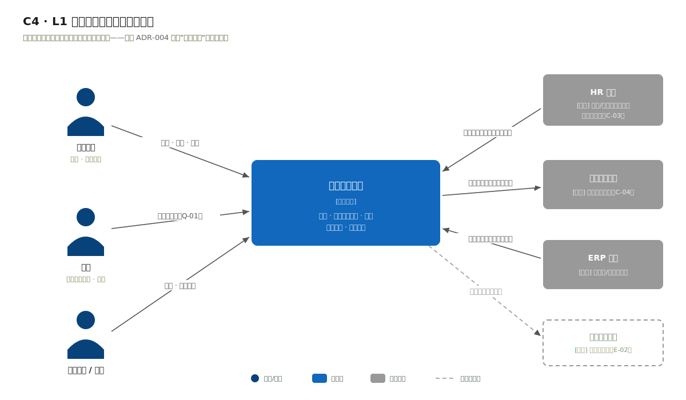

与案例一上下文图的结构性区别一眼可见：外部系统从"服务提供方"变成了"数据与触达伙伴"——HR 是主数据上游（拉取方向指向本系统）、钉钉是触达下游、ERP 是参照数据源。三条集成线的方向、频率、失败语义各不相同，这是 ADR-004 拒绝"统一总线"的原始证据：三条异构的低频集成，抽象不出值得建总线的公共形状。

### 容器图

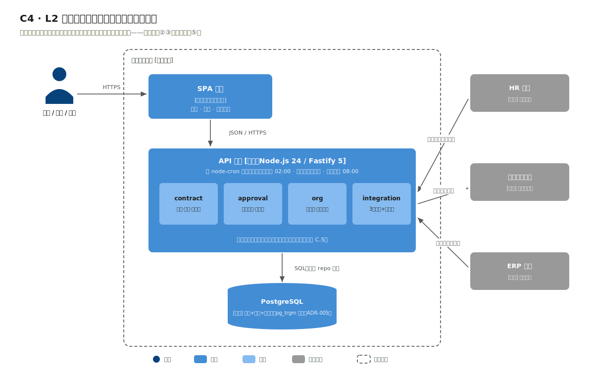

仍是"SPA + API 单体 + PostgreSQL"三件套，但 API 单体内部的模块分区换了主角：`contract`（合同台账）、`approval`（路由与审批链）、`org`（组织与数据权限）、`integration`（三个适配器 + 出站重试表）。同样的容器形状，完全不同的模块内容——第 1 章说"第⑤⑥步长得像的系统可以因②③完全不同"，这两张容器图并排看就是证据。

定时任务（组织同步、到期提醒扫描、出站重试）以 node-cron 方式跑在 API 进程内，不设独立 Worker：日频/分钟频的轻任务，单独起进程属于没有证据的复杂度（对照：案例四的 Worker 有证据，见第 5 章 ADR-005）。


---

# 3.3 数据、接口与权限：规则即数据，链即快照

> 流程进度：①②③ ▸ ④⑤ ▸ **⑥⑦** ▸ ⑧

## 两台状态机：合同的与审批链的

合同本身仍有状态机（`draft → approving → active → terminated`，驳回支线 `approving → rejected → 重提`），实现手法与案例一同款（as const 迁移表），不再展开。本案例的新东西是第二层：审批链。


链的生成规则（ADR-001 的表驱动路由）在示例工程中体现为规则表 `CHAIN_LEVELS`：金额阈值到环节序列；生产设计在此之上增加合同类型维度与法务管理界面（映射表见 3.4）。看真实实录：一份 ¥1,280,000 的合同提交后，系统当场物化出 4 步链：

```bash
$ curl -s -X POST "http://localhost:3002/api/contracts/HT-2026-0007/submit"
# HTTP 200
{
  "contractNo": "HT-2026-0007",
  "round": 1,
  "status": "approving",
  "chain": [
    { "stepNo": 1, "role": "法务",       "assignee": "周敏"   },
    { "stepNo": 2, "role": "部门负责人", "assignee": "王建国" },
    { "stepNo": 3, "role": "分管副总",   "assignee": "李雪梅" },
    { "stepNo": 4, "role": "总经理",     "assignee": "陈志远" }
  ]
}
```

物化（materialize）是本设计的关键词：链在提交时按"当时的规则"生成为 `approval_tasks` 记录，此后规则怎么改都不影响在途链，审计回放（Q-02）看到的永远是"当时规则下的当时链"。规则即数据（可改），链即快照（不可变）。

顺序控制退化为一个查询："当前步 = 本轮最小 step_no 的 pending 任务"。越级决策的真实实录：

```bash
$ curl -s -X POST "http://localhost:3002/api/approvals/21/decision" \
    -H 'Content-Type: application/json' \
    -d '{"decision":"approve","operator":"李雪梅","opinion":"同意"}'
# HTTP 409
{
  "error": {
    "code": "STEP_OUT_OF_ORDER",
    "message": "只能决策当前步：第 1 步（法务 周敏）",
    "details": { "currentStep": { "taskId": 19, "stepNo": 1, "role": "法务", "assignee": "周敏" } }
  }
}
```

与案例一的 409 同一设计语言：拒绝的同时告诉你"现在该谁"。驳回则将本轮剩余任务置 `skipped`、合同回 `rejected`；修改后重提 `round+1` 生成新链，两轮链都完整留存。

## 一个不起眼但常翻车的决定：金额存分

`contracts.amount_cents INTEGER`：金额一律以分存储整数，接口边界用元的字符串（`"1280000.00"`），换算收敛在唯一位置（工程 `contract/types.ts` 的 `yuanToCents/centsToYuan`，字符串整数运算不经浮点）。0.1 + 0.2 ≠ 0.3 的浮点课，不要在合同金额上补。印花税口径字段同理：买卖合同万分之三、借款合同万分之零点五（《印花税法》），税额计算必须落在整数分上才可对账。

## 数据模型：业务与组织两个世界


左半边业务域（contracts / approval_tasks / contract_seq）已如上述；右半边组织权限域是本案例独有的（ADR-002）：

- `departments`：带物化路径列（`/1/14/107/`），"本部门及以下"就是一个 `LIKE '/1/14/%'` 前缀匹配；
- `users`：挂部门、挂角色；HR 同步（ADR-003）只写这两张表，软删除保证历史审批链的人员引用不悬空；
- `routing_rules`（生产设计）：法务维护的路由规则表，金额区间 × 合同类型到环节序列。

## 数据权限：进 repo 层，不进 if-else

第 1 章第⑦步的警告在此落地：数据范围过滤统一在 repo 层注入。台账查询的签名是 `list(scope, filter)`，scope 由当前用户的角色推导（本人/本部门/本部门及以下/本公司/全集团），翻译成 SQL 追加条件；任何接口都不允许自己拼权限条件。越权查询得到的是空集而非报错（R-07）：权限对查询者不可见，既不泄露数据存在性，也让前端无需特判。

## 到期提醒：零调度器的奥卡姆示范

R-05 的第一反应往往是"上个延迟队列"。看量级：提醒是日粒度语义（"30 天内到期"），最自然的实现是一条 SQL 的派生查询：

```bash
$ curl -s "http://localhost:3002/api/contracts/reminders?days=30"
# HTTP 200 —— 精确命中 2 份：不含已过期、不含审批中
```

`expired` 状态同理不落库，台账查询时由 `expire_date` 派生：少一个要维护一致性的冗余状态字段，少一个半夜跑批改状态的定时任务。案例四会展示反例：当 SLA 计时是分钟级且要多实例竞争消费时，延迟队列才配得上它的成本（第 5 章 ADR-005）——同一个"到期"需求，两个量级，两种答案。


---

# 3.4 集成、部署与演进

> 流程进度：①②③ ▸ ④⑤ ▸ ⑥⑦ ▸ **⑦⑧**

## 集成落地：出站重试的时序细节

ADR-004 的防腐适配器 + 出站重试表，用一张时序图讲清失败补偿路径：


读图要点：审批链生成的事务里只落出站表（同事务，不可能"链生成了通知丢了"）；真正的钉钉调用发生在事务之外的扫描循环里，失败按 1min/5min/30min/2h 退避，24h 超限转人工。业务写路径与外部系统的可用性彻底解耦——钉钉全天宕机，影响的只是待办晚到，合同流程分毫不损（Q-03）。

## 部署视图


与案例一部署图对照着看最有信息量：

- **单节点虚拟机，没有双机热备。** Q 表里没有可用性场景撑腰（C-05：工作时间可用即可），热备就是没有证据的复杂度。故障恢复策略是"虚拟机快照 + 每日库备份，半天内重建"（写进运维手册，同样是架构产出物）；
- 定时任务跑在 API 进程内（node-cron）：组织同步（每日 02:00）、出站重试扫描（每分钟）、到期提醒扫描（每日 08:00）；
- 与三个外部系统的连线标注了方向与频率，这张图同时是网络策略申请单：向 HR/ERP 只出不进，钉钉出站走集团代理。

## 示例工程走读

运行工程后 `http://localhost:3002/` 是内嵌只读台账看板：


图中相对方注册地（上海、杭州、苏州、南京）为真实 GB/T 2260 行政区划（据 `dataset/02-contract-ledger/regions.json` 校验），企业名拟真但虚构；印花税按《印花税法》真实法定税率计算。

配套工程 `code/02-contract-ledger/`（30 个测试全绿）。除了与工程 01 同构的部分（附录 C），本工程的独有看点是仓储接口隔离的完整示范：

```
modules/approval/
├── types.ts      # 定义 ApprovalRepo、ContractGateway 两个"端口"（接口）
├── service.ts    # 业务逻辑只依赖端口——全文件零 SQL、零 sqlite import
├── repo.ts       # ApprovalRepo 的 SQLite 实现
└── index.ts
```

`tests/approval-chain.test.ts` 是这一设计的收益凭证：6 个链生成与流转测试跑在纯内存 Fake 上，全文件不碰数据库——2 步/3 步/4 步链、10 万/100 万阈值边界、中途驳回，毫秒级跑完。第 1 章说 repo 是"廉价的可逆性保险"，保费单在这里。

## 示例工程 ⇄ 生产架构映射表

| 生产设计 | 示例工程 | 缝合线 |
|---|---|---|
| PostgreSQL + pg_trgm 检索（ADR-005） | node:sqlite + LIKE | repo 层 |
| routing_rules 表 + 法务管理界面（ADR-001） | `CHAIN_LEVELS` 常量规则表（金额维度） | approval/service 的规则输入 |
| departments 物化路径 + 数据范围注入（ADR-002） | 未实现（工程聚焦路由与链） | repo 查询签名预留 scope 位 |
| HR/钉钉/ERP 适配器 + 出站表（ADR-003/004） | 未实现 | integration 模块位 |

示例工程演示的是决策的可运行核心（表驱动链、物化、顺序控制、仓储隔离），不是全功能：每个"未实现"都有明确的模块位与接口形状，也就是模块化单体"预留而不预付"的含义。

## 演进触发表

| 编号 | 触发条件 | 启动改造 | 提前量 |
|---|---|---|---|
| E-01 | 归档合同 > 50 万份且检索 95 分位 > 3s | zhparser 库内全文检索；再不足评估 ES（ADR-005 两级路径） | 3 个月 |
| E-02 | 电子签章采购落地 | integration 新增签章适配器，用印环节挂出站事件 | 2 个月 |
| E-03 | 出现并行会签/跨系统流程需求 | 重估 BPMN/Temporal（ADR-001 预分析，规则表可作迁移中间格式） | 6 个月 |
| E-04 | 适配器数量 > 6 或出现跨系统事务编排 | 重估集成平台（ADR-004） | 6 个月 |

---

## 本章小结（供第 6 章对照）

| 决策点 | 本案例答案 | 与案例一的分岔原因 |
|---|---|---|
| 流程实现 | **表驱动条件路由**（推翻案例一 ADR-003） | 规则调整权在法务（C-02）、多维条件（R-02） |
| 权限 | RBAC + 数据范围 + 物化路径部门树 | 组织月变（C-01）——案例一无此约束 |
| 集成 | 防腐适配器 + 出站重试表 ×3 系统 | 案例一只有 2 个简单外部服务 |
| 部署 | 单节点 + 每日备份 | 无可用性场景撑腰，热备被剃掉 |
| 检索 | PG 内置（pg_trgm），全文检索挂演进 | 量级 + C-06 |


---

# ADR-001: 审批流采用表驱动条件路由（推翻案例一 ADR-003 的结论）

- 状态：已采纳
- 日期：2026-07-02
- 关联：C-02、R-02、R-04、Q-01、Q-02
- 对照：案例一 [ADR-003](#adr-003-审批流用自研状态机迁移表实现不引入工作流引擎)（自研线性状态机）——本文在不同上下文中推翻其结论，两文互为方法论注脚

## 背景（Context）

审批路由是金额 × 合同类型的多维条件函数（<10 万 2 步 / ≥10 万 3 步 / ≥100 万 4 步，且销售、采购、技术类路由不同）；调整权在法务（C-02），法务不写代码；Q-01 要求改规则 ≤ 0.5 人日零发版。案例一的"迁移表写在代码里"方案在此直接违反 C-02——那里流程由法定程序决定、由开发者维护，这里规则由内控决定、由法务维护。**变的不是技术判断，是"谁拥有规则"**。

## 备选方案

**A. 沿用案例一：代码内状态机迁移表**
否决理由：改阈值 = 改代码 = 发版（违反 Q-01/C-02）；多维条件在迁移表模型里只能退化成代码分支。

**B. 引入 BPMN 工作流引擎（Camunda / Flowable，均 Java 系外置部署；或 Temporal 的 TypeScript SDK——真实存在但定位是持久化工作流而非人审批建模）**
否决理由：本场景无并行网关、无子流程、无动态会签——法务要改的只是阈值与环节序列，BPMN 的表达力上限远超需求；外置引擎的部署与建模培训成本超出 C-06 的预算。奥卡姆：不为一张 Excel 能画清的规则表买流程引擎。

**C. 表驱动条件路由——采纳**：路由规则存 `routing_rules`（条件：金额区间 × 合同类型；产出：环节序列），法务经管理界面维护；提交合同时按规则物化审批链到 `approval_tasks`（每步：step_no、role、assignee、status），只有当前最小 step_no 的 pending 任务可决策；驳回后重提 round+1 生成新链。

## 决策（Decision）

规则即数据，链即快照：路由规则可随时改（Q-01），但已生成的审批链不受影响——链在提交时物化，审计回放（Q-02）看到的是"当时规则下的当时链"。

## 后果（Consequences）

- 好处：法务自助改规则；每轮链完整留痕；顺序审批的状态机退化为"最小 pending 步"一个查询，实现比 BPMN 简单两个量级。
- 代价：规则表达力有上限（线性环节序列 + 条件匹配）；规则配置错误成为运行时风险——需配置校验与生效前预览。
- 重新评估条件：出现并行会签、跨系统长事务流程时，重估 BPMN/Temporal；届时本表可作为规则迁移的中间格式。


---

# ADR-002: 权限模型采用 RBAC + 数据范围，部门树用物化路径存储

- 状态：已采纳
- 日期：2026-07-02
- 关联：R-07、C-01、Q-02

## 背景（Context）

"能不能看这份合同"由两个正交维度决定：角色决定能做什么（起草/审批/归档），数据范围决定对哪些数据（本人/本部门/本部门及以下/本公司/全集团）。组织架构每月变动（C-01），3000 人、约 200 个部门、树深 ≤ 6 层。

## 备选方案

**A. 纯 RBAC**：否决——表达不了"本部门及以下"这类与组织结构绑定的范围语义，最终必然在代码里散落部门判断。

**B. ABAC（属性动态求值引擎）**：否决——五档固定范围枚举远未复杂到需要策略引擎；引擎的调试与审计成本反而伤害 Q-02。

**C. RBAC + 数据范围枚举——采纳**。随之而来的子决策是部门树存储（"本部门及以下"要求高效子树查询）：

| 方案 | 子树查询 | 移动子树 | 3000 人量级评估 |
|---|---|---|---|
| 邻接表 + 递归 CTE | 每查询递归 | 改一行 | 可行，但每条台账查询都带递归 CTE，SQL 复杂度传染 |
| 闭包表 | 一次 JOIN | 重算受影响闭包对 | 表行数 O(n×深度)，读最快，写最繁 |
| 物化路径（path 如 `/1/14/107/`） | `path LIKE '/1/14/%'` 前缀匹配（可走索引） | 批量改前缀 | **采纳**：查询是一个 LIKE，移动是一条 UPDATE——月度组织变动（C-01）频率下完全可承受 |

## 决策（Decision）

角色 → 数据范围档位；部门表带物化路径列；范围过滤在 repo 层统一注入（每条台账查询按当前用户范围追加 `owner = ?` 或 `dept_path LIKE ?` 条件），不允许各接口手写。

## 后果（Consequences）

- 好处：范围语义五档收敛，权限判定可测试可审计；组织月变只影响 path 前缀批量更新（HR 同步时一并处理，见 ADR-003）。
- 代价：repo 层查询签名多带一个范围参数（结构性成本，一次付清）；path 有长度上限（6 层 × 数字 id，远未触及）。
- 重新评估条件：出现"按项目/按客户"等非组织维度的授权需求时，升级为范围类型可扩展的设计。

与案例四的呼应：多租户的 tenant_id 隔离（第 5 章 ADR-002）本质是数据范围的极端形态——范围铁板一块、不可配置、必须机器强制。同一谱系，两种烈度。


---

# ADR-003: 组织架构同步采用每日定时拉取 + 软删除 + 人工对账，不上消息队列

- 状态：已采纳
- 日期：2026-07-02
- 关联：C-03、C-01、Q-03

## 背景（Context）

HR 是组织与人员的唯一权威源（C-03），本系统只读。组织变动按月发生、HR 系统按日结算变更；本系统对组织数据的新鲜度要求是"次日生效可接受"（与集团发文生效节奏一致）。

## 备选方案

**A. HR 推送（Webhook）**：否决——HR 系统是采购的成品套件，开放推送需要原厂定制（预算与排期不可控）；且推送模式下本系统要为"漏推"设计对账，复杂度不降反升。

**B. 消息队列解耦**：否决——每天一次的同步频率配 MQ，是全书"没有证据的复杂度"最典型的反面样本：为日频事件维护一套 broker、消费者、死信处理，收益为零。频率算账（[3.1 节](#31-业务与约束当规则由谁改成为核心问题)）就是否决书。

**C. 每日定时拉取增量/全量比对——采纳**

## 决策（Decision）

node-cron 每日 02:00 拉取 HR 接口全量组织与人员快照，与本地比对生成差异集（新增/变更/软删除——人员离职、部门撤并一律标记而非物理删除，历史合同的审批链引用不悬空）；物化路径（ADR-002）在同步事务内重算受影响子树；差异摘要写入同步日志表，提供人工对账页（Q-03：同步中断可人工介入，主流程不受影响）。

## 后果（Consequences）

- 好处：零新增中间件；失败模式简单（当日同步失败 = 用昨日快照，业务照常）；对账页让"数据不一致"从事故降级为工单。
- 代价：组织变更次日生效（已确认可接受）；全量比对在 3000 人量级毫秒级完成，量级增长百倍前无需优化。
- 重新评估条件：出现"实时借调/当日生效"的硬需求，或 HR 更换为支持标准事件推送的系统。


---

# ADR-004: 外部集成采用防腐层式点对点适配器 + 出站重试表，不建集成总线

- 状态：已采纳
- 日期：2026-07-02
- 关联：C-04、Q-03、[3.1 节](#31-业务与约束当规则由谁改成为核心问题)频率算账

## 背景（Context）

三个外部系统，三种集成形态：HR（入站拉取，日频，ADR-003）；钉钉待办（出站推送，日均约 80 条，允许分钟级延迟但必须最终送达）；ERP 主数据（按需查询，低频）。接口风格互不相同（REST/私有 SDK/数据库视图）。

## 备选方案

**A. ESB / iPaaS 集成平台**：否决——三条异构低频集成抽象不出公共形状；平台自身的部署、授权、学习成本（C-06 五人团队）远超收益。"以后集成多了怎么办"→ 演进触发表。

**B. MQ 解耦出站**：否决——日均 80 条推送配 broker，同 ADR-003 的频率论证。

**C. 防腐层式点对点适配器——采纳**：每个外部系统一个 adapter 模块（`integration/hr`、`integration/dingtalk`、`integration/erp`），对内暴露本系统领域语言的接口（如 `notifyApprovalTask(task)`），对外封装各家协议——外部系统的概念不许渗入领域层（防腐层，DDD 术语）。

## 决策（Decision）

适配器 + 出站重试表：所有出站动作先落 `outbound_messages`（目标、载荷、状态、重试次数、下次重试时间），与业务操作同事务；定时任务扫描表执行推送，失败退避重试（1min/5min/30min/2h，上限 24h），超限告警人工处理。**送达可靠性从"调用成功"改为"落表成功"**——业务事务不被钉钉接口抖动绑架（Q-03）。

## 后果（Consequences）

- 好处：零中间件实现最终送达；重试表天然是推送审计日志；新增外部系统 = 新增一个 adapter 模块，互不牵连。
- 代价：出站延迟下限为扫描周期（1 分钟，可接受）；重试表需清理策略（归档 90 天前记录）。
- 重新评估条件：适配器数量 > 6 个或出现跨系统事务编排需求时，重估集成平台。

与案例一的连线：案例一 notify 模块的"出站表 + 定时重试"是本模式的单系统版；这里升级为多系统防腐层，同一手法的两个刻度。


---

# ADR-005: 台账检索用 PostgreSQL 内置能力，全文检索列为演进项

- 状态：已采纳
- 日期：2026-07-02
- 关联：R-06、R-91、Q-04、量级算账

## 背景（Context）

台账检索条件：合同编号（精确/前缀）、相对方名称（子串）、状态、金额区间、到期日区间。十年归档约 5 万份。R-91（合同正文全文检索）在演进档。

## 备选方案

**A. Elasticsearch**：否决——5 万行结构化数据的条件检索，PG 的 B-tree 就是毫秒级；引入 ES 意味着索引同步、双写一致性、集群运维三座新山（C-06）。ES 的真正用武之地是正文全文检索（R-91）——但那是演进档需求，不为演进档需求预付中间件。

**B. LIKE '%关键词%' 走全表**：可用但在数据增长后退化；相对方名称子串查询是高频操作，值得一个索引。

**C. PG 内置能力组合——采纳**：编号/状态/日期/金额走 B-tree；相对方名称子串用 pg_trgm 扩展（PG 自带 contrib，三元组索引支持 LIKE '%x%' 走索引）；正文全文检索不做，登记演进触发表。

## 决策（Decision）

检索全部落在 PG：常规列 B-tree + 相对方列 pg_trgm GIN 索引。演进触发表登记 E-01：**归档合同 > 50 万份且检索 95 分位 > 3s 时**，引入 zhparser（PG 的中文分词扩展，真实存在）做库内全文检索；仍不足再评估 ES——两级演进路径都预先写明。

## 后果（Consequences）

- 好处：零新增部署单元；检索能力与数据同库同事务，无同步一致性问题。
- 代价：pg_trgm 对中文子串的索引选择率不如专业分词（5 万行量级下无感）；正文检索暂缺（业务确认可接受：正文在附件里，现阶段按编号/相对方定位即可）。
- 备注：示例工程用 SQLite 演示台账接口形状，pg_trgm/zhparser 为生产设计——映射关系见 [3.4 节](#34-集成部署与演进)。


---

# 4.1 业务与约束：负载形状第一次成为主角

> 流程进度：**①②③** ▸ ④⑤ ▸ ⑥⑦ ▸ ⑧　（方法回看第 1 章 [1.3 节](#13-第①④步从业务到架构风格)）

## 业务场景

一家有 3 个车间、约 2000 台液压设备（液压泵站、主泵机组、换向阀组、冷却过滤单元、作动器）的工厂要建状态监测系统：边缘网关采集设备数据上报平台；值班员看实时看板（当前压力/温度/状态/告警）、查历史曲线、处理阈值告警（触发、确认、恢复）；生产主管看班次/日/月运行报表；设备台账管理。

场景里的硬件与协议都是真实的工业存在：西门子 SIMATIC S7-1200 PLC（本案例网关型号）原生支持 Modbus TCP（TIA Portal 内置 MB_CLIENT/MB_SERVER 指令块），西门子官方 MQTT 客户端库支持 MQTT 3.1.1。配套工程的遥测同样取自真实来源：UCI 机器学习库第 447 号数据集《液压系统状态监测》（ZeMA / 萨尔大学采集，许可 CC BY 4.0）的传感器读数，按 `dataset/MANIFEST.md` 逐周期取均值后重整、数值未改。数据自带真实故障标签，窗口末约 10 小时是冷却器接近失效段，冷却效率跌落、油温升高据此触发告警。

> **术语速查**（纯软件背景读者可先扫一眼，本章会反复用到）：
> - **PLC**：可编程逻辑控制器，车间里连着设备的工业控制器，本案例充当采集网关。
> - **Modbus TCP**：工业设备最常见的数据读取协议之一，网关用它从设备取值。
> - **MQTT**：轻量发布/订阅消息协议，工业物联的事实标准；QoS 1 指"至少送达一次"（可能重复，靠平台幂等去重）。
> - **遥测（telemetry）**：设备上报的一条条测量值（温度、压力、振动…）。
> - **冷却效率（%）/ 液压油温（°C）**：冷却器的换热效率与油液温度，冷却器退化时前者骤降、后者升高，构成本案例的主告警信号；泵振动（mm/s）在本数据集内保持健康低位。
> - **TimescaleDB / hypertable / 连续聚合**：PostgreSQL 的时序扩展，及其"按时间自动分区的表"与"自动维护的分钟/小时/天聚合视图"，[4.3 节](#43-数据管道从传感器到看板的一条河)展开。

## 需求清单（节选）

| 编号 | 需求 | 优先级 | 验收要点 |
|---|---|---|---|
| R-01 | 网关批量上报遥测，平台持久化 | 本期 | 上报点不丢、可乱序、可重复（幂等） |
| R-02 | 实时看板：设备当前值与告警状态，秒级刷新 | 本期 | 看板延迟 < 5s |
| R-03 | 历史曲线：任意时间段查询，自动选择聚合粒度 | 本期 | 跨月查询不超时 |
| R-04 | 阈值告警：触发、去重、确认、自动恢复 | 本期 | 同一规则持续越限不重复告警 |
| R-05 | 运行报表：班次/日/月，分车间/设备类型 | 本期 | 报表数与原始数可对账 |
| R-06 | 断网续传：车间网络中断后数据补传不丢 | 本期 | 补传数据不重复入库 |
| R-90 | 反向控制（下发参数/启停） | 演进 | 见演进表 E-02 |
| R-91 | 预测性维护（振动频谱分析） | 演进 | 见 E-03 |

## 约束清单

| 编号 | 约束 | 来源 | 可谈判 |
|---|---|---|---|
| C-01 | **写多读少的时序负载**：2000 台设备、每 5 秒一条 ≈ **400 点/秒**持续写入 | 采集方案与设备规模 | 采样间隔可谈（5s 是工艺侧要求的下限） |
| C-02 | 存储成本有限：机房一台物理服务器的预算 | 预算 | 否 |
| C-03 | 车间**弱网**：Wi-Fi/工业环网偶发中断，网关须本地缓存续传 | 网络现状 | 否 |
| C-04 | 告警延迟 < 10 秒（值班响应要求） | 生产安全制度 | 否 |
| C-05 | 平台部署于工厂机房，与办公网隔离；无云依赖 | 网络安全制度 | 否 |
| C-06 | 运维：设备科 + 1 名信息化专员 | 组织现状 | 否 |

**C-01 是本案例的灵魂。** 前两个案例的负载（峰值每秒几十次读、每秒一两次写）在架构上"无感"；这里第一次出现用数量级说话的持续负载，数据流形状将直接决定架构形状。

## 质量属性场景

| 编号 | 属性 | 场景 | 响应度量 |
|---|---|---|---|
| Q-01 | 性能效率（写） | 400 点/秒持续遥测写入，叠加告警评估 | 入库延迟 95 分位 < 2s，不丢点 |
| Q-02 | 可靠性 | 发布/重启 API 查询服务 | **遥测写入不中断**（采集路径独立存活） |
| Q-03 | 性能效率（读） | 值班员查询某设备近 3 个月温度曲线 | 95 分位 < 3s |
| Q-04 | 灵活性（成本可控） | 数据量随时间线性增长 | 原始数据保留 30 天，聚合数据保留 3 年，磁盘占用有上界 |
| Q-05 | 可靠性（弱网） | 车间断网 2 小时后恢复 | 缓存数据全量补传，库中无重复 |

## 量级算账：这次数字真的咬人了

- 写入：400 点/秒 × 86400 秒 = 3456 万行/天，一年约 126 亿行。对照案例一（1800 行/天），一万九千倍、约四个数量级的差距，这就是"约束换血"的含义；
- 存储：每行按 40 字节估（窄表 + 索引摊销），原始数据一年约 500GB+，无限保留直接击穿 C-02，降采样与保留策略从"优化项"变成"生存项"（Q-04）；
- 读取：看板每 5s 刷新一次当前值（活跃看板 ≤ 10 个）加偶发历史查询，读负载本身不大，但跨月查询若扫原始表就是扫数亿行，必须预聚合（Q-03）；
- 告警：数百条规则 × 400 点/秒 = 每秒数百次规则匹配，内存中做是微不足道的算术，任何"流处理引擎"在这个量级都是高射炮打蚊子（ADR-004 展开）。

三条结论立此存照：写路径与读路径的负载特征截然不同（持续写对突发读），这是拆分的依据；数据必须分层老化（原始到小时聚合到天聚合）；告警在采集通路上顺手算掉。这三条构成了下一步架构决策的全部输入。


---

# 4.2 架构决策：全书第一次"拆"，拆的依据是数据流

> 流程进度：①②③ ▸ **④⑤** ▸ ⑥⑦ ▸ ⑧

## 第④步：第一条过硬的拆分证据

前两个案例都在"要不要拆"上给出了否，因为量级作证不出来。本案例的 Q-02 给出了第一条过硬的拆分证据：

> 发布/重启查询服务时，遥测写入不得中断。

单进程模型下，重启 API 就是重启采集：每次发版丢 30 秒数据点，弱网补传（C-03）还会放大这个窗口。而写路径（持续 400 点/秒、逻辑稳定、极少变更）与读路径（偶发查询、界面迭代频繁、经常发版）的变更节奏与负载特征都不同，按数据流切分为 `ingest`（采集/告警）与 `api`（查询/看板）两个进程，各自独立发布与重启。

对照第 1 章架构风格谱系图：这是从"模块化单体"右移一档到"按数据流切分的少量进程"，只右移一档，不是微服务：两个进程共享一个数据库、一个代码仓库、一套部署脚本，没有服务发现、没有跨进程调用（它们通过数据库与 MQTT 各自独立工作）。完整论证见 [ADR-003](#adr-003-按数据流切分-ingest-与-api-两进程全书第一次进程拆分)。

## 本章 ADR 一览

| ADR | 决策 | 关键证据 |
|---|---|---|
| [ADR-001](#adr-001-南向遥测接入采用-mqttqos-1-网关本地缓存) | 南向接入用 MQTT（QoS 1 + 网关缓存续传） | C-03、R-06、真实工业协议生态 |
| [ADR-002](#adr-002-时序存储采用-timescaledbpostgresql-扩展) | 时序存储用 TimescaleDB（PG 扩展），不上专用时序集群 | C-01/C-02/C-06、Q-03/Q-04 |
| [ADR-003](#adr-003-按数据流切分-ingest-与-api-两进程全书第一次进程拆分) | ingest / api 两进程（全书第一次拆） | Q-02、负载特征分析 |
| [ADR-004](#adr-004-告警在采集通路上内存规则匹配不引入流处理引擎) | 告警在采集通路内存匹配，不上流处理引擎 | C-04、规则量级算账 |
| [ADR-005](#adr-005-看板实时推送采用-sse不用-websocket) | 看板推送用 SSE，不用 WebSocket | 单向推送、反代穿透、浏览器自动重连 |

## 第⑤步：C4 建模

### 上下文图


系统边界的独特之处：最重要的"外部参与者"是设备与网关而非人：2000 台设备经车间网关（S7-1200 等 PLC/网关，Modbus 归一化后以 MQTT 上报）持续供数。人（值班员、生产主管）反而是低频参与者。

### 容器图


五个容器的分工：

1. **MQTT Broker（EMQX）**：南向接入的汇聚点。选型盘点见 ADR-001（EMQX / Mosquitto / Aedes 均为真实可选，生产推荐 EMQX）；
2. **ingest 进程**：订阅遥测主题 → 校验/幂等写入 → 增量聚合 → 内存告警匹配，只写不服务查询；
3. **api 进程**：历史查询、看板 SSE、台账、报表，只读遥测数据（台账等低频数据可写）；
4. **TimescaleDB**：PostgreSQL 加时序扩展，hypertable 自动分区、连续聚合、保留/压缩策略（ADR-002）；
5. **SPA 看板**。

数据流主线（设备 → 网关 → EMQX → ingest → TimescaleDB ← api ← 看板）是本案例的招牌视图，[4.3 节](#43-数据管道从传感器到看板的一条河)的管道图会带着速率标注完整展开。

### 与前两章对照的读法

案例一/二的容器图里，"模块"是主角、容器是配角；本章反过来：容器边界（进程）承担了架构语义，而每个进程内部的模块划分（ingest 内的校验/聚合/告警，api 内的查询/台账）退居次要。负载形状决定哪一层边界重要，这是第 1 章"每张图一个问题"原则的又一次应用。

### L3 组件图：只画这一个有争议的局部

第 1 章第⑤步定下规矩：C4 只对"有争议、要评审"的容器画到组件层，其余交给目录结构。全书四个案例真正满足这条门槛的只有一处：ingest 进程内部，因为幂等写入、增量聚合、内存告警评估同处一个写事务，这个事务边界是要评审的设计，值得单独一张图：


图里四个组件（校验 → 幂等写入 → 增量聚合 → 内存告警匹配）串在一个事务里，任一步失败整批回滚，不会出现"raw 写了但聚合没更新"的中间态；告警规则常驻内存，避免每个点都查库。其余容器（api、registry）的内部结构一眼可从目录看清，不再画 L3，画了也是三个月后就过期的负担。


---

# 4.3 数据管道：从传感器到看板的一条河

> 流程进度：①②③ ▸ ④⑤ ▸ **⑥⑦** ▸ ⑧

## 招牌视图：带速率标注的数据流管道


这张图是本案例的"一图版"：设备（Modbus 多路传感）→ 网关归一（S7-1200，本地缓存）→ MQTT QoS 1（约 400 点/秒）→ ingest（幂等写入 + 增量聚合 + 告警匹配，同一事务）→ TimescaleDB（raw 30 天 / 聚合 3 年）← api（自动选粒度查询、SSE）← 看板。每一段都标注了协议与速率：架构图上没有数字，就还不算做完第③步。

## 遥测数据模型：窄表 + 分层老化

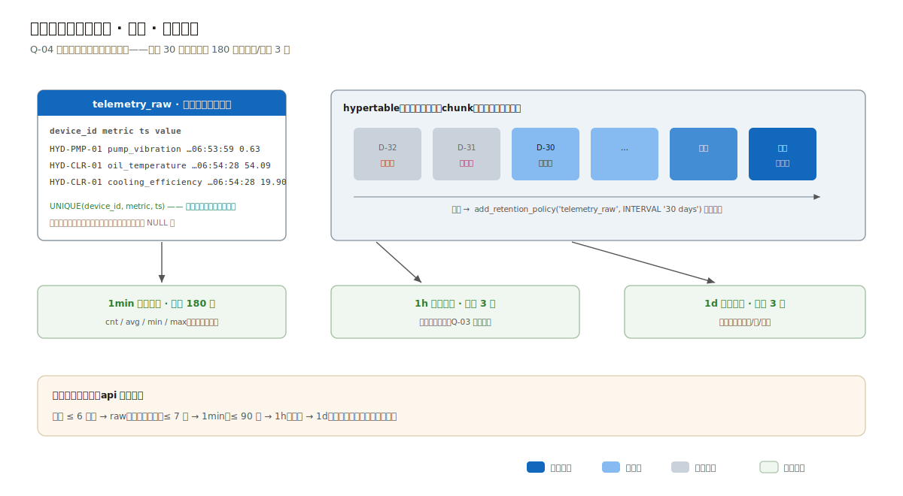

窄表（`device_id, metric, ts, value` 一行一点）而非宽表（一行一设备多列）：设备型号不同、指标集不同，宽表会长出几十个大多为 NULL 的列；窄表以 `(device_id, metric, ts)` 复合唯一索引同时服务幂等与序列查询。

生产设计的 TimescaleDB 三件套（真实 SQL）：

```sql
-- hypertable：按天自动分块
SELECT create_hypertable('telemetry_raw', 'ts', chunk_time_interval => INTERVAL '1 day');

-- 连续聚合：小时粒度物化视图（1min/1d 同理）
CREATE MATERIALIZED VIEW telemetry_hourly WITH (timescaledb.continuous) AS
SELECT device_id, metric, time_bucket('1 hour', ts) AS bucket,
       count(*) AS cnt, avg(value) AS avg, min(value) AS min, max(value) AS max
FROM telemetry_raw GROUP BY device_id, metric, bucket;

-- 保留策略：原始数据 30 天自动老化（Q-04 的磁盘上界）
SELECT add_retention_policy('telemetry_raw', INTERVAL '30 days');
```

示例工程在 SQLite 上实现了同构语义：raw 表加 hourly 聚合表，写入事务内增量 UPSERT（`cnt=cnt+新增, sum=sum+…, min/max 取劣`），avg 由查询时 `sum/cnt` 计算。冒烟实录展示幂等语义，同一批数据发两遍：

```bash
$ curl -s -X POST "http://localhost:3993/api/telemetry" \
    -H 'Content-Type: application/json' \
    -d '[{"deviceCode":"HYD-PMP-01","metric":"pump_vibration","ts":"2026-07-03T06:52:59.357Z","value":0.61},{"deviceCode":"HYD-PMP-01","metric":"pump_vibration","ts":"2026-07-03T06:53:59.357Z","value":0.63}]'
# 第一遍：HTTP 201
{ "received": 2, "inserted": 2, "duplicates": 0, "alertsFired": [], "alertsResolved": [] }
# 同一批第二遍：HTTP 201
{ "received": 2, "inserted": 0, "duplicates": 2, "alertsFired": [], "alertsResolved": [] }
```

重复不报错、不重复入库、不重复累计聚合（以 INSERT 的 changes 判定是否累计），这是 QoS 1"至少一次"语义的平台侧另一半，有专门测试作证。

## 断网续传的完整闭环

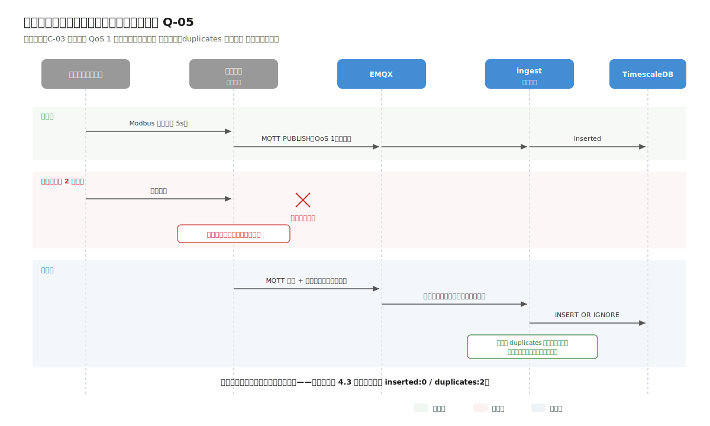

网关本地缓存（断网期间落盘）→ 恢复后按序补传（MQTT QoS 1 重发）→ 平台幂等去重（上面的实录）。三个环节各自独立成立，合起来兑现 Q-05："断网 2 小时，库中无缺口、无重复"。

## 有状态告警：不是"发通知"，是一台状态机

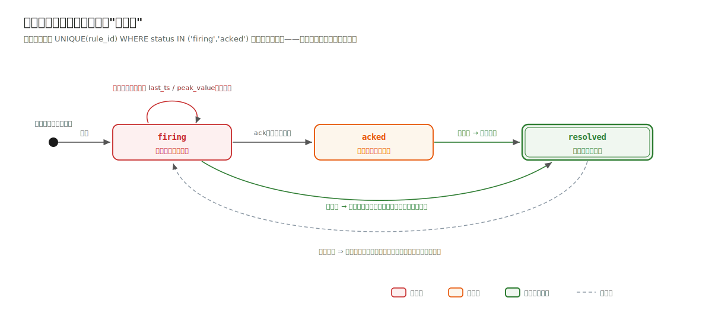

告警的生命周期：`firing`（首次越限）→ `acked`（值班确认）→ `resolved`（值回落自动恢复）。两个容易做错的语义都有真实实录：

**持续越限不轰炸。** HYD-CLR-01 的冷却效率在种子数据里持续低于阈值约 10 小时（120 个周期），告警列表里只有一条 critical，`first_ts` 到 `last_ts` 拉开约 10 小时、`peak_value` 记录最劣值 19.4%：

```json
{
  "id": 2, "deviceCode": "HYD-CLR-01", "metric": "cooling_efficiency",
  "op": "<", "threshold": 30, "level": "critical", "title": "冷却效率骤降（冷却器接近失效）",
  "status": "firing",
  "firstTs": "2026-07-02T20:59:28.434Z", "lastTs": "2026-07-03T06:54:28.434Z",
  "peakValue": 19.4
}
```

去重的最后防线不在应用层：部分唯一索引 `UNIQUE(rule_id) WHERE status IN ('firing','acked')` 让数据库直接拒绝第二条活动告警（测试中绕过应用层直插被拒）。这是第 1 章"架构决策要可被机器守护"的数据库版。

**回落自动恢复。** 上报一个阈值内的值，响应体的 `alertsResolved` 即时携带恢复事件（冒烟场景 7），值班无需手工关闭。

## 查询：自动选粒度

`GET /api/devices/:code/metrics?metric=oil_temperature&from=&to=` 按窗口跨度自动路由：≤ 6 小时走 raw（细节），更长走 hourly（趋势），调用方无需理解存储分层（Q-03）。显式 `bucket=raw|hour` 可覆盖。冷却效率、油温这些指标的量纲与判读（%、°C，以及"冷却器接近失效"的语义）由规则表的 title 携带进告警文案：领域知识进数据，不进代码。


---

# 4.4 部署、工程验证与演进

> 流程进度：①②③ ▸ ④⑤ ▸ ⑥⑦ ▸ **⑦⑧**

## 部署视图：边缘与机房两层


- **车间边缘层**：每车间 1~2 台网关（S7-1200 或工业网关），下连设备（Modbus TCP/RTU），上连工厂环网。网关的本地缓存是断网续传（Q-05）的第一环，它是架构的一部分，不是"现场的事"；
- **工厂机房层**：一台物理服务器（C-02）承载 EMQX、ingest、api、TimescaleDB 四个组件。进程拆分不等于机器拆分，ADR-003 拆的是发布与故障边界，不是硬件预算；
- **网络隔离**（C-05）：生产网与办公网之间只开放看板 HTTPS 端口单向访问；平台无公网出口。

## 示例工程走读

运行工程后 `http://localhost:3003/` 是内嵌只读看板，直接读种子数据：


看板里的读数是 UCI-447 液压试验台的真实传感器数据（见 `dataset/MANIFEST.md`）。

配套工程 `code/03-device-monitor/`（22 个测试全绿，冒烟 10 场景）。模块结构直接对应 ADR-003 的进程语义：

```
src/modules/
├── registry/    # 设备档案（读写均低频）
├── ingest/      # 只写路径：幂等入库 + 增量聚合 + 告警评估（同一事务）
└── dashboard/   # 只读路径：自动选粒度查询 + 告警查询 + 内嵌看板
```

架构守护测试在通用三条规则外追加第 4 条：ingest 与 dashboard 互不 import。演示工程虽是单进程（零依赖约束），但两模块的隔离由测试强制，未来拆成两进程时只需给各自加一个入口文件。模块边界就是预留的进程边界，这是"预留而不预付"在本案例的形态。

种子数据的真实感（README 有完整声明）：遥测是真实传感器读数，取自 UCI 机器学习库第 447 号数据集《液压系统状态监测》（N. Helwig 等，IEEE I2MTC-2015；ZeMA / 萨尔大学采集，许可 CC BY 4.0），按 `dataset/MANIFEST.md` 逐周期取均值重整、数值未改；真实量纲（bar、°C、mm/s、%、kW、l/min），三个资产编号（HYD-PMP-01 主泵机组、HYD-CLR-01 冷却过滤回路、HYD-FLW-01 主工作回路）是这批传感数据之上的演示标签。7 路传感器 × 576 个真实周期共 4032 行原始点，按 5 分钟间隔铺成约 48 小时窗口：前约 38 小时冷却器满效，末约 10 小时为数据集标注的冷却器近失效段，seed 完成即有 1 条 critical（冷却效率骤降）加 1 条 warning（油温升高）在告警列表上，看板开箱有真数据。`GET /` 的内嵌看板（零前端依赖）已在浏览器实测渲染。

## 示例工程 ⇄ 生产架构映射表

| 生产设计 | 示例工程 | 缝合线 |
|---|---|---|
| EMQX + MQTT QoS 1（ADR-001） | HTTP 批量上报（seed 载入真实数据窗口） | ingest 的传输入口；幂等/聚合/告警与传输层无关，全部真实受测 |
| TimescaleDB hypertable + 连续聚合 + 保留策略（ADR-002） | SQLite raw + hourly 增量 UPSERT + `db:prune` 思路 | repo 层；生产 SQL 已在 [4.3 节](#43-数据管道从传感器到看板的一条河)给出 |
| ingest / api 两进程（ADR-003） | 单进程内 ingest/dashboard 模块硬隔离（守护测试第 4 条） | 模块边界即进程边界 |
| SSE 推送（ADR-005） | 看板短轮询（同为真实降级路径） | api 的推送通道 |

## 演进触发表

| 编号 | 触发条件 | 启动改造 | 提前量 |
|---|---|---|---|
| E-01 | 设备规模 × 采样率增长 20 倍，或多工厂汇聚立项 | 重估专用时序集群（ADR-002 预分析） | 6 个月 |
| E-02 | 反向控制（参数下发/启停）需求立项 | MQTT 下行主题 + WebSocket 看板通道（ADR-001/005 预分析）；安全评审先行 | 3 个月 |
| E-03 | 预测性维护立项（振动频谱） | 边缘侧高频采样（kHz 级）+ 频域特征上报——原始波形不进平台，特征值进 | 6 个月 |
| E-04 | 出现跨指标/滑动窗口告警规则 | 先库内连续聚合规则，再评估流引擎（ADR-004 两级路径） | 2 个月 |

---

## 本章小结（供第 6 章对照）

| 决策点 | 本案例答案 | 决定性证据 |
|---|---|---|
| 进程形态 | **ingest/api 两进程**（全书首拆） | Q-02 发布不断采 + 负载特征三维对比 |
| 接入 | MQTT QoS 1 + 网关缓存 + 平台幂等 | C-03 弱网、R-06 |
| 存储 | TimescaleDB：分区+连续聚合+保留策略 | 3456 万行/天、C-02、C-06 |
| 告警 | 采集通路内存匹配 + 部分唯一索引兜底 | C-04 十秒、规则量级 |
| Redis/Kafka | 都不要 | broker 有证据（MQTT），队列没有 |


---

# ADR-001: 南向遥测接入采用 MQTT（QoS 1 + 网关本地缓存）

- 状态：已采纳
- 日期：2026-07-02
- 关联：C-03、R-01、R-06、Q-05

## 背景（Context）

2000 台设备的现场协议五花八门（Modbus TCP/RTU、OPC UA、脉冲电表），由车间网关归一化后上报平台。车间网络弱（C-03）：偶发中断分钟到小时级，断网期间数据不许丢（R-06）。

## 备选方案

**A. HTTP 批量上报**
可行但短板明确：断线重连、补传窗口、背压全要网关侧自实现；每批一次 TCP+TLS 握手在高频小包场景开销占比高；平台推送配置到网关（未来 R-90 反向控制）还要另开通道。

**B. 自定义 TCP 协议**
否决理由：自造轮子承担报文分帧、心跳、重连全部复杂度，且工业网关生态没有现成客户端——违背"用真实生态"的原则。

**C. MQTT——采纳**
工业物联的事实标准：西门子官方为 S7-1200/1500 提供 MQTT 客户端库（支持 3.1.1）；**QoS 1（至少一次送达）+ 网关本地缓存**恰好覆盖断网续传——离线期间消息落网关磁盘，恢复后按序补传；"至少一次"意味着可能重复，平台侧幂等写入补齐语义（见 [4.3 节](#43-数据管道从传感器到看板的一条河)，工程有测试与实录作证）。

Broker 选型（均真实可选）：EMQX（生产推荐：单机百万连接量级、集群与规则引擎成熟、有开源版）；Mosquitto（轻量 C 实现，单机小规模够用）；Aedes（Node.js 实现，适合嵌入演示）。本设计取 EMQX 单节点（2000 连接对它是零头，C-06 的运维预算养得起一个成熟 broker）。

## 决策（Decision）

网关以 MQTT 3.1.1、QoS 1 发布至 `telemetry/{gateway}/{device}` 主题；ingest 进程订阅共享订阅组；平台以 `(device_id, metric, ts)` 唯一键幂等去重。

## 后果（Consequences）

- 好处：断网续传由协议 + 网关缓存原生解决；发布/订阅解耦让 ingest 重启期间消息暂存 broker（Q-02 的配套保障）。
- 代价：多一个 broker 组件要运维（对照案例一/二"不上 MQ"：**这里有 C-03 与 400 点/秒作证，那里没有**——同一类组件，两种判决，证据不同）；至少一次语义强制平台幂等。
- 示例工程映射：演示工程以 HTTP 批量上报替代 MQTT 传输层（零外部依赖约束），**幂等写入、增量聚合、告警评估等平台侧核心逻辑与传输层无关**，全部真实实现并受测；映射表见 [4.4 节](#44-部署工程验证与演进)。


---

# ADR-002: 时序存储采用 TimescaleDB（PostgreSQL 扩展）

- 状态：已采纳
- 日期：2026-07-02
- 关联：C-01、C-02、C-06、Q-03、Q-04

## 背景（Context）

400 点/秒持续写入、3456 万行/天、历史查询跨月、原始数据必须老化（[4.1 节](#41-业务与约束负载形状第一次成为主角)算账）。团队只有 1 名信息化专员（C-06）。

## 备选方案

**A. 普通 PostgreSQL 表 + 手工分区**
可行下限：PG 单表到十亿行级需要手工管理分区、手工写聚合任务、手工删旧分区——每一件都是专员的长期负担。

**B. InfluxDB**
成熟时序库，但引入第二种数据库意味着第二套备份、监控、查询语言（Flux/InfluxQL）；台账等关系数据仍需 PG → 两库并存。

**C. ClickHouse**
分析型列存的强项在亿级/秒的写入与聚合分析；400 点/秒远未到它的入场线，集群运维复杂度直接击穿 C-06。典型的"为幻想量级预付"。

**D. TimescaleDB——采纳**
PostgreSQL 扩展（timescale.com，开源版可自部署）：hypertable 按时间自动分区（透明于 SQL）；连续聚合（continuous aggregates）自动维护 1min/1h/1d 物化视图；保留策略（`add_retention_policy`）与原生压缩自动老化数据。关键优势对准 C-06：团队仍然只运维"一个 PG"——备份、监控、权限、SQL 全部沿用 PG 技能。

## 决策（Decision）

遥测窄表建为 hypertable（按天分块）；三级连续聚合 1min/1h/1d；原始数据保留 30 天、1min 聚合保留 180 天、1h/1d 聚合保留 3 年（Q-04 的磁盘上界由此闭合）；查询按窗口跨度自动路由到对应粒度（Q-03）。

## 后果（Consequences）

- 好处：一个数据库覆盖时序 + 关系（台账/规则/告警同库 JOIN）；聚合与老化是声明式策略而非手写任务。
- 代价：TimescaleDB 是 PG 生态内的专项技能（分块大小、压缩时机需要学习）；单机写入上限约束了远期规模（对 400 点/秒余量充足）。
- 重新评估条件：设备规模 × 采样率增长 20 倍以上，或出现多工厂集中汇聚需求时，重估专用时序集群。
- 示例工程映射：node:sqlite 以 raw 表 + hourly 增量聚合表实现同构语义（写入事务内 UPSERT 聚合），连续聚合/保留策略的生产 SQL 在 [4.3 节](#43-数据管道从传感器到看板的一条河)正文给出。


---

# ADR-003: 按数据流切分 ingest 与 api 两进程（全书第一次进程拆分）

- 状态：已采纳
- 日期：2026-07-02
- 关联：Q-02、C-01、C-04

## 背景（Context）

写路径（遥测入库 + 告警评估）与读路径（历史查询、看板、报表）在三个维度上特征相反：

| 维度 | 写路径 | 读路径 |
|---|---|---|
| 负载 | 400 点/秒持续、平稳 | 偶发、突发（跨月查询可能秒级 CPU） |
| 变更频率 | 极低（协议与规则稳定） | 高（看板/报表持续迭代） |
| 可用性要求 | 不得中断（Q-02：断采 = 丢数据） | 可短暂中断（查询晚点无妨） |

## 备选方案

**A. 单进程模块化单体（沿用案例一/二）**
否决理由：每次发布看板功能都要重启采集——Q-02 直接否决。Node 单线程还叠加一条：重查询会阻塞事件循环，影响写入延迟（Q-01）。

**B. 微服务全家桶（采集/告警/查询/台账各一服务 + 网关）**
否决理由：台账、报表、告警查询之间没有独立伸缩或独立发布的证据；四个服务的运维面对 C-06 是灾难。

**C. 按数据流切两个进程——采纳**

## 决策（Decision）

`ingest` 进程（订阅 MQTT → 校验/幂等写入 → 增量聚合 → 内存告警匹配）与 `api` 进程（查询/SSE/台账/报表）共库、同仓库、同部署脚本，无进程间调用——耦合点只有数据库 schema。发布 api 不动 ingest；ingest 自身重启期间消息暂存 EMQX（QoS 1），不丢数据。

## 后果（Consequences）

- 好处：Q-02 结构性达成；两条路径各自按需重启/伸缩；故障隔离（查询打爆 CPU 不影响采集）。
- 代价：共享 schema 的两个进程要同步迁移（同仓库 + 同一迁移脚本化解）；部署单元从 1 变 2。
- 方法论注脚：这是全书第一次拆进程。对照案例一/二的"不拆"：三个案例用的是同一把尺（负载特征 + 变更节奏 + 可用性要求），量出了不同的答案——**拆分的依据是数据流特征，不是流行趋势**。
- 重新评估条件：出现多工厂汇聚或告警规则复杂化到需要独立发布时，告警评估可从 ingest 中再拆（模块边界已预留）。


---

# ADR-004: 告警在采集通路上内存规则匹配，不引入流处理引擎

- 状态：已采纳
- 日期：2026-07-02
- 关联：C-04、R-04、量级算账

## 背景（Context）

阈值告警：数百条规则（设备 × 指标 × 阈值 × 级别），要求触发延迟 < 10s（C-04）、持续越限不重复告警、回落自动恢复（R-04）。

## 备选方案

**A. 流处理引擎（Apache Flink）**
Flink 的入场场景是有状态流计算：窗口聚合、乱序水位、每秒百万事件。本案例是**数百条阈值规则 × 400 点/秒**——每秒几十万次浮点比较的零头，单核微秒级工作量。引擎带来的 JVM 集群、checkpoint 存储、作业管理，对 C-06 是纯负债。否决。

**B. 库内定时聚合查询（每 10s 扫一遍最新值）**
可行，但有两个毛刺：扫描周期与 C-04 的 10s 上限贴脸（抖动即超）；"持续越限不新增、回落恢复"的状态语义要靠查询窗口拼凑，边界情况多。

**C. 采集通路上的内存规则匹配——采纳**
遥测本来就逐条流经 ingest 进程——顺手评估是零额外架构成本：启动时加载规则表到内存（规则变更时重载），每个点写入事务内完成匹配与告警状态迁移。

## 决策（Decision）

告警评估内联在 ingest 写入事务中：越限且无活动告警 → 新建 firing；已有活动告警 → 更新 last_ts 与 peak_value；回落 → 置 resolved。数据库部分唯一索引（`UNIQUE(rule_id) WHERE status IN ('firing','acked')`）兜底防并发重复——应用层逻辑失误时数据库拒绝第二条活动告警。

## 后果（Consequences）

- 好处：告警延迟 = 写入延迟（秒级，C-04 大幅余量）；状态语义在一个事务里闭合，可精确测试（工程 22 个测试中若干专测告警状态机）。
- 代价：规则表达力限于"单指标阈值比较"（当前需求全集）；跨指标关联告警（如"温度高且振动高"）需要演进。
- 重新评估条件：出现跨指标/跨设备关联规则或滑动窗口规则（如"5 分钟均值超限"）时，先评估库内连续聚合上的规则，再评估流引擎——两级路径与案例二 ADR-005 同款。


---

# ADR-005: 看板实时推送采用 SSE，不用 WebSocket

- 状态：已采纳
- 日期：2026-07-02
- 关联：R-02、C-05、C-06

## 背景（Context）

值班看板要求秒级感知当前值与新告警（R-02）。数据方向纯单向（服务器 → 浏览器），活跃看板 ≤ 10 个。

## 备选方案

**A. 短轮询（每 3s 拉一次）**
最简单，量级上完全可行（10 个看板 × 0.33 请求/秒）。短板是告警到达延迟均值 = 轮询间隔一半，且每次全量拉取浪费。作为降级路径保留。

**B. WebSocket**
双向全双工——但本场景没有"向上"的数据（浏览器不发指令，R-90 反向控制在演进档）。为单向需求付出双向的成本：Nginx 反代的 Upgrade 配置、心跳保活、断线重连逻辑全要自己管。

**C. SSE（Server-Sent Events）——采纳**
单向推送的原生方案：普通 HTTP 长连接（反代零特殊配置）、浏览器 `EventSource` 自动重连（内建 retry 机制）、文本事件流协议简单可 curl 调试。Fastify 下用原生 `reply.raw` 写事件流即可，无需附加依赖。

## 决策（Decision）

api 进程提供 `GET /api/stream`（SSE）：推送设备当前值快照（每 5s）与告警事件（即时）。看板以 EventSource 订阅，降级路径为短轮询（同一数据接口）。

## 后果（Consequences）

- 好处：实现与运维成本最低的实时通道；断线自愈无需一行重连代码。
- 代价：单向——R-90（反向控制）落地时此通道不够用，届时按需引入 WebSocket（届时有双向证据）；HTTP/1.1 下浏览器对同域 SSE 连接数有限制（看板场景单连接，无碍）。
- 示例工程映射：演示工程看板用短轮询（B 方案，代码最少且同为真实可用路径），SSE 为生产设计——正文给出 Fastify 实现要点。


---

# 5.1 业务与约束：一次串租事故就能杀死一个产品

> 流程进度：**①②③** ▸ ④⑤ ▸ ⑥⑦ ▸ ⑧　（方法回看第 1 章 [1.3 节](#13-第①④步从业务到架构风格)）

## 业务场景

面向中小企业客服团队的 SaaS 工单产品（可理解为极简版 Zendesk）：租户自助注册开通、14 天试用、按席位订阅付费；成员邀请与角色管理；工单从网页表单与邮件转入，走生命周期流转；SLA 策略（按优先级的首响/解决时限，超时升级）；出站 Webhook 推送工单事件到租户自己的系统。

与前三个案例的根本身份差异：这是一个产品，不是一个项目。没有甲方、没有实施合同，用户自己上门、自己付钱、随时离开。这个身份换血了整个约束表。

## 需求清单（节选）

| 编号 | 需求 | 优先级 | 验收要点 |
|---|---|---|---|
| R-01 | 租户自助注册即开通（无人工干预） | 本期 | 注册返回 API 凭证，立即可建单 |
| R-02 | 工单生命周期流转（含重开） | 本期 | 非法迁移被拒绝并提示允许动作 |
| R-03 | 租户间数据绝对隔离 | 本期 | 跨租户访问返回 404（不泄露存在性） |
| R-04 | 订阅计费：试用/付费/欠费降级/取消全自动 | 本期 | 席位变更按比例计费，时间边界准确 |
| R-05 | SLA 计时与超时升级 | 本期 | 分钟级精度；工单解决时计时器取消 |
| R-06 | 出站 Webhook（签名/重试/幂等） | 本期 | 租户端点故障不影响主流程 |
| R-07 | 邮件转工单 | 本期 | 回复串联到同一工单 |
| R-08 | 租户数据导出与注销删除 | 本期 | 注销后数据不可恢复地删除 |
| R-90 | 在线聊天渠道 / AI 自动回复 | 演进 | 见演进表 |

## 约束清单

| 编号 | 约束 | 来源 | 可谈判 |
|---|---|---|---|
| C-01 | **租户数据隔离是生死线**：一次串租事故 = 产品信誉终结 | SaaS 商业模式 | 否 |
| C-02 | 全自助：获客/开通/计费/降级无人工介入 | 商业模式（毛利结构） | 否 |
| C-03 | 对外承诺可用性 SLA → 滚动发布、无单点 | 与客户的服务协议 | 否 |
| C-04 | SLA 计时分钟级精度，且多实例下不能重复触发 | R-05 + C-03 的叠加 | 否 |
| C-05 | 合规：租户有权导出并要求删除全部数据 | 个人信息与数据合规要求 | 否 |
| C-06 | 小团队起步（4 名工程师），但增长预期真实存在 | 创业公司现状 | 否 |

对照前三案例：政务的约束来自法规，企业的来自组织，行业的来自物理负载，SaaS 的约束来自商业模式本身。C-01/C-02/C-03 没有一条是技术约束，但每一条都长成了架构。

## 质量属性场景

| 编号 | 属性 | 场景 | 响应度量 |
|---|---|---|---|
| Q-01 | 安全性（隔离） | 租户 A 持自己凭证请求租户 B 的资源 | 100% 返回 404；隔离有**两道独立防线**且可被测试证明 |
| Q-02 | 灵活性（伸缩） | 注册租户数月增 50% | 加实例即扩容，无架构变更 |
| Q-03 | 可靠性（发布） | 每周多次发布 | 滚动发布零停机；发布期间 SLA 计时不丢不重 |
| Q-04 | 功能适合性（计费准确） | 租户月中增购 3 席位 | 按比例计费误差为零（以分计） |
| Q-05 | 性能效率 | 1000 租户、5 万活跃工单时的列表查询 | 95 分位 < 500ms |

**优先级：Q-01 >> 其他。** 隔离排第一且与第二名拉开距离，这是唯一一条"违反一次就没有下次"的属性。

## 量级算账

自助 SaaS 的量级要按目标规模而非当前规模设计（这一点与前三案例相反：项目制系统的规模由合同锁定，产品的规模由市场决定，而架构要在增长曲线上活下来）：

- 目标第一阶段：1000 租户 × 日均 20 工单 = 2 万工单/日，写入约 2.3 次/秒（含事件流 ×4），数据库毫无压力；
- **SLA 计时器**：活跃工单 × 2（首响 + 解决）≈ 数万个活动计时器，分钟级精度、多实例竞争消费、工单解决时要取消，这是真正的架构难点（C-04），案例一/二的"扫描表"手法在此失效（分钟级 × 数万 × 不可重复触发）；
- Webhook 出站：2 万事件/日 × 租户端点的不可靠性 = 必须异步化 + 重试；
- **连接数**：若每租户独立数据库（silo 模型），1000 租户 × 连接池 = 数据库连接爆炸，租户模型的选择被量级直接约束（ADR-001）。

三条结论：隔离要纵深（单防线必被穿）；异步任务要真正的队列（Redis 第一次拿到入场证据）；租户模型选 pool（共享表加 tenant_id）。


---

# 5.2 架构决策：云原生的单体

> 流程进度：①②③ ▸ **④⑤** ▸ ⑥⑦ ▸ ⑧

## 第④步：仍然是单体——但形态变了

微服务在本案例的诱惑最大（"SaaS 就该微服务"），但对比表再次给出否：4 名工程师（C-06）、写入 2.3 次/秒的业务负载、没有任何两个业务域需要独立伸缩。需要伸缩的是整体吞吐与发布频率，不是某个域，答案是架构风格谱系的第四档：

> **无状态单体 × N 实例 + Worker 进程 + 托管 PostgreSQL/Redis。**

- **无状态**（十二要素应用的核心约定）：会话在 JWT 里、文件在对象存储、定时任务在队列，任何实例可被随时替换，于是 Q-02 加实例即扩容、Q-03 滚动发布零停机；
- **Worker 进程**：SLA 计时、Webhook 投递、邮件解析等异步任务的消费者，与 API 实例分开伸缩与发布。这与案例三 ingest/api 的拆分逻辑同构（负载特征不同则进程分离），但方向相反：案例三拆的是写路径，这里拆的是后台任务；
- 仍是一个代码仓库、一个部署单元集：API 与 Worker 共享全部领域代码，只是入口不同。

## 本章 ADR 一览

| ADR | 决策 | 关键证据 |
|---|---|---|
| [ADR-001](#adr-001-多租户数据模型采用-pool共享表-tenantid) | 租户模型选 pool（共享表 + tenant_id） | 连接数算账、C-02 自助开通、成本结构 |
| [ADR-002](#adr-002-隔离双保险应用层强制-postgresql-行级安全rls兜底) | 隔离双保险：应用层强制 + PG RLS 兜底 | Q-01、连接池 set_config 的真实工程坑 |
| [ADR-003](#adr-003-租户识别采用子域名-jwt-内-tenant-claim) | 租户识别：子域名 + JWT tenant claim | C-02、R-01 |
| [ADR-004](#adr-004-计费采用自研订阅状态机-支付网关适配器) | 自研订阅状态机 + 支付网关适配器 | Q-04、C-02 |
| [ADR-005](#adr-005-异步任务采用-bullmqredis全书唯一被批准的-redis) | 异步任务用 BullMQ（Redis）——全书唯一被批准的 Redis | C-04 分钟级 × 多实例竞争 × 可取消 |

ADR-005 请与案例一/二的"不上 Redis"对照阅读：同一个组件，三次审判，两次驳回一次批准，差别全在证据。

## 第⑤步：C4 建模

### 上下文图

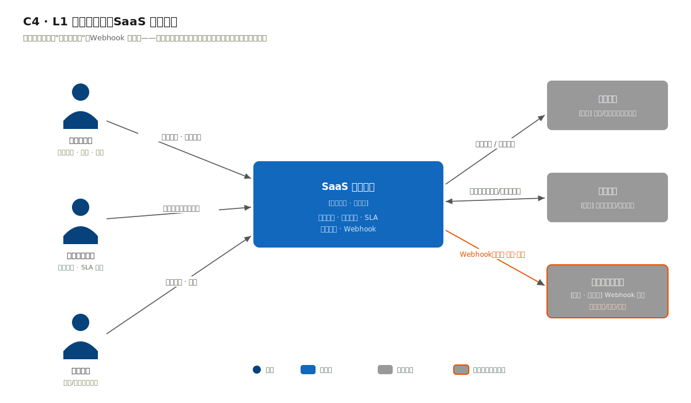

系统边界外第一次出现"租户的系统"（Webhook 回调端点）：本系统要向不受控、不可靠的外部端点主动推送，失败语义必须设计（R-06，重试 + 签名 + 幂等键）。支付网关与邮件服务是标准外部依赖。

### 容器图

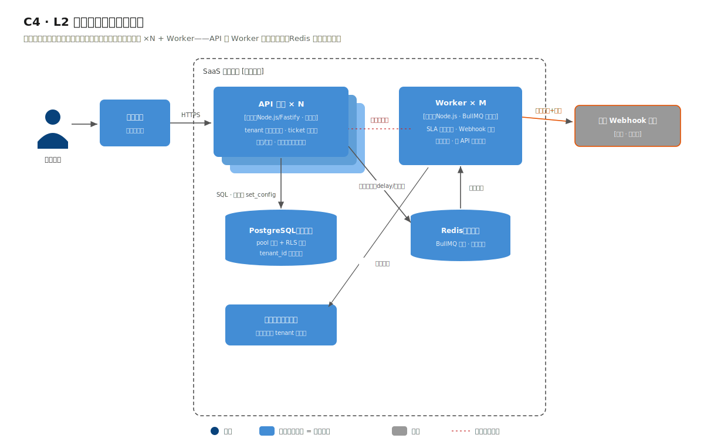

六个容器：负载均衡 → API 单体 × N（无状态）；Worker × M（BullMQ 消费者）；PostgreSQL（RLS 兜底隔离）；Redis（队列 + 延迟任务）；对象存储（附件）。API 与 Worker 之间不直接通信：API 只管往队列投任务，Worker 只管消费，Redis 是唯一交接点。

与前三章容器图连起来看，全书的"形态谱系"完整了：

| 案例 | 容器图形态 | 驱动力 |
|---|---|---|
| 一、二 | 单进程 + 单库 | 无伸缩/隔离证据 |
| 三 | 写/读两进程 + 时序库 | 数据流特征 |
| 四 | 无状态 ×N + Worker + 队列 | 伸缩、发布、异步可靠性 |

四张容器图没有一张长得一样，而画它们的流程完全相同，这就是全书想证明的事。


---

# 5.3 数据、接口与隔离纵深

> 流程进度：①②③ ▸ ④⑤ ▸ **⑥⑦** ▸ ⑧

## 三种租户模型，一图对照


图中三列即 ADR-001 的三个备选。记住选型的第一性依据不是"哪个隔离最强"，而是租户画像 × 成本结构：自助长尾（本案例）→ pool；数十个高价值大客户 → silo；混合画像 → pool 起步 + 大客户 silo（AWS SaaS Lens 的标准演进路径，已登记演进表）。

## 隔离纵深：一次请求的完整旅程


动画里两颗粒子的命运就是本案例的全部主题：SUPABASE 的凭证访问自家工单一路绿灯；PRISMA 的凭证访问 SUPABASE 的工单，在 repo 层的 `tenant_id = ?` 处被拦下，返回 404。真实实录（工程冒烟的高光场景，同一 URL、两把 Key）：

```bash
$ curl -s "http://localhost:3994/api/tickets/SUPABASE-0001" \
    -H 'X-API-Key: wd_supabase_b6d586079c13fa6651fc18a4'
# HTTP 200
{
  "ticketNo": "SUPABASE-0001",
  "title": "Supabase Database Lost",
  "priority": "high",
  "status": "in_progress",
  "assignee": "admin@supabase.example.com",
  "createdBy": "admin@supabase.example.com",
  "createdAt": "2026-07-02T22:26:39.000Z",
  "updatedAt": "2026-07-03T00:26:39.000Z",
  "events": [
    {
      "action": "created",
      "fromStatus": "-",
      "toStatus": "open",
      "actor": "admin@supabase.example.com",
      "note": null,
      "createdAt": "2026-07-02T22:26:39.000Z"
    },
    {
      "action": "start",
      "fromStatus": "open",
      "toStatus": "in_progress",
      "actor": "admin@supabase.example.com",
      "note": null,
      "createdAt": "2026-07-03T00:26:39.000Z"
    }
  ]
}

$ curl -s "http://localhost:3994/api/tickets/SUPABASE-0001" \
    -H 'X-API-Key: wd_prisma_c759423f7b16237cf2070804'
# HTTP 404
{
  "error": {
    "code": "TICKET_NOT_FOUND",
    "message": "工单不存在：SUPABASE-0001"
  }
}
```

**404 而不是 403。** 403 等于告诉攻击者"这个工单号存在，只是不归你"；404 不泄露任何存在性信息。这半行代码的差别是安全设计的基本功。

本案例的工单是真实数据：取自三个公开 GitHub 仓库的 issue（`supabase/supabase`、`prisma/prisma`、`vercel/next.js`，每仓对应一个租户），经 GitHub issues API 取回，工单标题、状态、标签、创建与解决时刻均为原始值（见 [dataset/MANIFEST.md](dataset/MANIFEST.md)）。租户企业名取自仓库所属公司，订阅档位、管理员账号与 API Key 均为应用内部演示配置。留存字段只到标题、状态、时间戳、标签，工单正文与解决经过不在其中，教程不据此虚构。

防线清单（每道均独立可测）：

| 防线 | 位置 | 机制 | 被什么证明 |
|---|---|---|---|
| 租户识别 | 鉴权钩子（fastify 子作用域） | Key 哈希查表 / 生产：子域名+JWT 双因子（ADR-003） | 无 Key/错 Key 401 测试 |
| 应用层强制 | repo 层 | 函数签名强制 tenantId 首参，SQL 一律 `tenant_id = ?` | **架构守护测试第 4 条**：正则扫描 repo 全部 SQL 字符串 |
| 数据库兜底 | PostgreSQL RLS（生产） | `set_config('app.tenant_id', $1, true)` 事务级 + POLICY | RLS 直连库验证；连接池坑详见 ADR-002 |

**鉴权作用域**的实现值得一看（工程 `app.ts`）：注册路由挂在无鉴权的公共作用域，全部工单路由注册在挂了 `onRequest` 钩子的 fastify 封装作用域内：安全边界用框架的封装模型表达，而不是每个路由手工记得加中间件。忘记加 = 路由根本不在受保护作用域里注册不上，错误在结构上不可能发生。

## 租户开通：一个事务的事

`POST /api/tenants/register` 在单个事务内完成：创建租户、管理员、每租户工单发号器（`ticket_seq`）。实录中注册完成即返回一次性明文 API Key（库中只存 sha256 哈希），立即可建单，这是 C-02"自助开通"的最小闭环。每租户工单号独立序列（`SUPABASE-0001`、`PRISMA-0001` 互不干扰，`UNIQUE(tenant_id, ticket_no)`），租户看到的是"自己的第 N 单"，这是产品体验，也是隔离语义的一部分。

## 两台状态机


工单：`open → in_progress → resolved → closed`，外加 `resolved → reopen → in_progress`（客户不满意重开）。迁移表实现与案例一同款，非法迁移 409 带 `allowedActions`（实录：对 open 工单直接 close 被拒）。


订阅（生产设计，ADR-004）：`trialing → active → past_due（宽限）→ suspended（欠费只读）→ canceled`。两台状态机加上案例一的审批状态机，"流程类实体 = 状态机"在全书的第三次出场，手法零新增。

## SLA 计时：延迟队列的取消语义


时序图的关键帧：工单创建 → 投递两个延迟任务（首响 30 分钟、解决 4 小时，按租户 SLA 策略）；客服首次回复 → 按 ID 取消首响任务；超时未动 → Worker 消费到期任务 → 升级（通知主管 + 工单标记）。"可取消的分钟级延迟任务 × 数万并存 × 多 Worker 竞争"就是 Redis 的入场证据链（ADR-005）。对照案例二的到期提醒（日级、一条 SQL），同一个"到期"语义，两个量级，两种正确答案。


---

# 5.4 部署、工程验证与演进

> 流程进度：①②③ ▸ ④⑤ ▸ ⑥⑦ ▸ **⑦⑧**

## 部署视图：全书唯一的云上部署


- **API × N**（起步 N=2）挂在负载均衡后，无状态（十二要素：配置进环境变量、会话进 JWT、文件进对象存储），滚动发布即逐实例替换，LB 健康检查摘流（Q-03）；
- **Worker × M**（起步 M=1）独立伸缩：队列深度是它的扩容信号，与 API 的 CPU 信号解耦；
- **托管 PostgreSQL / Redis**：4 人团队（C-06）把数据库高可用、备份、补丁托管给云厂商，这是"复杂度预算花在业务上"的采购版；
- 对照前三章：政务双机热备在机房、企业单节点在机房、工厂物理机在车间侧，部署形态是约束表的镜像，四张部署图并排就是四份约束表的 X 光片。

## 示例工程走读

运行工程后 `http://localhost:3004/` 是内嵌只读看板（演示内置租户 SUPABASE 的开发 Key）：


看板里的工单是 supabase/supabase 仓库的真实 issue（数据来源见 [3.3 节](#53-数据接口与隔离纵深)）。

配套工程 `code/04-saas-ticket/`（18 个测试全绿，冒烟 9 场景）。工程聚焦本案例的生死线，隔离双保险的第一道防线全链条：

```
src/modules/
├── tenant/     # 注册开通（单事务 provisioning）+ API Key 鉴权钩子
└── ticket/     # 工单状态机 + repo 层 tenant_id 强制
tests/
├── architecture.test.ts   # 四条规则：常规三条 + 第4条 repo SQL 必含 tenant_id
└── ...                    # 跨租户 404、两租户编号互不干扰、哈希存储等
```

三个最有含金量的测试（打开 `tests/` 直接看断言）：

1. **跨租户 404**：租户 A 的 Key 查租户 B 的工单，防线的行为证明；
2. **守护测试第 4 条**：扫描全部 repo 的 SQL，凡涉及作用域表的引用都必须配一个 `tenant_id = ?` 谓词，并断言扫描数量下限（防止扫描器自身失效），这是防线的结构证明；
3. **Key 只存哈希**：注册响应含明文，库中查无明文，凭证泄露面的证明。

## 示例工程 ⇄ 生产架构映射表

| 生产设计 | 示例工程 | 缝合线 |
|---|---|---|
| 子域名 + JWT 双因子识别（ADR-003） | X-API-Key（同为生产可用的 API 集成路径） | 鉴权钩子单点 |
| PG RLS 第二道防线（ADR-002） | 第一道防线全链条 + 守护测试 | RLS SQL 已在 ADR-002 给出 |
| BullMQ + Redis + Worker（ADR-005） | 未实现（工程聚焦隔离核心） | 队列投递点在 service 层预留 |
| 订阅计费状态机（ADR-004） | 未实现 | 与工单状态机同款手法，tenant 模块位 |
| LB + 多实例 | 单实例 | 工程本身无状态（数据全在库），加实例即成立 |

## 演进触发表

| 编号 | 触发条件 | 启动改造 | 提前量 |
|---|---|---|---|
| E-01 | 单租户查询影响他租户（P95 劣化且定位到吵闹邻居） | 按租户限流 + 慢查询配额；极端者迁 silo | 1 个月 |
| E-02 | 在线聊天/AI 回复立项 | 独立实时通道（WebSocket 网关）评估 | 3 个月 |
| E-03 | 签约首个要求独立部署的大客户 | pool + silo 混合模式（ADR-001 预分析：tenant_id 机制在单租户库依然成立，代码零改） | 2 个月 |
| E-04 | 队列任务类型 > 10 种或出现跨服务编排 | 重估工作流引擎（Temporal 型）——注意与案例二 ADR-001 的否决理由对照，届时上下文已不同 | 6 个月 |

---

## 本章小结（供第 6 章对照）

| 决策点 | 本案例答案 | 决定性证据 |
|---|---|---|
| 租户模型 | pool（共享表 + tenant_id） | 连接数算账、自助长尾画像 |
| 隔离 | 双保险：repo 强制 + RLS 兜底 | Q-01 生死线、防线独立性 |
| 进程形态 | 无状态 ×N + Worker | 滚动发布、伸缩、异步可靠性 |
| Redis | **要（BullMQ）**——全书唯一 | 分钟级 × 可取消 × 多实例竞争三重叠加 |
| 计费 | 自研订阅状态机 + 支付适配器 | 权限判定本地化、通道可插拔 |


---

# ADR-001: 多租户数据模型采用 pool（共享表 + tenant_id）

- 状态：已采纳
- 日期：2026-07-02
- 关联：C-01、C-02、C-06、Q-02、量级算账

## 背景（Context）

多租户数据隔离的三种主流模型（术语取 AWS Well-Architected SaaS Lens 的 Silo/Pool 与微软 Azure 架构中心的分类，均为公开权威来源）：

| 模型 | 隔离强度 | 每租户成本 | 运维形态 |
|---|---|---|---|
| Silo：每租户独立数据库 | 物理级（最强） | 高（连接池、备份、迁移 × N） | 1000 租户 = 1000 个库要迁移 |
| **Schema-per-tenant**：同库独立 schema | 逻辑强 | 中 | 迁移仍 × N；连接可共享 |
| Pool：共享表 + tenant_id 列 | 逻辑（依赖纪律与机制） | 最低 | 一张表、一次迁移、一份备份 |

## 备选方案分析

Silo：隔离最硬，但两条硬伤——1000 租户 × 每库最小连接池的连接数在单 PG 实例上不可行（量级算账）；自助注册（C-02）意味着"创建租户 = 建库 + 迁移 + 配置"，开通延迟与故障面失控。适用画像是"数十个大客户"的 B2B，不是自助长尾。

**Schema-per-tenant**：折中，但 schema 数量同样侵蚀运维（迁移 × N、pg_dump 复杂化），PostgreSQL 目录表在数万 schema 下退化。微软 PostgreSQL 多租户指南将其列为中间态。

**Pool——采纳**：一次迁移、一份备份、按需分片的成本结构与自助 SaaS 的长尾租户画像匹配；代价是隔离从"物理保证"降为"机制保证"——这笔代价由 ADR-002 的双保险偿付。

## 决策（Decision）

所有业务表带 `tenant_id` 列并入联合索引/联合唯一约束（如 `UNIQUE(tenant_id, ticket_no)`——工单号每租户独立序列）；隔离机制见 ADR-002。

## 后果（Consequences）

- 好处：成本结构支持自助长尾；开通 = 一个事务（工程有实录）；水平伸缩不受租户数影响（Q-02）。
- 代价：隔离依赖机制而非物理边界（→ ADR-002）；"吵闹邻居"问题（单租户重查询影响他人）需要限流治理（演进表登记）。
- 演进路径：混合模式——当出现付费能力与合规要求足够高的大客户时，为其单独 silo 部署（AWS SaaS Lens 的标准做法），pool 代码无需改动（tenant_id 机制在单租户库中依然成立）。已登记演进表 E-03。


---

# ADR-002: 隔离双保险——应用层强制 + PostgreSQL 行级安全（RLS）兜底

- 状态：已采纳
- 日期：2026-07-02
- 关联：C-01、Q-01、ADR-001

## 背景（Context）

Pool 模型下，隔离是机制而非物理。机制的敌人是人：新同事写一条忘带 `tenant_id` 过滤的查询，代码评审漏掉，一次串租，产品死亡（C-01）。单防线必被穿——问题只是何时。

## 备选方案

**A. 仅应用层 WHERE 过滤（靠纪律）**
否决理由：纪律不是机制。规模化团队里"总有一天"是确定事件。

**B. 仅数据库 RLS（应用层裸写）**
RLS 缺位应用层语义：无法给出"404 而非 403"的产品语义（返回空集，应用还要补判断）；且所有查询性能都过 RLS 谓词，无应用层过滤时索引利用变差。

**C. 双保险——采纳**：两道独立防线，任何一道单独失效都不导致串租。

## 决策（Decision）

第一道（应用层，主防线）：鉴权钩子解析租户上下文 → repo 层所有函数签名强制 `tenantId` 首参、SQL 一律 `WHERE tenant_id = ?` → 架构守护测试第 4 条扫描 repo 源码中的 SQL 字符串，凡涉业务表必须含 `tenant_id = ?`（机制化的代码评审，工程已实现并实测）。

第二道（数据库层，兜底）：PostgreSQL RLS——

```sql
ALTER TABLE tickets ENABLE ROW LEVEL SECURITY;
CREATE POLICY tenant_isolation ON tickets
  USING (tenant_id = current_setting('app.tenant_id')::bigint);
```

**连接池下的真实工程坑（本 ADR 最值钱的一段）**：租户上下文必须用事务级设置——

```sql
-- 正确：第三参 true = 事务内有效（SET LOCAL 语义），事务结束自动清除
SELECT set_config('app.tenant_id', $1, true);
```

若用会话级（`set_config(..., false)` 或 `SET`），连接归还池后残留上一个租户的上下文，下一个借用该连接的请求将以他人身份查询——双保险反而制造串租。每个事务开始时设置、随事务结束失效，才是与连接池兼容的唯一正确姿势。

## 后果（Consequences）

- 好处：串租需要两道独立机制同时失效；防线本身可被测试证明（跨租户 404 测试 + 守护测试扫描 + RLS 直连库验证）。
- 代价：RLS 谓词的性能开销（tenant_id 联合索引下可忽略）；`app.tenant_id` 的设置纪律要进数据访问层封装，不允许散落。
- 示例工程映射：SQLite 无 RLS——工程完整实现第一道防线（钩子 + repo 强制 + 守护测试第 4 条 + 跨租户 404 实录）；第二道为生产设计，SQL 如上（PG 官方文档语义）。


---

# ADR-003: 租户识别采用子域名 + JWT 内 tenant claim

- 状态：已采纳
- 日期：2026-07-02
- 关联：R-01、C-02、ADR-002

## 背景（Context）

每个请求必须在进入业务逻辑前确定"这是谁家的请求"。识别错误 = 隔离防线全部失效的上游污染。

## 备选方案

| 方案 | 评估 |
|---|---|
| URL 路径前缀（/t/{tenant}/…） | 可行但路径污染全部路由；分享链接暴露租户标识于路径 |
| 自定义 Header | API 场景可用（本工程演示所用），浏览器端不自然 |
| **子域名（{tenant}.example.com）——采纳** | 品牌感（租户自己的地址）；Cookie 天然按子域隔离；LB/证书用通配符一次解决 |

## 决策（Decision）

双因子租户识别：子域名解析出声称的租户；JWT（登录签发）内嵌 `tenant_id` claim 作为认证过的租户——两者在鉴权钩子中必须一致，不一致即 401。只信 JWT 不看子域名，会允许 A 租户的合法用户带着自己的 token 访问 B 子域（钓鱼与混淆场景）；只信子域名则毫无认证。识别结果注入请求上下文，下游（repo 的 tenantId 形参、RLS 的 set_config）只消费不再判断。

API 集成场景（无浏览器）用 `X-API-Key`（每租户签发、库存哈希）——示例工程演示的正是这条路径：注册返回一次性明文 Key，请求头携带，sha256 后查表定租户（工程实录见 [5.3 节](#53-数据接口与隔离纵深)）。

## 后果（Consequences）

- 好处：识别在边界一次完成，下游零判断（防御纵深的"上游收口"）；子域名为将来租户自定义域名（CNAME）留位。
- 代价：本地开发需要泛域名 hosts/DNS 方案；JWT 内 claim 要求登录服务是租户感知的。
- 重新评估条件：出现跨租户身份（一人多租户）需求时，claim 结构升级为 memberships 列表 + 当前活跃租户。


---

# ADR-004: 计费采用自研订阅状态机 + 支付网关适配器

- 状态：已采纳
- 日期：2026-07-02
- 关联：R-04、Q-04、C-02

## 背景（Context）

订阅生命周期：试用（14 天）→ 付费激活 → 续费/席位变更（按比例）→ 支付失败宽限 → 欠费降级（只读）→ 取消。全程无人工（C-02），金额准确到分（Q-04）。

## 备选方案

**A. 全托管订阅平台（如国际市场的 Stripe Billing 类服务）**
能力最全（试用、按比例、发票、催缴全内置），但两个现实问题：目标市场的支付通道（微信/支付宝/对公转账）与国际托管订阅服务的覆盖错位；订阅状态成为外部系统的影子数据，本地权限判定（"该租户现在能不能建单"）要么每次远程查询要么维护同步副本——复杂度回流。

**B. 支付与订阅逻辑全自研**
支付通道协议（签名、回调验签、对账单）没有自研价值，纯风险。

**C. 分层：订阅状态机自研 + 支付网关适配器——采纳**
订阅状态是业务核心（每个请求的权限判定都要读它），必须在本地、必须自己建模；支付是通道能力，适配器封装（微信支付/支付宝各一个 adapter，接口形状统一为"发起收款/回调核验"）——与案例二 ADR-004 的防腐层同一手法。

## 决策（Decision）

订阅状态机（`trialing → active → past_due → suspended → canceled`，迁移表实现，与工单状态机同款手法）为生产设计（示例工程未实现，聚焦租户隔离核心，见 [5.4 节](#54-部署工程验证与演进)映射表）；席位按比例计费用整数分运算（未用天数 × 日单价，向下取整给用户）；支付回调经适配器验签后投递幂等的计费事件（事件 ID 去重——支付回调必然重复）。宽限与降级由 BullMQ 延迟任务驱动（ADR-005）。

## 后果（Consequences）

- 好处：权限判定本地毫秒级；状态机可穷举测试（Q-04 的边界用测试钉死）；支付通道可插拔。
- 代价：催缴/发票等外围能力要逐步自建（按需，演进表）；两个支付适配器的对账逻辑是持续维护面。
- 交叉引用：订阅状态机与案例一的审批状态机、本案例的工单状态机是同一个模式的三次出场——流程类实体 = 状态机，本书立场的第三次实证。


---

# ADR-005: 异步任务采用 BullMQ（Redis）——全书唯一被批准的 Redis

- 状态：已采纳
- 日期：2026-07-02
- 关联：C-04、R-05、R-06、Q-03
- 对照：案例一 [2.2 节](#22-架构决策为约束设计而不是为流行设计)、案例二 ADR-003/004 两次否决 Redis/MQ 的理由

## 背景（Context）

三类异步负载：SLA 计时（活跃工单 × 2 ≈ 数万个活动定时器，分钟级精度，工单解决时要取消，超时要触发升级）；Webhook 投递（外部端点不可靠，重试退避，事件有序性按租户保证）；邮件解析。多实例部署（C-03）意味着任务必须竞争消费且不重复触发。

## 为什么案例一/二的手法在此失效

前两案例的"扫描表 + 定时任务"是日粒度/分钟粒度、单实例、无取消语义的场景。本案例三项都反过来：

| 维度 | 案例一/二 | 本案例 |
|---|---|---|
| 精度 | 日级（到期提醒） | 分钟级（C-04） |
| 实例 | 单实例扫描 | N 实例竞争，不可重复触发 |
| 取消 | 无 | 工单解决 → 取消对应计时器（数万级动态增删） |

数据库轮询模拟这三条（`SELECT ... FOR UPDATE SKIP LOCKED` + 每分钟全表扫）技术上可行，但把队列语义手写在业务库上——锁竞争、轮询延迟、死任务清理全是自担。

## 备选方案

**A. 数据库轮询队列**：上述，可行但语义手写；PG 上的任务表与业务表混居互相干扰（Q-05）。
**B. RabbitMQ/Kafka**：消息语义强，但延迟任务与取消不是原生强项（RabbitMQ 靠死信+TTL 模拟，取消困难；Kafka 根本不是这个工具）。
**C. BullMQ（基于 Redis）——采纳**：Node 生态最成熟的任务队列（真实开源项目，bullmq.io）：延迟任务原生（`delay` 选项）、任务可按 ID 删除（取消 = removeJob）、多 Worker 竞争消费、失败退避重试内置。Redis 同时可复用于限流与缓存（未来）。

## 决策（Decision）

Redis（托管实例）+ BullMQ：`sla` 队列（工单创建时投递 firstResponse/resolve 两个延迟任务，任务 ID = `sla:{ticketId}:{type}`，解决时按 ID 删除）、`webhook` 队列（指数退避 ×5）、`email` 队列。Worker 进程消费，与 API 分开伸缩。

## 后果（Consequences）

- 好处：三类异步负载一个组件覆盖；分钟级精度与取消语义原生；发布期间任务不丢（Redis 持久化 + Worker 平滑关闭）。
- 代价：引入全书第一个 Redis——运维面 +1（托管服务缓解）、任务与业务库两套存储的最终一致要设计（任务执行幂等化）。
- 方法论注脚：与案例一/二对照——同一个组件，三次审判：那两次的负载画像作证不出来，这次 C-04 的三项叠加作证充分。组件无罪，证据定罪；这正是奥卡姆剃刀"如无必要勿增实体"中"必要"二字的操作化。


---

# 第 6 章 四案例横向对比：同一个问题，为什么四个答案都对

四个案例走的是同一套八步流程（第 1 章），产出了四个互不相同的架构。本章把 19 篇 ADR 放进一张对照表，逐行展开每个决策点上的分岔逻辑。**读法**：每一行先看四个答案，再看"分岔变量"一列——那就是第②③步产出物中真正起裁决作用的条目。

## 总对照表

| 决策点 | 政务申报审批（2） | 企业合同管理（3） | 设备监控（4） | SaaS 工单（5） | 分岔变量 |
|---|---|---|---|---|---|
| 进程形态 | 模块化单体 | 模块化单体 | **采集/查询两进程** | **无状态×N + Worker** | 负载特征、发布独立性、伸缩证据 |
| 流程实现 | 自研状态机迁移表 | **表驱动条件路由** | 告警状态机 | 工单+订阅双状态机 | 规则由谁改、条件维度 |
| Redis / MQ | 无 | 无 | MQTT broker（有证据） | **BullMQ + Redis**（有证据） | 精度×取消×多实例竞争 |
| 数据库 | PG（信创 PG 系收敛） | PG（pg_trgm 检索） | **PG + TimescaleDB** | **PG + RLS** | 数据形状（时序/多租户） |
| 权限/隔离 | RBAC + 全程审计 | RBAC + **数据范围**（物化路径） | 网络隔离为主 | **tenant_id 双保险** | 谁会越权、越权的代价 |
| 集成方式 | 适配器 + 出站表（2 方） | 防腐适配器 ×3 + 出站重试表 | MQTT 南向归一 | Webhook 出站 + 支付适配器 | 集成方数量、方向、可靠性 |
| 部署形态 | 机房双机热备（等保分区） | 机房单节点 + 备份 | 车间边缘 + 工厂物理机 | 云上弹性 + 托管服务 | 合规、预算、可用性场景 |

## 逐行展开

### 进程形态：拆与不拆的一把尺

四个案例用同一把尺量了四次：**负载特征是否分裂、发布节奏是否分裂、可用性要求是否分裂**。案例一/二三项皆否（日均几百到几千次写），单进程 + 模块纪律是唯一有证据的答案；案例三写路径（400 点/秒持续、不许中断）与读路径（偶发、常发版）三项全裂 → 拆两进程；案例四的分裂轴不同——同质负载要**整体伸缩**、后台任务要**独立消费** → 无状态多实例 + Worker。注意所有案例都没到微服务：**没有任何一条质量场景要求两个业务域独立伸缩或独立部署**——这句话在四份 Q 表里都能验证。

### 流程实现：状态机的三次出场与一次让位

审批单（2）、告警（4）、工单与订阅（5）都是"迁移表 + 通用 act()"的同款状态机——流程类实体 = 状态机是全书复用度最高的手法。唯一的例外在案例三……不，在案例二：当**规则的修改权**从开发者转移到业务人员（法务）、且路由条件是多维的（金额 × 类型），代码里的迁移表就违反了约束 C-02——于是升格为**规则表（数据）+ 链物化（快照）**。案例一 ADR-003 与案例二 ADR-001 的互相引用是全书最重要的一对文档：**它们记录了同一个技术判断在两个上下文中的相反结论，且都是对的**。

### Redis 的三次审判

案例一（通知出站表）、案例二（组织同步、到期提醒）两次否决，判词都是频率：日频/分钟频的任务配 broker 是没有证据的复杂度。案例四批准，判词是四条证据叠加：分钟级精度 × 数万活动计时器 × 多实例竞争消费 × 可按 ID 取消——每去掉一条，数据库轮询就重新可行。**组件无罪，证据定罪**；这一行是奥卡姆剃刀"必要"二字的最佳注脚。

### 数据库：形状决定扩展

四个案例全部以 PostgreSQL 为底（团队技能与生态的公约数），分岔在**数据形状**：政务的信创约束把 SQL 收敛到 PG 通用子集并以 repo 层做缝合线；企业的检索需求用 pg_trgm 在库内解决（ES 被否）；工厂的时序形状（3456 万行/天 + 老化）引入 TimescaleDB 扩展——注意是**扩展**而非第二种数据库；SaaS 的多租户形状启用 RLS。**没有一个案例更换数据库品牌**——扩展在同一生态内完成，运维面不分裂。

### 权限与隔离：同一谱系的四个烈度

RBAC（政务，角色即科层）→ RBAC + 数据范围（企业，组织维度五档，物化路径支撑"本部门及以下"）→ 网络隔离为主（工厂，人少且都在生产网内，防线画在网络上）→ tenant_id 双保险（SaaS，越权代价 = 产品死亡，防线必须纵深且机器强制）。裁决变量是**越权的代价**：代价越高，防线越往机制走、离纪律越远。

### 集成：从出站表到防腐层

案例一的"出站表 + 定时重试"（短信通知）在案例二升级为完整模式：防腐适配器（外部概念不入领域层）+ 出站重试表（业务事务与外部可用性解耦）+ 退避与人工对账。案例四的 Webhook 是同一模式的方向反转（我们是不可靠端点的上游），追加签名与幂等键。案例三的集成在南向——MQTT 把 2000 台设备的协议差异挡在网关层。**四个案例没有一个引入 ESB/集成平台**：集成方数量（2~3 个）作证不出总线。

### 部署：约束表的镜像

把四张部署图并排：等保分区双机热备（合规决定形态）、单节点加备份（预算与可用性场景决定）、车间边缘加物理机（物理与网络现实决定）、云上弹性加托管（商业模式决定）。**没有"最佳部署实践"，只有约束表的忠实翻译**。

## 全书方法论的收束

回到第 1 章的定义：架构是在特定约束下对质量属性做出的一组可追溯的决策。四个案例的实证版本：

1. **分岔发生在第②③步**（约束与质量场景），第⑤⑥步的图与表只是下游。功能清单相似的系统（案例一 vs 二）可以架构迥异，负载数字不同的系统（案例一 vs 三）必然架构迥异；
2. **每个组件都要有编号的证据**。全书四个系统合计只引入了三个"额外"组件（MinIO、EMQX+TimescaleDB、Redis），每一个都能指出作证的 C-xx/Q-xx；被否决的组件（工作流引擎、ESB、ES、Flink、Kafka）每一个都有 ADR 记录否决理由；
3. **可逆性是奥卡姆剃刀愿意留下的实体**。模块边界、repo 缝合线、适配器、演进触发表——四个案例为"未来"支付的全部成本就是这些结构位，没有一行提前实现的代码；
4. **决策要能被机器守护**。四个工程的架构守护测试（依赖方向、模块边界、租户 SQL 扫描）+ 状态机的穷举测试 + 数据库的部分唯一索引——文档会腐烂，测试不会。

## 把这套流程带回你的工作

最后一份清单，对应八步流程的自查版：

- [ ] 我的需求清单有"演进（本期不做）"档吗？
- [ ] 我的约束表里每条都写得出来源吗？有没有偏好混进来？
- [ ] 我的质量场景有数字吗？量级是算出来的还是抄来的？
- [ ] 我引入的每个组件，能当场指出作证的编号吗？
- [ ] 我的图与代码逐字一致吗（状态名、模块名、动作名）？
- [ ] 我的"以后再说"写进演进触发表了吗（条件 + 阈值 + 预案）？
- [ ] 我的架构决策，有测试在守护吗？

四个示例工程（`code/`）随时可以 `npm run verify`——它们是这份清单全部条目的可运行答案。


---

# 附录 A：模板五件套

本书四个案例反复使用五种结构化产出物：需求清单、质量属性场景、ADR、演进触发表、约束清单。它们的**格式与填写规则只在本附录定义一次**，案例章节中只出现填好的实例，不再解释列含义。建议读者在自己的项目中直接复制使用。

模板的方法来源见第 1 章对应小节：需求清单与约束清单来自 arc42 模板第 1、2 节的实践（arc42.org，v9），质量属性场景来自 SEI 的六要素场景法（Bass/Clements/Kazman《Software Architecture in Practice》），ADR 来自 Michael Nygard 2011 年的原始格式，演进触发表是本书对"演进式架构"思想的工程化简化。

---

## A.1 需求清单表

| 列 | 填写规则 |
|---|---|
| 编号 | `R-<两位序号>`，全案例内唯一，正文与 ADR 用编号引用需求 |
| 需求 | 一句话，主语是用户角色，谓语是可验证的行为，禁止出现"等""相关"这类敞口词 |
| 优先级 | 只允许 `本期` / `演进`。没有"P1/P2/P3"——两档之外的优先级在实操中都会退化为"全都要" |
| 验收要点 | 一条可人工验证的判据。写不出验收要点的需求说明还没想清楚，退回重写 |

**"演进"档必须非空。** 一份没有"本期不做"内容的需求清单，意味着架构要为幻想中的全部需求预留复杂度——这是过度设计的第一来源（见第 1 章第 1 步"坑 2"）。

示例（截取自案例一）：

| 编号 | 需求 | 优先级 | 验收要点 |
|---|---|---|---|
| R-01 | 企业用户按事项要求提交申报材料 | 本期 | 缺任一必备材料时提交被拒绝，且提示缺哪几项 |
| R-90 | 办结后自动签发电子证照 | 演进 | ——（触发条件见演进触发表 E-02） |

## A.2 质量属性场景表

六要素来自 SEI 场景法。**"响应度量"必须是数字**，这是本模板存在的全部意义：把"高性能、高可用"这类不可证伪的形容词翻译成可验收、可打脸的句子。

| 列 | 含义 | 示例 |
|---|---|---|
| 编号 | `Q-<两位序号>` | Q-01 |
| 质量属性 | 从 ISO/IEC 25010:2023 的 9 个质量特性中选（功能适合性、性能效率、兼容性、交互能力、可靠性、安全性、可维护性、灵活性、安全性 Safety） | 性能效率 |
| 刺激源 + 刺激 | 谁、做了什么 | 400 名审批人员工作日 9:00 并发操作 |
| 环境 | 正常运行 / 高峰 / 降级 / 故障恢复中 | 高峰 |
| 响应 | 系统应有的行为 | 列表与详情页正常返回 |
| 响应度量 | **数字** | 95 分位响应时间 < 800ms |

每个案例只选 3~5 个属性写场景。**质量属性之间是权衡关系，全都要等于都不要**——排不出优先级的场景表是无效产出物。

## A.3 ADR（架构决策记录）模板

采用 Nygard 原始格式（Title / Status / Context / Decision / Consequences），本书增加一节"被否决的备选方案"——ADR 的核心价值恰恰在于记录"为什么不"。

```markdown
# ADR-<三位编号>: <决策标题，动宾结构>

- 状态：已采纳 | 已废弃 | 被 ADR-xxx 取代
- 日期：YYYY-MM-DD
- 关联需求/约束/质量场景：R-xx, C-xx, Q-xx

## 背景（Context）
当下面临什么问题、什么约束在起作用。只陈述事实，不预设答案。

## 备选方案
每个备选一小节：方案描述 + 在本案例约束下的关键优劣。
被否决的方案必须写"否决理由"，且理由必须引用编号
（某条约束 C-xx 或质量场景 Q-xx），不允许"不够先进/不够优雅"。

## 决策（Decision）
一句话结论 + 决策依据的编号清单。

## 后果（Consequences）
好处、代价、被引入的新约束，以及"什么情况下应重新评估本决策"
（该条同步登记到演进触发表）。
```

写作红线：**一篇 ADR 只回答一个决策**；ADR 记录的是"当时为什么"，事后被推翻不修改原文，只改状态并链接新 ADR（案例二 ADR-001 推翻案例一 ADR-003 就是活例）。

## A.4 演进触发表

演进规划不是"终极架构蓝图"，而是一组**条件触发的契约**：把"以后再说"变成"当 X 超过 Y 时启动 Z"。触发条件必须是可监控的数字，检查责任人必须是角色而非人名。

| 列 | 填写规则 |
|---|---|
| 编号 | `E-<两位序号>` |
| 触发条件 | 可监控的指标 + 阈值（数字） |
| 启动改造 | 一句话说明改成什么，并链接分析所在的 ADR |
| 提前量 | 从触发到改造完成可容忍的时间窗，决定监控告警阈值要打多少折 |

示例（截取自案例二）：

| 编号 | 触发条件 | 启动改造 | 提前量 |
|---|---|---|---|
| E-01 | 归档合同 > 50 万份，且台账检索 95 分位 > 3s | 引入 zhparser 中文全文检索（分析见 ADR-005） | 3 个月 |

---

## A.5 约束清单表

约束与需求分开记录（第 1 章第 2 步）。列：编号 `C-<两位序号>`、约束内容、来源（法规/合同/组织现状/既有系统）、是否可谈判（是/否）。**"来源"列空着的约束大概率是偏好而非约束**，应移出本表。


---

# 附录 B：SVG 图形规范

本书全部架构图、流程图、状态机图均为**手工编写的 SVG 文件**，存放于各章 `images/` 目录，Markdown 中以 `` 引用。选择手写 SVG 而非绘图工具导出，理由与代码同源：图是文本、可 diff、可评审、可在任何浏览器渲染，不依赖任何绘图软件——图形本身满足"真实、可复现"的要求。

## B.1 画布与命名

- `viewBox="0 0 1200 H"`，宽度恒为 1200，高度按内容在 480~900 之间取值；不设 `width/height` 属性，交由容器缩放
- 文件名：`<两位序号>-<kebab-case英文名>.svg`，如 `01-c4-context.svg`；序号即正文引用顺序
- 每图顶部左上角放图题（20px 粗体）与一行说明（13px 灰色），右下角放图例

## B.2 字体与文字排版

```
font-family="'PingFang SC','Microsoft YaHei','Noto Sans SC',sans-serif"
```

| 用途 | 字号 | 字重 |
|---|---|---|
| 图题 | 20px | 700 |
| 元素名称 | 15px | 600 |
| 元素类型标注（如 [容器: Node.js]） | 11px | 400，斜体不用 |
| 说明/连线标签 | 12px | 400 |
| 图例 | 11px | 400 |

**防溢出铁律**：中文按每字 1.0×字号 估宽（15px 字号 → 每字 15px），拉丁字符按 0.55×字号；文字宽度超过容器时换行（`<tspan>`）或加宽容器，禁止缩小字号到 11px 以下。

## B.3 配色

C4 类图（上下文图/容器图/组件图）沿用 C4-PlantUML 社区惯例色，读者在其他资料中看到同类图可无缝对应：

| 元素 | 填充 | 文字 |
|---|---|---|
| 人物/角色 | `#08427b` | 白 |
| 本系统/内部软件系统 | `#1168bd` | 白 |
| 容器（应用/进程/存储） | `#438dd5` | 白 |
| 组件 | `#85bbf0` | `#000` |
| 外部系统/外部人员 | `#999999` | 白 |
| 系统边界 | 无填充，`#444` 虚线 `stroke-dasharray="6 4"` | `#444` |

非 C4 图（状态机、泳道、数据流、部署、ER）用中性灰底 + 语义色点缀：

| 语义 | 色值 |
|---|---|
| 常规节点底 | `#f4f6f8`，描边 `#8a97a3` |
| 起始/成功/终态(正常) | `#2e7d32`（描边或填充） |
| 终态(否定/告警) | `#c62828` |
| 强调/当前焦点 | `#e65100` |
| 分区底色（泳道/网络区） | `#eef3f8` / `#fdf6ec` / `#f0f7f0` 交替，透明度不低于 1（不用 opacity 叠加） |

## B.4 图形与连线

- 节点：圆角矩形 `rx="8"`；数据库用圆柱（椭圆顶 + 矩形身）；人物用"头圆 + 肩弧"简笔
- 连线：`stroke="#555" stroke-width="1.6"`，箭头统一用 `<marker>` 定义一次复用；关系标签放线中点，白底垫片（`<rect fill="#fff">`）防止压线
- 状态机：状态为圆角矩形，初始态用实心圆 + 箭头，终态用双圈；每条边标注"动作名"，动作名与代码中的 `action` 字符串**逐字一致**（图码同源）
- 泳道图：横向泳道，泳道名在左侧竖排区；跨泳道箭头必须水平或折线，不斜穿
- 部署图：网络分区用大圆角矩形嵌套，分区名放左上角；安全设备（防火墙等）用菱形

## B.5 图例与自证

- 每图右下角图例：只列出该图实际用到的元素类型，不放全集
- 每图 `<desc>` 元素写一句话图意（无障碍 + 可 grep）
- 交付前逐张用 Chromium 无头渲染截图目检：文字不溢出、连线无压字、配色符合本规范

## B.6 与正文的关系

图回答"结构与流转"，正文回答"为什么"。一张图只回答一个问题、面向一个受众（C4 的原则）；正文引用图时必须点名读者应在图里看什么，禁止"如下图所示"孤悬。


---

# 附录 C：示例工程共用约定

本书四个示例工程（`code/01-gov-approval` ~ `code/04-saas-ticket`）遵循完全一致的工程约定。约定只在本附录说明一次，各工程 README 仅写"本工程差异"。

**四个工程是四个完全独立的 npm 包，互不引用。** 共 300 行左右的基础设施代码（`shared/db.ts`、`shared/errors.ts`、`tests/architecture.test.ts`）在四个工程中各有一份拷贝——这是有意的决策：抽公共包的代价（workspace 机制、四工程被迫同步升级、破坏"单目录即全貌"）大于四份拷贝的维护成本。**复制约定，而不是复制抽象**（Occam）。一致性由目录范式与 scripts 命名完全一致来维持。

## C.1 运行环境与零构建

- 要求 Node.js ≥ 24（实测环境 v24.16.0）。利用 Node 原生 TypeScript 类型剥离（`process.features.typescript === "strip"`），**不存在构建步骤**：`node src/server.ts` 直接运行 .ts 文件，`tsc --noEmit` 仅做类型检查。
- 类型剥离的语法约束（tsconfig 用 `erasableSyntaxOnly` 拦截）：相对导入必须带 `.ts` 后缀；不可用 `enum` / `namespace` / 构造函数参数属性。状态集合一律用 `as const` 对象 + 联合类型表达——这恰好也是状态机代码的更佳写法（值可枚举、可遍历、可打印）。
- `node:sqlite`（类 `DatabaseSync`）作为数据库：Node 24 中无需任何 flag，稳定性为 Release Candidate 级（Stability 1.2，见 Node 官方文档 nodejs.org/docs/latest-v24.x/api/sqlite.html）。教程数据量下同步 API 的事件循环阻塞无感，此权衡在各案例正文中已声明。

## C.2 依赖面（四工程完全一致）

| 类型 | 包 | 说明 |
|---|---|---|
| dependencies | `fastify` | 日志(pino)、请求校验(Ajv/JSON Schema)、序列化、注入测试(light-my-request)全部内置 |
| dependencies | `@fastify/swagger` | 从路由 JSON Schema 自动生成 OpenAPI 文档（`GET /openapi.json`），"契约即代码"的真实产物 |
| devDependencies | `typescript`、`@types/node` | 仅类型检查 |

**明确不引入**（各案例 ADR 与正文引用此清单）：`better-sqlite3`（原生编译是环境不可控风险，且 `node:sqlite` 已够用）、`zod`（Fastify 内置 Ajv 校验 JSON Schema，双写 schema 与 TS 类型在每工程 5~8 个 body 类型的规模下，重复成本低于引依赖的抽象成本）、`fastify-plugin`（跨模块依赖由组合根显式注入，不走 decorator）、`vitest / tsx / ts-node / nodemon / supertest`（均被 Node 内置能力替代）。

`package-lock.json` 必须提交，保证教程可复现。实测版本：fastify 5.9.x。

## C.3 目录范式（目录即架构）

```
0X-xxx/
├── package.json / package-lock.json / tsconfig.json / README.md
├── data/                    # 运行时 SQLite 文件（gitignore）
├── scripts/smoke.ts         # 冒烟：起真实服务→按剧本打请求→打印实录
├── src/
│   ├── server.ts            # 唯一入口：buildApp() + listen，10 行以内
│   ├── app.ts               # ★组合根：openDb → 构造各模块 service → 注册路由
│   ├── config.ts            # 端口、db 路径（读 env 带默认值）
│   ├── shared/
│   │   ├── db.ts            # node:sqlite 封装：openDb / withTransaction
│   │   └── errors.ts        # AppError(code, statusCode) + 全局 errorHandler
│   ├── db/
│   │   ├── migrate.ts       # 按文件名序执行 migrations/*.sql，记录 schema_migrations
│   │   ├── migrations/001_init.sql
│   │   └── seed.ts          # 种子数据（时间字段一律相对 Date.now() 偏移）
│   └── modules/<domain>/    # 每个业务模块一个目录，边界即目录
│       ├── index.ts         # ★模块唯一公共出口
│       ├── routes.ts        # HTTP 层：schema 校验 + 调 service，不写业务
│       ├── service.ts       # 业务逻辑/状态机；不 import fastify，不写 SQL
│       ├── repo.ts          # 只有 SQL；不含业务判断
│       └── types.ts         # 领域类型
└── tests/
    ├── architecture.test.ts # ★架构守护测试（见 C.5）
    └── <domain>.test.ts     # 业务测试：app.inject + ':memory:' 数据库
```

三条硬约定（模块化单体的落地形式）：

1. **依赖方向单向**：`routes → service → repo → shared/db`，反向 import 违规；
2. **跨模块只走 `index.ts`**：模块 B 需要模块 A 的能力时，由 `app.ts`（组合根）创建 A 的 service 并作为构造参数注入 B。`app.ts` 因此成为全系统依赖图的唯一可视位置；
3. **service / repo 禁止 import fastify**：领域层对 HTTP 无感知。

模块工厂签名范式：

```ts
// modules/<domain>/index.ts
export function createXxxService(deps: { db: Db; other?: OtherService }): XxxService;
export function xxxRoutes(service: XxxService): FastifyPluginAsync;
```

## C.4 npm scripts（四工程完全一致）

```jsonc
{
  "start":      "node src/server.ts",
  "dev":        "node --watch src/server.ts",
  "db:migrate": "node src/db/migrate.ts",
  "db:seed":    "node src/db/seed.ts",
  "db:reset":   "node src/db/migrate.ts --fresh && node src/db/seed.ts",
  "test":       "node --test \"tests/**/*.test.ts\"",
  "typecheck":  "tsc --noEmit",
  "smoke":      "node scripts/smoke.ts",
  "verify":     "npm run typecheck && npm test && npm run smoke"
}
```

`npm run verify` 全绿 = 该工程"真实可运行"的证明。根目录 `scripts/verify-all.sh` 对四工程依次执行 `npm ci && npm run verify`。

## C.5 架构守护测试

每工程 `tests/architecture.test.ts` 用 `fs` 遍历 `src/` + 正则解析 import 语句，断言 C.3 的三条硬约定。工程三、四各追加第 4 条：工程三禁止 ingest 与 dashboard 互相 import（写读两进程的边界预留）；工程四扫描**全部 `modules/**/repo.ts`**，对每条 SQL 计数——作用域表（tickets/ticket_events/users/ticket_seq，`tenants` 注册表根按设计豁免）的每一处 `FROM/JOIN/UPDATE` 引用都必须配一个独立的 `tenant_id = ?` 谓词，`INSERT` 因由列携带 tenant_id 而豁免。计数法（谓词数 ≥ 引用数）比"整串包含 `tenant_id = ?`"强：子查询里放一个谓词、外层裸查的绕过写法会被判违规，测试里有一条"自证"用例专门喂这种绕过样本验证扫描器不失灵。三条规则各带"扫描文件/语句数下限"断言，防止 glob 匹配为空时测试空过。**架构决策若不能被机器守护，就只是墙上的海报**——这份不到 130 行的测试是本书这一主张的直接实证。

## C.6 测试与种子数据

- 测试运行器 `node --test`；HTTP 测试用 fastify 自带 `app.inject()`（不占端口）；每个测试文件用 `buildApp({ dbPath: ':memory:' })` 独立建库 → migrate → 按需 seed，天然隔离。
- **种子时间铁律**：所有时间字段相对 `Date.now()` 偏移生成（如"到期日 = now + 12 天"），绝不写死绝对日期——保证"到期提醒 / 超期预警 / 告警"类演示在任何日期运行都真实命中。
- 种子数据拟真但虚构：行政审批事项名称使用真实存在的公开事项（公开目录信息），企业名 / 人名 / 证件号为虚构或脱敏格式，各工程 README 均有声明。

## C.7 端口分配

| 工程 | 端口 |
|---|---|
| 01-gov-approval | 3001 |
| 02-contract-ledger | 3002 |
| 03-device-monitor | 3003 |
| 04-saas-ticket | 3004 |

冒烟脚本的端口可用 `SMOKE_PORT` 环境变量覆盖（端口占用时改它即可），子进程与断言取同一值。

## C.8 接口契约约定（四工程一致，各案例只引用不重述）

第 1 章第⑥步要求接口有全局约定。四个工程共用下面这套约定，案例章节遇到具体接口时直接引用本节，不再各讲一遍。

**错误信封**。所有错误响应统一形状，由 `shared/errors.ts` 的 `AppError` 与 `app.ts` 的全局 `setErrorHandler` 保证：

```json
{ "error": { "code": "MACHINE_CODE", "message": "给人读的中文", "details": { } } }
```

`code` 是稳定的机器可判别字符串（前端据此分支，不解析 `message`）；`message` 面向人、可改；`details` 可选，携带结构化上下文（如缺失的材料清单、允许的动作）。请求体校验失败由 Fastify 内置 Ajv 拦截，归一化为 `code: "VALIDATION_FAILED"`。

**状态机接口回带可用动作**。流转类接口（`POST …/actions`、`…/transition`、`…/decision`）在非法迁移时返回 409，`details` 带 `currentStatus` 与 `allowedActions`——前端的按钮可用性、错误提示、测试断言三者读同一份数据，无需各自硬编码状态规则。

**幂等**。创建类接口以业务唯一键去重：申报编号、合同编号、工单编号均为 `UNIQUE`，发号在建单同一事务内完成；遥测写入以 `(device_id, metric, ts)` 唯一键 `INSERT OR IGNORE`，重复上报不重复入库、不重复累计聚合（见第 4 章）。

**不泄露存在性**。跨租户、越权访问返回 **404 而非 403**——403 等于承认"资源存在但你无权"，本身是一次信息泄露（见第 5 章）。同理，数据范围外的列表查询返回空集而非报错（见第 3 章）。

**分页与筛选**。列表接口用查询参数筛选（`?status=&overdue=`、`?priority=`），当前数据量级下不做游标分页；何时引入分页登记在各案例的演进触发表。

**契约即代码**。以上约定不靠文档维持一致，靠代码：路由的 JSON Schema 同时做入参校验与文档生成（`@fastify/swagger`），`GET /openapi.json` 的输出即当前真实契约。
